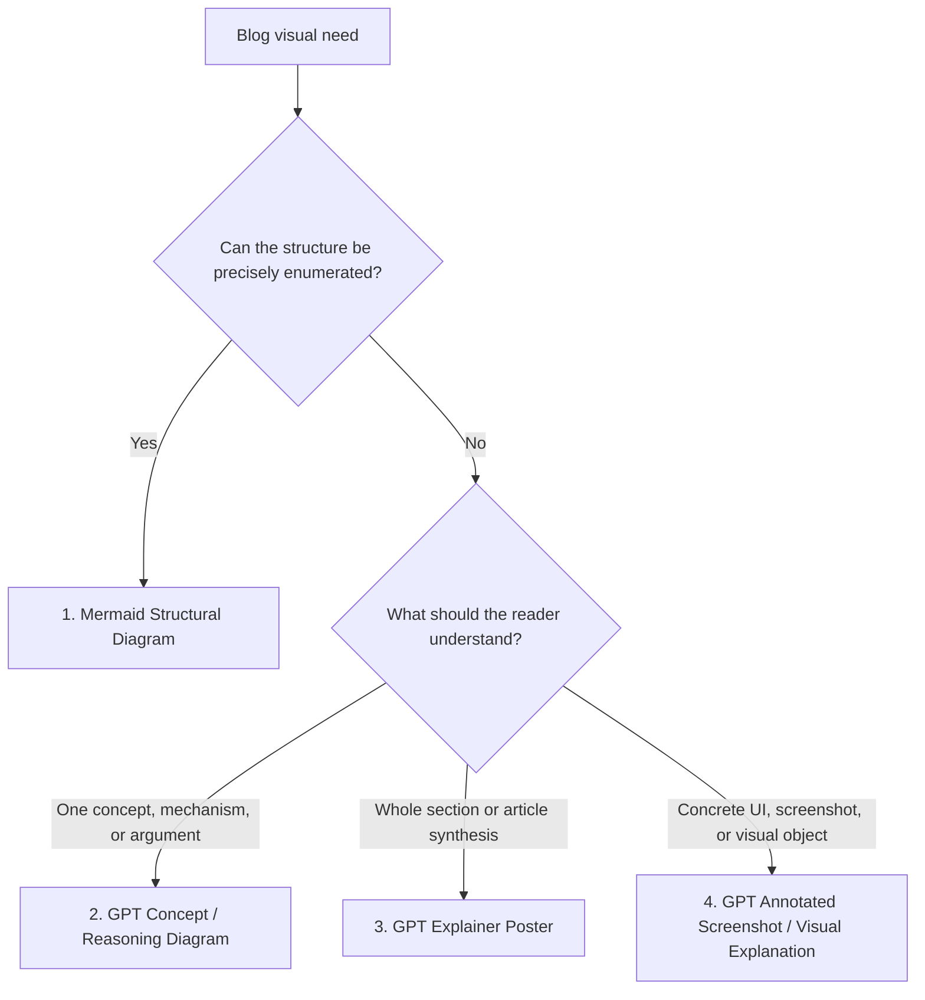

# Blog Image Generator

Create blog visuals as information instruments. Classify by **visual type and reader purpose**, not by image provider. Mermaid owns deterministic structure. GPT image generation owns visual explanation, dense teaching posters, and annotated screenshots.

## Visual Type Router

| Type | Reader purpose | Use when | Output |
|---|---|---|---|
| **1. Mermaid Structural Diagram** | Understand exact structure | Nodes, edges, sequence, state, or flow can be enumerated precisely | Mermaid block in markdown |
| **2. GPT Concept / Reasoning Diagram** | Understand an abstract idea | Concept, math idea, logical argument, architecture principle, algorithm mechanism, or causal chain needs visual intuition | PNG via `gpt-image-2` |
| **3. GPT Explainer Poster** | Grasp a whole section or post in one image | One high-density signature figure with panels, formulas, tables, legends, callouts, and takeaways | PNG via `gpt-image-2` |
| **4. GPT Annotated Screenshot / Visual Explanation** | See what matters in a concrete UI or visual object | Existing screenshot, UI flow, before/after state, product surface, or local detail needs labels and zoom-ins | PNG via `gpt-image-2` |

Default rule: if the structure is exact and maintainable as text, use Mermaid. If the value comes from visual teaching, spatial composition, local zoom, or poster-like synthesis, use GPT.

Do not use Gemini for this workflow.

## Setup

Python dependency:

```bash
pip install pillow
```

Env var:

| Var | For |
|---|---|
| `CHATFIRE_API_KEY` | GPT image generation through ChatFire base URL: `https://api.chatfire.cn/v1` |

## Workflow

### Step 1: Identify Context

- Current post directory, for example `content/posts/260305/`
- Existing images in that directory; `generate.py` auto-increments `1.png`, `2.png`, ...
- The visual type from the router above
- Exact labels that must appear in the visual

### Step 2: Pick the Visual Type

Use this decision flow:



## Type 1 — Mermaid Structural Diagram

Use Mermaid for architecture diagrams, module relationships, data flow, state machines, sequence diagrams, simple pipelines, and dependency maps where correctness matters more than illustration.

Good Mermaid candidates:
- 3-12 nodes with explicit edges
- request / data / control flow
- state transitions
- system boundaries and ownership
- timing or sequence relationships

Use GPT instead when the diagram needs teaching poster composition, hand-drawn arrows, visual metaphor, local zoom-in, or dense explanatory callouts.

## Type 2 — GPT Concept / Reasoning Diagram

Use for one abstract object that needs intuition: mathematical concepts, logic chains, architecture principles, algorithm mechanisms, causal loops, tradeoff structures, or evaluation logic.

Template:

```text
GPT concept / reasoning diagram: "[SUBJECT]".
Goal: help readers understand the core object, why it works, its structural intuition, and how it behaves across scenarios.

Visual style: clean light paper background, dark blue title, black / dark gray body lines, refined blue / teal / gold / red accents. High-quality technical handout plus hand-drawn educational poster. Elegant, clear, information-rich, not cluttered.

Layout: 4-panel explanatory diagram with rounded cards, thin borders, numbered labels, hand-drawn arrows, one local zoom-in box, and a concise summary strip.

Panel 1 - Core object:
  Show the central concept, claim, system, or mechanism.
  Name the key objects with short labels.

Panel 2 - Mechanism:
  Show how it works step by step.
  Use arrows, state changes, contracts, formulas, or inference links.

Panel 3 - Why / structure:
  Show the invariant, causal chain, proof sketch, boundary contract, or structural reason.
  Include one zoom-in callout for the decisive local detail.

Panel 4 - Scenarios / boundaries:
  Compare normal case, edge case, failure case, and practical use.
  Use a compact table or card row.

Bottom summary:
  3-4 short takeaways, visually separated.

Typography: legible CJK labels when the article is Chinese. Keep labels short. Avoid long paragraphs, dense derivations, photorealism, 3D rendering, and decorative clutter.
```

Domain lenses for Type 2:

| Lens | Panel 1 | Panel 2 | Panel 3 | Panel 4 |
|---|---|---|---|---|
| Math / theorem | definition + objects | transformation or proof sketch | invariant / geometry / structure | boundary cases + applications |
| Logic / argument | claim + terms | premises -> inference -> conclusion | key assumption or validity reason | counterexample + boundary |
| Architecture principle | problem + forces | components / contracts / flow | boundary, state, or consistency rule | tradeoffs + failure modes |
| Algorithm / mechanism | input + state | transition steps | invariant or complexity driver | best / worst / failure cases |
| Product / workflow | actor + job | task flow | friction or feedback loop | scenarios + outcomes |
| Evaluation / benchmark | dataset + metric | measurement pipeline | interpretation rule | risks + applicability |

## Type 3 — GPT Explainer Poster

Use for a single image that explains a whole section or post end-to-end. This is the hero / signature figure, not a routine diagram. Use at most one per post unless the article is explicitly visual-first.

Template:

```text
Single-image educational explainer poster: "[TITLE]".
Goal: one image explains the whole idea end-to-end.

Orientation: portrait 1024x1792 by default; landscape 1792x1024 only for broad horizontal systems.
Background: warm off-white (#F7F4EE).

TOP BANNER:
  Large bold title in dark brown-gray (#2A2620): "[TITLE]"
  Subtitle in smaller gray (#4A453C): "[ONE-LINE POSITIONING]"
  Thin warm-orange accent line (#D9573A).

SECTION 1 - [NAME]:
  [element type: card grid / mini-flow / formula block / legend / table / callout]
  [content hints]

SECTION 2 - [NAME]:
  [different element type]
  [content hints]

SECTION 3 - [NAME]:
  [different element type]
  [content hints]

SECTION 4 - [NAME]:
  [different element type]
  [content hints]

BOTTOM STRIP:
  3-4 green checkmark takeaways separated by vertical dividers.

Typography: sans-serif throughout. Section headers bold. Body text dark brown-gray (#2A2620). Captions slightly lighter (#4A453C). Accent warm orange (#D9573A) used sparingly.

Dense but organized, every panel filled, no photorealism, no gradients beyond soft panel tints, no shadows.
```

Panel-element cookbook:
- **Card grid**: 2-4 cards in a row, each = pictogram + label + caption
- **Diamond + branches**: decision node radiating to labeled color-coded pills
- **Table**: 3-5 columns x 2-5 rows, soft borders, bold headers
- **Mini-flow**: 3-4 cards connected by right arrows
- **Formula block**: simple LaTeX-style math only
- **Legend**: symbol -> meaning pairs
- **Callout box**: "why / note / risk" header plus 1-2 short lines
- **Checklist strip**: bottom summary with green checkmarks

## Type 4 — GPT Annotated Screenshot / Visual Explanation

Use when an existing UI screenshot, product surface, before/after state, or visual artifact needs explanation. Prefer this over redrawing the screenshot as Mermaid.

Template:

```text
Annotated visual explanation: "[SUBJECT]".
Use the provided screenshot or visual object as the base.

Goal: make the important parts immediately visible to a technical blog reader.
Style: restrained technical annotation, clean light-paper or white margin, dark gray labels, blue / teal / gold / red emphasis. No decorative clutter.

Annotations:
  1. [exact label] -> point to [target area]
  2. [exact label] -> point to [target area]
  3. [exact label] -> point to [target area]

Include:
  - thin arrows or leader lines
  - 1-2 local zoom-in boxes if needed
  - before/after divider if comparing states
  - concise caption strip with the key takeaway

Do not invent UI text. Preserve the base screenshot's structure.
```

## Running GPT Image Generation

```bash
python3 .claude/skills/blog-img/generate.py \
  --model gpt-image-2 \
  --prompt "YOUR PROMPT" \
  --out "content/posts/YYMMDD" \
  --filename "1.png" \
  --size 1024x1024 \
  --quality high
```

Flags:
- `--model` — `gpt-image-2` by default; also supports `gpt-image-1.5` and `gpt-image-1`
- `--size` — `1024x1024`, `1792x1024`, or `1024x1792`
- `--quality` — `high` by default; can be `medium`, `low`, or empty string to omit
- `--filename` — omit to auto-increment `N.png`
- `--out` — post Page Bundle directory
- `--provider openai` — accepted for backward compatibility only; Gemini is not supported

Output is normalized to `.png` for consistency with existing posts.

## Insert Into Markdown

```markdown

```

The Markdown title renders as `<figcaption>` through the project's Hugo render hook. Use it when the visual benefits from a caption.

## Prompt Rules

- Chinese labels are preferred when the article is Chinese.
- Quote exact labels that must appear.
- Keep labels short: <= 10 Chinese characters or <= 6 English words when possible.
- Do not ask GPT to render long paragraphs.
- Specify arrow direction and callout targets.
- Use Mermaid instead of GPT when a 3-12 node structure can be represented cleanly as text.
- Use chart libraries or Markdown tables for quantitative charts and dense data tables.

## When Not To Use This Skill

| Situation | Better option |
|---|---|
| Simple structural diagram | Mermaid |
| Dense numeric chart | Chart library or Markdown table |
| Raw source image that already explains itself | Insert the image directly |
| Logo / avatar / photorealistic image | Out of scope |
