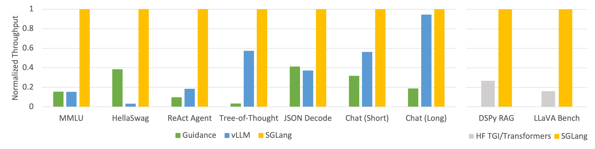
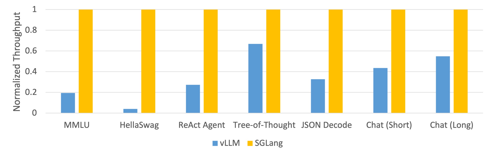
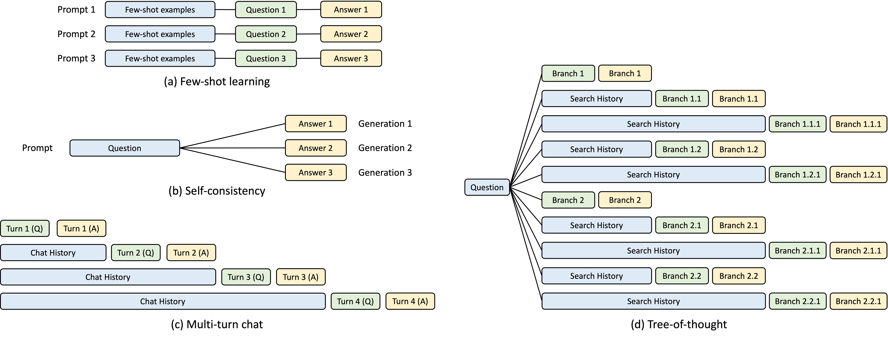

---
categories:
- 人工智能
- 技术解析
date: '2025-02-24'
tags:
- LLM
- 推理框架
- SGLang
- 多模态
title: SGLang：面向复杂LLM程序的高效推理框架
---

本文介绍了SGLang，一个旨在解决传统LLM推理框架在复杂交互场景中性能瓶颈的高效推理框架。SGLang通过共享前缀缓存、约束解码加速等技术优化内存与计算效率，并简化编程模型，支持控制流和并行处理，降低复杂LLM程序的开发成本。

以下是基于 https://lmsys.org/blog/2024-01-17-sglang/ 内容的翻译与开发者视角的技术解析：

---

### **SGLang：面向复杂LLM程序的高效推理框架**

#### **1. 核心设计目标**
SGLang（Structured Generation Language）旨在解决传统LLM推理框架（如vLLM）在复杂交互场景中的性能瓶颈。其设计目标包括：
- **高效处理多轮交互**：支持多步骤推理（如思维树、工具调用）、结构化输出（如JSON）、多模态输入（文本+图像）等复杂任务。
- **优化内存与计算效率**：通过共享前缀缓存（RadixAttention）、约束解码加速等技术减少冗余计算。
- **简化编程模型**：提供类编程语言的DSL（领域特定语言），支持控制流和并行处理，降低复杂LLM程序的开发成本。

---


Figure 1: Throughput of Different Systems on LLM Tasks (Llama-7B on A10G, FP16, Tensor Parallelism=1)



Figure 2: Throughput of Different Systems on LLM Tasks (Mixtral-8x7B on A10G, FP16, Tensor Parallelism=8)

#### **2. 核心技术解析**
**(1) RadixAttention：共享前缀缓存**
- **原理**：将LLM生成的键值（KV）缓存以基数树（Radix Tree）结构管理，自动识别并复用不同请求间的共享前缀（如系统提示词）。
- **优势**：减少重复计算，提升吞吐量。实验显示，在含共享前缀的请求中，吞吐量可提升2-5倍。
- **实现细节**：
  - 使用LRU策略动态管理缓存，避免显存溢出。
  - 支持跨请求的缓存共享（如RAG场景中相似查询的上下文复用）。

**(2) 压缩有限状态机（FSM）的约束解码**
- **问题背景**：传统约束解码（如JSON格式生成）需逐个Token验证，效率低下。
- **SGLang优化**：将正则表达式约束转换为压缩FSM，允许一次解码多个Token。
  - 例如，生成`{"name": "..."}`时，可直接跳过固定结构部分，仅需验证动态内容。
- **性能提升**：在结构化输出场景中，解码速度可提升3倍。

**(3) API推测执行**
- **应用场景**：调用黑盒API（如OpenAI）时，通过预生成推测结果减少交互次数。
- **实现逻辑**：在本地缓存可能的结果分支，仅当推测错误时回滚并重新调用API，降低延迟与成本。

**(4) 多模态与量化支持**
- **多模态模型**：支持LLaVA NeXT、Qwen-VL等视觉-语言模型，通过HTTP接口直接传入图像URL或Base64编码。
- **量化优化**：集成AWQ、GPTQ等量化方法，支持INT4/FP8数据类型，降低显存占用（如Qwen2-VL-7B仅需70GB显存）。


Figure 3: KV cache sharing examples. Blue boxes are shareable prompt parts, green boxes are non-shareable parts, and yellow boxes are non-shareable model outputs. Shareable parts include few-shot learning examples, questions in self-consistency, chat history in multi-turn chat, and search history in tree-of-thought.


---

#### **3. 开发者使用流程**
**(1) 部署示例（以LLaVA模型为例）**
```bash
# 启动服务端（支持多GPU张量并行）
python -m sglang.launch_server \
  --model-path lmms-lab/llama3-llava-next-8b \
  --port 30000 \
  --tp-size 2 \
  --chat-template llava_llama_3

# 客户端调用（图像分析）
curl http://localhost:30000/v1/chat/completions -H "Content-Type: application/json" -d '{
  "messages": [{
    "role": "user",
    "content": [
      {"type": "text", "text": "Describe the image"},
      {"type": "image_url", "image_url": {"url": "https://example.com/image.jpg"}}
    ]
  }]
}'
```

**(2) 性能对比**
- **吞吐量**：在相同硬件下，SGLang的吞吐量比vLLM高1.5-2倍（尤其在小模型场景）。
- **延迟**：Qwen-VL模型处理2560x2560分辨率图像的响应时间仅3.26秒，较原生Transformer实现快60%。

---

#### **4. 适用场景与生态**
- **推荐场景**：
  - 多步骤推理（如Agent工作流）
  - 高并发服务（如在线客服系统）
  - 多模态交互（如视觉问答）
- **生态工具**：
  - **SGLang-UI**：可视化调试工具，支持交互式Prompt设计。
  - **SGLang-Physics**：扩展物理模拟能力（如游戏开发原型）。

---

#### **5. 总结**
SGLang通过创新的缓存管理、约束解码优化和灵活的编程模型，显著提升了复杂LLM应用的推理效率。其与vLLM、TensorRT-LLM的性能对比显示，在需要结构化输出和多轮交互的场景中，SGLang更具优势。开发者可通过其Docker镜像快速部署，并利用量化技术进一步优化资源消耗。