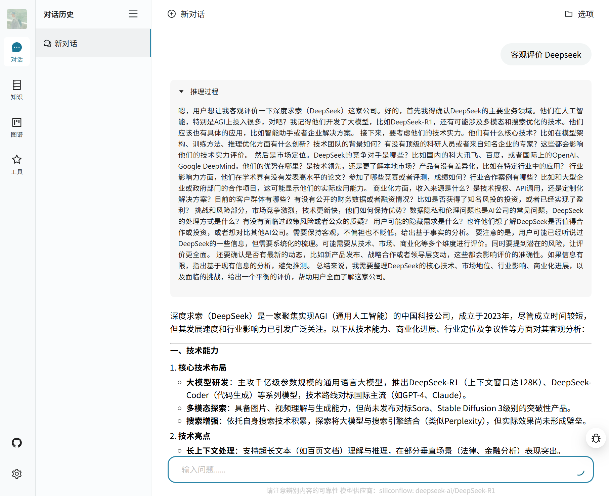

---
categories:
- 人工智能
- 技术开发
date: '2024-12-09'
tags:
- 大模型
- 知识图谱
- RAG
- 问答平台
title: Yuxi-Know：基于大模型 RAG 的知识库与知识图谱问答平台
---

今天给大家介绍一下师兄主导和我一起开发的一个基于大模型 RAG 技术的知识库与知识图谱问答平台，项目名称叫 `Yuxi-Know`。

[https://github.com/xerrors/Yuxi-Know](https://github.com/xerrors/Yuxi-Know)


该项目前身：[KnowledgeGraph-based-on-Raw-text-A27](https://github.com/littlewwwhite/KnowledgeGraph-based-on-Raw-text-A27)
我们是基于最早的基于 uie 抽取的实体关系，然后构建的知识图谱，然后基于知识图谱进行问答，在 graphRAG 出来后，我们又基于 graphRAG 进行了重构，并增加了知识库的支持。

Yuxi-Know 是一个结合大模型 RAG 技术和知识图谱的问答平台，支持多种大模型调用和本地部署，提供知识库和知识图谱的问答功能。项目采用 Llamaindex、VueJS、Flask 和 Neo4j 等技术栈，支持开发和生产环境的 Docker 部署。


`Yuxi-Know` 是一个基于大模型 RAG（Retrieval-Augmented Generation）知识库与知识图谱的问答平台，以下是关于这个仓库的详细介绍：

### 项目概述
- **项目名称**：语析（基于大模型的知识库 + 知识图谱问答平台）
- **技术栈**：Llamaindex + VueJS + Flask + Neo4j，大模型适配 OpenAI、国内主流大模型平台的模型调用、本地 vllm 部署，后端还使用了 [FastAPI](https://github.com/fastapi)，并添加了 [Milvus-Standalone](https://github.com/milvus-io) 的独立部署。
- **项目状态**：当前项目还处于开发的早期，存在一些 BUG，鼓励用户发现问题随时提 issue。

### 主要功能和特性
- **知识库和知识图谱问答**：利用大模型实现基于知识库和知识图谱的问答功能。
- **多模型支持**：
  - 支持 OpenAI 以及国内主流大模型平台的模型调用。
  - 支持本地 vllm 部署。
  - 支持 DeepSeek-R1，需配置 `DEEPSEEK_API_KEY` 或者 `SILICONFLOW_API_KEY` 使用。
  - 2025.02.23 增加了 SiliconFlow 的 Rerank 和 Embedding model 支持，现在默认使用 SiliconFlow。
- **待办功能**：
  - Ollma Embedding 支持（Open-like Embedding 支持）。
  - 知识图谱索引支持自定义 Embedding 模型。



### 项目结构
项目主要包含以下几个重要部分：
- **`src` 目录**：
  - 包含项目的主要源代码，如核心逻辑、配置文件、模型、插件、路由等。
  - 有 `.env.template` 文件，用户可以根据此模板创建 `.env` 文件来配置 API 密钥等环境变量。
- **`web` 目录**：
  - 前端部分的代码，基于 VueJS 开发，包含 `.eslintrc.cjs`、`.prettierrc.json` 等配置文件以及 `vite.config.js` 构建配置文件。
- **`docker` 目录**：
  - 包含 Docker 相关文件，如 `api.Dockerfile`、`web.Dockerfile`、`docker-compose.dev.yml` 和 `docker-compose.yml`，用于开发和生产环境的 Docker 部署。
- **`images` 目录**：存放项目的相关图片，如 `demo.gif`、`main.png`、`reasoning.png` 等。
- **`scripts` 目录**：包含一些脚本文件，如 `run.sh`、`run_docker.sh` 等，用于项目的启动和运行。

### 快速上手
1. **配置 API 密钥**：在启动之前，提供 API 服务商的 API_KEY，并放置在 `src/.env` 文件中。默认使用的是硅基流动，因此务必需要配置 `SILICONFLOW_API_KEY=<SILICONFLOW_API_KEY>`。其余模型的配置可以参考 `src/static/models.yaml` 中的 env。
2. **启动项目（开发环境）**：
```bash
docker compose -f docker/docker-compose.dev.yml --env-file src/.env up --build
```
也可以加上 `-d` 参数，后台运行。
3. **访问项目**：打开 [http://localhost:5173/](http://localhost:5173/) 就可以看到结果。
4. **关闭 docker 服务**：
```bash
docker compose -f docker/docker-compose.dev.yml --env-file src/.env down
```
5. **查看日志**：
```bash
docker logs <CONTAINER_NAME>  # 例如：docker logs api-dev
```
6. **生产环境部署**：
```bash
docker compose -f docker/docker-compose.yml --env-file src/.env up --build
```


### 模型支持
- 对话模型仅支持通过 API 调用的模型，如果需要运行本地模型，则建议使用 vllm 转成 API 服务之后使用。使用前请在 `.env` 配置 APIKEY 后使用，配置项目参考：[src/config/models.yaml](src/config/models.yaml)。

这个项目"语析（基于大模型的知识库 + 知识图谱问答平台）"主要有以下功能和用途：

### 1. 问答平台功能
- **基于大模型 RAG 知识库与知识图谱**：是一个问答平台，结合了大模型的 RAG（Retrieval-Augmented Generation，检索增强生成）技术，利用知识库和知识图谱来提供问答服务。其技术栈包括 Llamaindex、VueJS、Flask 和 Neo4j。
- **大模型适配多样**：大模型可以适配 OpenAI 以及国内主流大模型平台的模型调用，还支持本地 vllm 部署，用户只需要配置对应服务平台的 `API_KEY` 就能够使用。

### 2. 知识库支持
- **多种格式支持**：支持多种格式的知识库，目前支持的格式有 pdf、txt、md。文件上传后，会先转换为纯文本，接着使用向量模型将文本转换为向量，最后存储到向量数据库中，不过这个过程可能会花费不少时间。

### 3. 知识图谱支持
- **Neo4j 存储**：支持使用 Neo4j 作为知识图谱的存储。需要将图谱整理成 jsonl 的格式，每行格式如 `{"h": "北京", "t": "中国", "r": "首都"}`，然后在网页的图谱管理里添加该文件。
- **访问管理**：项目启动后会自动启动 neo4j 服务，用户可以通过 [http://localhost:7474/](http://localhost:7474/) 访问和管理图数据库，初始默认账户密码是 `neo4j` 和 `0123456789`，可在 `docker/docker-compose.yml` 和 `docker\docker-compose.dev.yml` 中修改（注：`api.environment` 和 `graph.environment` 都需要修改）。
- **图谱切换**：目前项目中暂不支持同时查询多个知识图谱，短期内也无计划支持，但可以通过配置不同的 `NEO4J_URI` 服务来切换知识图谱。如果已有基于 neo4j 的知识图谱，可将 `docker-compose.yml` 中的 `graph` 配置项删除，并将 `api.environment` 中的 `NEO4J_URI` 配置项修改为 neo4j 的服务地址。

### 4. 部署与启动
- **开发与生产环境**：项目支持开发环境和生产环境的部署。开发环境下，源代码的修改会自动更新（含前端和后端）；生产环境则使用 `docker/docker-compose.yml` 启动。
- **API_KEY 配置**：在启动前，需要提供 API 服务商的 API_KEY 并放置在 `src/.env` 文件中，默认使用硅基流动，所以务必配置 `SILICONFLOW_API_KEY=<SILICONFLOW_API_KEY>`，其余模型的配置可参考 `src/static/models.yaml` 中的 env。
- **本地模型配置**：如果需要指定本地模型（如 Embedding、Rerank 模型）所在路径，需要配置 `MODEL_DIR` 参数，并在 Docker Compose 中启用映射。

### 5. 其他
- **更新日志记录**：项目会记录更新日志，如 2025.02.23 支持了 SiliconFlow 的 Rerank 和 Embedding model 且默认使用 SiliconFlow，2025.02.20 支持了 DeepSeek - R1 等。
- **待办事项**：项目有一些待办事项，如 Ollma Embedding 支持（Open - like Embedding 支持）、知识图谱索引支持自定义 Embedding 模型等。


总结：项目的整体情况可以涵盖如下，基于大模型 RAG 知识库与知识图谱：用户可以向平台提出各种问题，平台利用大模型以及相关知识库和知识图谱进行问答服务。例如，对于一些需要专业知识解答的问题，平台可以根据已有的知识储备给出准确回答，欢迎大家来尝试体验。