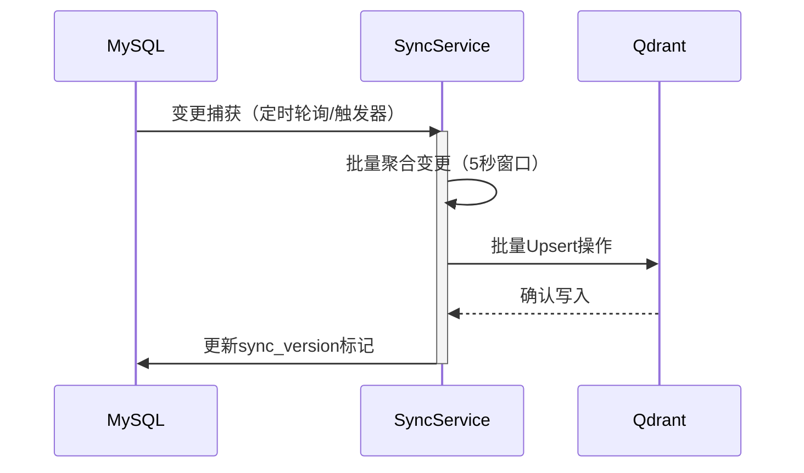
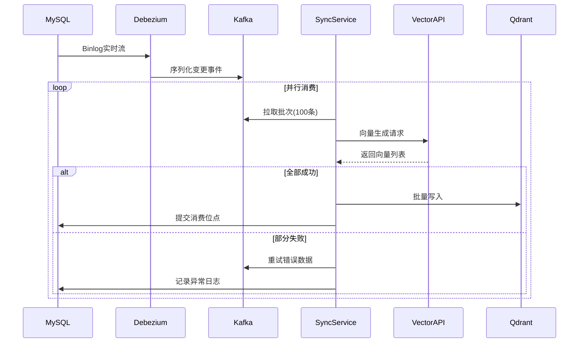

---
categories:
- 数据分析
- 数据库
date: '2025-02-19'
tags:
- 数据库同步
- 向量数据库
- 数据分析
title: Qdrant与MySQL同步机制解析
---


#### 一、同步机制核心思路
Qdrant作为高性能向量数据库，与MySQL关系型数据库的同步，本质是实现结构化数据与向量化数据的**双向一致性**。以下是两种典型的同步模式：

---

#### 二、简单同步机制
**适用场景**：中小规模数据、轻量级应用  
**架构流程**：  


**核心组件**：
1. **变更捕获层**  
   ```sql
   -- 示例：通过时间戳增量同步
   SELECT * FROM blocks 
   WHERE update_time > LAST_SYNC_TIME
   ORDER BY update_time ASC 
   LIMIT 1000;
   ```

2. **批量处理器**  
   ```python
   class BatchProcessor:
       def __init__(self):
           self.buffer = []
           
       def add_changes(self, changes):
           self.buffer.extend(changes)
           if len(self.buffer) >= 1000:
               self.flush()
               
       def flush(self):
           vectors = generate_vectors([c.content for c in self.buffer])
           points = [PointStruct(id=c.id, vector=v) for c,v in zip(self.buffer, vectors)]
           qdrant_client.upsert(points)
           self.buffer = []
   ```

**优势与局限**  
✅ 实现简单，运维成本低  
❌ 无法保证秒级实时性  
❌ 缺乏断点续传能力

---

#### 三、复杂同步机制
**适用场景**：企业级生产环境、海量数据  
**架构流程**：  


**关键设计**  
1. **分布式日志**  
   ```shell
   # Kafka主题分区策略
   bin/kafka-topics.sh --create \
     --partitions 3 \
     --replication-factor 2 \
     --topic qdrant-sync
   ```

2. **向量生成服务**  
   ```python
   class VectorizationService:
       def __init__(self):
           self.model = SentenceTransformer('all-MiniLM-L6-v2')
           self.cache = RedisCache()
           
       async def batch_embed(self, texts: list[str]) -> list[list[float]]:
           # 缓存层查询
           cached = await self.cache.mget(texts)
           # 过滤已缓存项
           uncached = [t for t, c in zip(texts, cached) if c is None]
           # 批量生成新向量
           new_vecs = self.model.encode(uncached)
           # 更新缓存
           await self.cache.mset(zip(uncached, new_vecs))
           return [cached[i] or new_vecs.pop(0) for i in range(len(texts))]
   ```

3. **完整事务处理**  
   ```java
   public class TransactionManager {
       // 二阶段提交协议实现
       public void processBatch(ChangeEventBatch batch) {
           try {
               startTransaction();
               List<Point> points = vectorize(batch);
               qdrantClient.prepareUpsert(points);
               mysqlClient.markAsProcessed(batch);
               commit();
           } catch (Exception e) {
               rollback();
               throw e;
           }
       }
   }
   ```

**核心优势**  
✅ 高吞吐量（支持10万+ TPS）  
✅ 端到端毫秒级延迟  
✅ 完善的错误恢复机制

---

#### 四、机制对比与选型建议

| **维度**         | **简单同步**          | **复杂同步**              |
|------------------|---------------------|-------------------------|
| 数据一致性         | 最终一致性（分钟级）      | 准实时（秒级）               |
| 数据规模          | < 100万条           | 亿级数据量                 |
| 容灾能力          | 无保障                | 多副本+消费位点持久化          |
| 运维复杂度        | 低                  | 需要Kafka集群管理           |
| 典型延迟         | 5-30秒             | 100ms-2秒              |
| **适用阶段**      | 快速验证期             | 生产环境                   |

---

#### 五、最佳实践建议
1. **数据结构设计**  
   ```python
   # 混合型数据结构示例
   class HybridDocument:
       def __init__(self, content, metadata):
           self.vector = None  # 由向量服务填充
           self.payload = {
               "content": content,
               "source_id": metadata['id'],
               "doc_type": "financial_report",
               "access_control": {
                   "owner": metadata['user_id'],
                   "permissions": metadata.get('permissions', [])
               }
           }
   ```

2. **性能优化技巧**  
   ```yaml
   # Qdrant性能调优配置
   storage:
     optimizers:
       indexing_threshold: 20000  # 超过2万段触发索引重建
     performance:
       max_search_threads: 8
     wal:
       wal_capacity_mb: 1024
   ```

3. **监控指标**  
   ```prometheus
   # 同步延迟指标
   qdrant_sync_lag_seconds{source="mysql"} 2.5
   # 向量生成吞吐量
   vectorize_requests_total{status="success"} 2345
   # 错误分类统计
   sync_errors_total{type="network"} 3
   sync_errors_total{type="timeout"} 12
   ```

---

#### 六、未来演进方向
1. **AI驱动**  
   引入强化学习自动调整同步参数：  
   ```python
   class AutoTuner:
       def adjust_batch_size(self, success_rate):
           if success_rate > 0.95:
               self.batch_size = min(500, self.batch_size*1.2)
           else:
               self.batch_size = max(50, self.batch_size*0.8)
   ```

2. **云原生集成**  
   ```terraform
   # 使用Kubernetes部署同步服务
   resource "kubernetes_deployment" "sync_worker" {
     metadata { name = "qdrant-sync" }
     spec {
       replicas = 8
       template {
         container {
           image = "registry.example.com/sync-worker:v3.2"
           resources {
             limits = { cpu = "2", memory = "4Gi" }
           }
         }
       }
     }
   }
   ```

3. **安全增强**  
   ```bash
   # 数据加密传输
   openssl req -x509 -nodes -days 365 \
     -newkey rsa:2048 \
     -keyout qdrant.key \
     -out qdrant.crt \
     -subj "/CN=qdrant.example.com"
   ```

通过本文的深度解析，您可以根据实际业务需求，选择最适合的Qdrant与MySQL同步方案。无论是初创项目快速验证，还是大型企业构建AI中台，合理的架构设计都能为业务发展提供坚实基础。