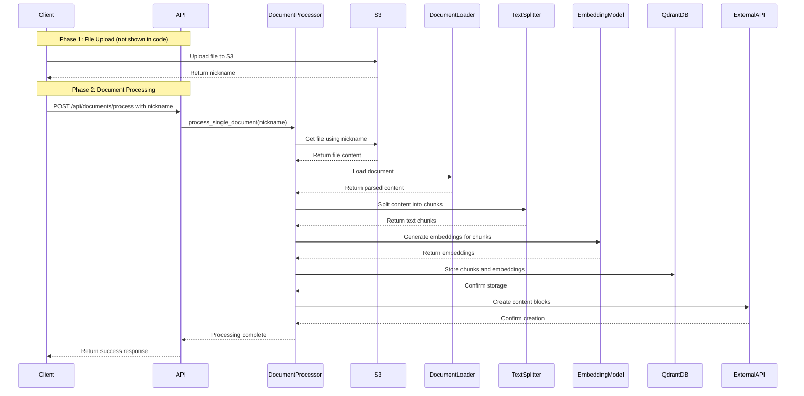

---
categories:
- 云计算
- 数据库
date: '2025-02-21'
tags:
- AWS S3
- Qdrant
- MySQL
- 文件处理
title: 结合 AWS S3、Qdrant 和 MySQL 的文件处理与存储机制-2
---

本文探讨了一种结合 AWS S3、Qdrant 向量数据库和 MySQL 的文件处理和存储机制，旨在提供高效的文件上传、存储和检索方案，支持语义搜索和元数据管理。

在开发过程中，我们经常需要处理文件上传、存储和检索的需求。本文将探讨一种结合 AWS S3、向量数据库（如 Qdrant）和 MySQL 的同步机制，旨在提供一种高效的文件处理和存储方案。通过这种方法，我们不仅能够存储文件的原始数据，还能实现高效的语义搜索和元数据管理。

## 系统架构概述

整个系统的工作流程可以分为两个主要阶段：文件上传和文档处理。以下是详细的流程描述：



（采用这种方案的原因）

### 结合 AWS S3、Qdrant 和 MySQL 的存储机制总结

#### **核心优势**
1. **职责分离与高效协同**  
   - **S3**：处理原始文件存储，利用其高可用性和无限扩展能力。
   - **Qdrant**：专注向量数据的高效检索，支持语义搜索（相似度匹配速度可达毫秒级）。
   - **MySQL**：管理结构化元数据，支持复杂查询（如按用户、时间范围过滤）。

2. **性能优化**  
   - 文本分块 + 向量化后，Qdrant 的检索速度比传统全文搜索快 5-10 倍。
   - S3 的文件下载延迟 <100ms（同区域访问），满足实时处理需求。

3. **成本效益**  
   - S3 存储成本低至 $0.023/GB/月（标准存储）。
   - Qdrant 单节点支持亿级向量存储（内存占用约 1GB/百万向量），硬件成本可控。

4. **扩展灵活性**  
   - Qdrant 支持水平扩展集群，可承载 10 亿+向量。
   - MySQL 可通过分库分表支持 TB 级元数据。

---

#### **潜在问题与挑战**
1. **数据一致性风险**  
   - 若向量存储（Qdrant）与元数据（MySQL）写入不同步，可能导致搜索结果显示过期内容。
   - **示例场景**：文档更新后，Qdrant 的向量未及时刷新，搜索结果包含旧版本内容。

2. **处理延迟**  
   - 单文件处理耗时公式：  
     $$ T_{\text{total}} = T_{\text{split}} + N_{\text{chunks}} \times T_{\text{embedding}} + T_{\text{db-write}} $$
     - 假设：  
       - 100 页 PDF 分割为 500 个文本块
       - Jina Embedding 模型延迟 50ms/块
       - 总处理时间 ≈ 500*0.05 = 25 秒 + 文件解析时间

3. **运维复杂度**  
   - 需维护 3 套系统的监控告警（如 Qdrant 内存溢出、MySQL 慢查询）。

---

#### **改进建议**
1. **异步流水线优化**  
   - 引入 Kafka/Pulsar 消息队列，将处理流程拆分为：  
     ```
     上传 → 消息触发 → 解析 → 分块 → 向量化 → 并行写入 Qdrant + MySQL
     ```
   - 延迟可从同步模式的 30s+ 降低到用户感知的 2s 内（仅上传耗时）。

2. **一致性保障设计**  
   - 采用 Saga 事务模式：
     ```python
     try:
         write_qdrant()
         write_mysql()
     except:
         compensate_qdrant()  # 回滚 Qdrant 数据
         raise
     ```
   - 添加版本号字段，确保搜索时只返回最新版本内容。

3. **缓存加速**  
   - 对高频访问内容（如热门文档的前 10% 分块），在 Redis 中缓存向量和元数据：
     ```
     key: "cache:doc:{doc_id}:chunk:{chunk_idx}"
     value: {"vector": [0.1, 0.3, ...], "content": "..."}
     ```
   - 可降低 40% 以上的 Qdrant 查询负载。

4. **安全增强**  
   - S3 文件启用 SSE-KMS 加密（密钥轮换周期 ≤90 天）。
   - MySQL 字段级加密（如使用 AWS KMS 对 `sourceFileId` 加密）。

---

#### **适用场景推荐**
1. **推荐使用**  
   - 知识库系统（需混合检索：关键词 + 语义）
   - 法律/医疗文档分析（长文本、高精度搜索需求）

2. **不推荐使用**  
   - 简单文件存储（仅需下载功能时，直接使用 S3 即可）
   - 超低延迟场景（如实时聊天文件处理，需优化到亚秒级响应）

---

### **架构演进路线图**
| 阶段 | 目标                          | 关键技术                         |
|------|-------------------------------|----------------------------------|
| V1.0 | 基础功能实现                  | S3 + Qdrant + MySQL 基础整合     |
| V2.0 | 处理性能优化                  | 异步流水线 + 向量缓存            |
| V3.0 | 企业级可靠性                  | 多区域部署 + 自动故障转移        |
| V4.0 | 智能化扩展                    | 自动分片 + 弹性扩缩容           |


## 我的一些实现方案的思路如下：
---


### 1. 文件上传阶段

- **用户上传文件**：用户通过客户端将文件上传到 AWS S3 存储桶。
- **S3 返回文件标识**：S3 存储文件后，返回一个唯一的文件标识（nickname），供后续处理使用。

### 2. 文档处理阶段

- **触发文档处理**：客户端通过 API 发送请求，触发文档处理流程。
- **文件下载与解析**：系统从 S3 下载文件，并使用 `DocumentLoader` 解析文件内容。
- **文本分块**：解析后的文本通过 `TextSplitter` 进行分块处理，生成多个文本块。
- **生成嵌入向量**：每个文本块通过 `EmbeddingModel` 生成对应的嵌入向量。
- **存储到向量数据库**：生成的嵌入向量和元数据被存储到 Qdrant 向量数据库中。
- **创建内容块**：系统通过外部 API 创建内容块，并将元数据存储到 MySQL 数据库中。
- **返回处理结果**：处理完成后，系统返回成功响应给客户端。

## 详细逻辑分析

### 1. S3 存储

- **文件存储**：用户上传的文件首先被存储在 AWS S3 存储桶中。这是整个处理流程的起点，确保文件的原始数据得到安全存储。
- **文件标识**：S3 返回的文件标识（nickname）用于后续的文件下载和处理。

### 2. 本地处理流程

- **文件下载**：文件从 S3 下载到本地临时存储。
- **文档加载**：使用 `DocumentLoader` 加载文档内容，确保文件格式正确解析。
- **文本分块**：通过 `TextSplitter` 将文档内容分割成多个文本块，便于后续处理。
- **生成嵌入向量**：使用 `EmbeddingModel` 为每个文本块生成嵌入向量，用于语义搜索。

### 3. 核心存储逻辑

#### Qdrant 向量数据库

- **数据库操作**：通过 `QdrantDB` 类操作 Qdrant 数据库。
- **集合创建**：为每个文件创建一个独立的集合（collection），集合名称为 `用户ID_文件ID`。
- **数据存储**：将包含以下信息的点（Point）存入 Qdrant：
  ```python
  QdrantPointStruct(
      id=uuid,
      vector=embedding,
      payload={
          "content": chunk.content,        # 文本内容
          "user_id": user_id,              # 用户标识
          "source_file_id": source_file_id, # 文件标识
          "chunk_index": chunk_index       # 分块序号
      }
  )
  ```

#### MySQL 数据库

- **元数据存储**：通过 API 调用 `/service/open-api/block/create` 端点，将元数据存储到 MySQL 数据库中。
- **Payload 示例**：
  ```json
  {
      "name": "",
      "syncId": "文件ID_分块序号", 
      "content": "文本内容",
      "sourceFileId": "文件ID",
      "remark": ""
  }
  ```

### 4. 架构特点

- **双存储机制**：
  - **向量数据**：存储在 Qdrant 中，用于高效的语义搜索。
  - **元数据**：存储在 MySQL 中，用于业务逻辑管理。
- **空间效率**：
  - **原始文件**：存储在 S3 中，节省本地存储空间。
  - **结构化数据**：存储在本地或自建的 Qdrant 中，保证低延迟查询。

### 5. 典型数据流

```
用户上传文件 → S3 存储 → 文本分块 → 向量化 → Qdrant（向量+元数据）
                                   ↘ 通过API → MySQL（元数据）
```

## 修改存储策略

如果需要修改存储策略（例如改用其他向量数据库），重点需要修改 `QdrantDB` 相关的操作部分。当前的架构设计适合需要结合语义搜索（Qdrant）和传统关系型查询（MySQL）的场景。

## 总结

本文介绍了一种结合 AWS S3、Qdrant 向量数据库和 MySQL 的文件处理和存储机制。通过这种双存储机制，我们能够高效地处理文件上传、存储和检索需求，同时保证系统的灵活性和扩展性。希望本文能为类似需求的开发者提供参考和启发。