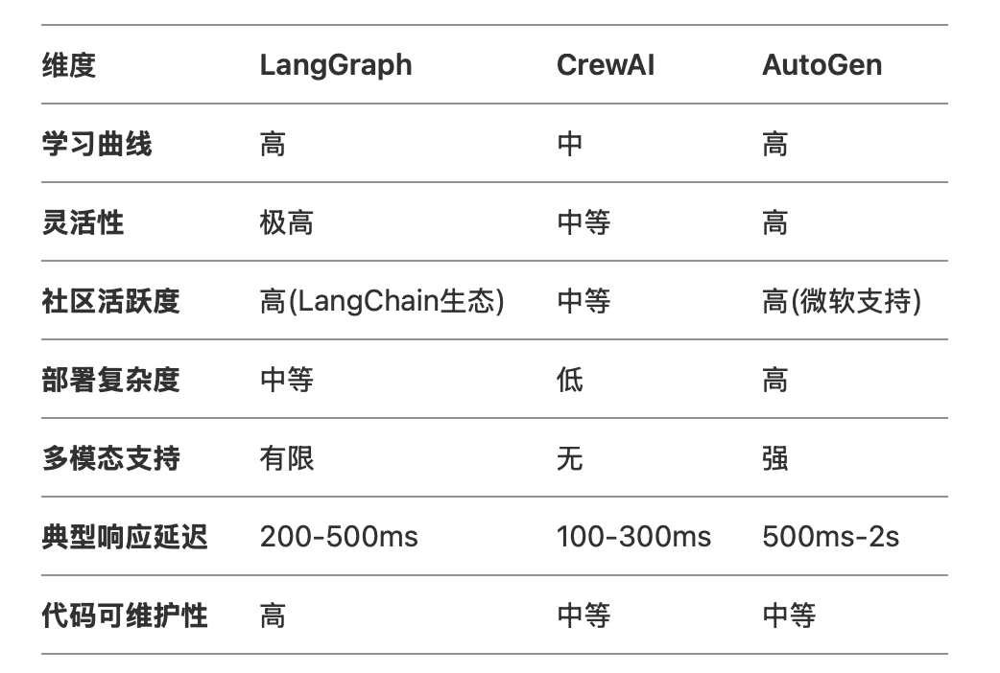
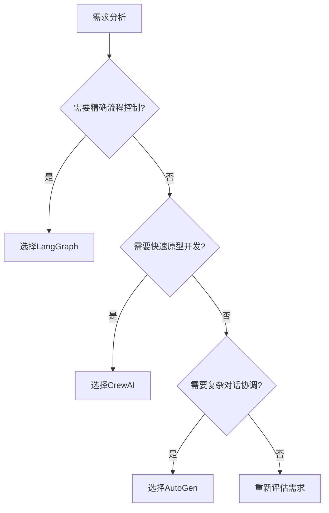

### 自我感受

作为一个开发者，我用过AutoGen和LangGraph，下面是我的一些对比：

先说说AutoGen吧，它在代理合作方式上，就像大家围坐在一起讨论，信息共享，交流起来特别自然、直观，就拿模拟客户支援团队来说，不同专长的代理能像在真实会议中那样互动，特别方便。而且它提供了直接修改基础类的入口，当我要在对话流程里加入特定业务逻辑时，能很轻松地达成，这一点对开发定制化功能太友好了。还有它明确指定一个代理执行函数，这让代码看着特别整洁，结构清晰。

但AutoGen也有一些比较明显的问题。在所有场景都用同一种合作机制，有时候就感觉很死板，不够灵活，聊天的时候还会产生很多无用信息，干扰正常交互。而且修改基础类虽然方便定制，但一到框架版本更新，就容易出现不兼容的问题，又得花时间去调试。另外，在函数调用时，消息在代理间转来转去，特别繁琐，效率不太高。而且和LangGraph比起来，它在表示复杂工作流程时不够灵活，生态系统整合方面也差一些，缺少像LangGraph借助LangChain生态那种丰富的整合和监控工具。

再讲讲LangGraph，它通过Node和Edge来控制工作流程，这简直太强大了！就像我开发财务建议应用时，不同算法模型（代理）能根据特定条件触发提供建议，LangGraph能把这种复杂的条件逻辑构建得特别合理。它高度抽象的设计，让我在添加新功能时，完全不用动底层代码，特别省心。而且在函数调用上，所有代理都能执行函数，协作起来直接又高效。另外，它把工作流程用图形表示，节点代表代理，边代表连接，设计和理解复杂工作流程的时候一目了然，再加上和LangChain生态系统的整合，能利用各种强大的功能和监控能力，真的是如虎添翼。

不过LangGraph也不是十全十美的。它的抽象层太多，刚开始接触的时候，我花了不少时间去理解，学习成本比较高。而且随着工作流程越来越复杂，管理和优化多个代理之间的交互就变得很困难，需要花费更多精力去维护。 

我个人目前使用的是 langgraph，因为在精细程度上来说，langgraph 的控制力更强，可以精细控制每个代理的行为，以及每个代理之间的交互，autogen 的控制力较弱，只能控制代理的行为，不能控制代理之间的交互。

但是新的autogen4.0 也要出来了，它也支持了精细控制，所以可以期待一下。

---

|框架|优势|劣势|适用场景|
|--|--|--|--|
|LangGraph|1. 以图形化形式展示数据流动，直观展示工作流程，便于理解任务间的依赖关系，适合多步骤协同工作的大规模应用； 2. 图形界面便于发现工作流中的瓶颈和问题，简化调试过程|目前相关资料较少，社区生态的成熟度有待提升|需要清晰的语言处理工作流视觉表示，创建分支或多路径依赖的复杂工作流场景|
|CrewAI|1. 界面直观，非技术用户也能轻松创建智能体，可快速上手； 2. 支持为每个智能体定义角色、目标和工具，基于角色驱动进行任务处理； 3. 与LangChain和LlamaIndex等框架无缝集成，集成广泛； 4. 提供丰富的预配置工具，内置工具多样|1. 复杂流程编排能力较弱，灵活性有限； 2. 智能体行为完全依赖LLM的推理能力； 3. 相比部分框架，社区资源和文档较少，社区支持不足|1. 快速构建多智能体原型或演示项目； 2. 需要模拟团队协作的场景|
|AutoGen|1. 专注于软件开发任务，在编程任务处理上能力突出； 2. 包含用户代理和助手代理，用户通过用户代理提供提示，助手代理生成并执行代码，分工协作明确|1. 应用场景相对局限在软件开发相关领域； 2. 对非编程场景的适配性欠佳|主要适用于软件开发任务，如代码生成、程序调试等需要编程能力的场景|

### 选择建议
- **LangGraph**：如果你希望通过图形化界面清晰地管理复杂的语言处理工作流，尤其是涉及多步骤、多路径依赖的任务，LangGraph是不错的选择。它能帮助你直观地设计和调试工作流程，提升大规模应用开发的效率。
- **CrewAI**：当你需要快速搭建多智能体系统的原型，或者模拟团队协作场景时，CrewAI凭借其简单易用的界面和角色驱动的设计，能让你迅速上手并实现相关功能。同时，如果你已经在使用LangChain或LlamaIndex等框架，CrewAI与之无缝集成的特性也会为开发带来便利 。
- **AutoGen**：若你的项目核心是软件开发任务，例如需要进行代码生成、程序调试等编程相关工作，AutoGen的用户代理和助手代理分工模式以及对编程任务的专注处理能力，能很好地满足需求，助力开发高效进行。 

### 根据场景选择

### 总结

LangGraph：需要精细控制流程的复杂多 Agent 项目，并且已经在使用 LangChain，希望获得一个良好的其生态和工具，那么 LangGraph 是一个不错的选择。尽管学习曲线较高，但它在复杂工作流管理方面的优势能够满足你的需求。
CrewAI：当你需要快速搭建多智能体原型，或者进行团队协作模拟，如虚拟团队项目、角色扮演游戏等，CrewAI 的直观界面和角色驱动的设计能够让你迅速上手。不过，如果你对复杂流程处理有较高要求，可能需要考虑其他框架。
AutoGen：如果你从事科研工作，或者需要开发复杂的对话系统，如智能客服、智能助手等，AutoGen 的强大功能和多种模式能够满足你的需求。虽然配置复杂，但丰富的社区资源和微软的支持可以帮助你解决遇到的问题。

