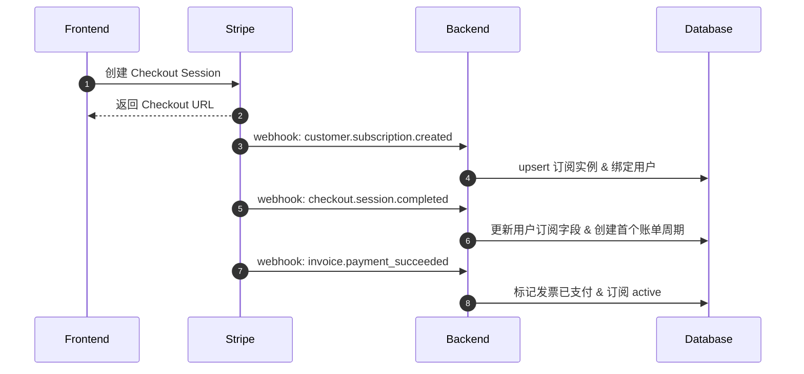
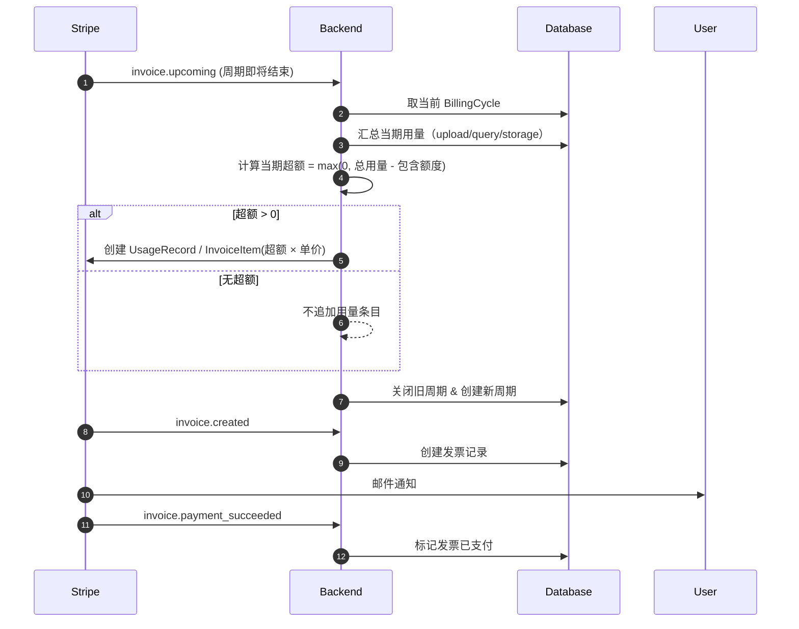
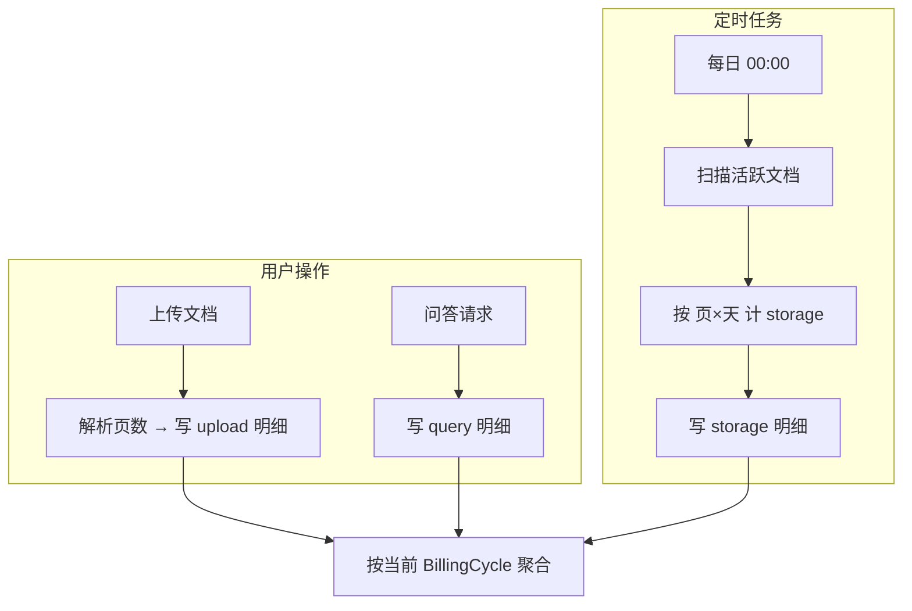

# 构建 Stripe 订阅+按量混合计费系统：从架构到落地（技术博客草稿）

> 最近在尝试使用 stripe 进行产品的支付添加，这是一篇面向工程实现的记录，讨论如何在 **订阅（预付）+按量（后付）** 的混合模式下，稳定地完成计费、用量追踪与对账闭环。

---

## 一、背景与目标

我们要解决的问题很清晰：

* 产品采用\*\*基础订阅费（预付，包含一定额度的 credits）**叠加**超额用量（后付）\*\*的混合模式；
* 覆盖“上传解析 / 问答 / 存储”等多种用量维度；
* 保证**账单周期清晰**、**对账可追溯**、**Webhook 幂等可靠**，并能优雅支持**升级/降级**、**取消**与**重试**。

核心设计思路：

1. Stripe 负责收费与发票生命周期；
2. 业务后端负责**精确计量**与**周期聚合**；
3. 双向对账：**期内实时累计，期末一次性上报**（仅上报超额部分）。

---

## 二、两种计费建模方式：单产品 vs 双产品

> 选择哪一种并没有绝对优劣，关键看你希望**基础费何时收取**、**超额如何合并**以及**订阅体验**。

### 方案 A：**单产品**（一个订阅项）

* 思路：订阅产品只收基础费，**本周期的超额下周期结算**。
* 用户体验：**首次订阅可能出现“基础费延后”或“首期金额较小/0”**（取决于是否立即收取基础费）。
* 适用：希望账单规则**简化**，接受**超额后结**。

### 方案 B：**双产品**（基础 + 用量）

* 思路：

  * 产品 1：基础订阅（预付，当期立即收取）。
  * 产品 2：用量计费（通过 Usage Records/Invoice Items 注入发票，通常在期末合并结算）。
* 用户体验：**订阅时即支付基础费**；超额**与当期发票合并**或**下期补结**，可配置。
* 适用：希望**首日就收基础费**，并将**超额与发票流程**更紧密地绑定。

> 实操上，我更偏向 **双产品**。它能让“预付基础费”与“后付用量”在同一个订阅下有更明确的账务映射，便于财务核对，也便于解释给用户。

---

## 三、用量模型与计价口径

我们将用量拆成三类：

* **upload**：上传解析（按页计）
* **query**：问答请求（按次计）
* **storage**：存储生命周期（按 *页*×*天* 计）

> 定价口径（**隐去具体数值**）：
>
> * 订阅预付：包含 **N** 个 credits；
> * 超额单价：**每个 credit 按计划设定单价**；
> * 不同套餐可配置不同的 **unitPrice** 与 **包含额度**。

### 计量与归集

* **实时写入明细**：业务动作发生时写 `UserUsage`（usageType/quantity/时间戳）。
* **日批任务**：存储费用通过定时任务扫描活跃文件，计算增量并入账。
* **周期聚合**：按 `BillingCycle` 的区间汇总，得到当期总用量与超额值（超出套餐包含额度的部分）。

---

## 四、业务流程与时序

### 1) 订阅创建/更新/取消

> 关键点
>
> * **幂等**：Webhook 处理必须以事件 `id` 为幂等键；
> * **原子性**：订阅状态更新 + 周期创建应放在一个事务内；
> * **状态源**：以 Stripe 为权威源，业务库为缓存与索引。

### 2) 周期结算（期末统计 & 上报超额）

### 3) 实时用量追踪（期内）

---

### 表关系

* User ↔ Subscription：一对多（保留历史订阅轨迹）
* Subscription ↔ BillingCycle：一对多（每期一个周期记录）
* BillingCycle ↔ Invoice：一对一（方便期对账）
* User ↔ UserUsage：一对多（期内明细）
* Plan：被订阅和周期引用

---

## 六、接口与 Webhook 设计

### API（示例）

| 功能    | 路径                              | 方法     | 说明                           |
| ----- | ------------------------------- | ------ | ---------------------------- |
| 创建订阅  | `/api/subscriptions`            | POST   | 返回 Checkout 链接/Client Secret |
| 查询订阅  | `/api/subscriptions/:sid`       | GET    | 订阅与当前周期状态                    |
| 修改订阅  | `/api/subscriptions/:sid`       | PUT    | 升降级（可指定期末生效）                 |
| 取消订阅  | `/api/subscriptions/:sid`       | DELETE | 取消（默认期末生效）                   |
| 查当前用量 | `/api/users/:uid/usage/current` | GET    | 按周期聚合                        |
| 查用量历史 | `/api/users/:uid/usage/history` | GET    | 明细与聚合                        |
| 查账单列表 | `/api/users/:uid/invoices`      | GET    | 发票镜像                         |
| 下载账单  | `/api/invoices/:iid/download`   | GET    | PDF 下载                       |

### Webhook（关键事件）

* `customer.subscription.created/updated/deleted`
* `checkout.session.completed`
* `invoice.upcoming/created/finalized/payment_succeeded/payment_failed`

> **落地要点**
>
> 1. **校验签名**：使用端点密钥校验；
> 2. **幂等处理**：事件 `id` 入库，重复则短路；
> 3. **顺序容忍**：不同事件可能乱序到达，逻辑应**可重放**且最终一致；
> 4. **错误重试**：处理失败返回非 2xx，让 Stripe 重试；
> 5. **日志脱敏**：避免打印客户与卡信息。

---

## 七、工程实现要点

### 1) 周期“来源以 Stripe 为准”

不要让后端用本地定时器“拍脑袋”生成周期边界。**以订阅的 `current_period_start/end` 为基线**：

* 周期切换由 `invoice.upcoming` 触发；
* 关闭旧周期、开新周期时，**以 Stripe 返回的下一期边界**作为本地 `BillingCycle` 的 `startAt/endAt`；
* 服务器重启或任务延迟也不会漂移（解决“重启后周期错乱”的经典坑）。

### 2) 用量与超额的计算口径

* 期内实时累积：`UserUsage` 仅记录**动作发生时的原子量**（如页数、次数、页×天增量）；
* 期末聚合：以 `BillingCycle` 区间窗口汇总，**一次性计算超额**；
* 上报方式：

  * **Usage Record**：适配 metered item；
  * **Invoice Item**：也可直接追加“超额费用行”；
* 上报后，**不可再改当期明细**，需要通过**贷记/补差发票**更正（保持审计友好）。

### 3) 升级 / 降级 / 取消

* 升级：可选择**立即生效**（触发比例计费）或**期末生效**（下期切换）；
* 降级/取消：默认**期末生效**；
* 包含额度“重置”策略需与 BillingCycle 对齐，避免“额度穿越”。

### 4) 幂等与事务

* Webhook 入口以事件 `id` 做去重；
* 数据库内复制一个**事件处理表**（`EventLog`），记录入参、状态、重试次数；
* 跨表更新（例如“关闭旧周期 + 创建新周期 + 写发票镜像”）使用事务；
* 出错时写**补偿任务**（可重跑聚合与上报）。

### 5) 监控与审计

* 指标：事件消费延迟、失败率、账单差异（Stripe vs 本地聚合）、周期漂移告警；
* 审计：周期聚合结果、用量明细抽样、对账报表导出（CSV/PDF）。

---

## 八、常见坑与修复

1. **服务器重启导致周期错乱**

* 症状：周期被重置为本地时间或重复生成；
* 方案：**以 Stripe 的 `current_period_*` 为唯一真相**，从 Webhook 事件中取边界回填。

2. **Webhook 重放或乱序**

* 方案：事件幂等 + 最终一致逻辑（允许重复计算，但保证相同结果）。

3. **用量统计时间窗不一致**

* 方案：所有聚合以 `BillingCycle.startAt/endAt` 为准，不以自然日或本地时区为准；所有时间存 UTC，展示时转换。

4. **升级/降级边界与额度重置**

* 方案：明确“额度生效点”只在**新周期开始**；若需立即生效，创建**临时补差发票**并重设余量。

5. **日志泄露敏感信息**

* 方案：统一脱敏与访问级别控制；密钥放安全配置服务，不入代码仓。

---

## 九、测试策略

* **单元测试**：用量写入、聚合、超额计算；
* **集成测试**：模拟 `invoice.upcoming → invoice.created → payment_succeeded` 全链路；
* **时序回放**：制造乱序/重复事件，验证幂等；
* **边界测试**：周期跨月、含闰日、跨时区、升级/降级当日；
* **对账测试**：本地聚合结果与 Stripe 发票逐行核对。

---

## 十、FAQ（节选）

**Q1：发票从 `invoice.created` 到 `payment_succeeded` 需要多久？**

* 与**支付方式**与**风险审查**有关：

  * 大多数卡支付**几乎实时**；
  * 银行转账/ACH 可能**数小时到数天**；
  * 失败会触发 `invoice.payment_failed`，可配置重试策略。

**Q2：如何调整账单触发周期（账单日/对齐某个日期）？**

* 关键参数通常包括（以概念说明）：

  * **账单锚点**（billing cycle anchor）：将周期对齐到特定日期；
  * **比例计费**（proration）：在非周期边界变更时，按比例补/退差；
  * **期末生效**：将变更延后到下一个 `current_period_end`。
* 实操建议：**所有周期边界以 Stripe 返回为准**，本地只做镜像与对账。

---

## 十一、总结

* 混合计费的本质是**清晰的口径 + 稳定的边界 + 可重放的事件流**；
* 以 Stripe 为结算权威，本地做好**用量事实表、周期镜像与发票镜像**；
* 用**幂等、事务、补偿**兜底，辅以完善的**监控与审计**；
* 这样，既能给用户稳定的账单体验，也能给财务与合规一个可核查、可追踪的账务闭环。

> 注：文中涉及金额/额度/密钥等均使用占位，落地时请根据你的产品配置填充，并确保遵循安全与合规要求。
