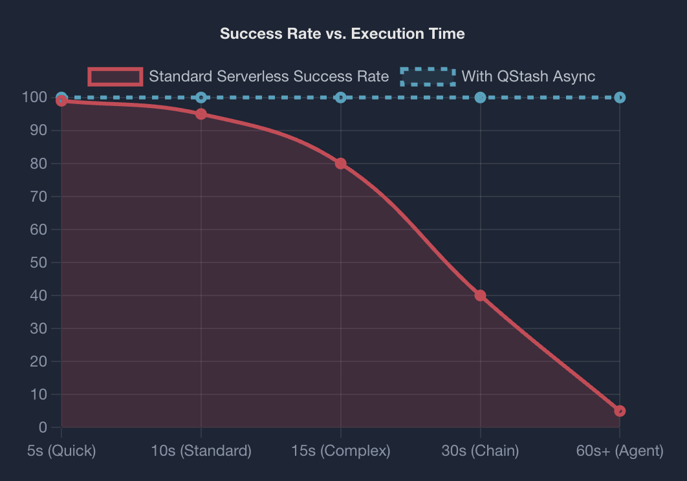
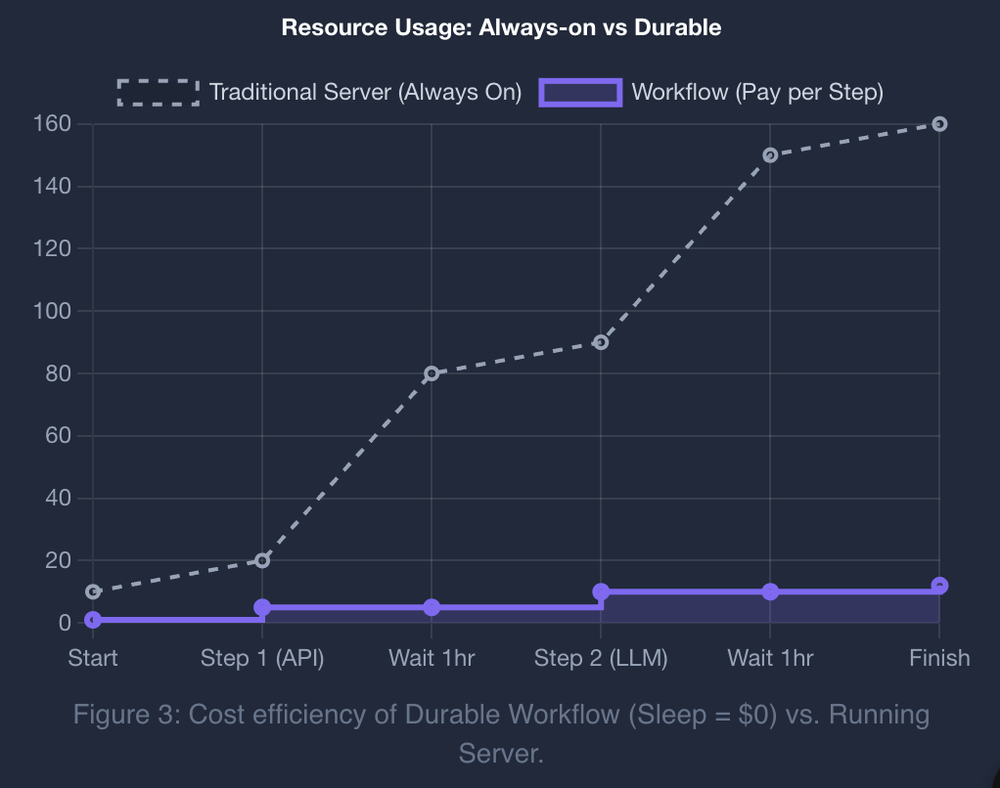
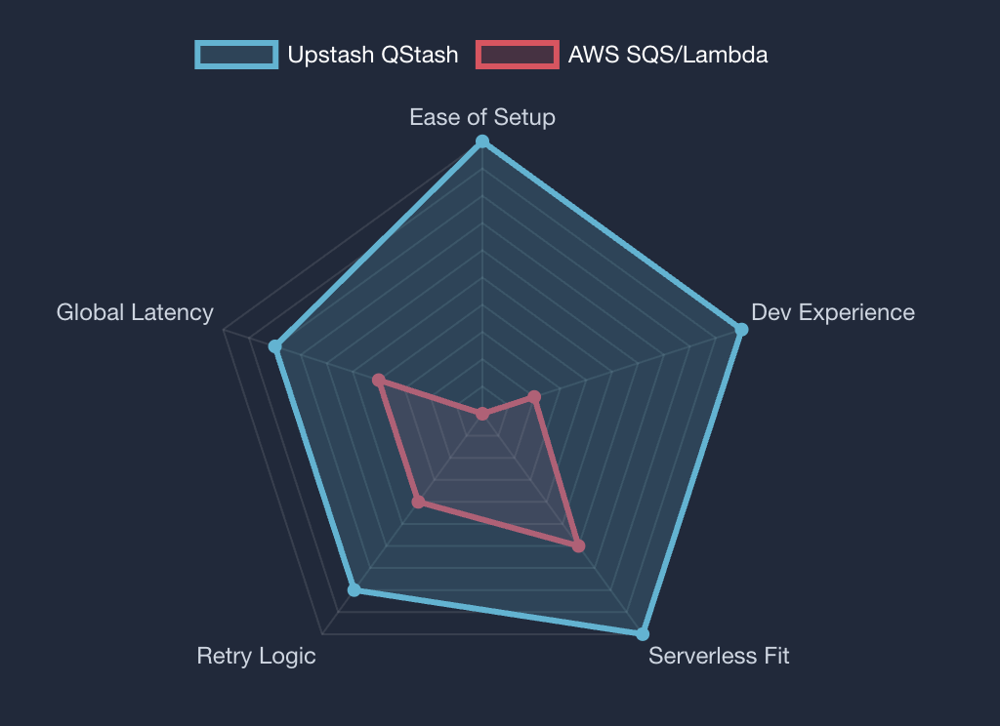

## Serverless 编排与持久化执行模式：Upstash QStash 与 Workflow 实战

### 摘要

最近在做一个自己的小项目时使用了 upstash（其实是之前 elevenlabs 的开发者计划白嫖的 upstash 的额度），深刻的意识到 Serverless 的爆发式普及暴露了“状态”这一老问题：函数短命、无状态、超时窗口有限。常见的解法是堆叠消息队列、数据库、定时任务，结果是工程复杂度飙升。对于长时运行、强一致性或高可靠的流程（如多步 API 协作、长时间推理、需要断点续传的任务），传统 Serverless 模式全是问题，我最近也在尝试使用 Upstash Workflow 来解决这个问题，在这里给大家分享一些我的经验。

Upstash 提供的 **QStash**（HTTP 原生的消息/调度）与 **Upstash Workflow**（基于 QStash 的持久化执行）是一个实用组合：

- QStash 解决“可靠触发”的问题：HTTP 推送、指数退避、死信队列、延迟与 Cron，适配所有 Serverless 平台。
- Workflow 解决“持久执行”的问题：通过挂起、持久化、重放，让代码写起来像同步流程，跑起来则是可中断、可恢复、跨超时窗口的执行。

关于链路的长度影响，可参考下图：


以下按模块拆解，并给出简要实战思路。

---

## 第一部分：Serverless 的状态危机与消息基石

### 1.1 Serverless 的瞬态矛盾

函数模型“用完即弃”，对 CRUD 类场景足够，但对长流程或需要中间态的任务不友好。典型痛点：多步外部 API、长耗时计算、需要幂等与重试的链路。

一个常见例子：
1. 接收查询
2. 规划任务
3. 并发拉取外部数据
4. 生成/汇总内容
5. 推送结果

在 Edge Function 的 10-60 秒超时里几乎无法完成；即便 Lambda 15 分钟，仍需自己处理重试、状态落盘、断点续跑。

传统堆栈是“消息队列 + 数据库 + 定时器”的拼接式方案，可用但维护与调试成本高。

### 1.2 QStash：HTTP 原生消息/调度

核心特点：

- **推送模式**：通过 HTTP POST 触发目标端点，无需长连接或轮询，天然适配 Serverless。
- **交付保障**：非 2xx 自动重试，指数退避，失败进入 DLQ，可手动 redrive。
- **时间语义**：支持延迟消息与 Cron 调度，不必自建调度器。

### 1.3 URL Groups 与并行扇出

把多个端点绑定到同一 Topic，发布一次消息即可并行触发所有端点，适合拆分为子任务的场景（转码、检测、摘要等）。

| 特性 | 传统队列 (SQS/Kafka) | Upstash QStash | 适用点 |
| :---- | :---- | :---- | :---- |
| 协议 | TCP/私有协议 | HTTP/HTTPS | 无需 SDK，跨平台触发 |
| 消费模式 | Pull 轮询 | Push Webhook | 无长驻 Worker，按需唤醒 |
| 重试 | 需配置可见性超时 | 内置指数退避 | 适合易 429/50x 的外部 API |
| 并行 | 增加消费者数 | URL Groups 扇出 | 快速触发大规模并发 |
| 调度 | 需额外组件 | 原生 Delay/Cron | 简化定时/延迟任务 |

---

## 第二部分：从消息到编排——Upstash Workflow 的持久化

### 2.1 为什么需要编排

QStash 解决“触发”问题，但业务流程本身仍需要控制：失败时的补偿、依赖顺序、长耗时步骤的断点续跑。纯消息队列容易陷入“回调地狱”。Workflow 提供持久化执行，让代码写法像同步，运行方式却可挂起、恢复、重放。

### 2.2 核心机制：挂起、持久化、重放

执行流程：
1) 触发后按代码顺序执行，遇到 SDK 原语（run/call/sleep 等）时向编排服务登记意图。
2) 函数立刻结束，状态存储在 Upstash。
3) 外部执行（如 HTTP 调用、sleep）完成后，编排服务再触发函数。
4) 代码从头运行，已完成的步骤直接返回历史结果，未完成的继续执行。

效果：即便中途重启或断电，流程仍能从断点继续，避免重复副作用。

### 2.3 四个关键原语（实用角度）

- **context.run**：包裹本地副作用或非确定性逻辑，确保只执行一次，重放直接取历史结果。
- **context.call**：把 HTTP 调用卸载给 QStash，突破函数超时并节省空转成本，适合外部 API/LLM。
- **context.sleep / sleepUntil**：暂停而不占用计算资源，用于延迟任务或定时轮询。
- **context.waitForEvent**：等待外部信号（如人工审批），无轮询负担。



实战示例：
```ts
const summary = await context.run("generate-summary", async () => {
  const r = await summarize(text);
  await db.insert(r);
  return r;
});

const llmResp = await context.call({
  url: "https://api.openai.com/v1/chat/completions",
  body: { /* ... */ },
});
```

---

## 第三部分：Workflow 在长流程/Agent 场景的落地要点

### 3.1 处理循环与历史膨胀

Workflow 会记录历史；无限循环会拖慢重放并超出 Payload 限制。做法：单次迭代后递归触发下一次（类似 Temporal 的 Continue-As-New），把最新状态作为输入传递，避免历史无限增长。
3) 递归调用：用 client.trigger/context.invoke 触发同一个 Workflow，传入新的 Payload。
4) 退出：当前实例结束，新的实例从干净历史开始，携带最新状态继续跑。

这样把“无限循环”摊开为一串短实例，历史不会无限膨胀。

TypeScript 伪代码：
```ts
export const POST = serve(async (context) => {
  const { history, goal } = context.requestPayload;

  const thought = await context.run("think", () => llm.think(history));
  const action = await context.run("act", () => tools.execute(thought));
  const newHistory = [...history, thought, action];

  if (!isGoalAchieved(goal, action)) {
    await context.run("next-turn", async () => {
      await client.trigger({
        url: process.env.WORKFLOW_URL,
        body: { history: newHistory, goal }
      });
    });
  }

  return { status: "turn-complete" };
});
```

### 3.2 超大上下文：用引用避免超限（Claim Check）

大 Prompt/上下文容易让 Payload 破 1MB。做法：数据存储在 Redis/S3，仅传递引用 Key。

流程：
1) 触发前把大 JSON 存到 S3/Redis。
2) Payload 只带 key（如 session_id）。
3) 首个 context.run 读取完整数据，处理后再写回。
4) 递归触发时仍只传 key。

Workflow 负责控制流，数据流放在外部存储，既绕过大小限制也减小传输成本。

### 3.3 流量控制：主动限流而不是靠重试

并发调用外部 API 容易触发 429。QStash 的 Flow Control 可以对 key（如 openai-prod-key）设定 rate 与 max parallelism：满负荷时排队，不靠盲目重试。

**架构价值**：这允许开发者采用“爆发式”触发模式（瞬间启动 1000 个任务），而系统会自动将这些任务“平滑”成一条符合 API 配额的细流，确保 100% 的成功率且无需编写任何复杂的客户端限流代码。

### **3.4 多 Agent 编排：扇出（Fan-Out）与扇入（Fan-In）**

复杂的任务往往需要多个专业 Agent 协作（例如“研究员”、“撰稿人”、“审稿人”）。Upstash Workflow 通过 Promise.all 和 context.invoke 完美支持这种模式。

**并发扇出（Fan-Out）：**

TypeScript

await context.run("parallel-agents", async () \=\> {  
  // 同时启动三个子工作流  
  const research \= context.invoke("research-agent", { topic });  
  const images \= context.invoke("image-gen-agent", { topic });  
  const seo \= context.invoke("seo-agent", { topic });  
    
  // 扇入（Fan-In）：等待所有子任务完成  
  const \= await Promise.all(\[research, images, seo\]);  
    
  return combine(researchResult, imageResult, seoResult);  
});

在这个模式中，主 Workflow 充当编排器（Orchestrator）。它并不执行具体任务，而是分发任务。context.invoke 会触发其他 Workflow 并等待其完成。  
Upstash 能够识别 Promise.all，并行调度这三个子 Workflow。主 Workflow 会挂起，直到所有子任务都返回结果。这种模式实现了任务的解耦和并行加速，是构建高性能 Agent 团队的标准范式。

## ---

**第四部分：高级实现模式与开发者体验**

### **4.1 双通道模式：流式响应（Streaming）与持久化**

用户在使用 ChatGPT 时习惯了“打字机”效果。然而，Upstash Workflow 是异步的、基于消息的，这似乎与实时流式传输（Streaming）相悖。Workflow 的步骤通常在完成后才返回结果。

为了在保持 Workflow 持久化优势的同时提供实时体验，我们采用**双通道模式（Dual-Channel Pattern）**。

1. **通道 A（控制与持久化）**：Workflow 负责核心逻辑的执行、状态保存、重试和最终一致性。  
2. **通道 B（实时反馈）**：在 Workflow 执行 LLM 生成的过程中，将生成的 Token 实时推送到一个即时通讯通道。

**技术栈组合**：Upstash Workflow \+ **Upstash Redis** (Pub/Sub) 或 **Upstash Realtime** (Server-Sent Events)。

**流程：**

* 前端发起请求，触发 Workflow。  
* 前端同时订阅一个 Redis Channel（以 session\_id 命名）。  
* Workflow 开始调用 LLM。在接收到 LLM 的流式 Token 时，Workflow 并不是只在内存中拼接，而是同时调用 redis.publish(channel, token)。  
* 前端通过 WebSocket/SSE 实时收到 Token 并展示。  
* Workflow 结束后，将完整回复存入数据库。

这种分离确保了：如果用户关闭浏览器，Workflow 仍在后台继续运行并完成任务（持久性）；如果用户在线，他们能获得即时的交互反馈（实时性）。

### **4.2 幂等性（Idempotency）设计的艺术**

在持久化执行环境中，**幂等性**是至高无上的法则。由于网络故障，任何步骤都可能被执行多次（尽管 context.run 保证了结果缓存，但在结果被成功持久化之前的崩溃可能导致重试）。

**陷阱：**

TypeScript

// 错误示例  
const paymentId \= await stripe.charge(); // 在 context.run 之外！  
await context.run("send-email",...);

如果 send-email 步骤失败导致 Workflow 重试，整个函数从头运行，stripe.charge() 会被再次调用，导致用户被重复扣款。

黄金法则：  
所有副作用（API 调用、DB 写入）必须包裹在 context.run 中。

TypeScript

// 正确示例  
const paymentId \= await context.run("charge-stripe", async () \=\> {  
  return await stripe.charge(); // 只有在第一次执行时调用，重试时直接返回缓存的 paymentId  
});

此外，对于外部系统，尽量使用支持幂等性的 API（例如，向 Stripe 传递 Idempotency-Key）。

### **4.3 错误处理：死信队列（DLQ）与 Failure Function**

即便有重试机制，代码 bug 或外部服务的长期宕机仍会导致 Workflow 彻底失败。  
Upstash 提供了两层防护：

1. **死信队列（DLQ）**：所有重试耗尽的消息进入 DLQ。开发者可以在控制台查看 Payload，修复代码 bug 后，直接点击“Redrive”重新处理这些消息。这对于 AI Agent 尤为重要，因为你不想因为一个解析错误就丢弃整个昂贵的推理结果。  
2. **Failure Function**：在定义 Workflow 时，可以指定一个 failureUrl 或 failureFunction。当 Workflow 最终失败时，系统会回调这个函数。  
   * **用例**：发送 Slack 报警、回滚数据库事务、给用户退款。

### **4.4 本地开发与调试体验**

Serverless Webhook 开发的一大痛点是本地调试。QStash 需要访问公网 URL，而你的 localhost 是不可达的。

本地开发服务器（Local Development Server）：  
Upstash 提供了 @upstash/qstash-cli，它可以在本地模拟整个 QStash 平台。

* 运行 npx @upstash/qstash-cli dev。  
* 它会在本地启动一个服务器（默认 8080 端口）。  
* 它会拦截所有的 context.call/run 请求，并直接调用你的本地 API（如 localhost:3000/api/workflow）。  
* **优势**：无需配置 Ngrok 或 Cloudflare Tunnel，支持离线开发，且响应速度极快。

时间旅行调试（Time-Travel Debugging）：  
Upstash Console 提供了一个可视化的时间轴。你可以点击任何一个历史步骤，查看当时的 Input 和 Output。这对于调试 AI Agent 极其有用——你可以确切地看到 LLM 在第 3 步输出了什么导致第 4 步崩溃，而不是靠猜。

## ---

**第五部分：成本与性能分析**

首先是 lambda 真的是太贵了，AWS 的东西真的用不起，全方位对比一下 upstash 和 AWS



### **5.1 定价模型经济学**

Upstash 采用基于\*\*消息数（Message Count）**的定价模型，这与 AWS Lambda 的**基于时间（Duration）\*\*模型有着本质区别。

* **Upstash**：每 10 万条消息约 $1（不同套餐有差异）。一个 context.run 算 1 条消息，context.call 算 2 条。  
* **Lambda/Vercel**：按 GB-Seconds 计费。

AI 场景的成本套利：  
假设一个 Agent 需要等待 GPT-4 生成回复，耗时 60 秒。

* **Vercel Serverless**：你需要支付 60 秒的计算费用。这非常昂贵，且容易超时。  
* **Upstash Workflow (context.call)**：你的函数在发送请求后立即休眠（0 秒计算时间）。你只需支付 2 条 QStash 消息的费用（约 $0.00002）。  
* **结论**：对于 I/O 密集型（等待时间长）的 AI 应用，Upstash Workflow 的成本通常比纯 Serverless 低一个数量级。

### **5.2 性能考量**

虽然 Workflow 极其可靠，但它引入了额外的延迟。每个 context.run 都会触发一次“函数暂停 \-\> 状态持久化 \-\> 函数唤醒”的循环。这通常会增加 50-200ms 的开销。  
对于需要毫秒级响应的实时应用（如高频交易），这不适用。但对于 AI Agent，用户的预期通常在秒级，这几百毫秒的开销相对于 LLM 的推理时间（数秒）几乎可以忽略不计，换来的是无价的可靠性和状态管理能力。

## ---

**结语：迈向高韧性的 AI 原生架构**

Upstash QStash 与 Workflow 的组合，不仅仅是一个工具集，它代表了一种架构范式的转移。它将分布式系统的复杂性（重试、队列、状态持久化、调度）从应用层下沉到了基础设施层。

对于 AI 开发者而言，这意味着你可以像写单机脚本一样编写复杂的、多步骤的、由 LLM 驱动的 Agent，而无需担心服务器崩溃、超时或 API 限流。通过掌握“Continue-As-New”、“Claim Check”和“Flow Control”等设计模式，开发者可以在 Serverless 的低成本基础上，构建出企业级的、具备无限扩展能力和高容错性的智能系统。

在这个 AI 迅速渗透软件各个角落的时代，\*\*持久化（Durability）\*\*将不再是后端的选修课，而是构建可信赖 Agent 的必修课。Upstash 正是这门课程的最佳实践平台。
