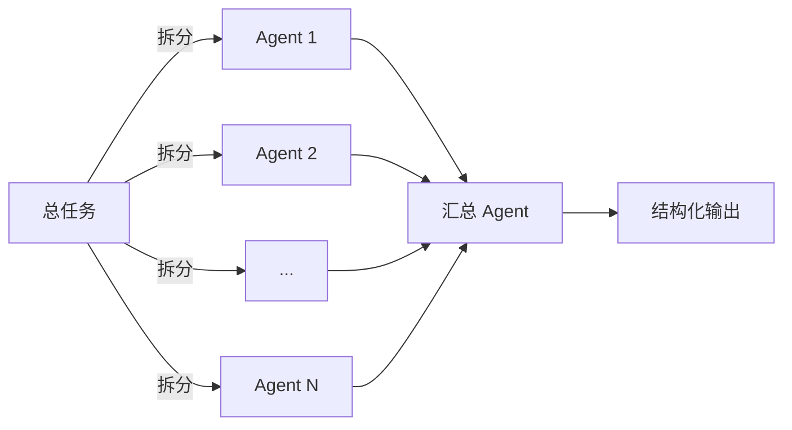

TiDB Cloud 上每天新建的集群，超过 90% 是 AI Agent 创建的。不是人类开发者点按钮，是 Agent 自己调 API 拉起来的。

这个数字改变了一个根本性的设计问题：当你的软件的主要用户不再是人，它应该长什么样？

直觉答案是"更智能、更强大、更新"。但黄东旭（PingCAP CTO）最近的一篇文章给出了一个完全相反的结论，我越想越觉得他说到了点上——**给 AI 做的软件，核心策略不是创新，而是复古。**

## 熟悉度悖论：你的 API 越新，AI 越不会用

LLM 在训练中内化了几十年的编程范式：文件系统、进程模型、POSIX 接口、SQL 语法。这些东西形态在演进，但核心抽象几乎没变过。当模型看过足够多的代码后，这些反复出现的模式就沉淀成了极强的先验知识。

这意味着一个反直觉的结论：**你的 API 越像已有的东西，AI 用得越好。你越创新，AI 越懵。**

这也是为什么 LangChain 之类的 Agent 框架叫好不叫座——它太新了，训练数据里没有足够的使用模式。连人类程序员都懒得学的东西，凭什么指望 AI 用好？Agent 不是在等一个更强大的系统，它更喜欢一个"它已经懂的系统"，然后用比人类快 1000 倍的速度写胶水代码来扩展它。

> 在传统软件行业，创新是竞争优势。在 AI Agent 时代，**兼容性**才是。

这跟生物学里的一个现象很像：进化中最成功的不是最强壮的物种，而是对已有生态位适应最好的。POSIX 就是软件世界的"生态位"——Agent 在这个生态位里如鱼得水。

## 好抽象的特征：在不破坏约束的前提下允许演化

Linux VFS 做了一件漂亮的事：任何用户态文件系统，只要遵循 POSIX 约定，就能被挂载进现有系统。上层完全无感，系统却获得了持续演化的能力。

```bash
# 假想：一个向量文件系统
$ cp ./docs/* /vectorfs/docs    # 自动创建索引、切分 Chunk、上传 S3
$ grep -r "What's TiDB?" ./docs # 在向量索引上搜索
```

用户执行的还是 `cp` 和 `grep`，心智模型零成本。但底层已经是完全不同的实现了。

这里有一个精妙的张力：**约束太松系统会失控（Agent 写代码速度是人类几千倍，没有约束很快就飞了），约束太紧又无法利用这个速度来演化。** VFS 恰好踩在了甜蜜点上——接口封闭，实现开放。

我把这个称为 **"POSIX 法则"**：给 AI 设计系统时，锁死接口语义，解放实现空间。

## 接口设计的三条硬约束

当 Agent 成为用户时，接口必须同时满足三个条件：

| 约束 | 本质 | 反例 |
|------|------|------|
| **可被自然语言描述** | 一句话能讲清"这个接口干嘛" | GUI 里的拖拽交互——试试用语言精确描述"点哪里拖到哪里" |
| **可被符号逻辑固化** | 意图能冻结为代码/SQL/config | 纯自然语言指令——每次执行结果可能不同 |
| **交付确定性结果** | 同输入→同输出 | 依赖隐式状态的 API |

第二条做好了，第三条自然满足。

这就解释了一个趋势：**CLI 正在复仇**。Anthropic 的 Claude Code 主动放弃了 GUI，因为命令行天然满足这三条约束——可描述、可固化、可确定。而 GUI 在 Agent 视角下几乎是不可见的。

有人会说自然语言有歧义。但原文给了一个很务实的回答：当底层心智模型正确、接口语义稳定、结果可验证时，Agent 的少量歧义不会成为系统性问题。它通过上下文和反复尝试来消解歧义，就像人类工程师之间的沟通一样——没有人每次都说得 100% 精确，但工程照样推进。

### 代码是终极 Meta Tool

原文中我最认同的一个判断：**编程本身是最好的工具，比任何 MCP Tool 都强。**

例子：把 10000 个英文单词翻译成中英释义。笨办法是把词表全塞给 LLM。聪明办法是让 Agent 写 6 行代码：

```python
def enrich_vocab(src, dst, llm_translate):
    with open(src) as f, open(dst, "w") as out:
        for word in map(str.strip, f):
            if not word:
                continue
            out.write(f"{word}\t{llm_translate(word)}\n")
```

模型理解一次规则，应用到任意规模数据。代码的认知密度远高于自然语言——Agent 用极少的符号描述了一个可以无限执行的过程。这也是我不太认同疯狂堆 MCP Tool 的原因：**与其给 Agent 100 个专用工具，不如让它自己写工具。**

## Agent Infra 的经济学：日抛型负载 × 极致虚拟化

Agent 的工作负载本质上是**日抛型**的。它们喜欢并行拉起多个分支，跑通一个就扔掉其他的。代码质量？不追求优雅，能跑能验证就行。

这颠覆了传统 Infra 的核心假设——"一个集群很宝贵"。在 Agent 时代，你必须假设**实例是廉价的、生命周期极短、数量会爆炸式增长**。

如果还沿用"一个任务一个实例"的模型，百万级租户的管理成本本身就不可承受。解法只有一个：**虚拟化**——资源共享，语义隔离。让每个 Agent 觉得"这是我的独立环境，随便折腾"，但背后其实是共享资源池。

> 虚拟化不是优化项，是 Agent Infra 的前提条件。做不到这一点，Agent 就被迫"省着用"，并行试错的优势就归零了。

另一个被低估的维度是**单位时间可撬动的算力**。当前大多数 Agent 交互还是串行的——问一句答一句。但复杂任务需要的是并行：



从"一块 GPU 串行对话"到"N 个 Agent 并行执行再汇总"——这对底层 Infra 的弹性要求是质变级别的。

## 商业模式的断裂：卖 Token 不可持续

这是整篇文章里最有商业洞察的部分。

过去软件行业的经济学很简单：需求足够大才值得投入工程成本。小超市老板想要库存系统？投入产出不匹配，不做。

但当 Agent 把写代码的边际成本拉到接近零，大量"不值得做"的长尾需求突然全部变得可行。这意味着 Infra 的总租户数会爆炸，但每个租户规模可能都很小、访问频率极低。

原文指出了一个结构性问题：**单纯卖 Token 的商业模式是脆弱的。** 卖得越多成本越高，竞争对手也在降价，规模上来后成本反噬增长。可持续的模式应该是把"每次重新推理"转化为"一次构建、反复使用"的服务。

这跟能源行业的演进路径几乎一样：从按度卖电（边际成本线性增长）到基础设施订阅模式（固定成本、边际成本趋零）。**谁先完成这个转型，谁就能在 Agent 时代活下来。**

## 三个可迁移的思考框架

读完这篇文章，我提炼出三个可以应用到其他领域的框架：

**1. 熟悉度优先原则**
给 AI 设计任何东西（API、数据格式、工作流），首先问：这个设计在训练数据里有多少先例？先例越多，AI 用得越好。创新应该发生在实现层，不是接口层。

**2. POSIX 法则**
接口封闭 + 实现开放 = 可控演化。这个模式不只适用于文件系统，适用于所有需要在稳定性和灵活性之间取舍的系统设计。

**3. 边际成本归零推演**
当某种生产要素的成本趋近于零时，反向推导整个价值链的变化：谁受益？谁被替代？瓶颈转移到哪里？代码生产成本→0 的推演结果是：运行成本成为新瓶颈，Infra 定价模式必须重构。

---

放下"我在控制系统"的执念，拥抱"系统被创建、试用、丢弃"的常态——这可能是做基础架构的人接下来都要面对的课题。

Welcome to the machine.
