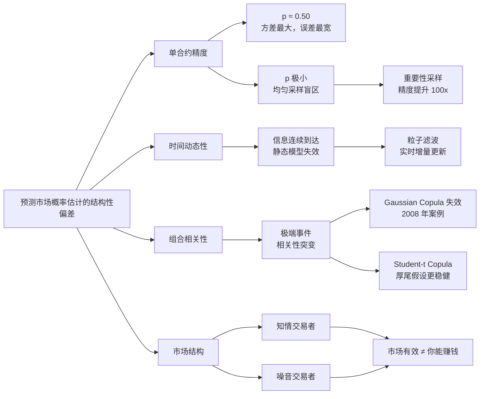

Polymarket 上最基础的操作：买一张合约，赌某件事会不会发生。合约价格代表概率，0.70 就是 70% 的意思。大多数人的使用方式是看一眼价格，觉得低估了就买，觉得高估了就跳过。

但"我觉得低估了"和"我能证明它低估了"，是两件完全不同的事。

预测市场和体育博彩的根本区别，不是主题，而是定价机制。博彩公司是庄家，它设定赔率，确保自己有利润空间；预测市场是对手盘市场，买卖双方直接撮合，价格由市场参与者共同决定，没有庄家抽水。这意味着价格反映的是市场参与者对事件概率的集体判断——它可以偏高，可以偏低，可以在信息不足时卡在 0.50，也可以在信息更新时迅速移动。

预测市场的实质是在交易概率的准确性，而不只是在赌结果。想在里面赚钱，不是猜测未来，是识别市场对概率本身估计的系统性偏差。这类偏差不是随机的，是有结构的——知道在哪里找，意义完全不同。

这篇文章拆解四个这样的结构性偏差。每一个都反直觉，每一个都在特定场景下稳定地错。

## 0.50 是最难定价的合约

先说一个反直觉的结论：预测市场里，报价越接近 0.50 的合约，往往估计越不可靠。

机构对预测市场合约定价用的基础工具是 Monte Carlo 模拟。原理不复杂：对影响事件的相关变量跑大量随机模拟，统计满足合约条件的比例得到概率估计。比如要估计某项立法通过的概率，就模拟政治支持度、议员投票倾向、外部事件冲击等几十个变量的组合，跑 10 万次，看多少次立法最终通过。这 10 万次结果里，命中的比例就是概率估计。

这个方法有个系统性弱点：**估计误差在 0.50 附近最大**，在接近 0 或 1 时反而最小。

背后有具体的统计原因。一枚硬币，抛 100 次，正面朝上的比例是多少？如果这枚硬币是 99% 概率正面，100 次结果里 99 次正面是强信号，置信区间非常窄。如果是 50% 概率，100 次结果里正反各半，但仅凭这 100 次你根本无法区分"真的 50%"和"其实是 53%"或"其实是 47%"——你需要跑更多次才能缩小误差范围。

数学上，Bernoulli 分布的方差是 p×(1-p)，当 p=0.50 时取到最大值 0.25，当 p 趋近 0 或 1 时趋近于 0。估计误差和方差直接相关，所以 0.50 的合约在同样的模拟次数下，估计精度最差。

你在 Polymarket 看到一张报价 0.50 的合约，直觉说"这很中性，市场没有倾向性"。更准确的读法是：**市场在说'我们不确定，而这正是我们最不确定的区间'。**

这两种解读导致完全不同的交易逻辑。如果你认为 0.50 是"中性稳定"，你可能会在轻微信息冲击后买入，期待价格回归 0.50。如果你认为 0.50 是"估计最模糊"，你知道这张合约的价格噪声最大，需要比其他合约更强的方向性信号才值得建仓。

买 0.50 附近的合约不是错。但你需要的不是"感觉它应该更高"，而是一个比市场现有信息更清晰的判断依据。

## 低概率事件，普通模拟看不见

0.50 是方差太大的问题，0.01 是另一端的问题——普通 Monte Carlo 根本看不见那里。

假设你在估计这样一个合约：某国央行在接下来三个月内宣布突发性降息超过 200 个基点。从历史数据看，这种事件的发生概率可能在 0.5%-1% 之间。

表面上，跑 100 万次模拟应该能命中 5000-10000 次，足够统计。现实是，对真正的极端事件，"命中"不是一个参数随机走到某个值，而是多个参数同时对齐，触发一连串的因果链。利率压力必须够高、政治窗口必须打开、外部冲击必须够大、央行委员会必须达成共识——这些条件同时满足的概率，往往比单个参数的极端概率还要低一个数量级。

结果是跑完 100 万次模拟，命中次数为零。不是因为概率真的是 0，而是均匀随机采样没有把采样预算花在正确的地方——100 万次里绝大多数都在模拟"一切正常"的情形，真正值得关注的那个角落一次都没到过。

这个问题有个专门的解法，叫重要性采样。思路是：不从全部可能空间均匀采样，而是人为地把采样分布向感兴趣的极端区域倾斜，专门模拟那些"正常采样很少触碰"的参数组合。然后在统计结果时，用数学方法反向校正这个倾斜，确保最终得到的概率估计是无偏的。

打个比方，这就像在大海里找针。均匀采样是把大海分成 100 万个格子，每个格子抽一次。重要性采样是先根据海流和磁场判断针最可能在哪片区域，在那片区域密集采样，最后用抽样密度修正结果。同样的采样预算，后者对尾部事件的估计精度可以提高 100 倍以上。

这解释了为什么在黑天鹅类合约上，机构定价和散户直觉差距最大。不是因为机构消息更灵通，而是散户的概率直觉对极端事件根本不可靠——没有经过尾部校正的直觉在这里不是粗糙，是系统性错误。机构用重要性采样，相当于换了一副专门看尾部的眼镜；散户在用裸眼，然后说"看不见，所以概率很低"。

## 选举夜的实时更新问题

前两个问题都是静态的：在某个时间点上，如何正确估计一个概率。预测市场还有一个动态问题：概率在时间里是连续变化的，而且变化速度可以非常快。

选举夜是最极端的场景。开票前，合约在 0.55 附近；开票后三个小时，所有关键摇摆州的数字陆续进来，合约可能走到 0.85 或者 0.20。在这段时间里，每隔几分钟就有新的计票数据进来。每个数字都携带信息，都会改变对最终结果的估计。

如果你在这段时间交易相关合约，你的概率模型必须能在每条新信息到达时立即更新。"等全部结果出来再算"没有意义——信息价值在它到达的那一刻，而不是在全部到齐之后。

这个持续更新的需求，用静态的 Monte Carlo 处理不了。从头重跑整个模拟成本太高，而且不能增量处理——你每次都要把之前的知识全部扔掉重来。

专业工具叫**粒子滤波**，也是序列 Monte Carlo 的一种。它的工作方式是这样的：

开票前，维护一个对"候选人最终得票数"的概率分布——比如用 1000 个粒子表示，每个粒子是一种可能的最终结果，初始时均匀分布在合理区间内。

第一批计票结果进来，比如某个关键县的初步数字。对每个粒子，计算"如果最终结果是这个粒子代表的值，看到这条计票数据的概率是多少"。这个概率叫做似然。给每个粒子乘上它的似然，重新归一化，粒子的权重就更新了——和这批数据一致的粒子权重变高，不一致的变低。

然后执行重采样：根据更新后的权重，从 1000 个粒子里重新采样 1000 个，高权重的粒子会被多次采到，低权重的会消失。再加入少量随机扰动防止所有粒子收敛到同一点。

这个过程每次新数据进来就重复一次。1000 个粒子代表的分布，随着信息流连续演进，始终反映截至当前所有已知数据下的最优概率估计。

对普通用户来说，这个机制最重要的含义是：**市场价格在选举夜的每次跳动，都对应一批新信息的信息量大小**。当佛罗里达早期计票显示某候选人领先幅度超出预期，合约从 0.60 跳到 0.72，这个跳动的幅度不是随机的，它对应的是"这个结果在当前概率分布下的惊讶程度"。

能利用这个机制的交易者，是那些能提前判断"某批数据比市场当前预期更强或更弱"的人。比如，历史上某个县的结果是全州走势的领先指标；或者早期计票覆盖的区域本来就偏向某一侧，需要等后续数据校正。这类判断需要对地理和历史数据的深度理解，不是看一眼数字就能做到的。

如果你的判断速度和质量都不如市场，选举夜交易的结果是在追一个已经移动过的价格。信息已经定价了，你只是在付溢价。

## 相关合约的隐藏炸弹

前三个问题都是关于单个合约的——如何正确估计一个事件的概率。最后一个问题升维：如果你同时持有多张合约，它们之间的关系如何？

预测市场里经常出现高度相关的合约组。比如 2024 年美国大选期间，Polymarket 上同时存在"特朗普赢得宾夕法尼亚"、"共和党拿下参议院"、"共和党赢得众议院"等多张合约。这些事件高度正相关——如果共和党整体势头强，所有合约都会上涨；如果民主党反弹，所有合约都会下跌。

很多人交易这类合约时，会分别估计每张的概率，然后认为持有多张相当于分散了风险。持有三张相关性 0.6 的合约，看起来比押注全部在一张上更稳健。

这个逻辑在平常时候没问题。它在一个关键情况下会系统性失效：**极端事件发生时，原本中等相关的合约会变成高度相关**。

为什么？因为极端政治事件往往有共同的系统性驱动因素。当某个触发点来临——比如经济数据大幅超出预期、爆出重大丑闻、发生地缘政治冲击——它会同时影响所有相关合约的基本面，让它们的走势在短时间内高度同步。原本相关性 0.6 的两张合约，在这个时间窗口内相关性可能跳到 0.95。

你以为持有的是分散组合，但在最关键的时刻，它表现得和一张合约没什么区别。

这个问题在金融史上有一个著名的案例，代价是整个经济体的数年增长。

2008 年金融危机之前，华尔街把大量住房抵押贷款打包成 CDO（抵押债务凭证），卖给全球投资者。这些 CDO 内部包含来自不同地区、不同风险等级的贷款，看起来非常分散。定价时，银行用了一个叫 Gaussian Copula 的数学模型来描述不同贷款之间的相关性。

这个模型背后的假设，用直白的话说就是：贷款人 A 还不上款和贷款人 B 还不上款，这两件事的关联程度，在房价大跌时和正常时候差不多。

这个假设在统计学上对应一个具体的选择：用正态分布（Gaussian 分布）来描述相关性的尾部行为。正态分布的尾部非常轻薄——极端事件是相互独立的，两个极端事件同时发生的概率极低。

现实是：当房价开始大跌，还不上款的人不是均匀分布在全美的，而是高度集中——大量来自同一批次、同一时期、同一经济区域的贷款同时出问题。极端事件的相关性，比正态假设预测的高出数倍。CDO 的风险模型全线崩溃，被认为"多元化"的组合事实上在同一个方向上集中暴露。

Gaussian Copula 的问题，是它用了一个"极端情况下相关性保持稳定"的假设来定价那些"极端情况下相关性会突然增强"的产品。模型和现实在最关键的时刻背道而驰。

预测市场里的类似坑更难察觉，因为相关性不是写在合约条款里的，它是通过共同的驱动因素隐性存在的。更健壮的做法是用能捕捉尾部相关性增强的模型——比如 Student-t Copula，它假设极端情况下相关性会变强，尾部是"厚"的，而不是 Gaussian 的"薄"尾。但对大多数普通用户来说，更实用的认知是：

**在极端事件的压力测试下，多张相关合约的组合不是分散风险，而是放大风险。** 你在平时感受到的分散效果，在恰恰最需要分散的时候消失了。

## 市场为什么有效，即使多数人在猜

上面四个坑，都是在说市场定价可能在哪里出错。但有一个反方向的问题同样值得回答：既然这么多参与者都没有精确的模型，预测市场的价格为什么还能大体靠谱？

Polymarket 2024 年大选的定价记录是一个常被引用的证据：开票前几周，合约价格对特朗普胜选的概率估计一直高于主流民调，最终结果证明 Polymarket 的方向是对的。这个结果用来支持"预测市场是高质量信息聚合器"的论点——即使个体参与者不理性，市场整体给出的估计仍然优于传统民调。

背后的机制，用 Agent-based 模型（基于主体的模型）可以解释得比较清楚。这类模型不假设所有参与者都是理性的，而是把参与者分成几类：

**知情交易者**：掌握比市场更多信息，或者有更准确的模型。他们的策略是在合约价格偏离他们估计的"真实概率"时买入或卖出，赚取差价。他们是价格向真实价值靠拢的驱动力。

**噪音交易者**：因各种原因（情绪、消息误读、随机偏好）买卖合约，交易方向和真实概率无关。他们的行为在统计上互相抵消——在高价买入的和在高价卖出的，平均下来对价格没有系统性影响。

**做市商**：持续提供买卖报价，赚取买卖价差。他们不押注方向，只是维持市场流动性，让其他参与者可以随时进出。

这三类参与者共存的结果，是一个涌现出有效定价的市场——尽管多数个体参与者都在做随机或噪音决策，知情交易者的套利行为会持续把价格拉向信息均衡。

但这个机制恰恰也是它冷酷的地方。市场有效性，是通过让非知情参与者长期平均亏损来实现的。噪音交易者是这个系统的流动性提供者，也是它的补贴来源。你贡献的是价差，知情交易者拿走的是错误定价。

市场定价靠谱，和你能在里面赚钱，是两件完全不同的事。

---

这五个维度——0.50 附近估计最不精确、极端事件采样看不见、概率需要随信息实时更新、相关性在极端情况突然增强、市场有效但对你未必有利——不是独立的技术细节，而是描述同一件事的不同侧面：**概率不是一个数字，是一个带结构的对象，有误差、有边界、有动态、有相关性、有社会性**。

把价格当成精确的概率读数，是在预测市场里最常见也最贵的认知简化。读价格时，问的问题不只是"这个概率是多少"，还应该是：这个估计的置信区间有多宽？这里的尾部风险可见吗？价格反映的是截至当前还是截至某个更早时间点的信息？如果持有多张合约，它们在极端场景下会怎样联动？

不需要全部搞清楚才能开始交易，但至少要知道这些问题存在。

## 延伸阅读

- [Prediction Market Simulation Techniques — gemchange_ltd](https://x.com/gemchange_ltd/status/2027744530124951831)
