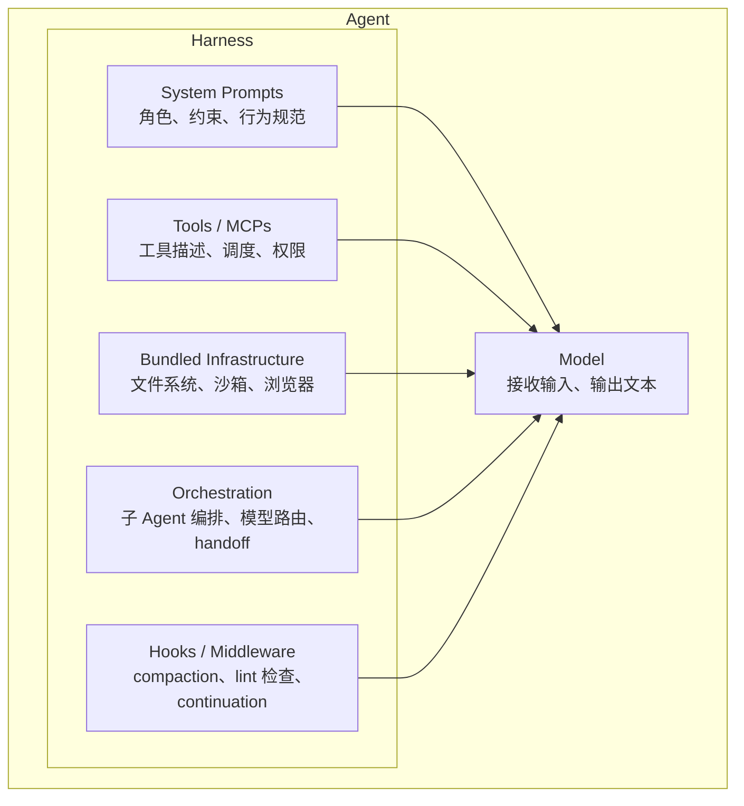
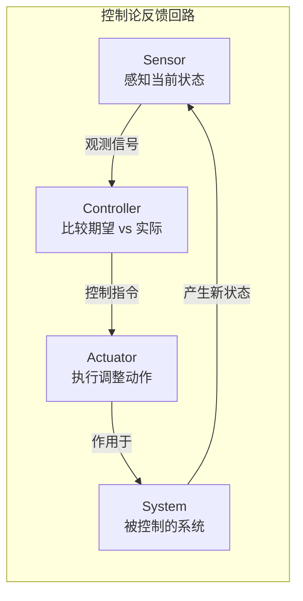
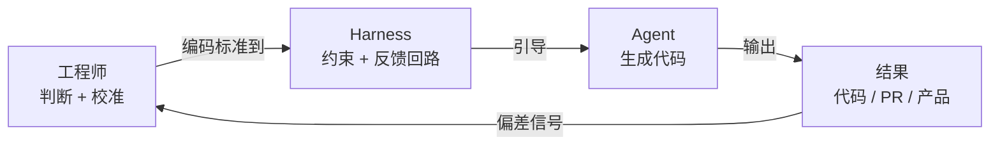

Terminal Bench 2.0，同一个 Opus 4.6。一个团队仅靠改 harness——不换模型、不动权重——排名从 Top 30 跳到了 Top 5。

这不是个别现象。OpenAI 的 harness engineering 博客描述了一种新的工程形态：五个月产出一百万行代码，没有一行是人手写的。工程师做的事情是设计环境、构建反馈回路、编码架构约束——然后 Agent 负责写代码。他们给这种工作方式起了个名字：harness engineering。

我们花大量时间讨论"哪个模型更强"，但这些数据说的是另一件事：**现阶段 harness 的边际贡献可能大于模型升级。** 模型能力趋同的速度越来越快，各家 benchmark 你追我赶，差距以月为单位缩小。但同一个模型在不同 harness 里跑出的差距，可以是 Top 30 和 Top 5 的距离。这个差距的杠杆在你手上，不在模型厂商手上。

## 如果你不是模型，你就是 Harness

Agent = Model + Harness。这个等式干净到残忍。

模型能做的事很少：接收文本、图像、音频，输出文本。它不能维持跨会话的状态，不能执行代码，不能访问实时知识，不能搭建自己的运行环境。一个裸模型不是 Agent，就像一台没装进车里的引擎不是交通工具——有动力，但哪儿也去不了。

Harness 是模型之外的一切。具体来说：

你在 Agent 系统里写的代码，只要不是模型本身，就是 harness 的某个部分。

把这个定义推到底，会发现文件系统是 harness 最基础的原语。它不只是存储——它是 Agent 的工作台面。Agent 用它来卸载上下文（一个长对话里的中间结果写到文件里，下次从文件读，不用塞在 context window 里），在会话间持久化工作进度（这轮做到哪了，下轮接着来），和其他 Agent 通过共享文件协作（Agent Teams 架构里多个 Agent 读写同一组文件来分工）。

加上 git，Agent 就有了版本控制、回滚和分支实验的能力。一个好的 harness 给模型的不是一把工具，是一整套**工作基础设施**：桌子、文件柜、版本日志、和隔壁同事的通信管道。

在这个定义下，harness 的边界远比"给模型加几个 tool call"要宽得多。它是一个完整的运行时环境设计问题。理解了 harness 是什么之后，一个更有意思的问题浮出来：为什么这种"围绕智能体搭建系统"的模式总在反复出现？

## 转阀门的人没有消失，他们开始设计调速器

1780 年代，James Watt 给蒸汽机装上了飞球调速器。在那之前，一个工人站在蒸汽机旁边，眼睛盯着转速，手动调节阀门——转快了关小点，转慢了开大点。飞球调速器用两个旋转的金属球通过离心力自动感知转速，球升高时连杆拉下阀门减小进气，球降低时阀门打开——一个机械的反馈回路。工人没有失业，但工作变了：从"转阀门"变成"设计调速器的参数"。

两百年后，Kubernetes 重复了同一个模式。工程师不再凌晨三点被叫起来手动重启崩溃的服务，而是声明期望状态——三个副本、这个镜像、这些资源限制。一个 controller 持续观察实际状态，发现偏差就自动协调：重启挂掉的 pod、扩缩副本、回滚坏的部署。工程师的工作从"操作系统"变成"写 spec"。

现在是第三次。OpenAI 描述的 harness engineering 是同一个结构的最新化身：工程师不再逐行写代码，而是设计环境、构建反馈回路、编码架构约束——然后 Agent 写代码、跑测试、修 bug、提 PR。工程师审查输出，调整约束，下一轮 Agent 运行得更好。

三次都是同一个结构：有人造出了足够强的 sensor 和 actuator，把反馈回路在那个层面闭合了。Norbert Wiener 在 1948 年给这个结构命名：**控制论**，来自希腊语 κυβερνήτης——舵手。Kubernetes 的词根也来自同一个词。你不再划桨，你掌舵。

这三次闭合的对比值得展开看：

| 时代 | Sensor | Controller | Actuator | 工程师角色迁移 |
|------|--------|------------|----------|--------------|
| 蒸汽机 (1780s) | 飞球感知转速 | 连杆机构 | 阀门开关 | 转阀门 → 设计调速器 |
| Kubernetes (2014) | 状态观测 | Reconciliation loop | Pod 操作 | 重启服务 → 写 Spec |
| Agent Harness (2025) | LLM 感知代码质量 | 反馈回路 + 约束系统 | LLM 生成/修改代码 | 写代码 → 设计 Harness |

代码领域为什么是最后被闭合的？因为低层反馈回路早就存在——编译器检查语法，测试套件检查行为，linter 检查风格——但这些只能检查可以机械验证的属性。更高层的判断一直没有 sensor 和 actuator：这个改动是否符合系统架构？这个接口抽象在代码库增长后会不会变成负担？这个方案在三个月后团队扩张时是否还能维护？

过去，只有人类能同时做出这类判断并执行修改。LLM 第一次同时充当了 sensor（能读代码、理解架构意图、评估设计质量）和 actuator（能重构模块、重新设计接口、改写测试套件），让反馈回路在**架构决策层面**闭合了。

知道模式存在不等于能用好。Watt 的调速器装错参数会让蒸汽机抖动失控，Kubernetes 的 spec 写错会触发无限重启循环。每一代控制回路都卡在同一个地方：校准。

## Agent 失败不是因为能力不够，是你的标准还锁在脑子里

Watt 的调速器需要调校飞球重量和连杆比例。Kubernetes controller 需要正确的 resource limits 和 health check 参数。Agent harness 需要的东西更难提供——因为要校准的不是物理参数，是人脑子里的工程判断。

基础反馈回路是入门门槛：Agent 能跑测试、CI 给出可解析的输出、报错信息指向修复方向。这部分不难。Nicholas Carlini 让 16 个并行 Agent 构建了一个 C 编译器，用的 prompt 简单到令人尴尬，但测试基础设施是精心设计的——每个语言特性都有对应的测试用例，Agent 写完代码跑测试，失败了看报错改代码，循环往复。他的原话："我的大部分精力花在设计 Claude 周围的环境上——测试、环境、反馈。"

更难的部分是**校准**：把你系统特有的判断标准变成机器可读的形式。

"Agent 总是做错事。它不理解我们的代码库。"我见过太多人这样说，但诊断几乎永远是错的。Agent 失败不是因为能力不够，是因为它需要的知识——什么叫"好的代码"、哪些设计模式你的架构鼓励、哪些要回避、错误处理该抛异常还是返回 null、新功能该加在哪个目录下——**锁在你脑子里，你没有把它外化**。

Agent 不会通过渗透学习。你不写下来，第一百次运行犯的是和第一次完全相同的错误。

OpenAI 的团队发现了同样的事。他们一开始花每周五 20% 的时间清理"AI slop"——Agent 生成的代码能跑，但不符合团队的工程标准：命名不统一，抽象层次混乱，错误处理风格各异。一开始修得过来。但 Agent 产出的速度是人的几十倍，很快修不动了。

转折点是他们不再修代码，开始修 harness。具体做了什么：

- 架构文档描述**真实的**分层和依赖方向（不是理想状态，是代码库此刻的实际结构）
- 定制 linter 不只报错，还内嵌修复指令（"不要用 `any`，用 `unknown`；修法：把参数类型改为 `unknown` 并在函数体内做 type guard"）
- Golden principles 编码团队的审美标准（"偏好组合而非继承"、"每个函数不超过 30 行"、"错误必须向上传播，不允许吞掉"）

这些不是文档工作。这是 harness 的**校准**工作——相当于 Watt 调飞球重量、K8s 工程师调 resource limits。

这里有一个惩罚倒转。写文档、写测试、固化架构决策、建立快速反馈回路——每本软件工程书过去三十年都在推荐这些实践。大多数人跳过，因为代价是缓慢弥散的：代码质量慢慢下滑，新人上手变难，技术债安静地复利累积，但从来不会在某一天突然爆炸。

Agent 时代把这个代价变成了即时的、成比例放大的：

- 不写文档，Agent 无视你的规范——不是一个 PR，是**每个** PR，以机器速度，全天候
- 不写测试，反馈回路根本无法闭合——Agent 写完代码不知道对不对，你也不知道
- 不固化架构约束，代码漂移的速度比你手动修复的速度快一个数量级

而且你没法用 Agent 来清理这个烂摊子——因为 Agent 自己也不知道什么叫干净。没有校准的 harness 制造了问题，同一个没校准的 harness 没法解决它。

校准问题的背后，指向一个关于工程师角色更根本的不对称。

## 你不需要比机器更会写代码，你需要比它更会判断代码

生成一个正确解比验证一个解是否正确要难——这是 P vs NP 背后的直觉，Cobbe 等人在 LLM 上做了实证验证：让模型生成答案的正确率远低于让它验证一个给定答案是否正确的正确率。生成难，验证容易。

这指向了 harness engineering 对工程师的终极含义：你的工作不再是比机器写得更好，而是比机器**判断得更好**。

具体来说，这意味着三件事：

**定义什么叫"正确"。** 不只是"能编译、测试通过"——那是编译器和测试框架早就闭合的低层回路。你要定义的是架构层面的正确：模块边界在哪里、依赖方向怎么走、哪些是允许的耦合哪些不是。

**识别输出什么时候偏了。** Agent 的输出在表面上几乎总是合理的——它能写出能跑的代码。但"能跑"和"该这么写"之间有一条巨大的鸿沟。你需要能看出一段代码虽然能跑，但它的抽象层次错了、它的错误处理策略和项目其他部分不一致、它引入了一个你三个月后才会注意到的隐式耦合。

**把判断编码成约束。** 看出问题之后，不是自己去改——那又回到"转阀门"了。而是把判断标准写进 harness：更新架构文档、加一条 linter 规则、在 AGENTS.md 里加一行约束声明。下一次 Agent 运行，这个问题就不会再出现。

这就是 harness 不是脚手架的原因。脚手架在建筑完工后拆掉，harness 永远不会拆——它是你的判断力的持久化形式。模型会换代，prompt 会更新，工具会增减，但 harness 作为"把智能变成工作"的系统角色不会消失。它是你作为工程师的**产出物本身**。

Harness engineering 是一个新名字，但模式和它的词根一样古老。Watt 的飞球调速器里有它，Kubernetes 的 reconciliation loop 里有它，你的 AGENTS.md 里也有它。每一代做的都是同一件事：不再亲手做那个动作，而是设计让那个动作自动正确发生的系统。

> 设计调速器的人不会回去转阀门。不是因为他们不会，是因为没有意义了。

---

## 延伸阅读

- [The Anatomy of an Agent Harness — Viv](https://x.com/Vtrivedy10/status/2031408954517971368)
- [Harness Engineering Is Cybernetics — George](https://x.com/odysseus0z/status/2030416758138634583)
- [Harness Engineering — OpenAI](https://openai.com/index/harness-engineering/)
- [Building a C Compiler with Large Language Models — Nicholas Carlini](https://www.anthropic.com/engineering/building-c-compiler)
