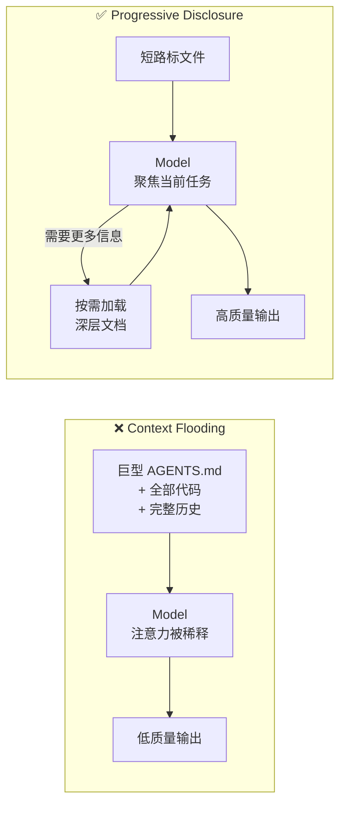

[上一篇文章]()里我用控制论的框架拆解了一件事：Agent = Model + Harness，harness 的边际贡献大于模型升级。蒸汽机飞球调速器、Kubernetes reconciliation loop、Agent harness——三代反馈回路的闭合，工程师的角色从"转阀门"迁移到"设计调速器"。

那篇文章解决了"是什么"和"为什么"。但写完之后我收到最多的问题是同一个：**好，我买账了。怎么设计一个好的 harness？**

答案不在任何单一团队的实践里，而是在三个独立团队的实践的交集里。

Princeton 的研究团队给 GPT-4 换了一套接口，SWE-bench 分数从 3.97% 跳到 12.47%。同一个模型，同一组题，同样的算力预算。唯一的变量是 Agent 看到信息的方式。

同一时期，Anthropic 让 Opus 4.5 自主构建一个生产级 Web 应用。失败了。不是模型不够强——它试图一次做完所有功能，跨了几个 context window 后留下一地半成品，然后在下一个 session 里看了一圈代码，宣布任务完成。Anthropic 没有换模型，而是重新设计了 Agent 的运行环境：加入 Initializer Agent 专门搭建上下文、feature list JSON 作为完成度真值、每个 session 强制 git commit 交接。同一个模型开始交付可用的软件。

再看 OpenAI：三个工程师，五个月，一百万行代码，零行人工手写。工程师做的不是写代码，是设计 Agent 的工作环境——分解任务、构建反馈回路、编码架构约束。

三个团队，三种动机，三个完全独立的项目。但你把它们的工程决策摊开对比，会发现一件事：**它们几乎在做同一套选择。**

## 三个独立团队解出了同一道题

独立收敛是工程领域最强的证据形式。一个团队发明了某个模式，可能是偶然、是品味、是路径依赖。三个团队在互不知情的情况下收敛到同一组模式，说明这些模式不是被发明的，是被约束逼出来的。就像三组不同的建筑师独立发明了拱门——不是因为互相抄，是因为重力就在那里。

把三个团队的关键设计决策并排放：

| 设计维度 | Princeton SWE-agent | Anthropic Claude | OpenAI Codex |
|---------|-------------------|-----------------|-------------|
| 搜索结果处理 | 硬上限 50 条，超过就强制精炼查询 | — | 短 AGENTS.md 作路标，深层细节按需加载 |
| 文件查看 | 有状态查看器，100 行窗口 + 行号 | progress.txt + git log 快速定位 | docs/ 结构化目录，渐进式发现 |
| 编辑反馈 | 每次编辑自动跑 linter，语法错即时拒绝 | Puppeteer 浏览器自动化做端到端验证 | 定制 linter 错误信息含修复指令，直接注入上下文 |
| 跨 session 状态 | 5 轮以前的历史折叠为摘要 | feature list JSON + progress.txt + git commit | 仓库本身就是所有知识的单一来源 |
| 隔离机制 | 单 session 内的认知隔离 | 每个 session 一个 feature | 每个 task 一个 git worktree |

表面上看，这五行写的是不同的东西。但如果你后退一步，会发现每一行都在回答同一个问题的不同侧面：**怎么在一个有限的认知空间里，让 Agent 把注意力用在该用的地方。**

这个"有限的认知空间"，就是 context window。而我们大多数人对 context window 的理解是错的。

## 对 Context Window 的最大误解：它不是内存，是意识

上一篇文章里我把 Agent 拆成了 Model + Harness，用控制论的反馈回路解释为什么 harness 比模型更重要。但那篇文章有一个没挖到底的问题：为什么所有有效的 harness 都长得差不多？答案藏在一个被广泛误解的概念里。

绝大多数人把 context window 当 RAM 用。200K token 的窗口，往里塞数据，模型处理，输出结果。更多 context = 更好性能。更长的 prompt = 更丰富的理解。

**这个心智模型是错的，而且错的方式会毁掉你的 Agent。**

Context window 更接近 Agent 在一个 session 里的**全部工作意识**。每一个 token 都消耗计算。每一条无关信息都在和有关信息竞争注意力。模型没有选择性注意机制能干净地忽略噪音——噪音在房间里，它影响每一步推理。

Princeton 团队在论文里细致地记录了这个效应。当 Agent 在大型代码库里运行 `grep` 返回一万行匹配结果时，你没有给它更多信息——你用无关数据淹没了它的工作记忆，此后每一步推理的质量都在下降，直到 context 被清空。当你用 `cat` 把整个文件扔给 Agent，而它只想看两个函数时，你给了它一根消防水管，但它只需要一杯水。

SWE-agent 的搜索工具设计了一个看起来"侮辱性简单"的机制：搜索结果超过 50 条，直接压制输出，告诉 Agent "结果太多，缩小你的查询范围"。就这一个设计决策，是整篇论文里杠杆最高的改动之一。因为它把一个 context 洪泛的失败模式，转化成了一个自然的精炼循环——你不能靠模糊搜索蒙混过关，你必须精确。

这不是在限制 Agent，是在保护它的认知空间。就像一个好的 IDE 不是把所有源文件同时打开，而是让你快速跳转到需要的那一行。

理解了"context window 是意识，不是内存"这个前提，所有有效的 harness 设计模式都变成了可推导的工程推论。

## 同一个约束方程的三条推论

如果 context window 是 Agent 的全部认知空间，那么 harness 设计的目标只有一个：**在有限空间里最大化有效信息密度。** 三个团队收敛到的所有模式，都可以归入三条设计定律。

**定律一：别淹没它——认知保护**

Agent 和人类在认知负荷下的反应一样：不确定的时候倾向于继续做当前正在做的事。一个人在大型代码库里迷路时会搜索得越来越广泛，产生越来越多噪音。Agent 也是。

SWE-agent 的限额搜索是一种**强制精炼函数**。OpenAI 的 docs/ 结构化目录取代巨型 AGENTS.md 是同一个原理——短地图指向深层真值，而不是把所有东西一次性倒进上下文。Anthropic 的启动序列（`pwd` → `progress.txt` → `feature_list.json` → `init.sh` → 基础测试）也是：只加载当前 session 需要的最小信息集。

认知保护的核心操作是**减法**，不是加法。不是给 Agent 更多工具，而是确保它在每一刻只看到它需要的东西。

**定律二：帮它记住——状态外化**

模型是无状态的。每个新 session 开始时，Agent 对项目一无所知。上一轮做到哪了，哪些 feature 完成了，哪些测试在跑，代码库此刻的结构是什么——全部空白。如果没有外部状态机制，每个 session 的前 N 个 token 都浪费在考古上。

Anthropic 的方案是三件套：`feature_list.json`（机器可读的完成度真值）、`progress.txt`（人类可读的交接日志）、git commit（可回滚的版本快照）。三者互相补充：JSON 告诉 Agent 什么还没做，progress 告诉它上一个 Agent 在做什么、做到哪了，git 给它一个可靠的回滚点。

这里有一个细节值得展开。Anthropic 特意选择 JSON 而不是 Markdown 来存储 feature list。原因是行为层面的：经验表明，模型面对 JSON 文件时比面对 Markdown 文件更不容易随意改写。JSON 的刚性结构天然抵抗"顺手编辑"。你希望 feature list 是 Agent 小心更新的真值表，不是它即兴改写的笔记。**格式本身就是一种约束。**

OpenAI 走得更远：仓库就是所有知识的唯一来源。从 Agent 的视角看，任何它无法在运行时从上下文中访问的东西，事实上不存在。Google Docs 里的设计文档、Slack 里的讨论、某人脑子里的架构判断——对 Agent 来说全是黑洞。这就是为什么 spec 必须编码进仓库、架构决策必须写成文件、约束必须变成 linter 规则。Agent 看不到的东西，等于不存在。

**定律三：让它立刻知道错了——反馈即时闭合**

Agent 的工作质量，上限由它的反馈回路质量决定。如果 Agent 无法在它关心的领域观察到自己行为的后果，它就会优化代理指标——而代理指标可能和真实正确性毫无关系。

SWE-agent 的编辑器在每次编辑后自动跑 linter。语法错直接拒绝，Agent 在引入错误的那一刻就收到反馈。没有这个机制会怎样？Agent 用 `sed` 做了一个多行替换，引入了一个微妙的缩进错误。它跑测试，看到一个似乎无关的失败——因为 Python 的缩进错误可以产生完全不相关的 runtime 异常。Agent 花三步去追踪那个"无关"的报错，每一步都往 context 里塞入更多无用的调试信息，最终耗尽 context window 去追一个幽灵。**错误不是在产生时最危险，是在传播后最危险。** 这就是经典软件工程里"bug 发现得越早修复成本越低"的原则在 Agent 世界的放大版——对 Agent 而言，未被即时发现的错误不仅消耗修复成本，还会持续污染它的认知空间，降低后续所有推理的质量。

Anthropic 发现了一个几乎所有团队都会踩的坑：Agent 把 feature 标记为完成，但实际上没有做端到端验证。它改了代码，跑了 unit test，看到通过，就标记完成。但 feature 在浏览器里用的时候根本不工作。Agent 和人类工程师的差距在这里：人类会自然地切换上下文——跑一下应用、点几下——来做 UI 级别的验证。Agent 不会，除非你给它工具。Anthropic 接入了 Puppeteer MCP server，让 Agent 能真正打开应用、点按钮、填表单、看结果。这个改动之后，一整类之前不可见的 bug 变得显而易见。

OpenAI 的方案更系统化：每个 Agent 任务跑在一个完全隔离的应用实例上，配备完整的本地可观测性栈——日志、指标、追踪——Agent 通过 LogQL、PromQL、TraceQL 查询。任务完成后环境销毁。Agent 用的是和人类工程师完全相同的调试工具。

三条定律之间有一个递进关系：认知保护确保 Agent 能集中注意力，状态外化确保它知道自己在哪，反馈即时闭合确保它做的事是对的。缺任何一条，其他两条的效果都会打折。

但理解正确的做法只是一半，另一半是理解为什么最直觉的做法注定失败。

## "一个大 AGENTS.md"的四种死法

如果你读了上一篇文章后的第一反应是"好，我写一个详细的 AGENTS.md 就行了"——你不孤独。OpenAI 的团队一开始也是这么想的。他们写了一个包含所有项目知识的巨型指令文件。

失败了。而且是可预测地、系统性地失败。

**第一种死法：上下文挤占。** 一个巨大的指令文件占据了 context window 里的大量空间。留给实际任务、代码和相关文档的空间被压缩。Agent 要么漏掉关键约束（因为它们淹没在指令海里），要么开始为错误的目标优化（因为注意力分配被扭曲了）。这不是理论推测——SWE-agent 论文用消融实验量化了这个效应：向 context 中注入与任务无关的信息，模型表现系统性下降。

**第二种死法：一切重要 = 一切不重要。** 当文件里的每一条都被标记为重要时，没有任何东西是真正重要的。Agent 开始做局部模式匹配，而不是有意识地导航。它会抓住 prompt 中最近出现的、最显眼的信息来行动，而不是真正理解任务的优先级。这就像你给新员工一本 200 页的员工手册，然后期望他第一天就记住所有规则——他不会的，他会记住最后读的那几页。

**第三种死法：即时腐烂。** 代码库在变化，一个单片式的指令文件在创建的那一刻就开始腐烂。新的模块加了、旧的约定改了、依赖升级了——但那个 AGENTS.md 还停留在写它的那天。过时的 AGENTS.md 比没有更糟，因为它主动误导 Agent 去遵循不再正确的规则。

**第四种死法：不可验证。** 一个大文本块不适合做覆盖检查、新鲜度追踪或交叉引用。你无法知道哪些规则还有效、哪些已过时、哪些互相矛盾。漂移不可避免。

OpenAI 的解法是**渐进式上下文展示（progressive disclosure）**：

一个约 100 行的短 AGENTS.md 文件充当**地图**，指向 `docs/` 目录里的深层真值来源。设计文档有目录索引，架构文档提供顶层领域和分层地图，计划文档作为一等公民check 进仓库、带进度和决策日志。

Agent 从一个小而稳定的入口开始，被教会去哪里找更多信息——而不是一上来被所有信息淹没。这种结构的维护成本也更低：一个短地图比一个巨型文档更容易保持准确。深层文档靠近它们描述的代码，跟着代码一起演进，腐烂的速度慢得多。

这个设计背后的认知原理和操作系统的虚拟内存一样：不是把所有东西都装进物理内存，而是按需调页。Agent 的 context window 就是物理内存，`docs/` 目录就是磁盘，AGENTS.md 就是页表。

> 把所有东西塞进一个文件，是在用 1970 年代的方式管理 2026 年的认知空间。

渐进式上下文展示的实际效果还有一个 OpenAI 团队提到的意外收获：当 Agent 被教会"去 docs/ 目录查找信息"之后，它能直接从仓库理解完整的业务领域，不需要访问可能不可用或过时的外部上下文。仓库成了自给自足的知识系统。

## 竞争壁垒在环境，不在引擎

从三个团队的实践中退后一步，一个让人不太舒服的推论浮出来。

如果执行层（模型写代码的能力）是大宗商品——同一个模型在不同 harness 里跑出的差距可以是 Top 30 和 Top 5 的距离——那长期的竞争壁垒不在模型上，在 harness 上。

这和过去三十年技术平台的演进规律一致。Web 的变革性不是因为 HTML 存在，而是因为搜索引擎和浏览器让 Web 变得可导航。移动互联网的变革性不是因为智能手机存在，而是因为 App Store 和开发者工具让大规模构建成为可能。每一次，组织底层能力的平台层才是持久价值所在。AI Agent 正在重复同一个剧本：能力已经存在，问题是谁来构建让能力变得可靠、可控、可持续改进的环境。

OpenAI Codex 团队构建的东西，本质上是一个为他们特定代码库和领域定制的开发平台。每个 Agent 任务有自己的 git worktree、自己的应用实例、自己的可观测性栈。定制 linter 的错误信息被格式化为可以直接注入 Agent 上下文的修复指令。架构约束被编码为机械化检查，而不是靠代码评审。当 Agent 吞吐量远超人类审查能力时，他们甚至改变了 merge 哲学——PR 保持短命周期，测试 flake 用重跑而非阻塞来处理——因为在高吞吐环境下，**修正是便宜的，等待是昂贵的。**

这里面有一个深层的不对称：harness 的价值会复利累积。每一次 Agent 失败都是关于环境缺什么的信号。修复环境后，这类失败在所有未来的 Agent session 中消失。投入一个更好的 prompt 来解决某个特定的失败模式是局部的、临时的。投入一个更好的工具来阻止一类失败模式是全局的、永久的。

这就是 harness 不是脚手架的原因。脚手架在建筑完工后拆掉。Harness 永远不会拆——它是你的工程判断力的持久化形式。模型会换代，prompt 会更新，工具会增减，但 harness 作为"把判断力编码进系统"的角色不会消失。

上一篇文章的结尾是"设计调速器的人不会回去转阀门"。这一篇想补上后半句：调速器设计得好不好，取决于你是否理解那台蒸汽机的认知限制——它能感知什么、不能记住什么、多快需要反馈。

模型是推理引擎。Harness 决定推理引擎推理的对象。把这个区分搞清楚，是应用 AI 工程里剩下的唯一一件真正重要的事。

---

## 延伸阅读

- [The Harness Is Everything — Rohit @rohit4verse](https://x.com/rohit4verse/status/2033945654377283643)
- [SWE-agent: Agent-Computer Interfaces — Princeton NLP](https://arxiv.org/abs/2405.15793)
- [Effective Harnesses for Long-Running Agents — Anthropic](https://www.anthropic.com/engineering/effective-harnesses-for-long-running-agents)
- [Harness Engineering — OpenAI](https://openai.com/index/harness-engineering/)
