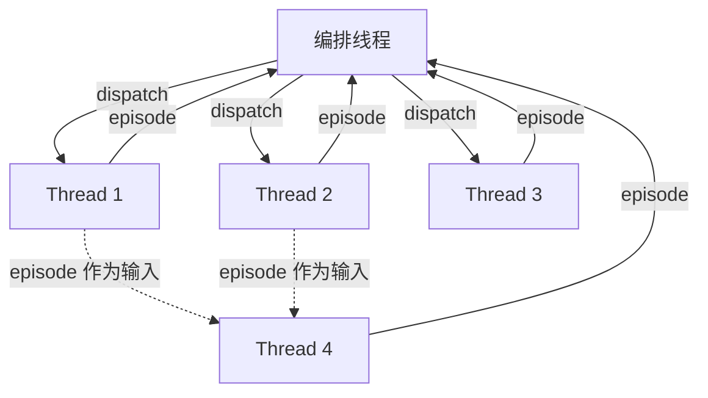

583 次工具调用，311 个请求，58 美元。Random Labs 用一个 Sonnet 模型——不是 Opus，不是 o1——把一个 7 万星的 Python 库完整移植成了 TypeScript。两个小时，全程自主运行。

有意思的不是"AI 能移植代码"，而是他们刻意选了一个不那么强的模型来做这件事。他们想证明的是：**决定 Agent 上限的不是模型智力，而是承载智力的架构。**

[上两篇文章]()我用控制论和三个团队的实践建立了一个判断：harness 的边际贡献大于模型升级，context window 是 Agent 的意识而非内存。Random Labs 最近发布的 Slate 技术报告从一个完全不同的方向抵达了同一个结论——而且给出了一套我之前没见过的架构原语。

## 现有 Agent 架构都在同一条轴上做取舍

构建能泛化的长任务 Agent 需要同时解决三个交织的问题：工作记忆管理（上下文装不下怎么办）、策略与战术的平衡（既要全局规划又要执行细节）、分布式上下文的同步（分出去的子任务怎么把结果完整带回来）。

每个问题单独看都有解法。Compaction（上下文压缩）解决记忆问题，但压缩是有损的——Claude Code 的 compaction 以丢关键信息著称。Subagent 通过上下文隔离绕过记忆上限，但隔离本身切断了信息流，返回的只有一条消息，像透过门缝递纸条。Markdown Planning 让模型提前规划，但计划有三种死法：写得不够细、执行时丢了步骤、遇到新信息忘了更新。Task Tree 把执行结构强制化，彻底性拉满，但模型被锁在预定义路径上，无法应对意外。

把这些方案摊开看，它们全部落在"彻底性 vs 灵活性"这条一维轴上。Task Tree 在彻底性一端，ReAct 在灵活性一端，RLM 试图两头兼顾但牺牲了中间反馈。**没有一个同时解决三个问题。**

## 策略和战术是两种推理，不该在同一个循环里解决

为什么三个问题这么难同时搞定？Slate 报告给了一个来自博弈论的解释。

McGrath 等人在 PNAS 上发表的对 AlphaZero 的内部表征研究发现了一个精确的涌现顺序：战术概念（棋子价值、空间控制）在训练前 32K 步内出现，战略概念（王安全、威胁、机动性）在 32K-64K 步涌现，长程权衡推理（接受弃子换取攻势转化）在 128K 步之后才成型。两类概念在**不同网络层**被编码——前世界冠军 Kramnik 的定性评估直接确认了这个分离。战术知识先于战略判断涌现，而且它们在物理上就是分开的。

软件工程是一个更开放的长程博弈。跑一个 bash 命令是战术，设计一个向后兼容的 schema 是战略。当前大多数 Agent 架构指望一个推理循环同时处理两种性质完全不同的工作——相当于让 AlphaZero 的 policy network 同时做 value network 的活。

这引出了一个被低估的概念：**Knowledge Overhang**——模型理论上拥有但无法通过战术行为直接访问的知识。Chain-of-thought、planning、文件规划，所有这些技巧本质上都在做同一件事：扩展模型的知识采样范围，把"知道但做不到"变成"知道且做到"。模型的知识储备远大于它在任意给定上下文中能调用的部分。

这也是为什么"做一个 planner agent + implementer agent + reviewer agent"听起来合理但用起来让人想砸键盘。角色分工的僵化并没有真正分离策略和战术，只是把同一个问题从循环内搬到了循环间——慢、惯性大、适应性差。

## 表达力决定行为空间的上界

僵化分层不行，那什么行？Slate 用一个概念把设计约束说清楚了：**Expressivity**。

一个只有 `file_read` 工具的 harness，不管模型多聪明，永远无法表达"编辑文件"这个动作。换成 `sed`，虽然接口更复杂，但读、写、搜索、就地替换全部可达。表达力 = 相同操作数下可达到的行为空间。Task Tree 的根本问题就在这里：它通过预定义节点结构削减了模型的行为空间，用灵活性换来了可预测性。在需求会变、环境会变、中间结果会改变后续策略的真实工程任务里，这种削减是致命的。

表达力的另一面是**归纳偏置**——模型被训练数据塑造出的行为倾向。Bash 和 Python REPL 理论上等价，但模型处理 C 绑定包修复用 Bash 比用 Python REPL 流畅得多，因为训练数据里 Bash 处理系统级任务的样本远多于 REPL。Harness 设计的核心原则因此不是"给最多工具"，而是**让期望行为成为模型的自然行为**。

RLM（Recursive Language Models）在表达力上走得最远：给模型 Python REPL 加递归能力，让任务分解从推理中自然涌现。但 REPL 执行像盲走迷宫——模型必须一次性提交整段脚本，执行完才能看到结果，中间没有反馈，没有修正机会。这就是问题的核心张力：**高表达力 + 频繁同步**是同时解决三个问题的必要条件。前者确保模型能表达复杂行为，后者确保偏离时能及时修正。现有方案都只拿到了其中一个。

## Thread Weaving：线程当进程，Episode 当返回值

Slate 的方案叫 Thread Weaving。核心想法极简：一个中央编排线程用高表达力接口调度工作，每个工作线程执行**一个动作**后暂停，把执行历史压缩成 **Episode** 返回给编排者。

Thread 和 Subagent 的关键区别不在规模，在同步方式。Subagent 是独立代理，通过消息传递同步——本质上是 IPC（进程间通信），带宽低、信息损失大。Thread 是编排者的延伸，Episode 直接以压缩后的结构化上下文共享——更接近共享内存加信号量。而且一个 Thread 的 Episode 可以成为另一个 Thread 的输入，上下文是**可组合的**，不是孤岛。

这直接映射到 Karpathy 的 LLM OS 框架：编排层是内核，Thread 是进程，Episode 是进程返回值，上下文窗口是 RAM。每个 Thread 返回都是天然的内存管理时机——决定什么保留、什么压缩、什么丢弃。OS 的历史就是一部"在有限 RAM 中管理无限任务"的历史：Episode 压缩 ≈ 页面换出，Thread 恢复 ≈ 页面换入，Dumb Zone ≈ 内存抖动。

回到架构全景图，Thread Weaving 的位置一目了然：

| 维度 | ReAct | Task Tree | RLM | Devin / Manus | Claude Code | Slate |
|------|-------|-----------|-----|---------------|-------------|-------|
| 规划 | 隐式 | 显式树 | REPL | 规划 Agent | plan mode | 隐式 |
| 同步 | 单线程 | 门控步骤 | REPL 返回 | 压缩返回 | 消息传递 | Episode |
| 表达力 | 高 | 低 | 高 | 中 | 中 | 高 |
| 适应性 | 强 | 弱 | 强 | 强 | 受消息限制 | 强 |
| 并行 | 无 | 无 | REPL 内 | 仅 Altera | 原生 | 原生 |

ReAct 有表达力和适应性但没有上下文隔离；Task Tree 有隔离但没有表达力；RLM 有表达力但缺中间反馈。Thread 的有界执行 + Episode 的可组合性是一个新原语，让这些原本互斥的特性共存。

Slate 还观察到一个有趣的现象：Sonnet 和 Codex 在同一个任务的不同 Thread 中协作，Episode 边界充当了干净的模型切换点——不同模型各做各的，没有上下文连贯性损失。架构层的设计让"普通"模型组合出"超强"模型单独做不到的结果。

## 瓶颈从来不是智力

回到开头那个 58 美元的移植案例。如果一个 Sonnet 模型用正确的架构能完成这种量级的任务，那行业在"更强模型"上花的注意力是不是有点偏了？

Knowledge Overhang 给出了明确的回答：模型失败的多数情况，不是不知道答案，而是在当前上下文中找不到通往答案的路径。瓶颈是上下文路由，不是知识储备。

Random Labs 在报告中说了一句话："We think single threaded agents have not been solved fully. As an industry, we do not need to move on to teams just yet." 在急着造 Agent 军团之前，先把一个 Agent 的上下文调度做对。

Thread Weaving 的意义不在于 Slate 这个产品。它的意义在于证明了一件事：Agent 的记忆问题是一个系统设计问题。而系统设计问题，我们已经解了五十年。

---

## 延伸阅读

- [Slate: moving beyond ReAct and RLM — Random Labs](https://randomlabs.ai/blog/slate)
- [Porting an entire library to a different language with a sentence — Random Labs](https://randomlabs.ai/blog/porting-a-library-with-slate)
- [Context Rot — Hong, Troynikov & Huber (Chroma, 2025)](https://research.trychroma.com/context-rot)
- [Acquisition of Chess Knowledge in AlphaZero — McGrath et al. (PNAS, 2022)](https://www.pnas.org/doi/10.1073/pnas.2206625119)
