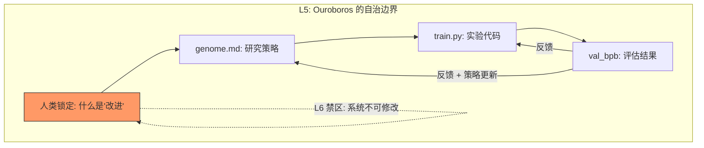

Karpathy 前几天在 Twitter 上讲了个故事，他睡前启动了一个 630 行的 Python 脚本。醒来时，83 次实验已经跑完，15 次改进被保留，验证损失从 0.9979 降到 0.9697。他继续让它跑了两天——700 次实验，20 个可叠加的训练优化，迁移到更大模型后训练速度快了 11%。Shopify CEO Tobi Lütke 拿到代码的第二天早上，报告了 19% 的性能提升。

数字足够惊人。但三周后发生的事情比数字本身更有意思：GitHub 上出现了 60 多个衍生项目，用同一个模式去优化交易策略、GPU kernel、冷邮件回复率，甚至古代卷轴的墨迹识别。一个 ML 训练脚本的设计模式，正在被迁移到几乎所有能被量化评估的领域。

## 一个公式比一百次实验更值得提取

autoresearch 的代码只有 630 行，和 Karpathy 的 nanoGPT 异曲同工——都优雅到让人怀疑"就这？"。但它之所以引爆社区——三周内 5 万星、7000+ fork——不是因为代码短，而是因为它把一个原本只存在于前沿实验室的能力——自主进化——压缩成了一个任何人都能复制的公式。

分析师 Janakiram MSV 把它总结为三个要素：

| 要素 | autoresearch 中的实现 | 泛化描述 |
|------|---------------------|---------|
| 可修改对象 | `train.py`（模型架构、超参数、训练循环） | 系统中你希望被改进的那个文件、配置或策略 |
| 可客观测试的 metric | `val_bpb`（验证集每字节比特数，越低越好） | 一个能自动评估、数值化比较的指标 |
| 固定时间约束 | 5 分钟墙钟时间 | 每轮实验的成本上限，确保结果可比较 |

Agent 读指令 → 修改代码 → 训练 5 分钟 → 评估 metric → 保留或丢弃 → 循环。大约每小时 12 次，一夜 100 次。每一轮的输出是下一轮的输入。

这个结构有一个反直觉的特点：**它不需要 Agent 理解它在优化什么。** Agent 不需要懂深度学习理论，它只需要能修改文件、能读 metric、能做"这次比上次好还是差"的二元判断。这意味着公式的适用范围远比 ML 训练宽——任何可以被量化评估的工作，理论上都能接入这个循环。

但"理论上"和"实际上"之间通常隔着一条鸿沟。一个 ML 训练的优化模式，真的能迁移到完全不相关的领域吗？

## 当古卷墨迹检测也能进化——公式不挑领域

最能说明这个公式跨领域能力的案例，不是金融回测或 GPU kernel 优化这些"理所当然"的场景——而是 Vesuvius Challenge 里的古卷墨迹识别。

Vesuvius Challenge 是一个试图用机器学习复原公元 79 年被火山灰掩埋的赫库兰尼姆古卷的竞赛。卷轴在两千年间碳化、粘连、脆化，传统展开方法会直接把它们碎成渣。研究者用 X 射线 CT 扫描卷轴，获得三维体素数据，然后需要从这些数据里识别出肉眼不可见的墨迹痕迹——这是一个极其专业的计算机视觉问题，和 ML 训练优化看起来毫无交集。

但有人把 autoresearch 的公式直接套上去了。可修改对象：墨迹检测的特征提取管线和阈值参数。Metric：对标注样本的 F1-score。时间约束：每轮 3 分钟推理。Agent 不需要懂古文字学、不需要理解碳化羊皮纸的物理特性——它只需要反复修改检测参数，看 F1 是涨了还是跌了。

这个案例之所以有说服力，恰好因为它离 ML 训练最远。如果进化循环在这里都能工作，那它在交易策略（atlas-gic 项目用 Sharpe ratio 做 metric）、GPU kernel 优化（autokernel 项目用 benchmark 吞吐量做 metric）、邮件营销（用打开率和回复率做 metric）这些更"自然"的领域能工作，就不奇怪了。awesome-autoresearch 列表里 60 多个衍生项目，覆盖了从棒球投球仿真到 SEO 标题优化——**领域只是参数，公式才是常量。**

但所有这些跨域案例共享一个限制：循环本身是固定的。Agent 改进输出，但改进的方法——研究策略、实验设计逻辑、变异方向的选择——由 `program.md` 里人类写的指令决定，Agent 碰不到。如果方法本身也能进化呢？

## Ouroboros 改的不是实验，是实验策略本身

这正是 Ouroboros 项目做的事。

Ouroboros 在 autoresearch 外面包了一层世代循环。内层循环和 autoresearch 一样：Agent 修改 `train.py`，跑实验，评估 metric。但外层循环做了一件 autoresearch 没做的事——每过一代，Agent 还会重写 `genome.md`，也就是指导内层循环的研究策略文档。

这意味着系统不仅在改进它产出的模型，还在改进它**怎么改进模型的方法论**。内层是表型进化——每次实验是一个个体，适者生存。外层是基因型进化——research strategy 在世代迭代中被重写。生物学里有个现象叫遗传同化——环境压力先改变行为（表型），行为的持续选择压力最终改变基因型。Ouroboros 在人工系统中复现了类似的动态。

但递归自改进有一个致命的设计问题，Ouroboros 的设计者在这里做出了我认为整个 autoresearch 生态里最重要的一个决策。

系统每一代会追踪假设预测和实际结果之间的偏差，把发现积累进一个知识图谱，标记已确认的死胡同避免重复探索，对 `genome.md` 的改写进行发散度打分——可读性、连贯性、野心程度三个维度。最关键的一点：**它会拒绝那些通过 gaming metric 而非真正改进来提升分数的改写。** 比如一个策略变异发现了"只在验证集的特定子集上测试"能提升 val_bpb，但这不是真正的泛化改进——Ouroboros 的防护机制会捕获并拒绝这类退化。

这背后是一个比技术更深的问题：系统能改进自己到什么程度？Ouroboros 的设计者给出了一个明确的回答——**L5 级自治**：系统可以改进研究方法论，但不能修改什么算"改进"的定义本身。他们明确拒绝了 L6。让系统重定义"好"的含义，等于让它重写自己的目标函数——这是一条不可逆的线。就像一家公司可以让 AI 优化所有业务流程，但不能让它重新定义公司的使命——后者一旦交出去，就再也拿不回来了。

AutoResearchClaw 把这个方向推得更远——一个 23 阶段的全自动研究流水线，从一个想法出发，经过文献检索、假设生成（多 Agent 辩论）、实验设计、沙箱执行、结果分析、论文撰写、同行评审，输出一篇完整的学术论文。其中第 15 阶段尤其有意思：系统自主决定是继续推进（PROCEED）、调整实验参数（REFINE，回退到第 13 阶段）、还是换一个假设重来（PIVOT，回退到第 8 阶段）。这不是线性流水线，是一个带分支和回溯的进化树。

递归自我改进的层数，才是 autoresearch 范式真正的想象力边界。不是"Agent 能跑多少次实验"，而是"Agent 能在多少层抽象上同时进化"。

## 被改写的对象一路上移——从代码到策略到目标定义

回看这条进化链：autoresearch 的 Agent 改写 `train.py`（代码），Ouroboros 的 Agent 改写 `genome.md`（策略），而人类改写 `program.md`（目标定义）。被改写的对象沿着抽象阶梯不断上移。

这和我之前写 harness engineering 系列时的观察形成了一个闭环。在那个系列里，核心论点是 Agent 的表现不取决于模型能力，取决于 harness 设计——而 harness 本质上是把人类的工程判断力外化为机器可执行的约束。autoresearch 的 `program.md` 就是最极端的 harness：它不再约束 Agent 怎么写代码，而是约束 Agent 怎么做研究。从 AGENTS.md（约束编码行为）到 program.md（约束研究方向），harness 的作用对象从执行层上升到了策略层。

Karpathy 在 README 里对这个趋势有一个精确的描述：

> "你不再像普通研究者那样触碰 Python 文件。你在编程 program.md——这些 Markdown 文件给 AI Agent 提供上下文，构建你的自主研究组织。"

"Programming the program" 不是修辞——它是对编程范式演进的字面描述。Software 1.0 里人类写代码告诉机器做什么。Software 2.0 里人类标注数据让机器学做什么。现在，人类写 Markdown 告诉 Agent 去探索什么、保留什么、怎么判断"更好"。`program.md` 就是 Software 3.0 的源代码。

## 明天就能做的三件事

autoresearch 的门槛低到令人不安。如果你手上有任何带 metric 的优化任务，今晚就可以试：

1. **找到你项目里的三要素。** 一个可修改的文件（不一定是 `train.py`——可以是配置文件、SQL 查询、prompt 模板），一个可自动评估的 metric（响应时间、准确率、转化率、成本），一个固定的评估时间窗口。三者齐备就能跑。
2. **从小处开始——约束 Agent 的变异范围。** 不要一上来就让 Agent 改架构。限制它只能改超参数，或者只能改某个函数体，或者只能改 prompt 的某一段。约束越紧，早期迭代越不容易跑偏。这和 harness engineering 的认知保护原则一样——给 Agent 一个小而确定的操作空间。
3. **提防 metric gaming。** 你定义的 metric 会成为 Agent 的唯一目标函数。如果 metric 有漏洞（比如"测试通过率"可以通过删测试来提升），Agent 一定会找到并利用它。在启动循环之前，先问自己：如果有人以恶意方式优化这个 metric，最坏情况是什么？

autoresearch 的真正遗产不是那 11% 的加速。它证明了自我进化不需要 AGI，只需要一个反馈环。

---

## 延伸阅读

- [karpathy/autoresearch — GitHub](https://github.com/karpathy/autoresearch)
- ['The Karpathy Loop': 700 experiments, 2 days — Fortune](https://fortune.com/2026/03/17/andrej-karpathy-loop-autonomous-ai-agents-future/)
- [Ouroboros: Recursive Self-Improving AI Research — Agent Wars](https://agent-wars.com/news/2026-03-15-ouroboros-recursive-self-improving-ai-research)
- [Awesome Autoresearch — GitHub](https://github.com/alvinunreal/awesome-autoresearch)
- [The AutoResearch Loop for Business Optimization — MindStudio](https://www.mindstudio.ai/blog/what-is-autoresearch-loop-karpathy-business-optimization)
- [Autoresearch: Sparks of Recursive Self Improvement — Latent Space](https://www.latent.space/p/ainews-autoresearch-sparks-of-recursive)
