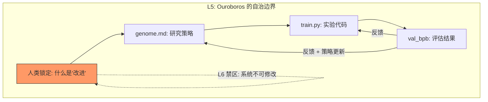

Karpathy 睡前启动了一个 630 行的 Python 脚本。醒来时，83 次实验已经跑完，15 次改进被保留，验证损失从 0.9979 降到 0.9697。他继续让它跑了两天——700 次实验，20 个可叠加的训练优化，迁移到更大模型后训练速度快了 11%。Shopify CEO Tobi Lütke 拿到代码的第二天早上，报告了 19% 的性能提升。

数字足够惊人。但三周后发生的事情比数字本身更有意思：GitHub 上出现了 60 多个衍生项目，用同一个模式去优化交易策略、GPU kernel、冷邮件回复率，甚至古代卷轴的墨迹识别。一个 ML 训练脚本的设计模式，正在被迁移到几乎所有能被量化评估的领域。

## 一个公式比一百次实验更值得提取

autoresearch 的代码只有 630 行。但它之所以引爆社区——三周内 5 万星、7000+ fork——不是因为代码短，而是因为它把一个原本只存在于前沿实验室的能力——自主进化——压缩成了一个任何人都能复制的公式。

分析师 Janakiram MSV 把它总结为三个要素：

| 要素 | autoresearch 中的实现 | 泛化描述 |
|------|---------------------|---------|
| 可修改对象 | `train.py`（模型架构、超参数、训练循环） | 系统中你希望被改进的那个文件、配置或策略 |
| 可客观测试的 metric | `val_bpb`（验证集每字节比特数，越低越好） | 一个能自动评估、数值化比较的指标 |
| 固定时间约束 | 5 分钟墙钟时间 | 每轮实验的成本上限，确保结果可比较 |

Agent 读指令 → 修改代码 → 训练 5 分钟 → 评估 metric → 保留或丢弃 → 循环。大约每小时 12 次，一夜 100 次。每一轮的输出是下一轮的输入。

这个结构有一个反直觉的特点：**它不需要 Agent 理解它在优化什么。** Agent 不需要懂深度学习理论，它只需要能修改文件、能读 metric、能做"这次比上次好还是差"的二元判断。这意味着公式的适用范围远比 ML 训练宽——任何可以被量化评估的工作，理论上都能接入这个循环。

如果三个要素这么简单，凭什么只能用在 ML 训练上？

## 从 Sharpe ratio 到冷邮件——进化循环不挑领域

事实是，它已经不只用在 ML 上了。

autoresearch 发布三周后，GitHub 上出现了一个 awesome-autoresearch 列表，收录了 60 多个衍生项目。按领域分布来看，ML 训练优化反而是少数派。

**金融**：atlas-gic 项目把可修改对象换成交易策略代码，metric 换成 Sharpe ratio，让 Agent 在历史数据上通宵迭代交易算法。同样的"修改 → 回测 → 保留/丢弃"循环，只是 `train.py` 变成了 `strategy.py`，`val_bpb` 变成了风险调整后收益。

**基础设施**：autokernel 项目用同样的模式优化 GPU kernel——Agent 修改 CUDA 代码，跑 benchmark，保留更快的版本。RightNow-AI 团队报告了在特定算子上持续逼近手写优化极限的结果。

**内容优化**：已经有团队把循环接入邮件营销——Agent 生成邮件变体，A/B 测试系统自动度量打开率和回复率，下一轮基于上一轮的赢家继续变异。同样的模式被用在落地页转化率、广告 CTR、SEO 标题优化上。

**科学研究**：Vesuvius Challenge 的古卷识别竞赛中，有人用 autoresearch 模式让 Agent 自主迭代墨迹检测算法。NanoResearch 项目把循环扩展到完整的科研流程——实验设计、SLURM 集群执行、结果分析、论文撰写，全程自动。

**甚至体育**：Driveline Baseball 用同样的循环优化投球速度的生物力学模型。Agent 修改参数 → 跑仿真 → 比较输出 → 保留改进。

这些项目的共同特征不是领域相似，而是**都满足三要素公式**。有一个可修改的文件，有一个可测的 metric，有一个固定的评估周期。公式一旦满足，Agent 就能进入进化循环。领域只是参数。

但所有这些跨域案例共享一个限制：循环本身是固定的。Agent 改进输出，但改进的方法——研究策略、实验设计逻辑、变异方向的选择——由 `program.md` 里人类写的指令决定，Agent 碰不到。如果方法本身也能进化呢？

## Ouroboros 改的不是实验，是实验策略本身

这正是 Ouroboros 项目做的事。

Ouroboros 在 autoresearch 外面包了一层世代循环。内层循环和 autoresearch 一样：Agent 修改 `train.py`，跑实验，评估 metric。但外层循环做了一件 autoresearch 没做的事——每过一代，Agent 还会重写 `genome.md`，也就是指导内层循环的研究策略文档。

这意味着系统不仅在改进它产出的模型，还在改进它**怎么改进模型的方法论**。内层是表型进化——每次实验是一个个体，适者生存。外层是基因型进化——research strategy 在世代迭代中被重写。生物学里有个现象叫遗传同化——环境压力先改变行为（表型），行为的持续选择压力最终改变基因型。Ouroboros 在人工系统中复现了类似的动态。

具体来说，Ouroboros 每一代会追踪假设预测和实际结果之间的偏差，把发现积累进一个知识图谱，标记已确认的死胡同避免重复探索，对 `genome.md` 的改写进行发散度打分——可读性、连贯性、野心程度三个维度。最关键的一点：它会拒绝那些通过 gaming metric 而非真正改进来提升分数的改写。

这个防护机制揭示了递归自我进化最深层的设计问题。Ouroboros 的设计者明确设定了一个自治边界：系统处于 **L5 级自治**——可以改进研究方法论，但不能修改什么算"改进"的定义本身。他们明确拒绝了 L6。让系统重定义"好"的含义，等于让它重写自己的目标函数——这是一条不可逆的线。

AutoResearchClaw 把这个方向推得更远——一个 23 阶段的全自动研究流水线，从一个想法出发，经过文献检索、假设生成（多 Agent 辩论）、实验设计、沙箱执行、结果分析、论文撰写、同行评审，输出一篇完整的学术论文。其中第 15 阶段尤其有意思：系统自主决定是继续推进（PROCEED）、调整实验参数（REFINE，回退到第 13 阶段）、还是换一个假设重来（PIVOT，回退到第 8 阶段）。这不是线性流水线，是一个带分支和回溯的进化树。

递归自我改进的层数，才是 autoresearch 范式真正的想象力边界。不是"Agent 能跑多少次实验"，而是"Agent 能在多少层抽象上同时进化"。

## 被改写的对象一路上移——从代码到策略到范式

回看这条进化链：autoresearch 的 Agent 改写 `train.py`（代码），Ouroboros 的 Agent 改写 `genome.md`（策略），而人类改写 `program.md`（目标定义）。被改写的对象沿着抽象阶梯不断上移。

Karpathy 在 README 里对这个趋势有一个精确的描述：

> "你不再像普通研究者那样触碰 Python 文件。你在编程 program.md——这些 Markdown 文件给 AI Agent 提供上下文，构建你的自主研究组织。"

"Programming the program" 不是修辞——它是对编程范式演进的字面描述。Software 1.0 里人类写代码告诉机器做什么。Software 2.0 里人类标注数据让机器学做什么。现在，人类写 Markdown 告诉 Agent 去探索什么、保留什么、怎么判断"更好"。`program.md` 就是 Software 3.0 的源代码。

autoresearch 的 README 开头写了一段"科幻前言"，在这个语境下不再像玩笑：

> "研究现在完全是自主 AI Agent 群体的领地，它们在天空中的算力集群上运行。Agent 们声称我们现在处于代码库的第 10,205 代，无论如何没有人能判断这是否正确，因为'代码'现在是一个超出人类理解的自我修改二进制文件。这个仓库是一切开始的地方。"

从 630 行 Python 到 60 个衍生项目到递归自我改进系统，这条线刚刚开始延伸。不是因为模型变强了，而是因为一个足够简单的公式让进化引擎成为了可复制的基础设施。当进化的成本接近于零——一块 GPU，一个 Markdown 文件，一夜时间——进化就会发生在所有可以被量化评估的地方。

autoresearch 的真正遗产不是那 11% 的加速。它证明了自我进化不需要 AGI，只需要一个反馈环。

---

## 延伸阅读

- [karpathy/autoresearch — GitHub](https://github.com/karpathy/autoresearch)
- ['The Karpathy Loop': 700 experiments, 2 days — Fortune](https://fortune.com/2026/03/17/andrej-karpathy-loop-autonomous-ai-agents-future/)
- [Ouroboros: Recursive Self-Improving AI Research — Agent Wars](https://agent-wars.com/news/2026-03-15-ouroboros-recursive-self-improving-ai-research)
- [Awesome Autoresearch — GitHub](https://github.com/alvinunreal/awesome-autoresearch)
- [The AutoResearch Loop for Business Optimization — MindStudio](https://www.mindstudio.ai/blog/what-is-autoresearch-loop-karpathy-business-optimization)
- [Autoresearch: Sparks of Recursive Self Improvement — Latent Space](https://www.latent.space/p/ainews-autoresearch-sparks-of-recursive)
