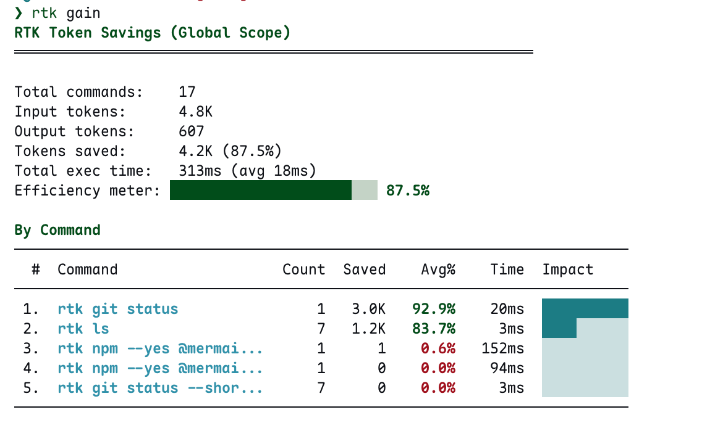
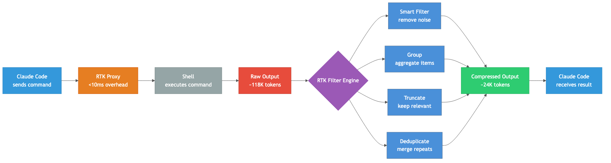
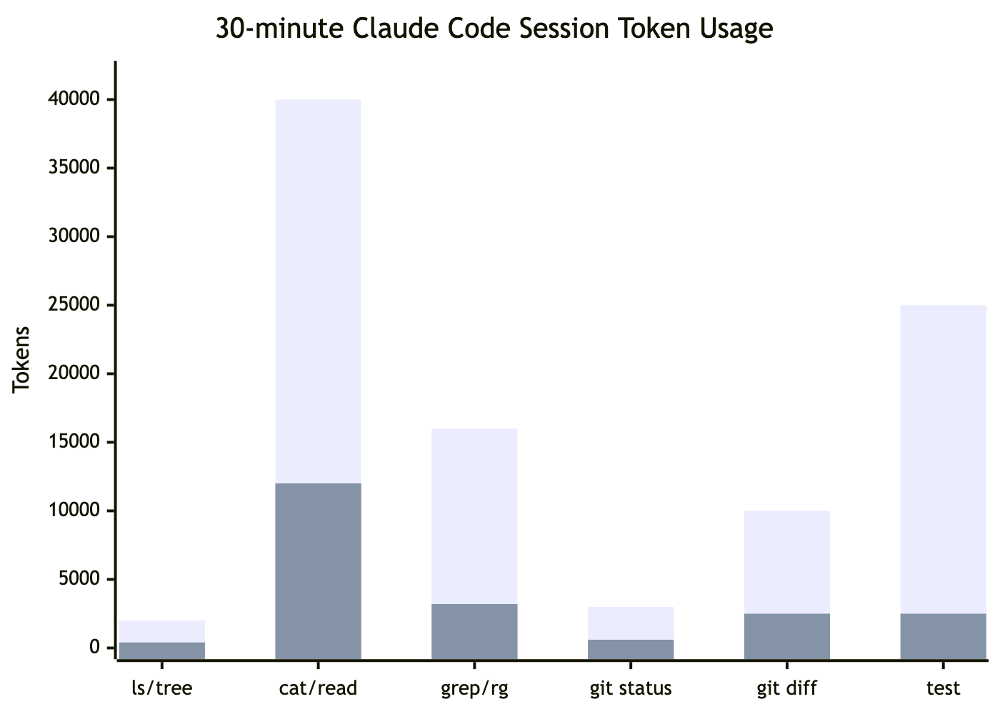
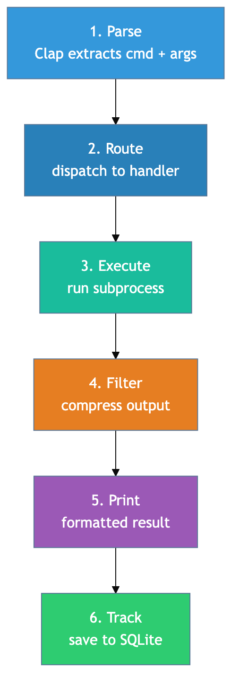

上图是我实际使用 RTK 后 `rtk gain` 的输出。17 次命令调用，输入 4.8K token，输出仅 607 token，节省了 4.2K（87.5%）。其中 `git status` 单次调用就省了 3.0K token（92.9%），`ls` 累计 7 次省了 1.2K（83.7%）。平均每次命令执行时间 18ms——几乎无感。

## 为什么需要 RTK

用 Claude Code 写代码半小时，大约消耗 118K token。其中绝大部分不是你的提示词，而是 `git status`、`cat`、`grep`、`cargo test` 这些命令的原始输出——LLM 不需要的噪音。

RTK（Rust Token Killer）的做法很直接：在命令输出到达 LLM 上下文之前，先过滤和压缩。单一 Rust 二进制文件，零依赖，开销小于 10ms。

以我自己的使用为例：Claude Code 在探索项目结构时会频繁调用 `ls`，每次都返回完整的文件列表。RTK 将其压缩为紧凑的目录树格式，7 次 `ls` 调用累计节省 1.2K token。而 `git status` 的压缩效果更夸张——原始输出包含 branch 追踪信息、untracked 文件提示、stage 状态说明等大量 LLM 不需要的文字，RTK 一刀砍到只剩变更文件列表，单次节省 92.9%。

## 问题：LLM 的上下文窗口被垃圾填满

当 Claude Code 执行 `git status`，它拿到的是完整的 porcelain 输出——untracked 文件列表、branch 信息、各种提示文字。LLM 只需要知道"哪些文件改了"，但它被迫处理全部原始文本。

测试输出更夸张。`cargo test` 跑 200 个测试，成功的 198 个每个都输出一行 `test xxx ... ok`，LLM 需要的只是"2 个失败了，分别是什么"。

这不是理论问题。Token 消耗直接对应：

1. **成本**——按 token 计费的 API 调用
2. **上下文窗口占用**——塞满无用信息后，有用的上下文被挤出去
3. **推理质量**——上下文越嘈杂，LLM 越容易分心

## RTK 的四种压缩策略



RTK 不是简单的 `| head -n 50`。它针对每种命令类型有专门的过滤器，运用四种策略的组合：

| 策略 | 做什么 | 典型压缩率 |
|------|--------|-----------|
| **Smart Filter** | 去除注释、空白、样板代码等噪音 | 60-80% |
| **Group** | 按目录聚合文件列表，按类型聚合错误 | 80-90% |
| **Truncate** | 保留相关上下文，截断冗余 | 70-80% |
| **Deduplicate** | 合并重复日志行，标注计数 | 90-99% |

关键在于**语义感知**。RTK 知道 `cargo test` 的输出格式，能精确提取失败测试的名称和错误信息，丢弃 198 行 `ok`。它知道 `git diff` 里哪些是真正的改动，哪些是上下文填充行。

## 实际节省数据

一个 30 分钟 Claude Code 会话的 token 消耗对比：



| 操作 | 频率 | 原始 Token | RTK 后 | 节省 |
|------|------|-----------|--------|------|
| `ls` / `tree` | 10x | 2,000 | 400 | **-80%** |
| `cat` / `read` | 20x | 40,000 | 12,000 | **-70%** |
| `grep` / `rg` | 8x | 16,000 | 3,200 | **-80%** |
| `git status` | 10x | 3,000 | 600 | **-80%** |
| `git diff` | 5x | 10,000 | 2,500 | **-75%** |
| `cargo test` / `npm test` | 5x | 25,000 | 2,500 | **-90%** |
| **总计** | | **~118,000** | **~23,900** | **-80%** |

测试输出的压缩率最高，达到 90%。文件读取因为是消耗大户（20 次调用、40K token），绝对节省量最大。

## 命令生命周期



每个命令经过六个阶段：

1. **Parse** — Clap 解析命令和参数
2. **Route** — 分发到对应的处理器（64 个模块，覆盖 Git、JS/TS、Python、Go、Ruby、.NET、云工具等生态）
3. **Execute** — 子进程执行实际命令
4. **Filter** — 生态感知的压缩策略
5. **Print** — 输出格式化结果
6. **Track** — 记录节省数据到 SQLite（90 天自动清理）

整个过程对 CI/CD 透明——退出码原样传递。

## 使用方式

安装后一行命令接入 Claude Code：

```bash
brew install rtk
rtk init --global
```

`rtk init --global` 会注册一个 Claude Code hook，自动将 `git status` 重写为 `rtk git status`。对用户完全透明，不需要改变任何习惯。

我自己的安装体验：`brew install` 之后跑一次 `rtk init --global`，重启 Claude Code，就生效了。没有配置文件要改，没有环境变量要设，整个过程不到一分钟。之后所有 Claude Code 发起的命令调用都自动经过 RTK 过滤，你在终端里看到的输出和以前一样，但 LLM 拿到的是压缩版。

几个实用命令示例：

```bash
# Git 操作 — 紧凑输出
rtk git status          # 只显示变更文件，去掉提示文字
rtk git diff            # 精简 diff，去掉冗余上下文
rtk git log -n 10       # 单行提交格式

# 测试 — 只看失败
rtk test cargo test     # 198 passed, 2 failed → 只输出失败详情
rtk pytest              # Python 测试同理
rtk vitest run          # Vitest 同理

# 分析节省了多少
rtk gain                # 查看累计节省统计
rtk gain --graph        # 30 天 ASCII 图表
rtk discover            # 发现还有哪些命令可以优化
```

`rtk discover` 值得单独提一下——它会分析你的 Claude Code 历史，找出哪些高频命令还没有经过 RTK 优化，告诉你还能省多少。这是一种"你不知道你在浪费"的发现机制。

## 为什么这个思路值得关注

RTK 解决的问题会随着 AI 编码工具的普及而放大。Claude Code、Cursor、Copilot Workspace 这些工具的共同特征是**大量自动执行 CLI 命令**——每次执行都在消耗上下文窗口。

当前 LLM 的上下文窗口虽然在增长（128K → 200K → 1M），但实际使用中 token 效率仍然关键：

- 长上下文的推理质量会下降（lost-in-the-middle 问题）
- 成本与 token 数线性相关
- 上下文压缩比上下文扩展更可控

RTK 选择 Rust 不是偶然——<10ms 的开销意味着它可以无感地插入每一次命令调用。如果这个延迟是 100ms 甚至 1s，用户体验就会明显下降。

它的架构也有启发性：64 个模块各自负责一类命令的过滤，单一职责、可独立测试。这种"按生态分治"的策略比通用压缩算法更有效，因为它利用了每种输出格式的结构化信息。

## 个人体感

用了一段时间后的几个观察：

1. **对话轮次确实变少了**。以前 Claude Code 经常因为上下文太长而"忘记"前面的讨论，需要重复提醒。RTK 压缩掉的那 80% token 大部分是命令输出的冗余，省下来的空间让真正重要的对话内容留在上下文里的时间更长。

2. **测试驱动开发受益最大**。我写代码习惯频繁跑测试，每次 `cargo test` 或 `pytest` 的输出是 token 消耗大户。RTK 只保留失败信息的做法几乎完美——成功的测试我不需要知道细节，失败的测试我需要完整的错误栈。

3. **不是所有命令都适合压缩**。从我的 `rtk gain` 截图可以看到，`npm --yes @mermaid...` 这类命令的节省率只有 0.6% 甚至 0%——因为这些命令的输出本身就很短或者结构不规则。RTK 在这些场景下会直接透传，不做无用功。

4. **87.5% 的效率值是真实的**。不是 cherry-pick 的最佳场景，而是正常写博客（涉及 git、ls、文件读写）过程中的自然积累。如果是纯开发场景（大量 test、diff、grep），这个数字只会更高。

最终，RTK 解决的是一个你可能都没意识到存在的问题——你的 AI 编码助手每天都在为命令行噪音买单。一个 Rust 二进制文件，<10ms 开销，87% 的 token 节省。这种投入产出比值得一试。

---

项目地址：[github.com/rtk-ai/rtk](https://github.com/rtk-ai/rtk)
