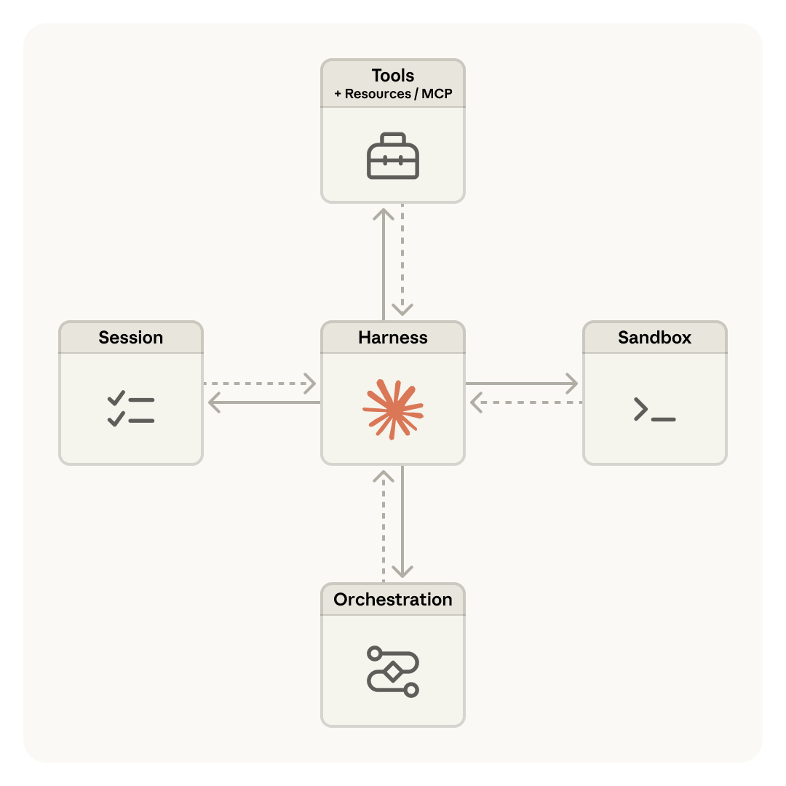
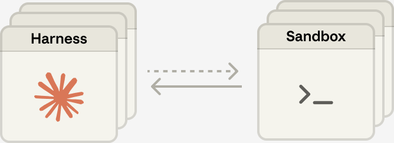
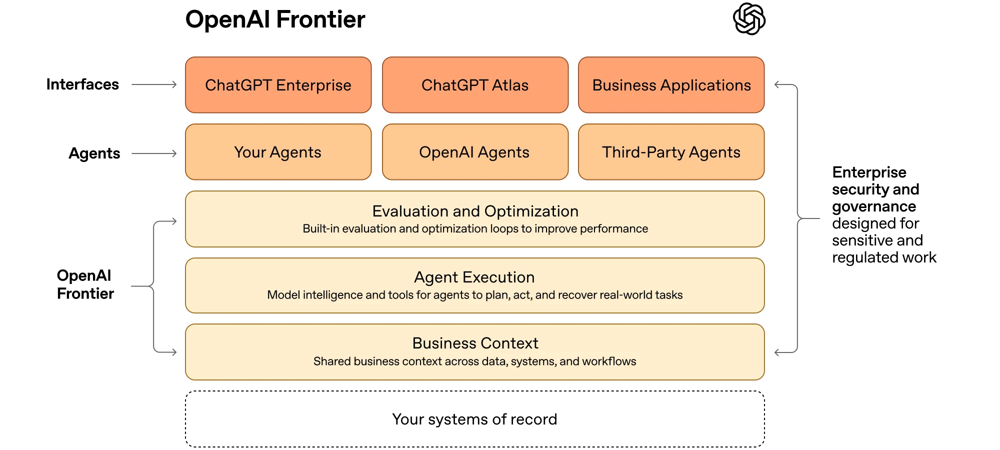
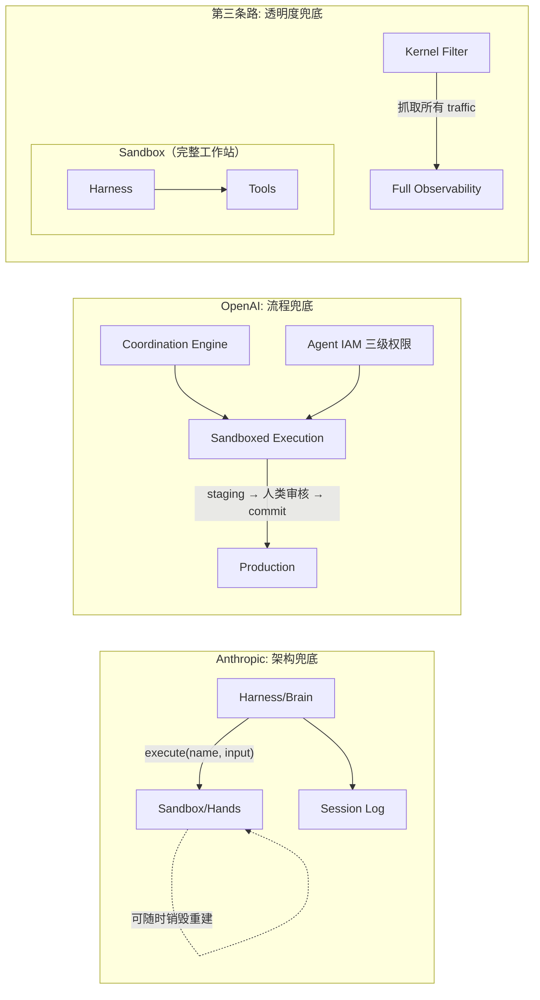

Anthropic 最近发了一篇工程博客，公开了他们做 Cloud Agent 的完整技术演进。同一个月，OpenAI 的 Frontier 平台已经签下了 Uber、Oracle、State Farm。而第三条路线正在悄悄成型——有团队选择了 Anthropic 明确抛弃的那个架构。

三家都在做"Agent 上云"，但打开各自的架构图，你会发现他们对同一个词——sandbox——的定义完全不同。

## 每个 Agent 都要交一台机器的入场费

直觉上，Agent 上云应该和 serverless 一样：一堆人共享一台服务器，不够了就扩。这套模式跑了几十年，Lambda 和 Cloud Functions 就是这样。

但 Agent 有一个 serverless 没有的问题：它执行的是不可信代码。Agent 会安装任意包、运行未经审查的构建脚本、用你想不到的方式操作文件系统和网络。传统容器共享宿主机内核——三千多万行代码里只要有一个漏洞，攻击者就能从容器逃逸到宿主机，危及同机所有租户。

所以行业收敛到了 microVM：每个 Agent 拿到自己的内核、自己的文件系统、自己的网络栈。E2B 用 Firecracker，冷启动 150ms；Daytona 用 Docker 加可选的 Kata Containers，最快 27ms；Modal 用 gVisor 在用户态拦截 syscall。方案不同，但逻辑一致——隔离必须在内核层面，一个 sandbox 出了事不能殃及邻居。

这意味着 Agent 的基础设施成本结构和传统云计算根本不同。不是"按调用收费"，是"按机器收费"。这个物理约束决定了后面所有架构决策的出发点。

## Anthropic 把脑和手分开，然后发现一件更深的事

Anthropic 的第一版架构很直觉：所有东西塞进一个容器。Session、Harness、Sandbox 住在一起，文件操作直接走 syscall，不用设计服务边界。

然后问题来了。容器挂了，session 就丢了。容器无响应，工程师只能 shell 进去手动修复——但容器同时持有用户数据，意味着调试和隐私保护天然冲突。更麻烦的是客户要接自己的 VPC：harness 假设所有资源都在容器内，要连客户网络就得做 network peering，一个架构假设变成了业务限制。他们自己的原话是 "nursing containers meant debugging unresponsive stuck sessions"——容器变成了宠物，得喂得养，死了还得伤心。

第二版做了一个关键决策：**把大脑和手分开**。Harness（调用 Claude、路由 tool calls 的循环）离开容器，sandbox 变成一个可以随时调用的工具——`execute(name, input) → string`，和调其他任何 tool 一样。Session log 存到外部数据库。

这带来了三个变化。容器死了不要紧，harness 捕获失败当作 tool-call error 传给 Claude，Claude 决定要不要重试，新容器通过 `provision({resources})` 标准化重建。Harness 自己也可以随时重启，因为 session 在外面——`wake(sessionId)` 从最后一个 event 继续就行。不需要容器的 session 根本不用等容器启动，p50 TTFT 下降约 60%，p95 超过 90%。

但博客里最有价值的不是这些架构细节，而是一段设计哲学：

> Harness encodes assumptions about model inadequacy — and these assumptions expire as models improve.

他们举了一个具体例子。Claude Sonnet 4.5 在接近 context window 上限时会出现 "context anxiety"——过早结束任务。团队为此在 harness 里加了 context reset 机制。后来换到 Opus，这个行为消失了，reset 变成了死代码。

这意味着 **harness 代码有天然的半衰期**。你今天写的每一行编排逻辑，都是在补偿当前模型的某个不足。模型升级一次，其中一部分就失效。写得越多，将来要删的就越多。

我自己维护 CLAUDE.md 有完全一样的体验。半年前写的很多规则——比如"不要在单次回复中修改超过 3 个文件"、"遇到报错先读完整日志再行动"——现在全是多余的。不是规则错了，是模型变强了，它自己就会这样做。这些规则从"必要的护栏"变成了"碍事的约束"，删掉反而让 Agent 表现更好。

Anthropic 的应对方式是不做具体 harness，做 **meta-harness**——对接口有主张（Session 要能 append-only、Sandbox 要能 `execute`），对接口背后跑什么没有主张。用他们的类比：就像 OS 的 `read()` 不关心底层是 1970 年代的磁盘还是现代 SSD，sandbox 接口不关心底层是容器还是手机。接口比实现长寿——这是他们押的赌。

解耦的终极形态是 **Many Brains, Many Hands**——一个 brain 可以连接多个 hands，brain 之间还可以互相传递 hands。当模型足够智能，能推理多个执行环境并决定把工作发到哪里时，单容器反而成了瓶颈。

## "Sandbox" 这个词在三家手里意味着完全不同的东西

到这里，一个自然的问题是：OpenAI 和 Rebyte 在做什么？

先看结论：**三家对 sandbox 的定义不同，背后是对"agent 犯错谁来兜底"这个问题的不同回答。**

Anthropic 的 sandbox 是**无状态的手**。可以随时销毁重建，harness 在外面，token 永远不进入 sandbox（Git token 注入 local remote，MCP 走 proxy + vault）。Agent 犯了错？harness 捕获异常，Claude 自己决定要不要重试。兜底的是**架构**——每个组件都可替换，失败被结构性地隔离。

OpenAI Frontier 的 sandbox 是**有状态的牢笼**。Agent 在里面草拟操作，暂存（staging），人类审核后才提交到生产系统，支持即时回滚。更关键的是 Agent IAM 系统——每个 Agent 有三级自主权：Observe（只读）、Propose（草拟需人类确认）、Autonomous（在预定义规则内自动执行）。高风险操作始终保持人类监督。兜底的是**流程**——分级审批加人类卡点。

第三种思路是把 sandbox 做成**完整的工作站**。Harness 跑在 sandbox 里面，不是外面。固定 template 全部 preinstall 进内存，kernel filter 抓所有网络请求给管理员看。这条路线的安全观点很直接：复杂的权限系统（比如 vault + proxy）最后都会被几个白痴直接干掉，不如把 network policy 做好、把可观测性做好。兜底的是**透明度**——你能看到 Agent 干了什么，出了事后溯。

这三种选择不是技术偏好，是对同一个问题的不同押注：**agent 什么时候能被完全信任？**

Anthropic 的隐含判断是"不知道，所以做好组件可替换，随时能换"。接口比实现长寿，meta-harness 对未来不做假设。这是最保守也最有远见的选择——代价是所有操作都得跨 RPC 边界，你再也不能 native 用 Unix 原语了。

OpenAI 的隐含判断是"还不能信任，所以人类必须在关键节点卡着"。三级自主权本质上是一个渐进放权框架——今天给 Observe，验证稳定后升级到 Propose，最终到 Autonomous。这是大企业最能接受的叙事。代价是你需要一支 FDE 团队驻场帮客户设计权限边界，39 人团队不是偶然的。

第三条路的隐含判断是"信不信任不重要，重要的是出了事你能看见"。这个观点我半同意——network policy + full observability 确实比复杂的 vault + proxy 更务实，尤其对小团队。但"安全和 agent 本质上对立"这个说法太绝对了。Anthropic 的 token 永远不进 sandbox 的设计证明了结构性安全是可行的，不需要牺牲 agent 的自主性。这条路线的真正优势不是安全哲学，是 **harness 中立**——Claude Code、Codex、Gemini CLI 都能跑，这是 Anthropic 和 OpenAI 打死做不到的事。

## 微内核 vs 宏内核的当代重演

退一步看，这场分歧有历史先例。

Anthropic 走的是微内核路线：把尽可能多的东西移出核心（harness outside sandbox），每个组件通过标准化接口通信，独立失败独立替换。OpenAI 走的是分层特权路线：不同的 Agent 拿到不同级别的系统调用权限。第三条路走的是宏内核路线：所有东西放在一起（harness inside sandbox），性能最好，内部通信最快，但一个组件出问题影响面更大。

操作系统历史上，Linux 宏内核赢了桌面和服务器。但在安全隔离要求极高的场景——QNX 跑在汽车刹车系统里，seL4 用在军事和航空——微内核从未输过。

Cloud Agent 更像哪种场景？考虑到 agent 执行不可信代码、需要访问客户数据、7x24 无人值守运行——它更像刹车系统，不像桌面应用。

这不意味着 Anthropic 一定赢。微内核路线的历史性弱点是生态：接口定义得再优雅，没人在上面开发也没用。宏内核阵营的 harness 中立策略和 OpenAI 的 Frontier Alliances（McKinsey、BCG、Accenture、Capgemini）都是在用不同方式解决生态问题。最终谁赢可能不取决于架构优劣，而取决于谁先建成了开发者或企业客户的习惯路径。

三个判断标准，帮你评估自己的场景该押哪条路：

- **你的 Agent 执行的代码有多不可信？** 完全不可信（用户上传的任意脚本）→ Anthropic 的结构性隔离。半可信（内部团队写的 workflow）→ 宏内核路线的 observability 够用。
- **你需要多快看到 Agent 出错？** 事前拦截 → OpenAI 的三级审批。事后追溯 → 宏内核路线的 kernel filter。自动恢复 → Anthropic 的 stateless 重建。
- **你在乎模型锁定吗？** 如果明年想从 Claude 换到 Gemini → harness 中立的宏内核方案是唯一选项。如果只用一家模型 → Anthropic 或 OpenAI 的深度集成更有价值。

Harness 放在 sandbox 的哪一侧，不是一个架构问题。它是你对"AI agent 值不值得信任"这个问题今天给出的回答。

---

## 延伸阅读

- [Scaling Managed Agents: Decoupling the brain from the hands — Anthropic Engineering](https://www.anthropic.com/engineering/managed-agents)
- [Introducing OpenAI Frontier — OpenAI](https://openai.com/index/introducing-openai-frontier/)
- [On Cloud Agent Harness](https://mp.weixin.qq.com/s/K545pM8LLt4ONyNULNfVRQ)
