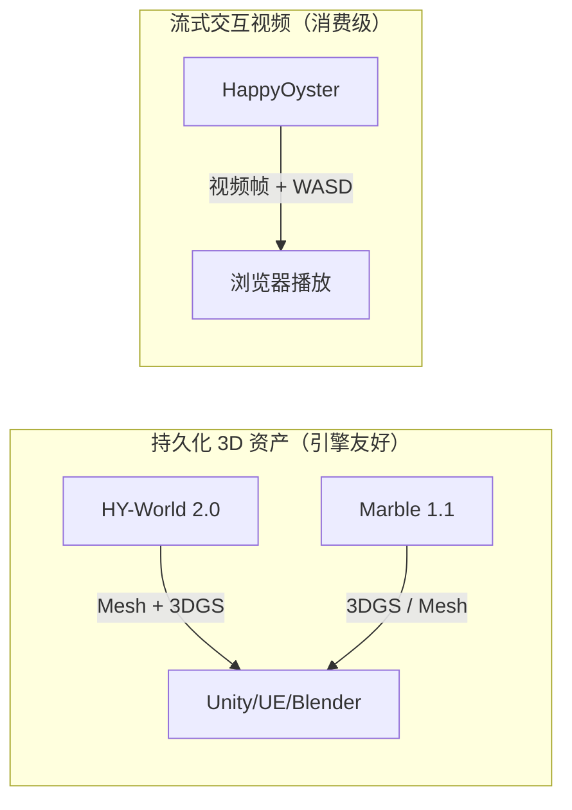
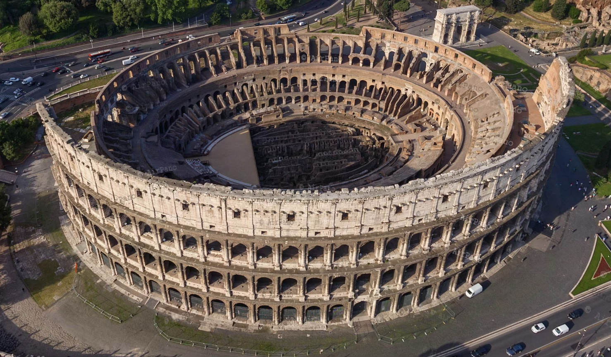
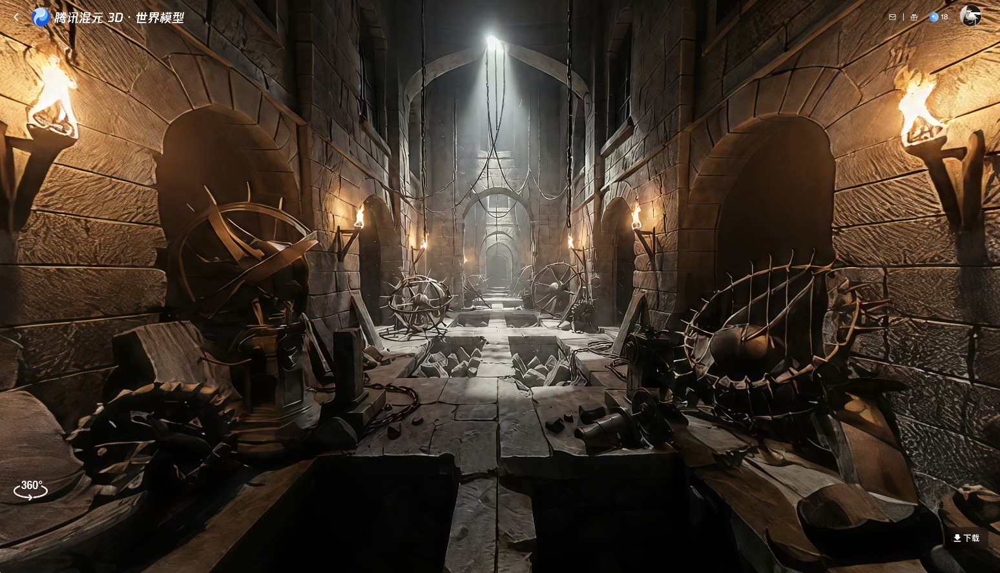
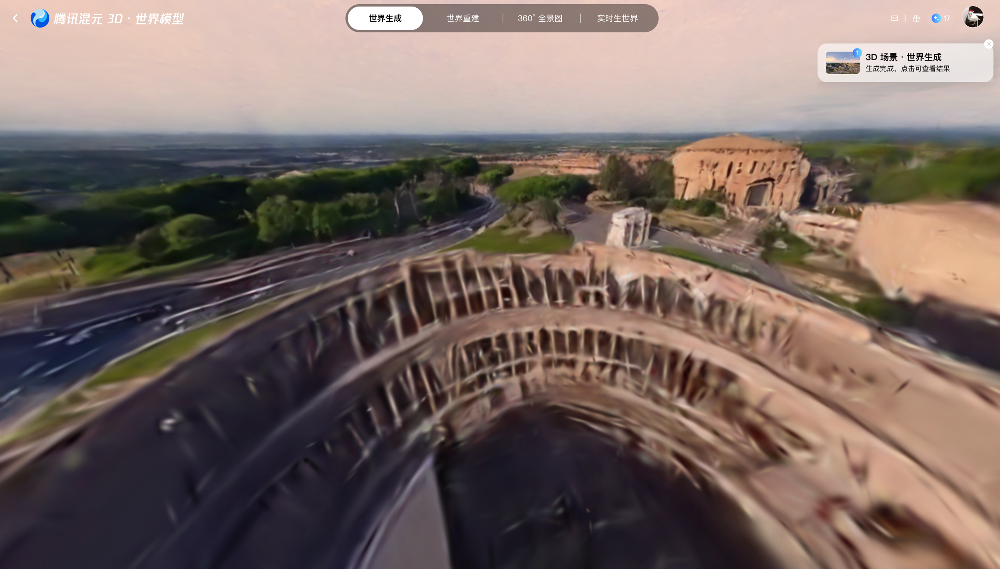
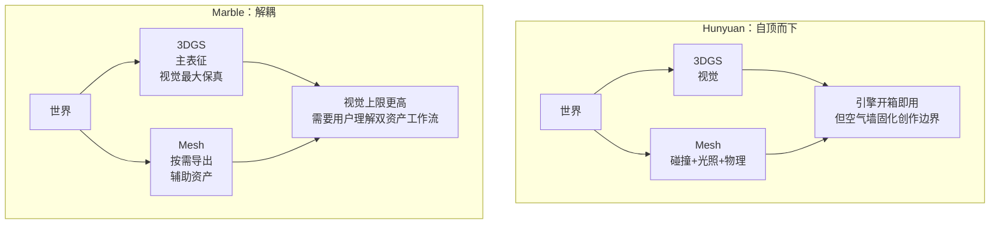

## TL;DR

- **Hunyuan（HY-World 2.0）**：纹理最好、3D 资产全栈（Mesh+3DGS、多视图重建）；但几何一换视角就塌、局部物体经不起放大、原图周边会被外扩改写。
- **Marble 1.1**：近景复刻目前市面第一、形状最合理；但远景是 **3DGS 数学意义上的必糊**（原理问题，不是训练能救的），且不做重建。
- **HappyOyster**：首帧复刻度最高、漫游前 20~30 秒沉浸感三家最强；**场景里的人真的会动**；**远景不崩**；但是其交互视频生成指令遵循和物理规则很乱、prompt 毫不起作用。
- **Genie 3（参照项，非自测）**：我没有账号，判断来自 DeepMind 官方说明和公开 hands-on；但它确实把"可交互视频"推到了更像实时仿真的位置：720p / 20~24 fps、几分钟一致性、约一分钟视觉记忆，跳跃、碰撞、回访记忆都能被公开测试拿出来压。
- **一句话**：这篇主线还是 Hunyuan / Marble / HappyOyster 三家自测；Genie 3 更像旁边那根标尺。单帧惊艳已经不是门槛，真正的分水岭在**第二帧之后**——拉远、转视角、连续交互、prompt 改写。现在近景选 Marble，短时沉浸选 HappyOyster，资产管线看 HY-World；如果看下一代 Agent 环境，Genie 3 明显更接近答案。

---

2026 年 4 月 16 日和 17 日，腾讯开源了 HY-World 2.0，阿里发了 HappyOyster，两家间隔不到 24 小时。再加上李飞飞 World Labs 的 Marble 1.1 已经迭代到第二个小版本，我把这三款都跑了一遍——同一张罗马斗兽场的照片，一个文本 prompt，一个漫游测试。**得出的结论不是"谁最好"，而是"这三家在做三件不一样的事，把它们放一起比较本身就是误解"**。

## 「世界模型」这个词在 2026 年 4 月已经指三件不同的事

先把赛道分清楚，后面所有对比才站得住。

HY-World 2.0 输出的是 **3DGS + Mesh 混合 3D 资产**，直接导入 Blender / Unity / Unreal Engine / Isaac Sim。整个四阶段流水线（HY-Pano 2.0 → WorldNav → WorldStereo 2.0 → WorldMirror 2.0）的终点是一个**可以放进游戏引擎的文件**。

Marble 1.1 输出的是 **Gaussian Splat 或 Mesh**，也能直接下载，但产品逻辑是**创作者工具**——它配了一个叫 Chisel 的混合 3D 编辑器，让你先用方块拉出空间结构，再让 AI 填视觉细节。结构与风格解耦。

HappyOyster 输出的是**视频**。更准确地说，它输出的是一段**可以用 WASD 键盘交互控制的视频流**。你给它一张图和一个 prompt，它给你一个可以一人称漫游的"世界"——但这个世界不是 3D 模型，是不断生成的下一帧画面。

Genie 3 我没有自测，所以不把它硬塞进同一张成绩单里。但它必须被提一下：公开材料里它不是在交付 3D 资产，也不只是生成一段短视频，而是在生成一个可以实时探索、能维持几分钟一致性的环境。换句话说，HappyOyster 像"给内容创作者玩的交互视频"，Genie 3 更像"给 Agent 用的实时训练场"。

前三家的输出物差异，不是工程细节，是**对"世界模型该交付什么"这个问题给出的三种不同答案**。Genie 3 暂时不参与这张实测表，但它让这件事更明显：世界模型已经同时分叉成资产、创作工具、内容体验和训练环境四条路线了。

押这两条路的隐含判断完全不同。3D 资产路线认为"世界 = 几何 + 纹理，生成完就该能被传统引擎消费"；视频流路线认为"世界 = 时间序列上一致的画面，3D 几何是实现细节而不是产品形态"。**谁对，取决于未来主要的消费场景是"游戏和虚拟制片"还是"可交互内容"**。

## 一个大家都认识的东西：罗马斗兽场

为了让对比公平，我上网找了一张高清图片，选了一张大家都熟悉的场景——罗马斗兽场内部全景。

测试开始就撞上 HY-World 2.0 的第一个硬约束——**它不接受含角色的输入图**。前端直接拦截，不让上传。这不是产品限制，是**技术诚实**：HY-World 2.0 主干走的是 3DGS 路线，训练数据里是静态环境，动态角色不在分布内。真让人站进去，只能被冻成扭曲的雕塑——腾讯选择前端拒绝，而不是"试试看出事再说"，这在工程上是合理的。

但是影视场景里，以及各种业务场景中一定有人，只好换一张没人的外部鸟瞰作为腾讯的输入：

## 文生世界：纹理和形状是两件事

先说一个反直觉的观察：在**纯文本生成**场景下，**Hunyuan 的纹理密度明显强于 Marble，但 Marble 的物体形状正确性更强**。

在此之前，我首先用 Hunyuan 生成一个"一个充满了障碍和杂物的房间"的 prompt：

石墙的风化纹理、火把的暖光衰减、金属器物的反光层次——这是**图像模型血统的直接体现**。乍一看是不是很好，但是我们仔细看看会发现很多物体形状是扭曲的：

再看同一风格下 Hunyuan 生成的斗兽场外部——从侧上方和正上方两个视角：

纹理是真好看，但**几何一换视角就崩**。这就是"图像模型血统"的代价——第一帧惊艳，转一圈原形毕露。

这是 world marble 的：
## 图生世界：近得惊艳，远得崩溃

图生世界是个完全不同的能力轴。在这个轴上，**Marble 近景的还原度是目前市面上最好的**，可以说一骑绝尘

对比前面那张原图，几何结构对得上，观众蓝衣分布、石材风化纹理、拱门分层都保留下来了。室内小场景的 PPT 级展示完全够用。

**但把同一个 Marble 世界拉远到全景视角**：

这不是 Marble 训得不好，是 **3DGS 的数学本质决定的**。HoGS 论文（arXiv 2503.19232）把这件事讲得很清楚：由于透视投影，距离相机较远的大物体在像平面上只占极小的区域；无边界场景在欧式空间可以横跨任意尺度，使得 3DGS 很难在保持可观察尺寸的同时把高斯核优化到远处。

翻译成人话：**3DGS 给每个高斯核分配"视觉像素预算"的方式决定了远处物体会持续亏损——越远越模糊，是原理问题，不是模型不够努力**。

所以当前所有基于 3DGS 的世界模型都有这个问题。我测 Hunyuan 的图生世界同样会糊远景，只是它的"糊"分布不同——因为它会主动做场景外扩（从单视图→ 360° 全景→关键帧扩展），远景的信息来源是"编造"而不是"压缩"。

HY-World 2.0 复刻那张外部鸟瞰图：

建筑整体轮廓对得上，**但周边的道路车辆和更远的建筑都被重新编造过一遍**。这是场景外扩的双刃剑——给你一个完整可漫游的世界，代价是原图里没拍到的部分它自己编，而且**原图已经拍到的区域也会被改动**。

数字孪生用不了。但游戏关卡随便用。

## 世界重建：只有一家在做，但还用不起来

Marble 不做重建，只做生成。HappyOyster 也不做——它的"图生"本质是把图当作视频首帧。**只有腾讯在同一个模型里同时做了生成和重建**（WorldMirror 2.0 这个模块单独可用）。

这是腾讯路线非对称的优势。多视图/视频 → 3DGS 场景这件事如果做好了，对影视行业是降维打击：实景勘景拍一段素材，直接重建成 3D 场景，后续镜头全在数字孪生里生成——**解决"同一场景跨集一致性"这个网剧行业最大的痛点**。

但腾讯今天还做不到。WorldMirror 2.0 开源刚一周，复杂室外场景的鲁棒性明显低于论文 demo。实测下来的状态是"潜力很大、目前不能用"。

## 空气墙，或者纯粒子

Hunyuan 生成的 3D 世界**有空气墙**。Marble 生成的**没有**。

这不是工程细节，是架构哲学的分歧。

Hunyuan 原生输出 **3DGS + Mesh 混合**，Mesh 负责碰撞和物理边界，自带的 WorldLens 渲染平台有"efficient collision detection"——character mode 下操控角色会撞到物体、走不穿墙。这就是空气墙。

Marble 主要输出 **3DGS（PLY 格式）**，也能导出 Mesh（GLB），但是**双资产策略**：PLY 存视觉，GLB 存碰撞，**默认查看器里是纯粒子形式，没有 runtime collision**。想要碰撞？自己拿 GLB 在 Unity 里 setup。

行业趋势实际上在**逼迫两家收敛**。KIRI Engine 已经在推 Mesh-Inclusive 3DGS；Khronos Group 2026 年 2 月公布了 KHR_gaussian_splatting glTF 2.0 扩展，把 3DGS 作为 mesh primitives 的一部分规范化，预计 Q2 ratify——**这实际上是给整个行业下了一个判决书：未来标准化的 3DGS 必然带 Mesh**。

短期看，**Hunyuan 更实用，Marble 更艺术**。长期看，**两者都要走向 hybrid，但 Hunyuan 已经在产品形态上走在了前面**。空气墙不是缺点，是未来 12 个月的行业方向。

## 阿里为什么做了一个完全不同的东西

如果你看懂了 3DGS 路线，再看 HappyOyster 会很困惑：**它为什么完全不做 3D 资产？**

答案是阿里 ATH 事业群郑波团队。他们 4 月 7 日匿名上榜 Artificial Analysis Video Arena 文生视频第一（Elo 1389），4 月 10 日认领模型叫 HappyHorse——**开源的 SOTA AI 视频模型**。10 天之后，HappyOyster 发布。

两个产品共享同一个 Transformer 架构内核：40 层统一自注意力，text/image/video/audio 四类 token 进同一条流，DMD-2 蒸馏让 1080p 视频 8 步去噪、38 秒生成。**HappyOyster 不是阿里做的"3D 资产生成器"，是阿里把 HappyHorse 这个最强视频模型包装成"可交互世界"的结果**。

用户实测的两个观察完美对上了这个血统：

第一，**图生世界的"视频"完全就是静态视频**——因为 HappyOyster 把输入图当作视频首帧，没有做 3D 重建，所谓"图生世界"就是生成一段视角不动的视频。这是架构必然，不是 bug。

第二，**漫游模式里人物一致性出奇地好**。漫游本质是"交互式视频生成"，WASD 操作就是"在线注入的条件变量"——角色一致性直接继承自 HappyHorse 的训练积累。

HappyOyster 的**生成效果相当惊艳**——首帧复刻度比 Marble 还高（这是视频模型的本命：学"怎么生成接近输入图的下一帧"）；漫游的首轮 20~30 秒里，建筑几何、人群分布、光影走向都对得上，**而且场景里的人真的会走来走去**——不是静态贴图的人偶，是有动作、有朝向变化的视频级别活人，第一次见到的时候把我家孩子吓哭了。

**另一个意外优点：远景没有大的崩坏**。Marble 那种 3DGS 数学塌陷在 HappyOyster 里不存在——因为它根本不是 3DGS 重建，它就是在生成视频帧，远处的斗兽场外墙该怎么渲染就怎么渲染，和近处用的是同一套像素预算。**代价是这个远景你走不过去**，视角固定在原位——不会崩，但也不会变近。

问题不在"生成"，在**"交互"**。

**第一种崩塌：实时漫游的物理不收敛**。连续交互超过一分钟开始失控——撞墙、穿墙、物理反馈乱飘、走进同一个走廊两次出来会是不同的房间。阿里官方宣传说"支持 1 分钟以上不崩塌"——1 分钟，不是 10 分钟。

**第二种崩塌：prompt 改写功能几乎不可用**。
给大家看个搞笑的（见下图）
HappyOyster 在界面里放了 "Add Vehicles / Add Light & Shadow / Turn to American Cartoon" 几个预设按钮，也允许自定义 prompt（比如"唐老鸭出场"）。实测这条路几乎废。

这是视频流架构的**结构性缺陷**：帧和帧之间没有 3D 锚点，所以 prompt 一改整帧都在重生成——人物身份、衣服、手性、场景比例同时漂走。3D 资产派（Hunyuan / Marble）不会有这个问题，因为他们改的是几何和材质，不是像素。这条裂痕解释了为什么阿里在官方视频里**只演示漫游、几乎不演示 prompt 改写**——这个功能还没到能上线推广的程度。

**阿里选的是一条和腾讯、Marble 都不正面竞争的路线**。它不做 3D 资产，做"可交互的长视频"。护城河是 HappyHorse 的人物一致性+音画同步，目标客户是 C 端创作者，不是游戏开发者或 VFX 公司。

## 放进落地流程：三家该怎么选

| 能力维度    | HY-World 2.0 | Marble 1.1  | HappyOyster   |
| ------- | ------------ | ----------- | ------------- |
| 原图保真度   | 低（外扩改原图）     | 中           | ✅高（远处也保持不错）   |
| 输入图含人物  | ❌ 禁止         | ✅支持         | ✅ 支持（人物也会活动！） |
| 文生纹理    | ✅ 高          | 中           | 中             |
| 文生形状    | 弱            | ✅ 最强        | 强             |
| 图生近景    | 中            | ✅ 最强        | 高             |
| 图生远景    | 糊 + 编造       | 糊           | 不错能用          |
| 3D 资产导出 | ✅ Mesh+3DGS  | ✅ 3DGS/Mesh | ❌             |
| 漫游体验    | 中（空气墙）       | 中（无碰撞）      | 首轮惊艳          |
| 实时故事生成  | —            | —           | ❌ 失控（毫无逻辑）    |
| 连续叙事一致性 | 无漫游          | 无漫游         | 限 1 分钟        |
| 速度      | 最慢           | 中           | ✅快            |

这张表回答的是"谁在哪个能力轴上赢"。但真到项目里，问题会变成另一句：**我到底要交付什么**。

如果按交付物重新排，三家就不再像同一个排行榜里的选手，而像三种完全不同的工具。这里我额外把 Google DeepMind 的 Genie 3 放进来做参照——它不是本文实测对象，我没有账号，下面对它的判断主要来自 DeepMind 官方说明和少数拿到内测资格的人发出来的 hands-on 结果。

这个免责声明很重要。前三个产品我至少自己跑过，知道哪些地方是"demo 好看但手一碰就塌"。Genie 3 我只能看别人怎么测：有人用恐龙森林、毛毡蜗牛、伊斯坦布尔街猫这类场景去压它，重点不是看画面有多美，而是看**快速转视角会不会丢背景、连续跳跃会不会穿模、角色动作会不会滑步、离开再回来世界还记不记得原来的结构**。

从这些公开测试看，Genie 3 强得有点离谱。DeepMind 官方说的是 720p、20~24 fps、几分钟连续交互、约一分钟视觉记忆；hands-on 里更关键的是另一件事：它已经不像传统视频模型那样"看起来在动"，而是开始有可测试的物理反馈——蜗牛会被石头挡住，猫能连续跳上箱子，角色不会轻易穿墙，动作也不是简单平移贴图。这个级别的交互稳定性，和我测 HappyOyster 时那种一分钟后开始空间漂移的感觉，不在一个段位。

但 Genie 3 也不是游戏引擎。公开材料里反复出现的限制是：动作空间还很窄，复杂抓取、对话、多智能体互动都不成熟；真实地点不能精准复刻；文字渲染仍然弱；连续交互是"几分钟"，不是"一晚上挂着不崩"。所以它最可怕的地方不是今天能不能替代 Unity，而是它把"世界模型是否能成为 Agent 训练场"这件事从概念拉到了可测状态。

| Genie 3 公开实测点 | 说明 | 对这篇横评的意义 |
| --- | --- | --- |
| 720p / 20~24 fps 实时交互 | 官方口径是实时可探索世界，不是离线生成视频 | 它站在 HappyOyster 同一条"流式世界"路线上，但实时性和稳定性目标更高 |
| 几分钟连续一致性 | 官方称环境能保持几分钟，视觉记忆可回看约一分钟前的信息 | 这正好打中 HappyOyster 最大短板：走久了空间和物理开始漂 |
| 基础物理和碰撞可测 | 公开 hands-on 里有跳跃、落地、被障碍物挡住、角色动作连续性测试 | 它更像"可交互模拟器"，而不只是"能用键盘控制镜头的视频" |
| Promptable world events | 可以在世界中改变天气、加入物体或角色 | 这是 HappyOyster prompt 改写失败那条裂缝的正面解法 |
| 行动空间仍有限 | 复杂动作、多智能体互动、真实地点复刻仍是限制 | 它还不是完整游戏引擎，更像下一代训练环境原型 |

| 模型 | 开放状态 | 任务中心 | 最适合的场景 | 不适合的场景 |
| --- | --- | --- | --- | --- |
| HY-World 2.0 | 开源中，但世界生成链路还没全放出 | 生成 / 重建 **3D 资产** | **游戏关卡雏形**：文本或单图生成 Mesh/3DGS，再进 Unity / UE / Blender。 **机器人和仿真**：有 Mesh 才能谈碰撞、导航、Isaac Sim。 **实景资产化**：多视图 / 视频转 3D，给数字孪生做第一版底稿。 | 不适合含大量动态人物的输入；也别把单图外扩结果当精准数字孪生。它现在更像"能进引擎的世界草稿机"，不是测绘工具。 |
| Marble 1.1 | 闭源产品，可导出资产 | 受控 3D 创作 | **室内和近景概念设计**：结构、材质、氛围一次成型。 **VFX / 分镜预演**：用 Chisel 先搭结构，再让 AI 填视觉细节。 **Web 3D 展示**：Gaussian Splat 保真度高，Mesh 负责进入传统工具链。 | 不适合大尺度远景重建；也不是实时互动世界。它最强的是"把一个可控空间做漂亮"，不是让角色在里面长期生活。 |
| HappyOyster | 闭源体验 | 可交互视频内容 | **C 端漫游体验**：第一人称走进一张图，前 20~30 秒沉浸感很强。 **有人的场景预览**：人物不是雕塑，会动，有视频模型的优势。 **短时互动内容**：展会、品牌装置、社交媒体 demo。 | 不适合 3D 资产交付、碰撞、物理、精确 prompt 改写。它交付的是"一段能走进去的视频"，不是一个可维护的世界。 |
| Genie 3 | 研究预览，少量用户可测 | 实时仿真和 Agent 环境 | **Agent 训练 / 评测**：让智能体在动态环境里执行目标。 **教育和训练**：生成可探索的历史、灾害、驾驶等场景。 **突发事件压测**：用 promptable world events 改天气、加物体、制造异常。 **交互原型验证**：先验证一个世界是否"可玩"，再决定要不要做成真正资产。 | 不适合资产导出、商业生产线、真实地点精准复刻。它现在更像"会实时做梦的仿真环境"，不是可编辑资产工具。 |

换成更朴素的项目语言：

| 你要交付什么 | 首选 | 备选 | 别选错 |
| --- | --- | --- | --- |
| 能放进引擎的 3D 场景 | HY-World 2.0 | Marble | HappyOyster / Genie 3 都不是资产管线 |
| 一个漂亮、可控、可导出的近景空间 | Marble | HY-World 2.0 | 别拿 HappyOyster 的视频帧当 3D 资产 |
| 一段有沉浸感、有人物活动的漫游内容 | HappyOyster | Genie 3 | Marble / HY-World 的人会变成静态资产问题 |
| 真实场景重建的第一版底稿 | HY-World 2.0 的 WorldMirror | Marble 多图输入 | 单图生成路线会改写现实，不能当测绘 |
| Agent 训练和环境泛化测试 | Genie 3 | HY-World 2.0 + 引擎仿真 | HappyOyster 更像内容体验，不是训练环境 |
| 结构先行、风格后补的美术工作流 | Marble Chisel | HY-World 2.0 | HappyOyster 的 prompt 改写目前不稳 |

横向看一眼就能看出三家的能力**只有部分重合**：

- **Hunyuan** 的高分集中在"纹理+3D 资产+多视图重建"这一列——图像模型血统加上 Mesh 架构的双重收益。但**形状弱、保真低、外扩改原图**三项同时挂红，意味着一旦换视角或要求精准复刻，它的表现就骤降。
- **Marble** 的高分集中在"形状+近景复刻"——3D 先验带来的几何一致性。但**远景必糊、不做重建**是数学层面的硬约束，不是训练不够就能解决的（如果能和 hunyuan 结合一下就好了🤣）
- **HappyOyster** 的高分集中在"重建度高（模型有点聪明的）+漫游惊艳"——视频模型直接把输入图当起点，最接近"所见即所得"。但还只是demo，主要是其实时视频生成更是毫无逻辑性可言，第一次用的时候直接开始感觉无聊了，还好后来试了试了其他的。

Genie 3 放在这里的意义不是"第四家参赛"。它更像一根标尺：当视频流世界模型不再服务内容创作者，而是服务智能体训练时，产品形态会变成实时环境模拟器。HappyOyster 还在 C 端内容这边，Genie 3 已经站到 AGI 训练场那边了。

这也是为什么我觉得 Genie 3 很强。它没有解决 3D 资产问题，但它绕开了 3D 资产问题：不先生成世界再渲染，而是每一帧根据动作继续生成世界。传统 3D 派会说这不是"真世界"，但如果一个 Agent 能在里面走、跳、撞、探索、完成目标，那么从训练环境的角度看，它已经足够像世界了。

三家不是"谁更好"，是**把同一个 benchmark 拆到不同的维度上，各自赢下了其中两三项**。没有任何一家在超过一半的维度上领先，这是一个"能力剖面完全互补"的局面，不是"谁接近理想"。

**第一，HoGS 什么时候进产品**。远景衰减是 3DGS 的数学限制，学术界已经有解（齐次坐标高斯），谁先把它吸收进生产模型，谁就在"大场景"这一局里翻身。

**第二，KHR_gaussian_splatting 的标准化进程**。一旦 glTF 2.0 扩展在 Q2 ratify，3DGS+Mesh 混合就成为事实标准。Hunyuan 路线变成默认，Marble 必须内化 Mesh 生成。产品形态会快速收敛到 hybrid。

**第三，视频流派是否反向吞并 3D 资产派**。 HappyOyster 今天只输出视频，但其兄弟 HappyHorse 架构是原生多模态的——理论上可以扩展到原生输出 3D token。如果阿里 将这两者融会贯通了，而且人物一致性保持，那对 Marble/Hunyuan 是最大的威胁。

生成速度这个问题反而不关键。腾讯论文自报 12 分钟/场景，用户实测"慢得受不了"——这不是谁说谎，是"benchmark 时间"和"创作者真实等待时间"是两个不同的时间。三家今年都会把这个指标优化一个数量级，秒级生成在 2027 年会是 baseline。

## 总结：三种效果剖面

从**效果**这一个维度看下来，三家做出来的是部分重叠的雷达图：

- **Hunyuan**：纹理、光影、氛围感还行；但是几何理解弱、局部物体（笼具、刺球、楼梯梁木）完全经不起放大。
- **Marble**：形状和结构最接近原图，近景绝对市面第一！！！远景是 3DGS 数学意义上的必糊，而且是原理性的。
- **HappyOyster**：首帧复刻度三家第一；漫游前 20~30 秒沉浸感最强，场景里的人物真的会自然活动（给孩子吓哭了😭）；并且远景不糊、不崩。但交互超过一分钟后物理、空间一致性全部失控，prompt 改写功能（"唐老鸭出场"）因为缺 3D 锚点直接把整帧重生，脸、手、比例一起漂走。
- **Genie 3（公开测试参照）**：它不解决资产导出，但公开测试里已经能把"实时交互、短时记忆、基础物理反馈"这几件事放到同一个世界里测。这个强度很夸张，强在它不是多给你一段好看的视频，而是让世界开始对动作有反馈。

**如果只看我实测的三家，三个能力剖面没有交集**：Hunyuan 赢纹理输几何，Marble 赢近景输远景，HappyOyster 赢首帧和沉浸感、输交互一致性（但是感觉做的很不错了）。横着看，没有一家在超过一半的维度上领先，大家都有各自的押宝。Genie 3 则是另一条更激进的线：不先把世界做成资产，而是直接把世界当作可持续生成的交互过程。

**单帧惊艳已经不是门槛了**。三家都能给你一张能发朋友圈的图。真正的分水岭是在**第二帧之后**——拉远、转视角、连续交互、prompt 改写、离开再回来世界还记不记得原来的结构——这些维度上，三家全都还有明显的结构性缺陷，只是缺陷的位置不一样。而 Genie 3 之所以值得单独拿出来说，就是因为它把这些"第二帧之后"的问题推进到了可公开讨论、可公开压测的阶段。

---

## 延伸阅读

- [HY-World 2.0 技术论文（腾讯混元）](https://3d-models.hunyuan.tencent.com/world/world2_0/HY_World_2_0.pdf)
- [Tencent-Hunyuan/HY-World-2.0 · GitHub](https://github.com/Tencent-Hunyuan/HY-World-2.0)
- [Marble: A Multimodal World Model · World Labs](https://www.worldlabs.ai/blog/marble-world-model)
- [Genie 3: A new frontier for world models · Google DeepMind](https://deepmind.google/blog/genie-3-a-new-frontier-for-world-models/)
- [Genie 3 · Google DeepMind 模型页](https://deepmind.google/models/genie/)
- [Google Genie 3 Hands-On: We Tested the “GPT Moment” for AI Interactive Gaming](https://www.xugj520.cn/en/archives/google-genie-3-ai-interactive-gaming.html)
- [HoGS: Unified Near and Far Object Reconstruction via Homogeneous Gaussian Splatting · arXiv](https://arxiv.org/abs/2503.19232)
- [Alibaba 认领匿名模型「欢乐马」—— 爱范儿](https://www.ifanr.com/1661708)
- [Alibaba HappyOyster AI World Model 官方](https://happyoyster.lol)
- [KHR_gaussian_splatting glTF 2.0 extension · Khronos Group](https://github.com/KhronosGroup/glTF/tree/main/extensions/2.0/Khronos/KHR_gaussian_splatting)
