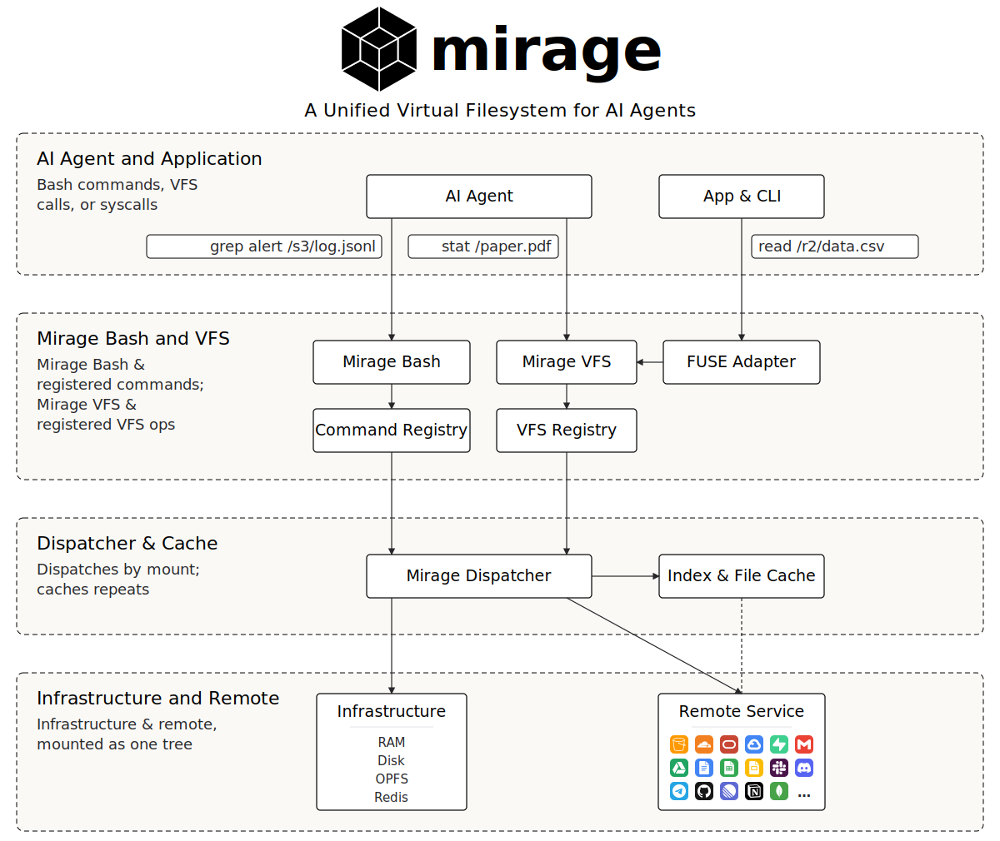
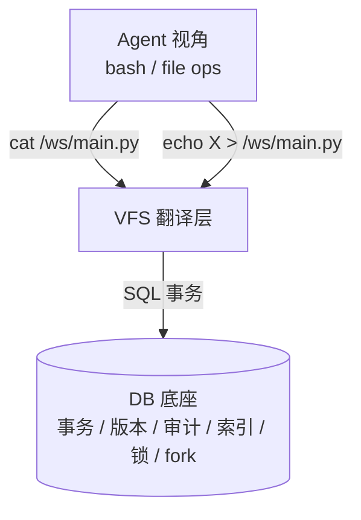
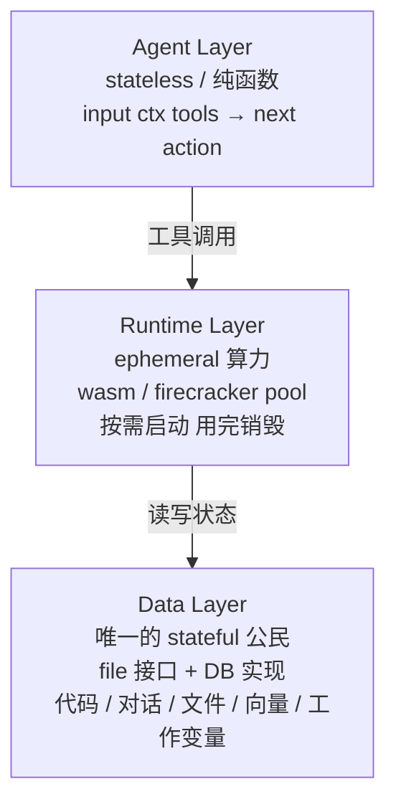

我最近读了 Mirage 和 AGFS 两个项目，发现一件它们自己都没说破的事：**它们都打着文件系统的旗号，但底下早就不是文件系统了**。AGFS 的 queuefs 落到 SQLite，Mirage 的 Workspace 类直接内置了 history、snapshot、consistency policy——这些全是数据库语义。看穿这件事之后我又往前走了一步：cloud agent runtime 需要的可能不只是把 file 换成 DB，而是把"agent 跑在 stateful Linux 上"这个上一个时代的假设彻底拆掉。

## Agent 和外部世界对话只有一种语言

Mirage 想解决的问题非常具体：让一个 agent 用同一套词汇操作所有外部 SaaS。

没有 Mirage 时你得给 agent 三个 tool：`slack_read_channel(channel, date)`、`s3_get_object(bucket, key)`、`gdocs_create_doc(content)`。每个 tool 一套 schema，三个 SDK 三种参数风格，错误形态各不相同。LLM 每用一次都要查参数，因为它训练语料里每个具体 SDK 的密度都极低——见过 Slack Web API 完整调用示例的 token 数，跟见过 `grep`、`cat`、`echo > file` 的 token 数差几个数量级。

Mirage 把这些 SDK 全部翻译成 bash：

```bash
grep ERROR /slack/alerts/2024-05-13.json | head
cat /s3/logs/2024-05-13/api.log | grep -A 5 "request_id=xyz"
echo "根因是 X" > /docs/report.md
```

它一口气挂上了 23 种 resource——S3 / GitHub / Gmail / Notion / Slack / Postgres / MongoDB / Linear / SSH / Discord——每一种都是一个 mount 点，操作动词全是 bash（完整 resource 列表见 [Mirage 官方文档](https://docs.mirage.strukto.ai)）。**Mirage 的核心赌注是：LLM 在训练分布上对 bash 和 Unix 工具的密度，远高于任意一个 SaaS SDK**。让 agent 用 SDK 等于让母语者讲外语；让它用 bash 等于把交互成本压到接近零。



这件事的意义不是省 token，是让模型在自己最有把握的语境里思考——recall 和 precision 都会上一个台阶。这条逻辑反过来也成立：任何想给 agent 做工具的人，第一个该想的问题不是"我的 API 怎么设计 schema"，而是"我能不能让它看起来像一个文件"。

## 多 agent 协作也是同一种语言

AGFS 看上去和 Mirage 是同类项目，其实在解决完全不同的事情。它不关心怎么和外部 SaaS 对话，关心的是**多个 agent 怎么在同一个工作台上互相传任务、共享状态、查谁还活着**。

它的 plugin 列表把这件事讲得很清楚：

| Plugin | 实质 |
|---|---|
| `queuefs` | 消息队列 |
| `kvfs` | 共享 KV |
| `heartbeatfs` | agent 存活检测 |
| `sqlfs2` | SQL session |
| `vectorfs` | 向量索引 |
| `streamfs` | 流式数据 |

`heartbeatfs` 最能代表这套设计哲学：

```bash
mkdir /heartbeatfs/coder              # agent 注册
touch /heartbeatfs/coder/keepalive    # 心跳续期
cat  /heartbeatfs/coder/ctl           # 查询状态: alive / dead
# 30 秒不 touch，目录自动消失
```

`mkdir` 是注册、`touch` 是 lease 续期、`ls` 是服务发现、目录消失是节点死亡——一整套分布式状态机用文件系统语义讲完了。这是 Plan 9 的 ctl 文件模式纯正复刻，只不过把 9P 协议换成了 HTTP RESTful API，更贴近 cloud native 的现实（每个 plugin 的具体协议见 [`agfs-server/api.md`](https://github.com/c4pt0r/agfs/blob/main/agfs-server/api.md) 和 [`docs/first-run.md`](https://github.com/c4pt0r/agfs/blob/main/docs/first-run.md)）。

Mirage 朝外、AGFS 朝内，但两边最后落到了**同一种接口语言**。这不是巧合，是 LLM 训练分布决定的——对 agent 友好的接口形态只有一种，所以做对的方案最后都长得像。看到这里我以为故事就到这里：把 file 接口推到极致，agent 工具问题就解决了。但再往代码里挖一层，发现这不是终点。

## 看穿底层：它们都已经在用数据库实现文件

把 Mirage 的 [`Workspace`](https://github.com/strukto-ai/mirage/blob/main/mirage/workspace.py) 类签名拉出来看：

```python
class Workspace:
    def __init__(
        self,
        resources: dict[str, BaseResource | tuple],
        consistency: ConsistencyPolicy = ConsistencyPolicy.LAZY,
        history: int | None = 100,
        session_id: str = DEFAULT_SESSION_ID,
        agent_id: str = DEFAULT_AGENT_ID,
        observe: BaseResource | None = None,
    ) -> None:
```

`ConsistencyPolicy`、`history`、`session_id`、`agent_id`、`observe`、`snapshot()`——这些不是文件系统的词汇，是数据库的词汇。Mirage 给 agent 看的接口是 file/bash，但它管理 agent 自己的 state 用的是事务化、可观测、可快照的语义。**file 只是壳**。

AGFS 那边更直接。打开 [`agfs-server/pkg/plugins/queuefs/`](https://github.com/c4pt0r/agfs/tree/main/agfs-server/pkg/plugins/queuefs)，里面有什么？`backend.go`、`db_backend.go`、`sqlite_backend_test.go`——**queue 的底层就是 SQLite**。一个写到 `enqueue` 这个虚拟文件的消息，落地路径是 `INSERT INTO queue_table` 一个 SQL 事务，不是 `write(fd, buf, len)` 一个 syscall。AGFS 已经在用数据库实现"看起来像文件"的接口，只是没把这件事提升为整体哲学。

两个项目都摸到了"接口是 file，实现是 DB"这条线，但都没说破。它们各自的下一步演化方向，其实早就刻在自己的代码里了——只是它们自己还以为在做"文件系统"。

## POSIX 在 cloud agent 多用户场景必然结构性坍塌

我在做云端 coding agent 多用户场景时撞到一个事实：**POSIX 文件系统在这个场景下不是"不够好"，是结构性坏掉**。它是 1970s 单机时代的接口设计，强行扛到多租户云端必然漏水。

漏在 6 个具体位置：

| POSIX 缺陷 | Cloud Agent 场景的崩溃 |
|---|---|
| 无事务 | agent 写一半超时被 kill → 文件半空、状态腐烂 |
| 无版本 | "30 分钟前 main.py 长啥样" → 答不出来 |
| 无审计 | agent 改了什么 → 不可追溯 |
| 无原生索引 | 跨 session 找"哪个 session 动了 auth" → 全盘 grep |
| 本地锁不跨机 | 两个 sandbox 改同一份 workspace → silent corruption |
| 快照很重 | 想 fork 一个 workspace 试改动 → 整个 microVM 复制 |

最让我头疼的是第 5 条。一个用户开两个并行 session 让 agent 同时改同一个 repo——一个 agent 改 `package.json` 添依赖、另一个 agent 同时改同一个文件添 script。`flock` 在本地有效，但两个 session 跑在不同的 sandbox 上。最后写赢的那份提交，另一个 agent 的修改默默消失——没有报错、没有冲突提示，因为 POSIX 在分布式语境里就是这个语义。要修补这个洞，要么外挂一个分布式锁服务（每次 `open` 都跨网络一次，性能崩盘），要么干脆给每个 workspace 钉死单机（牺牲弹性调度的全部好处）。两条路都难看。

第 2 条同样难受。agent 把 `tsconfig.json` 改坏，整个项目编译失败。用户想回到 30 分钟前的状态——POSIX 没法回答。要靠 git，但 agent 不会自觉每步都 commit；要靠 OS snapshot，但 LVM/Btrfs 要 root 且很重。最后我们做了一个补丁方案：inotify 监听写事件然后异步打 shadow git commit——能跑，但你心里清楚这是给一个本不该用作 cloud agent 存储的东西做的应急包扎，不是设计。

这里有个反直觉的事情值得停一下。**直觉上"文件系统比数据库轻"——这是错觉**。POSIX 的"轻"是把代价（事务、审计、版本、索引、分布式锁）外包给了应用层。但 agent 应用层根本做不来这些——agent 不会自觉 commit 每一步，不会自觉写 audit log，不会自觉建索引，它就是一个不可靠的写者。把这些代价收回到存储层、由存储层用一次性的好设计承担，agent 才能真正轻起来。

## 新物种的第一层：file 是接口，DB 是实现

承接上一节的判断，重建方案的形状其实很清楚：



最小数据模型可以这么写：

```sql
file_node     (workspace_id, path, current_version_id, mode)
file_version  (id, workspace_id, path, content_hash,
               session_id, parent_version_id, committed_at)
blob          (hash PRIMARY KEY, content BLOB)  -- 内容寻址，跨版本天然去重
workspace     (id, parent_id, branched_from_version)
```

`cat /ws/main.py` 翻译成 `SELECT content FROM blob WHERE hash = (SELECT current FROM file_node WHERE path=...)`。`echo X > /ws/main.py` 翻译成一个事务：插入 blob、插入新 version、更新 current 指针。fork 一个 workspace 只是新增一行 + copy-on-write 引用所有 file_node——git 已经验证这种模式在百万文件规模上跑得动。

每个之前缺的能力都自动落地：事务 = `BEGIN/COMMIT`，版本 = `file_version` 表，审计 = 同一张 `file_version` 表（免费），fork = `workspace` 表新增一行，分布式锁 = DB 行锁，索引 = `path` 上 trigram + `content` 上 FTS/embedding。它不是为某个能力加一个补丁，而是这些能力在数据模型里同时是免费的。

但这条路上有三个工程门槛得诚实说清楚。

**分层存储**。不要把所有东西砸进 DB。`pip install numpy` 解压 wheel 会触发几千次 mkdir/write，每次都做 DB 事务必崩；`cargo build` 创建几十万临时文件，更不可能。只把 **source of intent**——agent 决策路径上要审计/回滚/索引的东西——进 DB，构建产物 / 临时文件留传统文件系统，按 lockfile hash 在外部对象存储做跨 workspace 共享。中间产物是 DB 的物化视图，不是真相。

**砍掉冗余 POSIX**。软链接、硬链接、mmap、open fd——不是不能模拟，但每多模拟一层就把 DB 设计往 POSIX 模拟器推。Cloud agent 大多数只用 read/write/list/stat/rename/delete + glob——砍掉 80% 的 POSIX 表面，DB-backed 才变得现实。这件事 JuiceFS / SeaweedFS 没敢做，背着完整 POSIX 兼容的包袱，所以始终是"DB 撑文件系统"而不是"DB 取代文件系统"。

**流式分离**。stdout/stderr 千行/秒一行一个 insert 等于自杀。流式 IO 是另一类原语（AGFS 的 streamfs 已经指了方向），不是文件——读 stdout 走环形缓冲 + 异步 archive 到对象存储，不走 DB 事务路径。

到这里看上去答案已经齐了：file 给 LLM，DB 给系统，agent 跑在一个稳定的存储上。但这只是第一次拆解。

## 真正的终局是 agent / runtime / data 三层完全分离

Mirage 和 AGFS 都没解决的问题——**它们都还假设 agent 跑在一个 stateful Linux 环境里**。一个 microVM、一个 container、一个长生命周期的 sandbox。agent 进程、OS 状态、工作数据、网络栈全部绑在这个 VM 的生命周期上。VM 死了，所有东西一起死；VM 迁移，所有东西一起迁；用户开三个并行 session 试三种修改方案，三个 VM 同时跑同时占资源；用户离开半小时，VM 在那继续白白吃 CPU 和内存。

这是上一个时代的假设。看看周围已经完成的几次同类拆解：

| 层 | 老世界 | 新世界 |
|---|---|---|
| Web 服务 | Apache + 持久状态 | Lambda + DynamoDB |
| 数据计算 | 长跑 Hadoop 集群 | Snowflake / DuckDB on object store |
| 构建系统 | local make / gradle | Bazel / Nix（hash-addressed，任何 worker 都能跑） |
| 工作流 | Airflow stateful scheduler | Restate / Temporal（function stateless，state in DB） |
| **Agent runtime** | E2B / Daytona / Modal Sandbox（stateful microVM） | **？这件事还没发生** |

每一次拆解都是同一个动作：**把 state 从 runtime 里挤出去，runtime 变成 ephemeral 的纯算力**。Agent 是下一个排队等这件事发生的领域。

终局的形状大概是这样：



Agent 不再"跑在某台机器上"——它是一个**调度问题**。每次思考调度到任意 LLM 节点，每次工具调用启动一个 ephemeral runtime 操作 DB 里的状态，runtime 销毁后状态不丢。一个用户开三个并行 session 试三种修改方案 = 三个 ephemeral runtime 并行起来读同一份 fork 后的 DB 状态；某个 sandbox 节点维护重启 = 不影响任何 agent，因为 agent 不绑节点；用户离开半小时 = 没有任何 runtime 在等他，回来时按需起一个。

这件事难在三块硬骨头上：

**冷启动延迟**。每次工具调用新起 container 太慢。现实解法是 sandbox pool + firecracker snapshot/restore（resume 100ms 级），或者 WASM 微秒级冷启动配合 native 工具兜底。这一块工业界已经有现成思路，是工程问题不是设计问题。

**POSIX 工具的 stateful 假设**。`cd /ws && source .venv/bin/activate && pip install x && python -c "..."` 这条命令链有累积状态——PWD、env、激活的 venv、import 的 module。把 shell session 本身当成 durable workflow：每个 command 是一个事件，写进 DB；runtime 死了换台机器从事件流恢复——这就是 Restate / Temporal 那套 durable execution 模型搬到 shell 层面。

**数据本地性**。DB 在远端，每次 read/write 跨网络 → agent 一个 `grep` 就崩。read-through cache + write-through commit，DB 是 source of truth，runtime 本地是 hot copy；或者干脆把 runtime 调度到数据所在的可用区，让网络近似于 local IPC。

这三件都不是新难题，分别在 serverless、durable execution、edge compute 领域都有成熟解法。没人把它们组装在一起做成"cloud agent runtime"这个产品——这就是趋势缺口。

如果这个判断对，未来两年应该能看到这样的产品形态出现：**没有"开一个 sandbox"这个动作，只有"绑定一个 workspace（DB 里的一行）+ 提交一次 agent task"**；sandbox 在用户感知之外按需起停；workspace 像 git branch 一样轻量 fork、可 blame、可回滚；多个 agent session 并行在同一 workspace 不同分支上跑互不干扰；问"agent 跑在哪台机器上"这个问题本身会变得不再有意义。Mirage 把 workspace 语义做对了，AGFS 把协调原语做对了，但下一个真正定义 cloud agent runtime 的项目，会是把它们和 microVM pool + 事务化 DB-backed FS + durable shell 这三件东西第一次组装在一起的那家。

## 延伸阅读

- [Mirage: A Unified Virtual File System for AI Agents](https://github.com/strukto-ai/mirage)
- [AGFS: Aggregated File System, a tribute to Plan 9](https://github.com/c4pt0r/agfs)
- [Dolt: Git for Data](https://github.com/dolthub/dolt)
- [Neon: Serverless Postgres with branching](https://neon.tech)
- [Restate: Durable Execution Engine](https://restate.dev)
