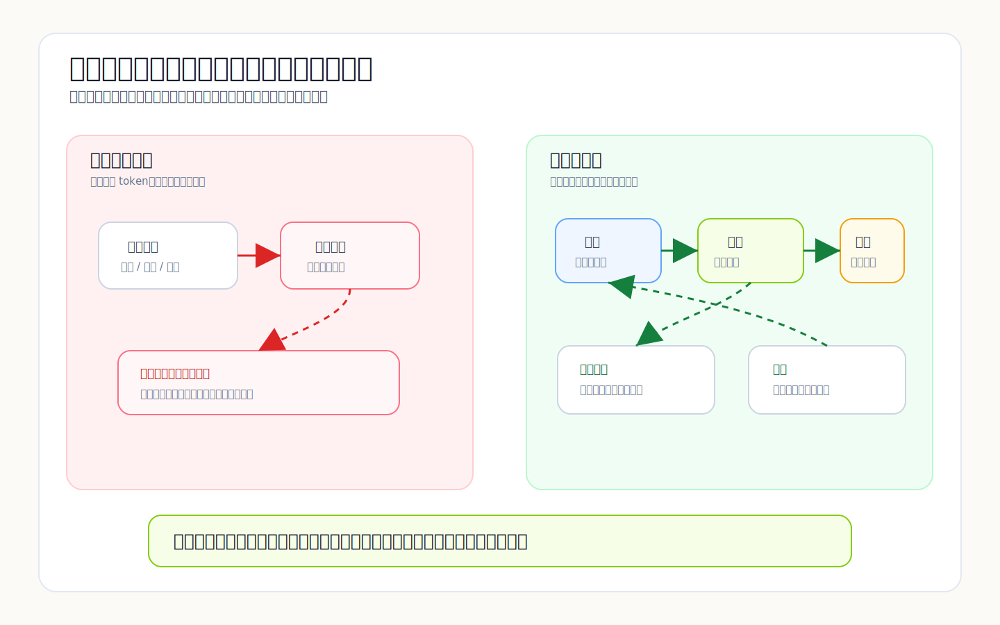
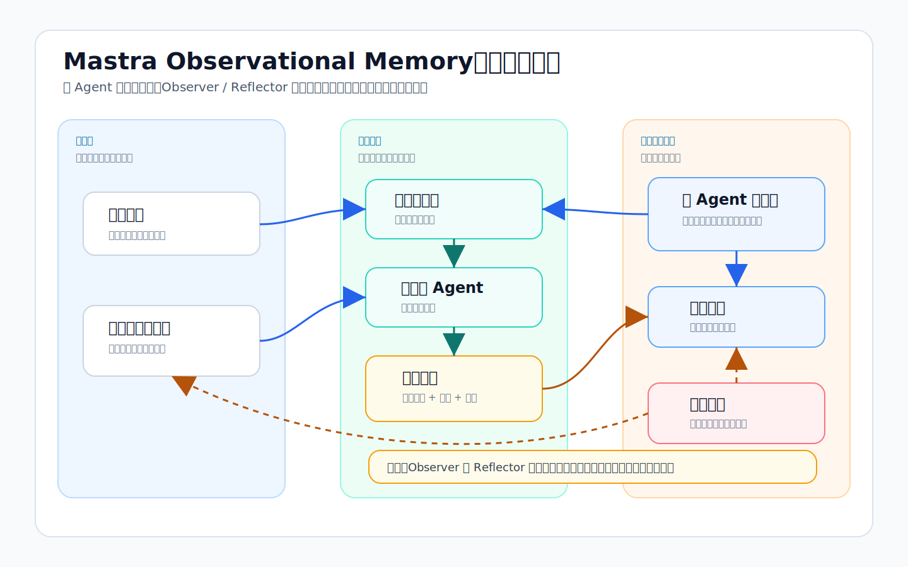

最近看到赵纯想哥在推荐 Mastra，之前也用过，但后来在 laper 里面看到它已经被实战验证了，就想着再研究下。里面一个比较让我惊讶的就是记忆系统。我一开始把 Mastra 的 Observational Memory 当成又一版“上下文压缩”，翻完实现后感觉非常有意思。

它最值得看的地方，不是“怎么把聊天记录变短”，而是它敢做一件更危险的事：把一部分原始消息从上下文里拿走，再把模型生成的观察记录塞回去，让 Agent 接着干活。这个动作如果做坏，省下来的上下文预算会变成失忆。

## “谁最能代表过去？”

Mastra 里普通的记忆处理器更像清扫工具。`MessageHistory` 管最近几条消息，`SemanticRecall` 做语义召回，`WorkingMemory` 注入当前状态，`TokenLimiter` 控制窗口大小，工具调用过滤器清掉一部分工具结果噪音。它们都合理，但它们处理的是“怎么少塞一点”，不是“拿掉之后谁来作证”。

这个差别在编程 Agent 里很明显。跑久一点后，上下文里会混着读过的文件、失败日志、用户纠正、已经排除的路线。保留每一行日志没意义，但只保留最近 N 条也很粗暴。早期一个“不要往这个方向改”的约束，可能比后面十页测试输出都重要。向量召回也不稳，因为相似片段不等于当前任务的因果链。

所以长上下文的麻烦不是装不下。装不下只是窗口约束。真正麻烦的是：原始消息离开后，系统拿什么继续代表“过去确实发生过这些事”。

## Mastra 没有保存聊天记录，它在做派生账本

Observational Memory 更像事件溯源。原始消息是事实源；Observer 读一段消息，写下观察记录；Reflector 在观察记录太长时，把旧观察再压一遍。聊天记录会被移出上下文，但账本留下来。

这三层最好不要混在一起：

| 层 | 角色 | 能不能重写 | 失败代价 |
|---|---|---|---|
| 原始消息 | 事实源，保留原始措辞、工具输入、工具输出 | 不能 | 丢了就无法证明原文是什么 |
| 观察记录 | Observer 生成的事件账本，服务当前和后续回合 | 可以追加 | 漏记会污染后续判断 |
| 反思记忆 | Reflector 对观察日志的再压缩 | 可以重组 | 压过头会丢掉偏好和状态变化 |

几个默认值能看出它的取舍：Observer 在“尚未观察的消息历史”到 30k tokens 附近触发；Reflector 在观察日志到 40k tokens 附近触发；异步缓冲默认每 20% `messageTokens` 预处理一次；激活默认把原始上下文压回到约 20% 阈值的余量。这些数字不优雅，但很工程：既要留住足够新的原文尾巴，又不能让工具输出把长期记忆挤死。

它和 RAG 的分叉也在这里。RAG 是“问的时候去找”；OM 是“发生的时候记账”。Mastra 研究文里 `gpt-5-mini` 在 LongMemEval 上给到 94.87%，他们强调的不是前几条召回更聪明，而是稳定的上下文窗口和提示词缓存。

换成运行时组件看，它大概是下面这个形状：

这里最简单也最关键的一点是：主 Agent 不直接相信压缩文本。它拿活跃观察维持连续性，需要精确内容时再通过召回回到原始消息范围。Observer 和 Reflector 都只是派生视图的维护者，不是事实源。

## 激活是我改观的地方

刚看源码时，我以为重点会在 Observer 的提示词。比如怎么区分用户断言和用户提问，怎么保留时间锚点，怎么标记任务完成，怎么把重复工具调用合并成一条观察记录。这些都重要，但不够让我觉得新。

让我改观的是激活。很多记忆系统做到“后台生成一段压缩稿”就停了。写进数据库，下一轮再拿出来，看起来任务完成。可对一个正在跑任务的 Agent 来说，难点刚开始：上一分钟它还在原始消息里看到失败日志、文件路径、用户纠正；下一分钟这些消息被移走，只剩一段观察记录。替换做不好，Agent 就会产生断片感。它知道一些过去事实，却接不上当前动作。

Mastra 在这里写了不少脏活。它会在阈值、空闲、模型提供方变化等条件下激活缓冲观察；找分块边界；把观察记录注入活跃观察；再返回 `activatedMessageIds`，让实时的 `MessageList` 删除已经被观察过的原始消息。它还会插入续写提示，提醒主 Agent 自然继续、不要提记忆系统、不要把对话当成新开局。

这一步让我觉得它不是普通压缩。普通压缩关心“压缩结果写哪儿”；激活关心“压缩结果能不能顶替原文继续工作”。这是两个难度。前者像归档，后者像热替换。

## Observer 不能，也不应该被当成事实源

我不喜欢的一点也很明确：Observer 很容易被误用成事实源。模型压缩不是无损编码。它会选择、改写、合并、遗漏。闲聊偏好可以这么处理，代码、文案、合同、错误日志不行。

写作工具里这个边界尤其敏感。用户选中正文一句话，让 Agent “保持这个语气，但不要那么 AI”。Observer 可以把它记成“用户偏好更自然、更少模板感的表达”。这对后续风格判断有用。但如果用户两天后问：“上次我让你改掉的那句原文是什么？”这条观察记录就废了。它保存的是判断，不是证据。

编程 Agent 也一样。观察记录可以写“测试失败来自 libsql adapter 的排序问题”，但不能替代原始错误堆栈和命令参数。越是需要精确复现的内容，越不能只相信被模型改写过的观察记录。

Mastra 的检索模式在这里补了一刀。观察分组可以带 `range="startId:endId"`，指向它来自哪段原始消息；主 Agent 在需要精确内容、代码、引用、URL、文件路径、具体数字时，用召回工具翻回原文。这个设计的潜台词很重要：观察记录只是大意，不是原文。

所以我会把这条写成规则：有损记忆只能指导行动，不能证明事实。它可以告诉 Agent “用户不喜欢这种写法”，但不能替用户还原原句；它可以告诉 Agent “这个任务已完成”，但不能替代测试输出。需要证明时，回原始消息。

## 学账本，别学整套状态机

Mastra 的异步缓冲那层不轻。里面有锁、阈值、缓冲区、世代标记、激活标记，还要处理空闲、模型提供方变化、未完成分块。框架产品需要这些；自己的 MVP 上来就搬，基本是在提前养一套很难收尾的状态机。

更该先搬的是账本模型。

**原始日志永远是事实源。** 聊天消息、工具调用、正文差异、测试输出都应该先以不可变事件保存。派生记忆可以短、可以错、可以重算，但不能成为唯一证据。写作工作区尤其需要这个边界：正文状态不应该依赖聊天会话，AI 改写也必须有差异审阅路径。

**每条有损观察都挂原文范围。** 不管观察记录是人写的、模型写的，还是规则提取出来的，都要知道它来自哪段原始事件。没有原文范围的记忆只能做软偏好，不能参与需要精确还原的任务。

**压缩格式要服务下一步行动。** 只写“用户讨论了部署问题”没有用。要记录“当前任务是什么”“哪些方案被否定”“哪些步骤已完成”“还有什么没验证”。Mastra 的 `<current-task>`、完成标记、时间锚点、优先级符号，价值都在这里。它们不是漂亮格式，而是让 Agent 少走回头路的操作信号。

明天就能做的改动很小：把记忆拆成原始事件、观察记录、快照三张表；给观察记录增加 `source_start_id` 和 `source_end_id`；在提示词里明确规定精确内容必须召回原文。等这些边界稳定，再谈异步缓冲、激活阈值和提示词缓存的经济账。

Agent 记忆不该追求“保存更多过去”。它应该把过去分成三类：可以压缩的行动线索、必须保留的事实凭证、可以被重写的长期视图。账本立住了，压缩才不会变成失忆。

## 延伸阅读

- [Memory processors — Mastra Docs](https://mastra.ai/docs/memory/memory-processors)
- [Observational Memory — Mastra Docs](https://mastra.ai/docs/memory/observational-memory)
- [Observational Memory: 95% on LongMemEval — Mastra Research](https://mastra.ai/research/observational-memory)
- [observational-memory.ts — mastra-ai/mastra](https://github.com/mastra-ai/mastra/blob/main/packages/memory/src/processors/observational-memory/observational-memory.ts)
- [constants.ts — mastra-ai/mastra](https://github.com/mastra-ai/mastra/blob/main/packages/memory/src/processors/observational-memory/constants.ts)
- [observer-agent.ts — mastra-ai/mastra](https://github.com/mastra-ai/mastra/blob/main/packages/memory/src/processors/observational-memory/observer-agent.ts)
- [reflector-agent.ts — mastra-ai/mastra](https://github.com/mastra-ai/mastra/blob/main/packages/memory/src/processors/observational-memory/reflector-agent.ts)
