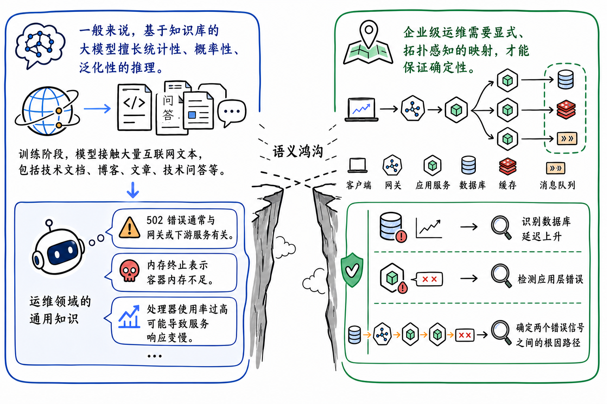
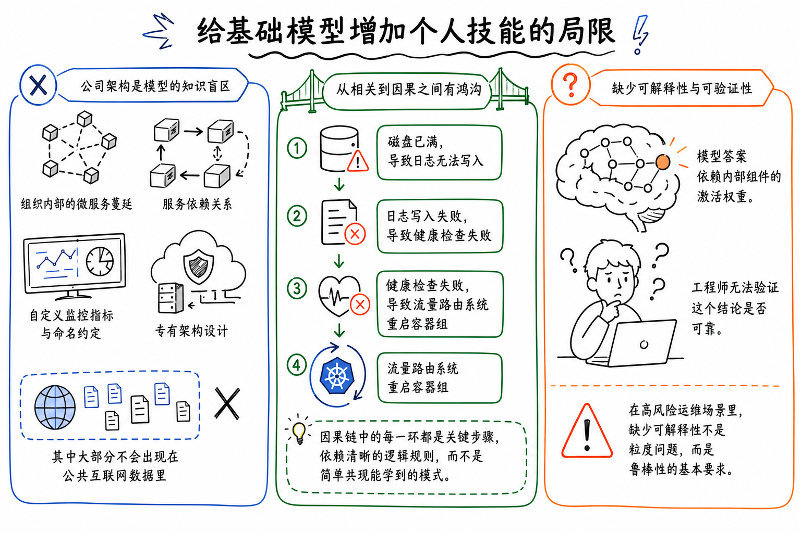
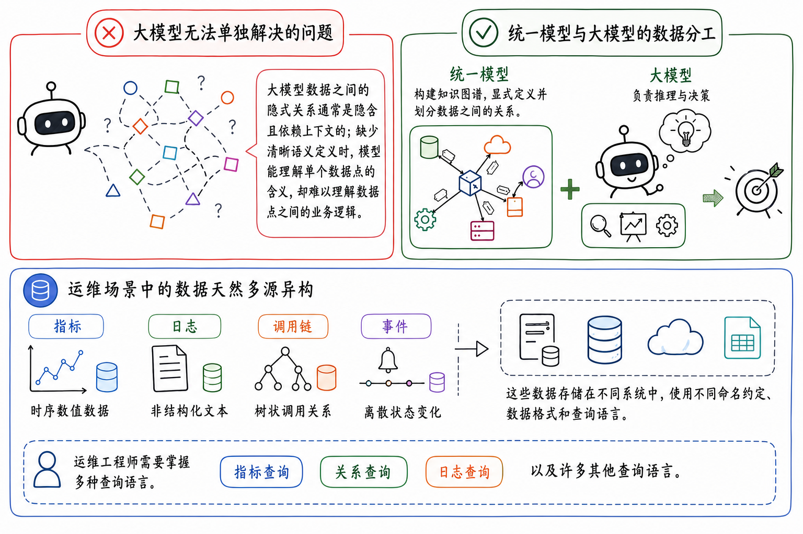
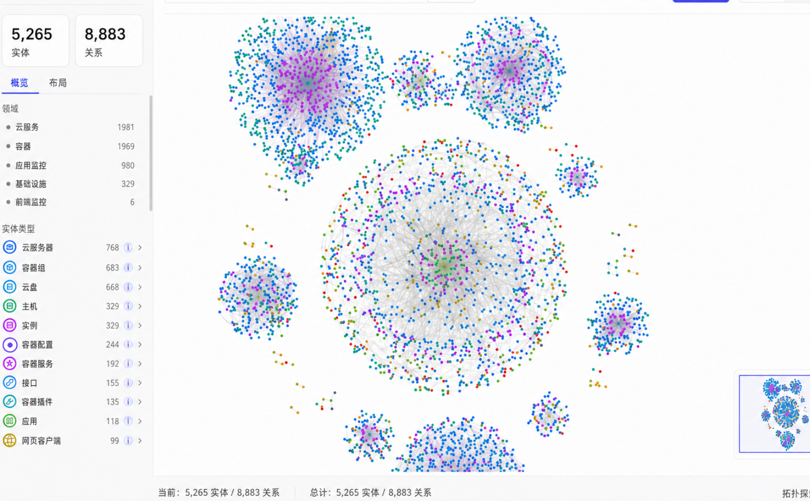

最近本体论的概念忽然冒出来了，看了下一些大厂商对这个东西的认知和技术博客，觉得和我平时 coding 的时候有些观念很相似，只不过换了种说法，并且抽象出来了，并且把之前感觉在大家口中已经埋葬了很久的知识图谱也再次挖了出来；于是有了下面这篇 blog：

给一个运维 Agent 看一条 `502 Bad Gateway`，它会告诉你"502 通常意味着上游服务无响应，建议检查后端服务健康状况"。这句话没错，放在任何一篇 Stack Overflow 答案里都成立。但它对你此刻的生产事故毫无用处——它不知道你的上游服务是哪个，不知道这个服务挂在哪台机器上，更不知道二十分钟前那次发布动了什么。

这不是模型不够聪明。这是它知道的那种知识，和运维需要的那种知识，根本不是一回事。

我后来又想了一层：这个问题其实不只属于 AIOps。运维只是最容易看清楚的场景，因为错一次就会报警、升级、回滚、追责。真正的结构性问题是，很多 Agent 现在缺的不是更长上下文、更多工具、更多文档，而是一个**可计算、可治理、可追溯的领域世界模型**。本体论如果还能回来，靠的不是"知识图谱"这个老词，而是它能不能承担这层世界模型。

## LLM 的知识是统计的，你的系统是确定的

大模型在预训练阶段吞下了整个互联网的技术文档、博客和问答。它对"502 错误"的理解，是从几百万个网页里**统计共现**出来的一个概率分布：502 经常和"网关""上游""超时"这些词一起出现，所以它会把这些词组织成一句通顺的建议。这种知识是泛化的、概率的、面向公共语料的。

但你的系统不在公共语料里。你的微服务调用拓扑、你给中间件起的内部代号、你那套只有三个人知道的部署约定——这些是模型的知识盲区。阿里云那篇讨论本体论的文章把这道裂缝叫做 **Semantic Chasm（语义鸿沟）**：一边是模型基于公共知识的统计性、概率性、泛化的理解，另一边是企业运维要求的显式、拓扑感知、确定性的判断。

原文有个措辞我觉得很准确：通用大模型的运维知识是 **"statistical, probabilistic, and generalized"**。这不是在贬低 LLM，而是在划清边界。统计知识适合回答"通常会怎样"，但生产事故问的是"此刻在我这套系统里到底怎样"。前者是语言问题，后者是系统状态问题。

这道鸿沟的关键，不在于鸿沟两边知识量的多少，而在于**两边知识的性质正交**。你可以把企业的全部架构文档塞进 context window，让模型"知道得更多"，但你改变不了它推理的方式——它依然是在做模式匹配，而不是在你的系统拓扑上做确定性推导。多塞知识，治不了根。

## 真正的缺口不是知道得少，是从相关跨不到因果

承认了语义鸿沟，下一个直觉反应是："那把企业架构喂给它不就行了？" 这个反应是对的方向，错的诊断。喂知识能补上"知道得少"这一半，补不上更要命的另一半——**因果方向**。

设想一个真实的故障链：磁盘写满了，导致应用日志写不进去，导致健康检查探针失败，导致编排系统判定 Pod 不健康、把它重启。最后你在监控大盘上看到的是什么？是磁盘使用率、日志错误率、健康检查失败数、Pod 重启次数这四条曲线**同时**异常。

一个统计模型看到这四条同时异常的曲线，能告诉你它们**相关**，但给不出那条单向的箭头：到底是磁盘满引发了重启，还是重启引发了磁盘异常？文本语料里学不到这个方向，因为这个方向不在任何网页的词频共现里——它只存在于**你这套系统此刻的拓扑结构**中。这就是 LLM 推理的结构性缺口：它能算出哪些事一起发生，算不出谁导致了谁。

而因果方向恰恰是运维的全部。定位根因，就是在一团同时亮起的告警里，找出那条"磁盘满"的源头，而不是去重启那个被牵连的 Pod。这个缺口不是靠更大的模型、更长的上下文能填平的——它是统计推理这种方法本身的边界。这也是为什么在严谨运维场景里，**可解释性不是加分项，是硬性要求**：你得能审计这条因果链，而不是接受一个黑箱给出的概率最高的猜测。

这里也是我对很多 Agent 项目最警惕的地方：它们把"能说出一个看起来合理的排障步骤"误当成了"完成了根因定位"。两者中间差了一层可执行语义。排障步骤可以由模型生成，根因定位必须落到实体、关系、时间窗口和证据路径上。没有这层落地，Agent 越会说话，反而越容易把工程师带偏。

## 解法是换建模范式：从面向数据到面向对象

既然多塞数据和换更大模型都不解决问题，剩下的出路只有一条：换掉建模的范式本身。本体论给出的转向，一句话概括就是**从面向数据到面向对象**。

面向数据的世界里，你的可观测信号是四摊割裂的东西：Metrics 是时序数字、Logs 是非结构化文本、Traces 是树状调用链、Events 是离散状态变更。它们存在不同的系统里，用不同的查询语言——PromQL 查指标、SQL 查日志表、SPL 查事件、Cypher 查图。运维工程师的日常，是同时精通四种查询语言，在四个控制台之间手动关联线索。

面向对象的世界里，这四摊数据不再是主体，而是**绑定到实体的观测属性**。一个 `Pod` 是对象，它的 CPU 指标、它的日志、它参与的调用链、它的重启事件，都是挂在这个对象上的属性；它和 `Node`、`Service`、`Disk` 的关系，是图上可以被推理遍历的边。要把这套建模落成系统，核心动作就两步：先定义一层实体和关系的图模型，把"指标/日志/调用链/事件"归位成实体的属性和实体之间的边；再在底下接一个统一查询层，把 PromQL、SQL、SPL、Cypher 这些方言收敛到同一个执行引擎，让一次查询能横跨四类数据。

这个"从面向数据到面向对象"的口号听起来温和，我的理解更激进一点：对象不是给数据加个标签，而是把数据的解释权从查询语言手里拿回来。指标不再先属于某个表或某条查询语句，而是先属于一个有身份、有生命周期、有上下游关系的实体。这个顺序一换，Agent 的工具调用也会跟着变：它不应该先问"我要查哪张表"，而应该先问"当前问题涉及哪些实体，沿哪些关系扩展上下文"。表是实现细节，实体才是 Agent 应该面对的第一性对象。

这个转向的意义，不在于省了几次切换控制台的麻烦。在于**关系一旦被显式建模成图上的边，因果推理就有了确定性的路径可走**。上一节那条"磁盘满→Pod 重启"的链，在面向数据的视图里要靠人脑拼接四条曲线，在面向对象的图里就是一条可以被程序遍历的路径。LLM 不再需要去"猜"因果，它只需要在一张已经把因果关系编码进去的图上**找路径**。

## 别把本体论做成更复杂的数据字典

这里要补一个边界。很多人一听本体论，就会自动把它理解成"知识图谱"或"语义层"。这三个东西有关，但不是一回事。

语义层更像业务友好的查询翻译层：什么叫收入，什么叫活跃用户，什么叫转化率，应该查哪张表、哪个字段、哪个聚合口径。知识图谱则是填了实例事实的图：订单 A 属于客户 B，服务 C 依赖数据库 D，指标 E 来自节点 F。真正的本体更靠前一层，它定义的是对象类型、关系类型、约束、状态机、业务规则和可允许的动作。换句话说，语义层回答"这个词怎么查"，知识图谱回答"现在有哪些事实"，本体回答"这个世界里到底有什么、它们怎样相连、什么变化算合法"。

这也是 Microsoft、Salesforce、Palantir 这些公司最近都在往同一个方向收敛的原因。Microsoft Fabric IQ 把 ontology 放成企业共享业务模型，让人、Agent 和工作流使用同一套实体、关系、属性和约束；Salesforce 把 Agent 需要的 ontology 分成 descriptive 和 structural 两层，前者定义业务语义和规则，后者把语义映射到真实数据位置；Palantir 讲得更狠：ontology 不只建模"名词"，还要建模"动词"——也就是 Agent 到底能执行哪些动作，这些动作被什么权限、验证和审计约束。

这个分野很重要。一个只会检索文档的"本体层"，最多是 RAG 的另一个资料库；一个能表达对象、关系、规则、证据、动作和治理的本体层，才是 Agent 的语义操作系统。Snowflake 最近用生物医学数据做 Cortex Agents 的实验也给了一个很实用的信号：从 baseline semantic view 到 knowledge graph、GraphRAG，再到 GraphRAG + term mappings，成功率从大约 50% 提到 78.2%。这个数字不能机械外推，但它说明一件事：当问题需要跨同义词、层级、父子关系和多跳关系时，结构化语义不是装饰，是可靠性的主要来源。

## 本体论二十年没成的死穴，这次赌的是数据反向派生

写到这里该泼一盆冷水了。本体论不是新东西。语义网、知识图谱、企业本体建模，这套东西从上世纪末就在学术界和工业界反复"流行又退潮"。每一轮的剧本都一样：开头描绘一个用显式知识消除歧义的美好世界，结尾死在同一个地方——**schema 的构建和维护成本，随着系统的熵增而爆炸**。

谁来定义这几千个实体类型？系统架构改了，本体怎么同步？一个微服务团队上线了新服务、改了调用关系，那张本体图谁去更新？历史上每一次本体论项目的崩塌，都不是死在"建不出来"，而是死在"建出来之后维护不动"。一张和真实系统脱节的本体图，比没有还糟，因为它会理直气壮地给出错误的因果路径。这是本体论真正的死穴，也是任何人鼓吹"本体论又回来了"时你应该追问的第一个问题。

那这一轮凭什么不一样？我的判断是，真正变了的不是"本体论本身进步了"，而是**本体的来源变了**。看一眼任何一个真实生产系统自动探测出来的拓扑——一张图里五千多个实体、近九千条关系，这种规模根本不可能是人肉在白板上画出来的。

这种规模的实体和关系，只能从已经在采集的可观测数据里**反向派生**出来：调用链里出现的服务自动成为实体，trace 里的上下游关系自动成为边，部署事件自动更新拓扑。本体不再是工程师在白板上画完、再苦苦维护的静态产物，而是从 telemetry 流里持续生长、持续自校验的派生物。系统变了，数据先变，本体跟着数据变——这是它和上一代手工知识图谱最根本的分野。

这一点恰恰是大多数鼓吹"本体论回来了"的文章讲得最不充分、却最关键的地方。它们花大量篇幅讲本体的价值和架构，讲实体关系怎么建、查询怎么统一，但对"本体怎么来、怎么不腐烂"这个历史死穴往往只是点到为止。而这才是判断这轮复兴是真突破还是又一次轮回的**唯一分水岭**：本体到底是人工知识工程的产物，还是可观测数据的派生物。前者注定重蹈覆辙，后者才有可能这次真的成。

更进一步说，"自动派生"也不是免死金牌。这是我对这套乐观叙事最大的保留：自动生成的关系如果没有来源、时间戳、置信度和失效条件，本质上只是把人工维护的腐烂风险换成了自动腐烂——而且自动腐烂更隐蔽，因为没人会去怀疑一条"机器生成"的边。一个边 `Service A -> Database B` 至少要回答四个问题：它从哪条 trace、哪次配置、哪条部署事件里来？什么时候观测到？最近一次被反证是什么时候？如果它错了，会影响哪些推理路径？没有这些治理字段，本体图越大，Agent 反而越有可能在一张漂亮但过期的地图上自信迷路。所以我的结论是：数据反向派生是必要条件，但远不是充分条件，真正的工程难点在派生之后的治理，而不是派生本身。

## LLM 探索，本体收敛——这才是 Agent 推理的正确分工

退一步看，本体论和 LLM 的关系，从来不是谁取代谁，而是一种分工。把这两节连起来想：LLM 的统计推理擅长在开放空间里**探索**——理解你模糊的自然语言意图、生成假设、规划下一步该查什么；本体提供的确定性结构擅长**收敛**——保证每一步推理都落在一条可审计、可复现的因果路径上。

这正是我一直相信的那条原则在运维场景的复现：**自然语言负责探索空间，符号负责收敛空间**。一个只有 LLM 的 Agent，会在严谨场景里给出流畅但不可靠的猜测；一个只有本体图的系统，是台死板的规则引擎，接不住人类模糊的意图。把两者按"探索-收敛"分工组合起来，才是 AIOps Agent 该有的形态：本体提供上下文感知和确定性的语义底座，LLM 负责在这个底座上做自主规划和推理。谁也替代不了谁，错的是想用一个去顶替另一个。

我甚至觉得这个分工是个比 AIOps 大得多的判断。这几年 Agent 圈反复在两个极端之间摇摆：一边是"模型够强就什么都不需要"的纯 LLM 派，一边是"把所有逻辑写死成规则和流程图"的纯符号派。前者在开放任务上惊艳、在严谨任务上翻车，后者反过来。本体论这轮回潮，本质上是符号派带着一个新筹码回到牌桌——这个筹码就是"结构可以从数据里自动长出来，不用全靠人写"。如果这个筹码成立，那"探索归 LLM、收敛归符号"就不再是权宜之计，而是 Agent 架构的稳定形态。

这也给 Agent 产品一个很实际的设计原则：不要把本体层做成 RAG 的另一个资料库。本体层应该暴露的是可组合的对象操作，例如"沿调用边向上游扩展两跳"、"找出同一节点上同时异常的实体"、"返回这条推理路径的证据来源"。LLM 调这些操作时，像是在使用数据库事务和类型系统，而不是在翻一堆文档摘要。

如果把它落成工程，我现在更愿意把这一层叫做 **Agent 语义操作层**。它至少要拆成六个正交层次：真实数据源，实体解析和稳定 ID，本体 schema，实例图和时间化事实，Agent retrieval/tool 接口，以及动作治理层。前四层让 Agent 知道世界是什么，第五层让它能查询和推理，第六层决定它能不能安全地改变世界。少了最后一层，本体仍然只是"会回答问题"；加上动作、权限、审批、回滚和审计，它才开始接近"能在真实系统里行动"。

所以，关于"我们要给 Agent 加个知识图谱/本体层"这种赶热点的想法，只需要用这些问题检验它是真方案还是又一次轮回：

- **这个本体解决的是因果方向问题，还是只是又一个知识库？** 如果它补的只是"知道得更多"，那它没碰到真正的缺口。
- **本体是人工维护的，还是从已有数据自动派生的？** 前者会在系统第三次架构调整后腐烂，后者才扛得住熵增。
- **它的输出可审计吗？** 给不出可追溯因果链的本体，在严谨场景里和黑箱没区别。
- **实体身份是否稳定？** 如果同一个服务在指标、日志、调用链里有三套名字，Agent 的第一步就已经错了。
- **关系是否有时效？** 拓扑边不是永恒真理，尤其在发布、扩缩容、故障切流之后，旧关系必须自然过期。
- **推理路径是否能回放？** 一个根因结论至少要能回放出实体、关系、观测值、时间窗口和每一步扩展规则。
- **动作是否被建模和治理？** 如果本体只描述对象、不描述动作权限、审批、回滚和审计，那它还不能支撑高风险 Agent。
- **失败能不能反向更新本体？** 如果每次误判只是在 prompt 里加一句补丁，而不是修实体、关系、规则或评测集，这套系统还是会腐烂。

本体论这次值不值得重新投入，答案不在本体论本身，而在你是否承认：LLM 的统计推理有一个 scaling 填不平的缺口，叫因果确定性。承认这个缺口，本体就不是可选的增强，而是必需的底座；继续往前走，它也不只是知识表示，而是 Agent 从"会说"走向"能在真实系统里负责行动"时必须跨过的语义操作层。它能不能这次真正落地，赌的从来不是知识图谱画得多漂亮，是它能不能跟着你的系统一起，自己活下去。

现在越发的觉得 AI coding时代，考验的是人对世界的抽象认知，以及如何从错误和痛点中学习和反思。

## 延伸阅读

- [Ontology is trending again — can it improve my AI agent's performance? — Alibaba Cloud](https://www.alibabacloud.com/blog/ontology-is-trending-again--can-it-improve-my-ai-agents-performance_603207)
- [What is ontology — Microsoft Fabric IQ](https://learn.microsoft.com/en-us/fabric/iq/ontology/overview)
- [Two Types of Ontologies Your AI Agents Need to Be Trustworthy — Salesforce](https://www.salesforce.com/blog/structural-and-descriptive-ontology/)
- [Connecting Agents to Decisions — Palantir](https://blog.palantir.com/connecting-agents-to-decisions-277dee8ddb40)
- [GraphRAG — Microsoft Research](https://www.microsoft.com/en-us/research/project/graphrag/)
- [Ontology in Snowflake: Building Cortex Agents — Snowflake](https://www.snowflake.com/en/blog/engineering/ontology-grounded-cortex-agents/)
- [Ontology vs Semantic Layer — Atlan](https://atlan.com/know/ontology-vs-semantic-layer/)
- [How to Build Living Ontologies for Enterprise AI — Alation](https://www.alation.com/blog/living-ontologies-enterprise-ai/)
