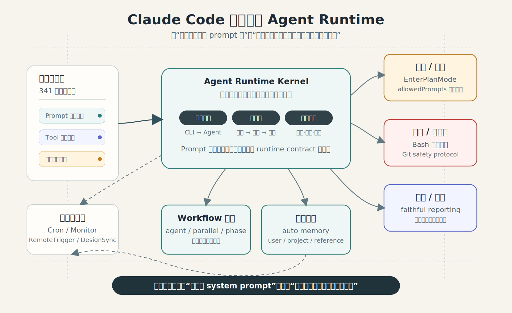
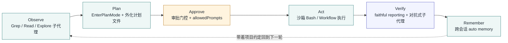

<!--
input: phistory 对 Claude Code system prompt 和工具协议的版本归档。
output: 分析 Claude Code 从 CLI 工具演化为 agent runtime 的博客正文。
pos: content/posts/260615 的主文章入口。
-->

有人把 Claude Code 每个 npm release 跑起来、抓下它发出的 system prompt，归档成快照。到 2.1.177 为止，一共 341 个快照，最后一个采集于 2026-06-13。把它们按版本号排好，你会看到 prompt 从 1.0.0 的 53,556 字节，长到 2.1.177 的 100,394 字节——几乎翻倍。

翻倍的不是话痨。在 `1.0.127` 里，开头还是 `You are Claude Code, Anthropic's official CLI for Claude.`；到了 `1.0.128`，这行被改写成 `You are a Claude agent, built on Anthropic's Claude Agent SDK.`。一个工具把自己的定义从"命令行工具"换成了"SDK 之上的 agent"。这不是文案润色，是这 47KB 增量的总纲：**Claude Code 这一年真正在做的事，不是"更会写代码"，而是把软件工程里本来靠工程师脑子临时判断的东西——该不该跑、跑在哪、要哪些权限、并发怎么管、做完怎么验证、要不要记住——逐个抽出来，固化成 prompt 和工具协议层面的运行时保证。**

下面这篇东西，数据来自 [phistory](https://github.com/WEIFENG2333/phistory) 对 `@anthropic-ai/claude-code` 的归档。需要先声明边界：这是对实际运行时 prompt/工具协议的逆向归档，**不等于官方产品路线图**；它能告诉你"能力边界怎么变了"，不能告诉你 Anthropic 内部怎么想。

这篇文章可以按三条线读：身份从 CLI 翻到 Agent，副作用从建议变成协议约束，会话从一次性对话长出记忆、调度、远程触发和编排。三条线合在一起，才是"runtime 化"这个判断的完整含义。

## 先把"修改量"当信号读：重写都发生在哪几个版本

不必逐字读 341 份 prompt。先看每个版本相对上一版的字节增量，突变点自己会跳出来。剔掉两类采集噪声后——`2.1.69` 是一份被截断的坏快照（19,678 字节，前后 ±60K 是假信号），`2.1.111`–`2.1.122` 在 ~105K 和 ~113K 之间反复横跳是条件性模块时有时无——真正的结构性重写落在这几处，刚好把演化切成四段：

| 阶段 | 版本区间 | 干了什么 |
|:--|:--|:--|
| CLI 硬化与 IO 纪律 | 1.0.0 → 1.0.59 | 顶着"官方 CLI"身份打磨输出卫生：禁止未经请求的 emoji、含空格路径强制加双引号、把 Grep 升级成 ripgrep 接口并禁止直接 shell 出 `grep`/`rg` |
| 子代理种子·异步执行·身份翻转 | 1.0.60 → 1.0.128 | Task 拿到 `subagent_type`、后台 bash 落地、命令默认进沙箱，最后在 1.0.128 把身份改写成 "agent built on Claude Agent SDK" |
| v2 重组·计划态状态机·人机门控 | 2.0.0 → 2.1.47 | 2.0.0 一次瘦身（删掉 Code style、MultiEdit、硬编码模型名）；plan mode 升级成审批状态机；`allowedPrompts` 语义化最小权限；Skill 工具形式化 |
| 持久记忆·自调度·远程·编排 runtime | 2.1.58 → 2.1.177 | auto memory、Cron 自调度、Monitor/PushNotification/RemoteTrigger 远程化，最后以 Workflow 编排引擎和 DesignSync 收束 |

注意一个反直觉点：**修改量最大的一次（`2.1.153 → 2.1.154`，净 -22KB）是删多于加**。它把一堆常驻工具描述挪进了按需加载的 `ToolSearch`，省下的体量比新加的还多——这本身就是 runtime 化的标志：工具不再都塞在 prompt 里硬背，而是变成可延迟加载的协议。

## 委派被协议化：从无类型 Task 到确定性编排引擎

agent 化最硬的一条主轴是"委派"。1.0.0 的 Task 工具是无类型的，本质是个"帮我多搜几轮"的通用助手。`1.0.60` 给它加了必填参数：

> When using the Task tool, you must specify a subagent_type parameter to select which agent type to use.

一行约束，把"外包一次搜索"升级成"按类型派发具名子代理"。这是后来所有多代理架构的协议起点。紧接着 `1.0.72` 补上 `run_in_background` + `BashOutput` + `KillBash`——agent 第一次能 spawn 一个长跑进程、轮询它、杀掉它，同时继续干别的活。"开个终端跑着、回头再看"这种并发习惯，被写进了工具协议。

这条线在 `2.1.154` 一次性收口成 `Workflow` 工具：

> Execute a workflow script that orchestrates multiple subagents deterministically. Workflows run in the background — this tool returns immediately with a task ID, and a \<task-notification\> arrives when the workflow completes.

它是一个用 `agent()` / `parallel()` / `pipeline()` / `phase()` / `budget()` 写的 JavaScript 编排引擎：按 cache 前缀可恢复（resume）、有 token 预算上限、有并发上限，还配了一个常驻的 Ultracode "默认就编排"模式。同一版本里，`SendMessage` 让子代理从"一次性 Task"变成"可续聊的执行单元"，`isolation: "worktree"` 给并行写文件的 agent 各自一个 git worktree。**把"人来分解、调度、合并多步工作"这件事，彻底变成了可脚本化、可复现的运行时。**

说句实在的：这篇报告本身就是用 `Workflow` 跑出来的——21 个突变点并行刻画、逐条对抗验证引文是否 verbatim、再综合排名。我是用 2.1.154 的能力，去分析 2.1.154 这次改动。这种自反性不是噱头，它恰好说明：编排已经从"prompt 技巧"沉淀成了"基础设施"。

## 权限与计划：副作用被默认关进沙箱，计划态变成审批状态机

agent 能跑命令、能写文件，风险就从"答错"升级成"搞坏"。这一年里，副作用治理从"靠 agent 自觉"变成了"默认受约束"。

`1.0.124` 的措辞很重：

> CRITICAL: ALWAYS set the `sandbox` parameter to `true` for all commands by default

命令默认沙箱、违例时不许把 `~/.ssh` 之类敏感路径加白名单。`1.0.128`——也就是身份翻转那一版——同步删掉旧的 sandbox-override 警告，补进结构化的 Git Safety Protocol：不准 `push --force`/`hard reset`、`--amend` 前先查 `git log -1 --format='%an %ae'` 确认作者、不准提交 `.env`。自我认知和执行护栏，在同一个版本里一起硬化。

计划这一侧走的是另一条路：把"先想后做"做成状态机。`2.0.51` 的 EnterPlanMode 开头一句：

> This tool REQUIRES user approval - they must consent to entering plan mode

它不再是一个"我准备好了"的信号，而是"进入要审批 → 把计划写进文件 → 改文件 → 退出待批"的两工具流程，计划内容从内联字符串外化成持久文件。`2.1.6` 再补上 `allowedPrompts`——计划审批时，agent 可以预先声明它接下来需要的命令类别：

> you can request prompt-based permissions for bash commands your plan will need. These are semantic descriptions of actions, not literal commands.

权限从"逐条命令现批"升级成"按语义、按最小特权、按会话预申报"。Observe → Plan → Approve → Act 这条链，被一颗一颗螺丝拧进了工具协议。

## 记忆、调度、远程：agent 长出了会话之外的器官

到 2.1.x 后半段，改动开始往"会话之外"长。`2.1.59` 给了持久记忆：

> You have a persistent auto memory directory ... Its contents persist across conversations.

而且一上来就带纪律——`MEMORY.md` 始终加载、超 200 行截断、明确规定"该存稳定约定/不该存临时状态"、先查重再写、错了要删。`2.1.83` 进一步把它升级成带类型 schema 的记忆（user / feedback / project / reference）。"工程师记得住项目约定"这件事，变成了一个有边界、有治理的持久层，而不是把所有对话塞进一个向量库。

时间维度也进来了。`2.1.72` 的 Cron 让 agent 给自己入队未来的提示词（5 字段 cron、默认 3 天过期、仅 REPL 空闲时触发），`2.1.101` 的 ScheduleWakeup 让它在 `/loop` 里自定步。远程维度则由 `2.1.111`/`2.1.122` 那组工具补齐：

> Start a background monitor that streams events from a long-running script. Each stdout line is an event — you keep working and notifications arrive in the chat.

Monitor 把长跑脚本的输出流式成聊天通知，PushNotification 跨设备把用户的注意力拉回来，RemoteTrigger 经 claude.ai 调度远程 agent。再加上 `2.1.175` 的 DesignSync（增量读写 claude.ai/design 的设计系统，一次一个组件、绝不整包替换）——Claude Code 的作用域已经从一个 repo，扩到了"代码 + 记忆 + 时间 + 远程 + 设计资产"。

## 串起来，是一条完整的 agent 循环

把这些改动按作用归类，它们并不散：

这就是这部演化史最深的一条线：**Claude Code 从"聪明的聊天框"变成了"受约束的执行系统"。**每一次关键改动，都是把工程师本来在脑子里一闪而过的某个判断，抽出来固化成运行时保证。身份从"官方 CLI"翻转成"Agent SDK 之上的 agent"，正是这一整套 runtime 化在自我定义上的盖章时刻——它先把自己重新定义成了 agent，然后才有资格、也才有必要，给自己装上这一圈约束。

值得强调的是 2.1.154 那句被新加进来的话：`Report outcomes faithfully: if tests fail, say so with the output`。早期 prompt 的核心诉求是"少废话、别烦用户"；现在的核心诉求是"别制造假确定性"。对一个会真的去改你代码库的执行系统来说，后者才是信任的地基。

## 抄作业：这部演化史，对自建 Agent 系统意味着什么

如果你也在做自己的 agent（我手上是宠物问诊和小说工具两套），这条 1.0.0 → 2.1.177 的轨迹里有五条可以直接抄的判断：

- **Skill 不该背全局进度的锅。** Claude Code 的分层很清楚：Skill 是局部能力包（领域知识 + 流程 + 工具约束），进度、权限、状态、恢复、最终交付是主循环和 Workflow 的事。别让一个能力包去管整条任务的生死。
- **默认不要上重型 DAG。** 它的路子是"主循环 + 工具协议 + 可选 workflow 脚本"，平常单 agent，复杂任务才显式 fan-out，多阶段用 pipeline，只有真有全局依赖才上 barrier。把所有东西提前画成静态图，是过度设计。
- **记忆必须有类型和边界。** 它把记忆分成 user/feedback/project/reference，并反复强调"不要存仓库已经记录的东西"。做问诊长期记忆同理：用户偏好、宠物画像、病史事实、诊疗事件、证据来源、待确认假设，要分开建模，而不是一锅塞进向量库。
- **首交互快准狠，后台再深挖。** 它的模式是主 agent 先 scout，必要时才 workflow fan-out。第一次问诊不该一上来跑多 agent，而是先给一个可信的初筛结论、风险等级、下一步该问什么；只有高风险或信息复杂时才启动深层分析。
- **验证机制比"换更强模型"更值钱。** 它后期把对抗式验证、completeness critic、loop-until-dry 写进了 Workflow。强模型也会漏、也会把假设当事实——给小说压缩、抄袭检测、宠物问诊都配一个"反方"：漏了什么？证据够不够？有没有危险误判？这件事的边际收益，长期高于把底座模型再换大一号。

一句话收束：**Claude Code 这一年不是在变得更会写代码，是在把软件工程里的不确定性、权限、副作用、并发、验证、记忆、资产，一项一项 runtime 化。**你要抄的不是它某个 skill 或某个 subagent，而是它的分层——把 agent 当成一个受约束的执行系统来设计，而不是一个挂了工具的聊天框。

## 延伸阅读

- [phistory：agent CLI 的 system prompt 版本归档](https://github.com/WEIFENG2333/phistory)
- [phistory.cc — Claude Code 版本浏览](https://phistory.cc/?agent=claude-code&from=1.0.0&to=2.1.177)
- [Claude Code 1.0.0 的 prompt 快照（"official CLI" 身份）](https://raw.githubusercontent.com/WEIFENG2333/phistory/main/captures/claude-code/1.0.0/prompt.md)
- [Claude Code 2.1.177 的 prompt 快照（"Agent SDK" 身份 + Workflow/Memory）](https://raw.githubusercontent.com/WEIFENG2333/phistory/main/captures/claude-code/2.1.177/prompt.md)
