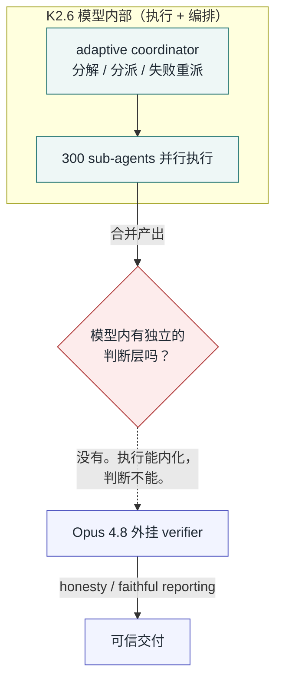

<!--
input: Movez 推文、Kimi K2.6 官方博客与模型卡、第三方架构拆解、Anthropic 招募哲学家/咨询神父写 Claude Constitution 的事实，以及本站 260615《Claude Code 如何长成 Agent Runtime》的立场。
output: 分析 Kimi K2.6 swarm 与 Claude Code runtime 两条路线、并上升至「自主性时代方法论层」的博客正文。
pos: content/posts/260620 的主文章入口。
-->

2026 年 6 月中旬，一条推文在 X 上刷到接近一百万次浏览。加密圈 KOL Movez 贴出一篇文章，标题是《The Self-Improving Loop: a 300-agent swarm on Kimi K2.6, verified by Opus 4.8》。核心一句很抓人：一个免费的开源模型，用单个 prompt 起 300 个并行 agent、跨 4000 步协调，在真实研究任务上得分超过贵它 5 倍的闭源旗舰。

标题里最值钱的是 "self-improving"（自我进化）和 "verified by Opus 4.8"（由 Opus 4.8 验证）这两个词。但正是这两个词，泄露了整套方案真正的边界——**执行可以被装进模型，判断不能**。这篇不打算否定 K2.6 的 swarm，它确实是开源侧一个实打实的架构进步；我想做的是顺着 Movez 标题里那个自相矛盾的地方，把 agent 系统里一条更值得投入的线拽出来：当模型自己编排自己，真正在进化的到底是模型，还是围绕模型的那层规则。

## 一张性感的饼：开源、免费，还「自我进化」

先把 Movez 卖的东西摊开看。Kimi K2.6 是 Moonshot AI 在 2026 年 4 月 20 日放出的开源模型，1 万亿参数的 Mixture-of-Experts、激活 32B、256K 上下文，Modified MIT 协议，权重挂在 HuggingFace 上。价格是 $0.95 / 百万 input、$4.00 / 百万 output，大概是 Opus、GPT 这代旗舰的 1/5 到 1/6。便宜到能让人忽略它所有的不足。

它真正的主打功能叫 Agent Swarm：模型自己当编排者（官方的说法是 adaptive coordinator），把一个复杂任务拆成异构子任务，派给最多 300 个并行 sub-agent，跨 4000 步协调执行。一次 API 调用进去，一份完整产出（文档、网站、幻灯片、表格）出来。这组数字相对上一代 K2.5（100 个 agent、1500 步）是 3 倍和 2.7 倍的实打实提升。Moonshot 自己的描述很有画面感：coordinator 会根据每个 agent 的技能画像派活，某个 sub-agent 卡住或失败，它会检测到、重新分派、甚至重新生成子任务，再把各路输出合并交付。

Movez 把这套东西包装成"自我进化的循环"，言下之意：不只是更猛，是会自己变猛。这个叙事对加密圈和 AI 外围受众极其有效——开源、免费、还自我进化，几乎集齐了 2026 年最性感的三个词。一百万次浏览，多半是冲着这三个词来的。

## benchmark 选的是主场：swarm 模式赢的，恰好是 K2.6 独占的赛道

饼画得再圆，也得看分数是不是选着报的。

把 HuggingFace 上 K2.6 的模型卡拉出来，逐条对 benchmark，会发现一个规律：K2.6 真正领先的，几乎全是 swarm 模式专属的赛道。BrowseComp 的 Agent Swarm 模式，K2.6 拿到 86.3，GPT-5.4 只有 78.4，差出近 8 分；DeepSearchQA 的 F1，K2.6 是 92.5，GPT-5.4 是 78.6、Opus 4.6 是 91.3。这两个 benchmark 测的是"能不能并行铺开大量 agent 做广度搜索和深度研究"——恰好是 swarm 架构的主场，也恰好是闭源旗舰没有对等模式可跑的赛道。

但把视角切到单 agent 的硬任务上，画面就不一样了。

| benchmark | K2.6 | 对比项 | 结果 |
|---|---|---|---|
| BrowseComp (Agent Swarm) | 86.3 | GPT-5.4: 78.4 | K2.6 大幅领先（swarm 主场）|
| DeepSearchQA (F1) | 92.5 | Opus 4.6: 91.3 / GPT-5.4: 78.6 | K2.6 领先（swarm 主场）|
| SWE-Bench Verified | 80.2 | Opus 4.6: 80.8 | 打平，略输 |
| SWE-Bench Pro | 58.6 | Opus 4.7: 64.3 | Opus 领先 5.7 分 |
| APEX-Agents | 27.9 | GPT-5.4: 33.3 | 闭源领先一大截 |

SWE-Bench Verified，K2.6 是 80.2，Opus 4.6 是 80.8——基本打平，K2.6 还略低。SWE-Bench Pro（更长链路、更大仓库的工程任务），K2.6 是 58.6，Claude Opus 4.7 已经到 64.3，差 5.7 分。APEX-Agents 这种纯 agentic 多步任务，K2.6 是 27.9，GPT-5.4 和 Opus 4.6 都在 33 上下。Toolathlon、MCPMark 这些工具调用类项目，K2.6 同样不占优。

所以"超过贵 5 倍的模型"这句，成立的前提是任务正好落在 swarm 的主场。一旦任务要的是单 agent 深度推理或多步工具调用，K2.6 的价格优势还在，但"超过"就不成立了——它是用更便宜的 token 换一个略低或明显更低的质量。这不丢人，开源模型做到这一步已经是硬实力，但它和 Movez 卖的"自我进化、全面超越"是两回事。

还有个容易被标题唬住的数字：4000 步。它不是每个 agent 跑 4000 步，是整个 swarm 一共 4000 步的总预算。300 个 agent 分下来，平均每个才 13 步左右。这意味着 swarm 擅长的是大量浅层、专门化的子任务并行，不是 300 个深度推理 agent 同时攻坚。把它想象成"300 个短工期工人"而不是"300 个资深工程师"，更接近真相。

## 真正被打破的，是「self-improving」这个词

benchmark 选主场，还只是宣传层面的小账。真正的问题，是 Movez 标题里那个最唬人的词——self-improving——从根上就站不住。

"自我进化"在机器学习里有明确含义：系统会更新自己的参数，或者至少积累持久的能力，下一次比这一次强。K2.6 的 swarm 做的是这件事吗？没有。一次 run 里模型权重纹丝不动；所谓"循环"，是 coordinator 发现某个 sub-agent 卡住或失败后，重新派发任务、重新生成子任务，最后把各路输出合并。这是一个 **self-correcting 的调度纠错循环**，不是 self-improving。把"会自己补救"偷换成"会自己变强"，是这词最大的水分。

但这一节真正的转折，不在词义辨析，而在 Movez 自己标题的后半句：verified by Opus 4.8。

把这句话和前半句放一起看，矛盾就出来了。前半句宣称，300 个 agent 的编排、协调、纠错全在 K2.6 这一个模型内部完成——这是"自我进化"叙事的根基，编排被装进了模型。可后半句立刻说，最终要靠 Opus 4.8 来验证。如果 K2.6 内部的编排真的足够，为什么还得外挂一个完全不同厂商、贵好几倍的模型来兜底？

答案只能是：执行和编排可以塞进一个模型，**独立的判断不行**。300 个 agent 并行跑出来的东西，需要一个不参与执行、只负责挑错的 verifier 来兜底；而 K2.6 自己既当运动员又当裁判，靠不住。Movez 无意中用标题的后半句，推翻了前半句的叙事——这不是 self-improving loop，是一个 executor 外加一个独立 verifier。

Opus 4.8 被选中当这个 verifier 也不是偶然。它相对前代最被强调的改进叫 "honesty"：官方说法是它比前代少大约 4 倍的概率，放任自己写的代码里的缺陷蒙混过关。在一个会真的去改代码库、真的去执行任务的 agent 系统里，"虚假的确定性"才是最贵的失败模式——它把错误包装成自信，让你在很晚才发现问题。Opus 4.8 的价值不在它更聪明，在它更愿意承认"这里有问题"。这恰好是 executor 不该具备、verifier 必须具备的特质。

## 两条反向路线，在「执行和判断必须分开」上汇合

Movez 标题的自相矛盾，指向一个比"哪家模型强"更稳的命题：**agent 系统的稳定性来自执行和判断的分离，而不是模型本身有多强**。有意思的是，2026 年两条看起来方向相反的路线，在这个命题上汇合了。

K2.6 选的是把编排做进模型。好处是零基础设施——一次 API 调用进去，一份合并产出出来，开发者不用自己搭 orchestrator。代价也被很多人点破：Daniel Braz 在拆解时直接写，这是 "zero infrastructure overhead, **zero ability to audit or customize**"。编排逻辑藏在模型里，你既看不见 300 个 agent 之间怎么互相依赖，也没法在某个子任务失败时插手纠正，coordinator 的失败模式没有任何文档。执行省事，治理交白卷。

另一条路线是 Claude Code 这一年走的。我前阵子写过它怎么从一个 CLI 工具长成 agent runtime：它把 orchestrator、权限、副作用治理、计划审批、验证、记忆全部外化成 harness 层的运行时保证，而不是塞进模型 prompt。最让我在意的是 2026 年中加进去的那句约束——

> Report outcomes faithfully: if tests fail, say so with the output.

对会真的改代码的执行系统来说，"别制造假确定性"是信任的地基。它的验证也不是靠"换个更强模型"，而是写在 Workflow 里的对抗式子代理：一个 agent 干活，另一个专门挑漏，loop 直到挑不出问题。委派、并发、失败恢复、最终验证，被一颗一颗螺丝拧进了工具协议，而不是交给某个模型的自觉。

这两条路线看起来一个内一个外，但落到"执行和判断怎么分工"上是同一件事。K2.6 把执行和编排内化，发现判断兜不住，于是 Movez 外挂 Opus 4.8——分离发生在模型边界之外。Claude Code 从一开始就把判断（对抗验证、faithful reporting、计划审批）做成 harness 里独立的一层——分离发生在 harness 内部。**两条路都承认了同一件事：执行和判断不能是同一个东西。**区别只是这条边界划在模型里，还是划在 harness 里。

我自己在做 agent 系统时的体感和这一致。手上一套宠物问诊、一套小说工具，我没把精力花在"换更强的底座模型"上，而是给每套都配了一个反方：漏了什么、证据够不够、有没有把假设当成事实。底座模型再强也会漏，会把自己的猜测当结论塞给你；一个独立的 verifier 的长期边际收益，远高于把模型再换大一档。这件事 Claude Code 用一年 runtime 化验证过，Movez 用 Kimi 加 Opus 从另一个方向撞到了同一堵墙。

## 模型越自主，规则越比 prompt 值钱

执行和判断要分离，其实只是更上层一个判断的具体表现：**当模型越来越自主，高杠杆已经不在"写好一个 prompt"上，而在"设计规则、迭代路径和验证结构"上**。

判断的依据不在别处，就在 Anthropic 自己的动作里。2026 年它干了一件让圈外人发笑、圈内人发毛的事：招了一位哲学博士出身的 Amanda Askell 常驻公司，专门负责给 Claude 写"人格"和"宪法"——一份两万多字的行为规则，定义 Claude 该怎么推理、怎么拒绝、怎么承认不确定。这还不够，它又把硅谷一位前科技高管转行的天主教神父 Father Brendan McGuire、梵蒂冈的 Bishop Tighe、还有几位伦理学者请进来，一起打磨这套规则。外网戏称 Anthropic 在"招神父给 AI 上道德课"。

精确地说，神父是被咨询的顾问，不是员工；真正招进来的是 Askell 这样的哲学家和 character 设计者。但这个区分不影响重点。重点是伦理学者 Brian Patrick Green 转述的 Anthropic 的理由：公司意识到它——

> can't make a regulation about every single case

所以不再去写穷举式的禁令清单，而是塑造一个 disposition——一种面对没见过的新情况时，倾向于好好表现的稳定倾向。

这句话翻译过来，就是规则设计的范式转变：从"给每种情况写一条 prompt"（短半衰期，穷举不完，永远是补丁），到"设计一套能迭代、能泛化的规则底座"（长半衰期，是资产）。Askell 写的那两万字不是一条 prompt，是一个 constitution——它管的是 Claude 在数百万次对话里稳定表现出的行为倾向，而不是把某一次问答调到最优。这就是为什么"设计规则和迭代路径"的远期收益，会压过"雕琢单条 prompt"。单条 prompt 是消费，规则层是资产；模型每半年翻一倍能力，但 executor/verifier 分离、faithful reporting、对抗式验证、分层治理这些判断，是用很多年的工程审美换来的，不会随某家厂商发新版而失效。

Movez 把 K2.6 的 swarm 叫 self-improving loop，误读了真正在发生的事。真正在自我进化的不是模型的权重，是围绕模型的那一层方法论——规则怎么定、验证怎么做、迭代路径怎么走。在一个模型越来越能自己跑起来的时代，该往哪里投精力，答案越来越清楚：别再雕那个 prompt 了，去写你的 constitution。

## 延伸阅读

- [Movez 原推文：The Self-Improving Loop](https://x.com/0xMovez/status/2067291911468044494)
- [Kimi K2.6 官方技术博客 — Moonshot AI](https://www.kimi.com/blog/kimi-k2-6)
- [Kimi K2.6 模型卡（完整 benchmark 表）— HuggingFace](https://huggingface.co/MuVeraAI/Kimi-K2.6)
- [Kimi Agent Swarm：成本与可审计性分析 — Daniel Braz](https://levelup.gitconnected.com/kimi-agent-swarm-when-one-model-becomes-team-fa4aa8710dba)
- [300 sub-agents 与 4000 步预算的澄清 — Verdent](https://www.verdent.ai/guides/kimi-k2-6-agent-swarm)
- [Widening the conversation on frontier AI — Anthropic](https://www.anthropic.com/news/widening-conversation-ai)
- [The Catholic Priest Who Helped Write Anthropic's AI Ethics Code — Observer](https://observer.com/2026/03/the-catholic-priest-who-helped-write-anthropics-ai-ethics-code/)
- [Claude Code 如何长成 Agent Runtime（本站姊妹篇）](../260615/)
