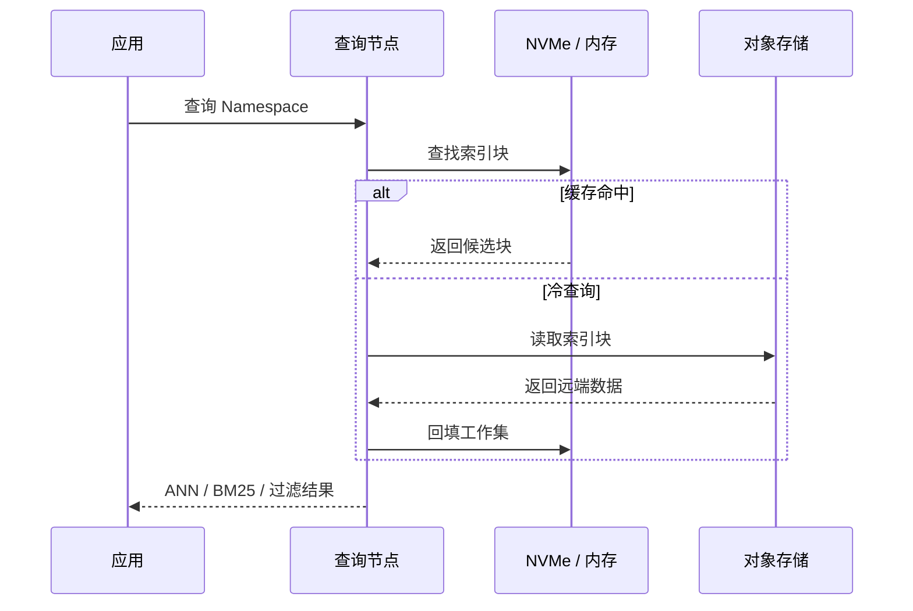
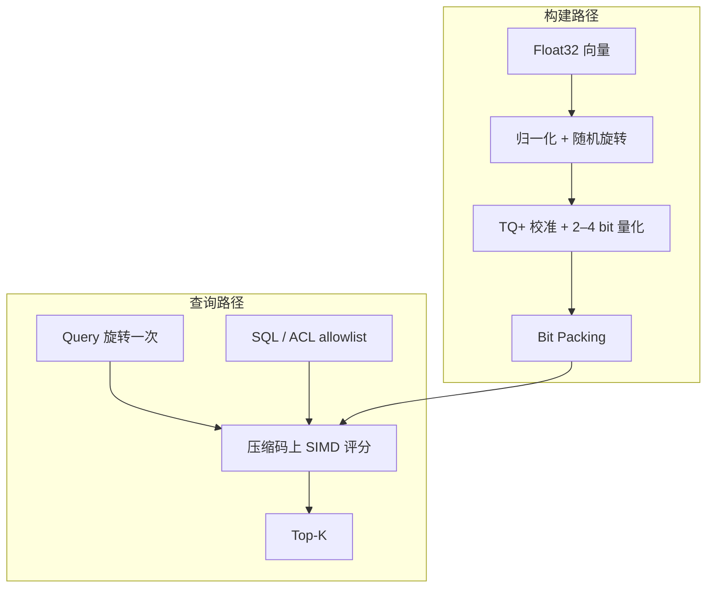
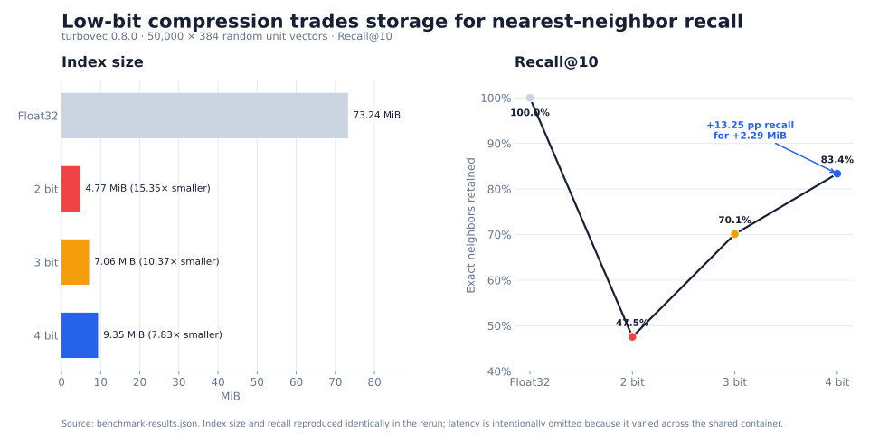

最近在做一个内容创作相关的检索模块。以小说 Agent 为例，世界观、角色卡、章节和场景记忆会随着写作持续累积，它们都需要一套能长期工作的检索基建。

第一版沿用了熟悉的 Qdrant。它足够成熟，也能满足当前需求；但我已经很久没有系统关注向量检索，因此重新检查了一遍近几年的向量数据库、压缩索引和冷热分层方案，确认继续使用 Qdrant 是当前约束下的选择，而不只是路径依赖。

一千万条 768 维 Float32 向量仅主体数据就占 30.72 GB。规模上来后，检索成本会沿两条路径增长：全量数据常驻在哪一层，以及每次查询需要搬运多少字节。

turbopuffer 通过对象存储和工作集缓存降低全量数据的常驻成本，turbovec 通过 2–4 bit 量化降低热路径的内存占用和带宽需求。前者改变字节所在的存储层级，后者改变每条向量的表示密度，两种机制可以同时存在，不能用一张性能榜直接排出胜负。

现有证据也不足以支持小说 Agent 迁移。turbopuffer 部分来自官方架构与性能资料，没有托管服务压测；turbovec 部分来自两次本地实验，但使用随机单位向量和共享容器。本文据此讨论架构机制、局部实验结果和当前产品决策，不做两款产品的完整 Benchmark。

## 存储层级与表示密度

30.72 GB 还没有计入 ID、元数据、索引结构、副本和内存对齐。规模继续增长后，距离计算只占一部分成本；数据位于对象存储、SSD 还是内存，以及一次查询需要读取多少字节，也会影响延迟和价格。

| | turbopuffer | turbovec |
|---|---|---|
| 系统边界 | 通过网络访问的完整搜索数据库 | 嵌入应用进程的本地向量索引 |
| 改变什么 | 全量数据的存储位置与工作集缓存 | 每条向量的表示大小与内存带宽 |
| 主要代价 | 冷查询、远程访问和写入延迟下限 | 召回损失与本地索引生命周期 |
| 本文证据 | 官方架构数据，未做服务实测 | 2、3、4 bit 本地实验 |


## turbopuffer：为冷数据保留一条远程路径

按照 [turbopuffer 的架构文档](https://turbopuffer.com/docs/architecture)，对象存储是持久层，NVMe 与内存只承担缓存。每个 Namespace 在对象存储中拥有独立前缀；首次查询需要取回远端索引块，后续请求则尽量路由到已经持有缓存的查询节点。



官方给出的性能数据中，一百万文档的 Namespace 首次查询 p50 为 874 ms，缓存后降到 14 ms。这组差距直接反映了对象存储作为持久层的访问成本。预热可以减少用户遇到冷查询的次数，远程 I/O 仍会在缓存未命中时发生；比较这类系统时需要同时报告首次访问和缓存后延迟，只报告热缓存 p50 会遗漏存储分层的主要代价。

写入也使用对象存储作为持久化边界。成功返回代表 WAL 已持久化，索引随后异步构建；尚未索引的近期数据仍可通过较慢的穷举参与查询。官方文档说明强一致读取默认开启，而 [Tradeoffs](https://turbopuffer.com/docs/tradeoffs) 给出约 10 ms 的一致性延迟下限，并提醒极端尾延迟仍可能遇到数百毫秒的冷查询。

对象存储的随机访问成本也影响了索引选择。[官方架构说明](https://turbopuffer.com/docs/architecture)指出，基于 SPFresh 的质心索引可以用较少的对象存储往返批量读取候选簇；HNSW 一类图遍历包含更多不规则随机访问，在远程存储上会放大 I/O 成本。turbopuffer 因而优先减少候选块和存储往返，再优化单次内积计算。

## turbovec：让热数据少搬一些字节

[turbovec 0.8.0](https://github.com/RyanCodrai/turbovec/releases/tag/v0.8.0) 是 Rust 编写并提供 Python Binding 的本地索引。应用仍然负责文档、权限与持久化边界，turbovec 保存压缩向量并返回 Top-K，主要减少热数据在内存层级中移动时的字节数。

它实现的 [TurboQuant](https://arxiv.org/abs/2504.19874) 先归一化向量，再施加共享的随机正交旋转，让坐标分布更适合标量量化。turbovec 的 [TQ+ 实现](https://github.com/RyanCodrai/turbovec/blob/v0.8.0/README.md#how-it-works)会在首次写入时校准各维经验分布，然后使用 Lloyd-Max 量化与 Bit Packing 将坐标压到 2、3 或 4 bit。



搜索时不逐条恢复 Float32，是压缩能够转化为查询收益的条件。Query 只旋转一次，NEON、AVX-512 或 AVX2 kernel 直接在量化码上查表评分；如果每条数据库向量都在评分前解码，压缩节省的内存带宽会被解码过程抵消。

turbovec 也接受 [allowlist 过滤](https://github.com/RyanCodrai/turbovec/blob/v0.8.0/README.md#hybrid-retrieval-filtered-search)。应用先用 SQL、租户权限或时间窗口生成允许集合，索引再以 32 条向量为一个 Block 跳过完全不相关的块。搜索结果因此直接是允许集合内部的 Top-K，无需先过量召回再做后过滤。turbovec 本身不承担文档存储，过滤集合及其生命周期仍由外部系统负责。

## 低 bit 换来多少召回损失

本地实验只尝试证伪一个窄问题：低 bit 索引获得压缩率时，能否仍然保留足够多的精确近邻。环境为 turbovec 0.8.0、NumPy 2.5.1、Python 3.12.13；使用固定随机种子生成 50,000 条 384 维随机单位向量和 200 条独立 Query，以 Float32 精确内积的 Top-10 作为 Ground Truth。OpenBLAS、OMP、MKL 与 Rayon 均固定为单线程，每组预热后重复七次取中位数。

[实验脚本](https://github.com/littlewwwhite/littlewwwhite.github.io/blob/main/content/posts/260726/benchmark_turbovec.py)、[第一次原始结果](benchmark-results.json)、[复跑结果](benchmark-results-rerun.json)和[绘图脚本](plot_tradeoff.py)都保留在 Page Bundle 中。图表可由原始 JSON 直接重建：

```bash
python plot_tradeoff.py
```



| 表示 | 落盘大小 | 相对 Float32 | Recall@10 | Top-1 命中 | 200 条查询：首次 / 复跑 |
|---|---:|---:|---:|---:|---:|
| Float32 精确搜索 | 73.242 MiB | 1× | 1.0000 | 1.0000 | 171.9 / 86.5 ms |
| turbovec 2 bit | 4.771 MiB | 15.35× | 0.4755 | 0.3000 | 34.0 / 33.2 ms |
| turbovec 3 bit | 7.060 MiB | 10.37× | 0.7010 | 0.5500 | 60.7 / 55.8 ms |
| turbovec 4 bit | 9.349 MiB | 7.83× | 0.8335 | 0.7000 | 60.9 / 59.0 ms |

两次运行中，索引大小、Recall@10 和 Top-1 命中完全一致。2 bit 接近理论上的 16 倍压缩，但只保留了 47.55% 的 Top-10；4 bit 仍有 7.83 倍压缩，Recall@10 提高到 0.8335。从 3 bit 增加到 4 bit，多占 2.289 MiB，换回 13.25 个百分点的 Recall。在这组合成数据上，选择 bit width 时必须同时检查召回损失；只看压缩率会把 2 bit 误判成最优解。

延迟没有同样稳定。使用相同版本、数据与线程设置复跑时，Float32 精确搜索从 171.9 ms 变成 86.5 ms，而压缩索引的大小和召回没有变化。这说明共享容器里的绝对速度受 CPU 调度和底层资源影响，不能据此宣称 turbovec “快 2.8 倍”，也不能把 3 bit 与 4 bit 的几毫秒差异解释成稳定优势。

随机单位向量是可控的合成分布，不能代表小说 Embedding；共享容器也不能代表目标硬件。这组实验只决定下一步需要测什么，不能直接决定是否迁移。turbovec 0.8.0 的 README 在 [OpenAI Embedding 与 GloVe](https://github.com/RyanCodrai/turbovec/blob/v0.8.0/README.md#recall) 上报告了不同的召回曲线，进一步说明量化结果取决于数据分布。速度比较需要回到目标硬件，质量比较则需要一套真实小说 Query。

## 当前决策：不迁移

小说 Agent 需要按租户过滤世界观、角色卡、章节和场景记忆，并混合关键词与向量召回；当前运行边界以 Vercel、Supabase 等托管组件为主。turbovec 需要稳定的本地索引生命周期，把它放进短生命周期 Function 会增加索引加载、状态同步和并发控制。turbopuffer 的多租户与混合检索能力更接近现有需求，但当前 Postgres/Supabase 路径还没有出现由冷数据或 Namespace 扩张引起的瓶颈。

因此现阶段继续使用现有检索栈，并先建立可回放的真实查询集。只有观测到对应瓶颈后，迁移才有依据；新组件的功能列表本身不能证明现有路径需要替换。

下一步保存真实 Query、过滤条件、候选 Chunk 和最终采用结果，并观察 Recall、p95 与 p99。之后按瓶颈分叉：

- 如果问题集中在大量冷租户与长期存储成本，用同一批 Query 测 turbopuffer 的首次访问、缓存命中和淘汰后尾延迟；
- 如果系统转向稳定本地进程，并出现明确的内存容量或带宽瓶颈，再在真实 Embedding 上比较 turbovec 的 2、3、4 bit 与 Float32/PQ；
- 如果两类成本都没有出现，就不迁移。

在上述指标触发前，引入第二套检索系统会先增加数据一致性与运维成本。保留现有方案，并用真实查询记录迁移条件，是当前证据支持的决策。
