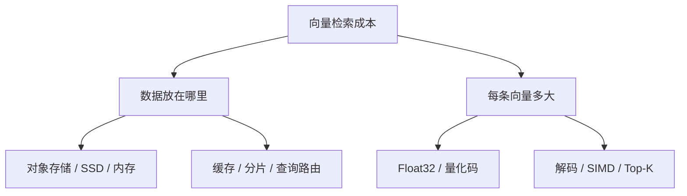

最近在给一个网页端 Agent 写小说产品挑检索组件时，我遇到了一个很容易被名字带偏的问题：**turbopuffer 和 turbovec 到底是什么关系？**

它们都带有一个 `turbo`，都和向量搜索有关，讨论时也经常被放在一起。乍看之下，一个像是云上的向量数据库，另一个像是它的本地开源版本；再仔细看，却发现这两个判断都不对。

先纠正一个容易传播的笔误：正式名称是 **turbopuffer**，不是 turbopuff。

这篇文章不打算把两个项目的 README 重新排版，而是试着回答一个更底层的问题：**当向量检索变贵时，究竟应该重新设计数据放在哪里，还是重新设计一条向量如何被表示？**

我的结论是：

- [turbopuffer](https://turbopuffer.com/docs/index) 是一个完整的、对象存储原生的搜索数据库，主要重构的是**存储层级和搜索系统**。
- [turbovec](https://github.com/RyanCodrai/turbovec) 是一个本地向量索引库，主要重构的是**向量表示和计算路径**。
- 它们不是同一个项目的云版与开源版，也不是简单的竞争关系；严格来说，它们甚至不在同一层。

## 一、向量检索首先是一个搬运问题

很多向量数据库的介绍，喜欢从 HNSW、IVF、PQ 这些 ANN 名词开始。但数据规模上去之后，真正昂贵的往往不是某一次内积计算，而是为了完成一次查询，需要把多少字节从对象存储、SSD、内存搬到 CPU。

假设有一千万条、每条 768 维的 `float32` 向量，仅主体数据就需要：

$$
10^7 \times 768 \times 4\ \text{bytes} = 30.72\ \text{GB}
$$

这还没有计算 ID、元数据、索引结构、多副本和内存分配开销。若把每一维压缩成 4 bit，主体数据的理论大小则变成：

$$
10^7 \times 768 \times 0.5\ \text{bytes} = 3.84\ \text{GB}
$$

所以向量搜索的成本大致可以拆成两部分：



**turbopuffer** 主要回答“哪些数据必须保持在昂贵的热存储里”；**turbovec** 主要回答“必须保持热状态的向量，是否还需要以 Float32 存在”。

这也是为什么把两者放在同一张“谁更快”的排行榜里，通常没有太大意义。

## 二、turbopuffer：把对象存储变成搜索数据库

### 2.1 它不是一个向量索引，而是一套搜索系统

turbopuffer 官方把自己定义为 object-storage-native search engine。它提供的也不只是向量近邻搜索，还包括：

- 属性过滤和倒排索引；
- BM25 全文搜索；
- 稠密、稀疏向量搜索；
- 精确搜索和近似搜索；
- 聚合、分组聚合和混合检索；
- 以 Namespace 为边界的多租户隔离。

因此更准确的类比是：它试图成为一个面向搜索工作负载的 Elasticsearch、Pinecone 或 Weaviate，而不是一个可以 `pip install` 后嵌入进程的 ANN 算法。

### 2.2 对象存储是数据库，SSD 和内存是缓存

传统搜索系统往往把本地 SSD 或内存看成主要数据载体，对象存储只是备份。turbopuffer 反过来：

```text
对象存储：唯一持久状态，容量大，价格低
    ↓
NVMe SSD：查询节点上的较热缓存
    ↓
内存 / CPU Cache：更小，但更快的工作集
```

每个 Namespace 在对象存储上有自己的前缀。写入先进入对象存储上的 WAL；写入成功返回，意味着数据已经持久化。后台再异步把 WAL 中的数据构造成适合搜索的索引；在索引尚未完成时，最近写入的数据仍然可以被查询，只是需要对这部分数据做较慢的穷举搜索。

这个设计带来一个很清晰的性能模型：**第一次访问可能是冷查询，之后的数据逐渐“膨胀”到本地缓存，热查询才会变快。**

官方架构文档给出的示例是：一百万文档的 Namespace，第一次查询 p50 约为 874ms，缓存到查询节点后，后续查询 p50 约为 14ms。这个数字是官方示例，不是对所有数据集和查询条件的承诺，但它很适合说明该系统的真实边界：它用缓存命中率换取对象存储成本，而不是假装冷数据和热数据拥有相同延迟。

### 2.3 为什么它不把 HNSW 当成唯一答案

HNSW 在内存中很强，但图遍历会带来大量不规则的随机访问；如果底层数据还要跨对象存储、SSD 和内存移动，随机访问会放大网络和 I/O 成本。图结构更新也容易产生写放大。

turbopuffer 的公开文档将向量索引描述为基于 [SPFresh](https://dl.acm.org/doi/10.1145/3545008.3535058) 的质心式 ANN 索引：先定位与查询相关的质心，再读取对应的向量簇。这种方式牺牲了一部分“图遍历式”的灵活性，但更容易把访问组织成较大的、连续的读，减少对象存储往返次数。

2026 年公开的 [ANN v3 文章](https://turbopuffer.com/blog/ann-v3) 又展示了更进一步的系统设计：

- 用层次化聚类匹配内存层级；
- 用二值量化减少需要读取的向量字节；
- 用误差边界和全精度回查维持召回率；
- 在存储密集型机器之间做分片，并在查询时合并 Top-K。

官方文章给出的目标是对 1000 亿条向量提供千级 QPS、p99 约 200ms 的 ANN 查询。这里最值得关注的并不是某一个数字，而是它的优化顺序：先把单机上的存储、内存和 CPU 利用率做足，再通过分片扩展，而不是简单地堆机器。

### 2.4 它更像“第一阶段召回层”

turbopuffer 的定位也很诚实：先从数百万甚至更多文档中筛出几十或几百个候选，再把第二阶段逻辑放到应用代码中。

```text
海量文档
   ↓ 过滤 / BM25 / 向量搜索
几十或几百个候选
   ↓ RRF / 业务规则 / Cross Encoder / LLM
最终上下文
```

这对 RAG 很自然。最终效果通常还取决于 Query Rewrite、权限过滤、时间范围、Chunk 去重、多样性控制和重排序。与其继续往数据库 DSL 里堆叠所有业务规则，不如让数据库负责高质量的候选召回，把第二阶段逻辑留在熟悉的编程语言中。

当然，这些取舍也不能藏起来：

- 写入直接落对象存储，延迟高于纯内存系统；
- 强一致读取需要检查对象存储，存在约 10ms 的延迟下限；
- 不活跃 Namespace 可能触发冷查询，尾延迟会明显变差；
- 它适合搜索，不适合拿来替代事务数据库。

这是一种经济学取舍，而不是免费的性能魔法。

## 三、turbovec：把向量本身压到 2～4 bit

### 3.1 它解决的是另一个问题

turbovec 是 Rust 编写、带 Python Binding 的本地向量索引。它负责的事情很集中：

```text
输入向量
  → 归一化与量化
  → 本地持久化
  → SIMD 近似评分
  → 返回 Top-K
```

它不负责：

- 分布式分片和高可用；
- 多副本和租户管理；
- BM25 全文搜索；
- 事务和元数据存储；
- 网络 API 和服务发现。

因此，turbovec 更像一个“向量协处理器”：让 PostgreSQL、SQLite、BM25 引擎或应用层继续管理文档、权限和业务状态，自己只负责把候选向量排个序。

### 3.2 TurboQuant 的核心直觉

turbovec 建立在 Google Research 的 [TurboQuant](https://arxiv.org/abs/2504.19874) 之上。它的关键观察并不是“找一个更大的 Codebook”，而是先把向量变换到一个更容易量化的坐标系。

对一个向量 $x$，可以先拆成模长和方向：

$$
x = \|x\| \hat{x}
$$

随后对方向做同一个随机正交变换：

$$
y = R\hat{x}
$$

正交变换不会改变向量之间的内积关系，却可以让高维单位球面上的坐标分布变得更规则。接下来对每个坐标进行低 bit 标量量化，再把量化码紧凑地打包。

从工程上看，大致是六步：

1. 归一化，单独保存向量长度；
2. 对所有向量使用同一个随机旋转；
3. 根据坐标分布进行轻量校准；
4. 用 Lloyd-Max 标量量化把坐标映射到 2、3 或 4 bit；
5. 把量化结果 Bit Packing；
6. 在查询时旋转一次 Query，直接对压缩码进行 SIMD 评分。

以 1536 维向量为例，主体数据的理论大小是：

| 表示方式 | 每条向量主体大小 | 相对 Float32 |
| --- | ---: | ---: |
| Float32 | 6144 bytes | 1x |
| 4 bit | 768 bytes | 8x 压缩 |
| 2 bit | 384 bytes | 16x 压缩 |

实际索引还要保存 ID、长度、校准参数和对齐填充，因此不能把这张表直接当成最终 RSS；但它足以解释为什么向量压缩会直接改善内存带宽。

### 3.3 “无需训练”需要说得准确一点

TurboQuant 的基础算法是 data-oblivious 的：不需要像 Product Quantization 那样先对整个语料训练数据相关的 Codebook，也不需要因为语料增长而反复重建 Codebook。

但这不等于 turbovec 完全不看数据。

当前 turbovec README 描述的 TQ+ 会在第一次加入向量时，根据坐标分布计算每维的 shift 和 scale，然后冻结这组校准参数。它没有独立的全量训练阶段，却有一次轻量的数据相关校准。

这个区别很重要：

```text
传统 PQ：先训练 Codebook，再编码向量
TurboQuant：由数学分布直接得到量化器
turbovec TQ+：在首次写入时做轻量校准，再复用校准结果
```

因此，写成“不需要单独的 Codebook 训练和全量重建”是准确的；写成“完全与数据无关”就过头了。

### 3.4 它并不是把压缩向量解压后再搜索

turbovec 的价值不只是把文件变小，然后查询时再还原成 Float32。那样会把压缩节省下来的带宽重新花掉。

它的查询路径是直接在量化码上计算近似内积，使用 NEON 或 AVX-512BW 等 SIMD kernel 批量处理。量化带来的误差主要由表示方式承担，计算路径则尽量避免逐向量解码。

它还支持把过滤下沉到搜索 kernel。例如，先由 SQL 或权限系统得到一组允许的 ID，再把 allowlist 交给 turbovec：

```text
PostgreSQL / BM25 / ACL
          ↓ 允许的 ID
       turbovec
          ↓ 压缩向量内排序
        Top-K
```

README 描述的实现以 32 条向量为一个 Block；如果整个 Block 都不在 allowlist 中，可以跳过评分。这比“先搜索很多结果，再在应用层过滤”更合理，因为后过滤会造成过取、召回下降和额外计算。

## 四、我做了一个什么实验

这里需要把三件事分开：项目方 benchmark、论文 benchmark，以及我自己的实验。前两者不能被改写成第三者的实测结果。

我没有把 turbovec 的 README 数字冒充成自己的 benchmark，而是在本地做了一个更小的、只用 NumPy 的最小实验，目的是验证低 bit 表示的数量级和误差趋势：

- 20,000 条随机单位向量；
- 200 条随机 Query；
- 256 维，取 Top-10；
- 固定随机种子 `20260726`；
- 先做共享随机正交旋转；
- 使用标准正态分布的 Lloyd-Max 标量量化；
- 用未量化的 Float32 内积作为 Ground Truth；
- 不包含 turbovec 的 TQ+ 和长度校正，因此只作趋势实验。

得到的 Recall@10 如下：

| bit width | 每条向量主体大小 | Recall@10 | Top-1 命中率 |
| ---: | ---: | ---: | ---: |
| 1 bit | 32 bytes | 0.2360 | 0.1250 |
| 2 bit | 64 bytes | 0.5015 | 0.4300 |
| 3 bit | 96 bytes | 0.7145 | 0.5750 |
| 4 bit | 128 bytes | 0.8410 | 0.7750 |
| 8 bit | 256 bytes | 0.9865 | 0.9800 |

这个结果没有什么神奇之处：压缩率和召回率之间确实存在交换关系，而且低维、小样本、简单量化器都会放大量化误差。它真正说明的是另一件事：**“压缩 16 倍”从来不是单独成立的指标，必须同时给出 bit width、数据分布、维度、距离度量和 Recall@K。**

这也是为什么我不愿意直接用“turbovec 比 FAISS 快多少”作为结论。turbovec README 中的 ARM、x86 结果是项目方在特定硬件、数据集和参数下的测试；它们可以作为选型线索，但不能脱离测试条件变成普遍规律。

## 五、两者究竟差在哪里

| 维度 | turbopuffer | turbovec |
| --- | --- | --- |
| 产品定位 | 分布式向量与全文搜索数据库 | 本地压缩向量索引库 |
| 解决层级 | 存储、缓存、分片、一致性、搜索 | 向量压缩、内存带宽、SIMD 计算 |
| 持久状态 | 对象存储为主要真相源 | 本地索引文件 / 进程内状态 |
| 查询能力 | 向量、BM25、过滤、聚合、混合搜索 | 向量搜索和 allowlist 过滤 |
| 分布式能力 | 服务内置，Namespace 可透明分片 | 需要应用自行设计 |
| 冷数据 | 可以留在对象存储中，按需回填缓存 | 需要自己管理加载、缓存和生命周期 |
| 写入语义 | WAL、默认强一致 | 进程内索引语义，由应用管理 |
| 主要代价 | 冷查询和写入延迟 | 量化误差、单机边界、集成工作 |
| 适合场景 | 多租户在线 SaaS、海量检索 | 本地、私有化、单机或向量重排 |

最简洁的概括是：

> **turbopuffer 减少需要长期保持在昂贵存储中的数据，turbovec 减少每条热向量本身需要占用和搬运的字节数。**

## 六、放到网页端小说 Agent，应该怎么选

假设系统要检索用户的世界观、角色卡、章节和场景记忆，真实的链路通常是：


如果目标是一个多租户网页服务，我会优先考虑 turbopuffer 这一类系统：

- Namespace 可以自然映射到工作区、小说或租户；
- 同时需要 BM25、向量和属性过滤；
- 不希望自己维护分片、缓存回填、WAL 和高可用；
- 能接受搜索数据库的写入延迟和商业服务成本。

如果目标是桌面端、内网或单机私有知识库，turbovec 会更自然：

- 语料可以放进一台机器；
- 内存是最直接的瓶颈；
- 已经有 SQLite、PostgreSQL 或文件系统管理文档和权限；
- 只需要压缩向量搜索，不需要一个完整的搜索平台。

两者也可以组合，但不要为了“架构完整”而强行组合。一个可能的组合是：对象存储或数据库保存原文和元数据，在线服务用 turbopuffer 做第一阶段召回，私有节点用 turbovec 做本地向量重排。可这会引入索引同步、版本一致性和两套召回语义，只有当单一系统确实无法满足约束时才值得付出这个复杂度。

尤其不要把 turbovec 直接塞进 Vercel 这类短生命周期 Function，然后期待多个实例共享一个本地索引文件。进程内索引需要稳定的生命周期和明确的持久化策略；如果采用 Serverless，就必须额外设计索引加载、更新、并发和冷启动。

## 七、如何做一次真正公平的 Benchmark

两者不应该共用一张简单的 QPS 表，而应该分别测量自己的核心承诺。

### turbopuffer

- 冷 Namespace 与热 Namespace 的 p50、p95、p99；
- 不同过滤选择率下的 Recall@K；
- 写入返回到查询可见的时间；
- Namespace 数量和大小变化；
- BM25、向量和混合检索的 NDCG；
- 缓存命中、预热和分片后的尾延迟。

### turbovec

- 2、3、4 bit 的内存占用和 Recall@K；
- 同一数据集上的 Float32、PQ 和 turbovec 对照；
- ARM、AVX2、AVX-512 的单线程与多线程延迟；
- allowlist 选择率对延迟和召回的影响；
- 首批校准数据规模对 TQ+ 的影响；
- 持久化加载、增量添加和删除后的性能。

所有测试都应该固定 embedding 模型、维度、距离度量、Query、Top-K 和 Ground Truth。否则“快 20%”可能只是因为一方做了过滤，另一方没有做；“召回率更高”也可能只是两边的候选数量不同。

## 八、结语：向量搜索正在从算法竞赛变成数据流设计

turbopuffer 和 turbovec 的有趣之处，并不是它们名字里都有一个 `turbo`，而是它们分别从两个方向重新审视了向量搜索。

turbopuffer 的问题是：**不是所有向量都需要长期待在昂贵的本地存储中。**

turbovec 的问题是：**即使一条向量必须保持热状态，也不代表它必须以 Float32 的形式存在。**

前者重新设计对象存储、SSD、内存和索引之间的关系，后者重新设计向量的表示、误差和 SIMD 计算路径。一个优化的是数据的**位置**，一个优化的是数据的**形状**。

所以，未来的向量数据库很可能不是在“云数据库”和“本地索引”之间二选一，而是同时拥有更清晰的分层：冷数据留在对象存储，热索引驻留 SSD，最热的候选进入内存；每一层再使用适合该层硬件和延迟预算的量化精度。

向量搜索最终比拼的，也许不再是某个 ANN 算法的名字，而是一次查询从对象存储走到 CPU 寄存器的整个数据流。

## 参考资料

- [turbopuffer：Introduction](https://turbopuffer.com/docs/index)
- [turbopuffer：Architecture](https://turbopuffer.com/docs/architecture)
- [turbopuffer：Tradeoffs](https://turbopuffer.com/docs/tradeoffs)
- [turbopuffer：ANN v3](https://turbopuffer.com/blog/ann-v3)
- [RyanCodrai/turbovec](https://github.com/RyanCodrai/turbovec)
- [TurboQuant: Online Vector Quantization with Near-optimal Distortion Rate](https://arxiv.org/abs/2504.19874)
- [RaBitQ: Quantizing High-Dimensional Vectors with a Theoretical Error Bound for Approximate Nearest Neighbor Search](https://arxiv.org/abs/2405.12497)
