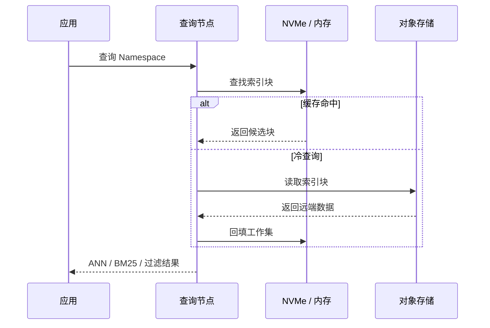
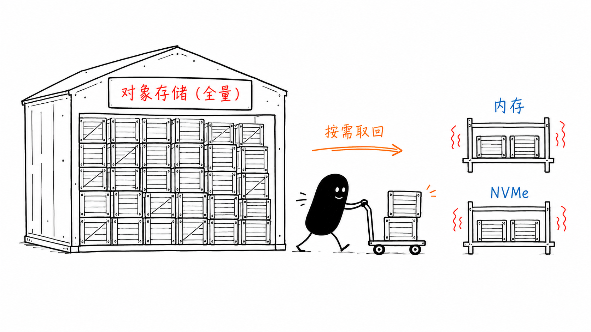
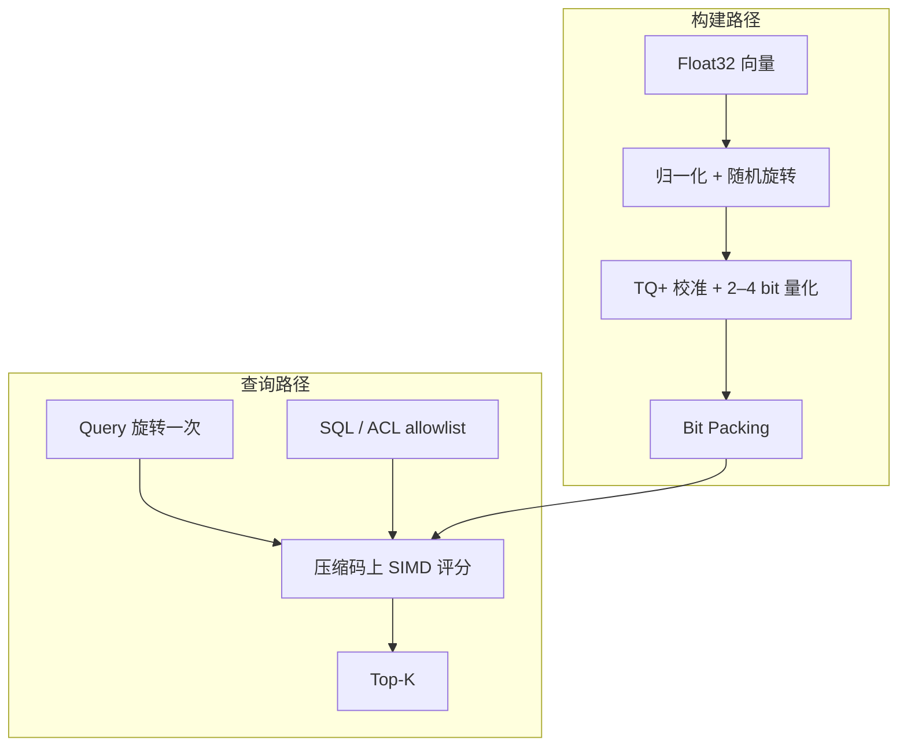
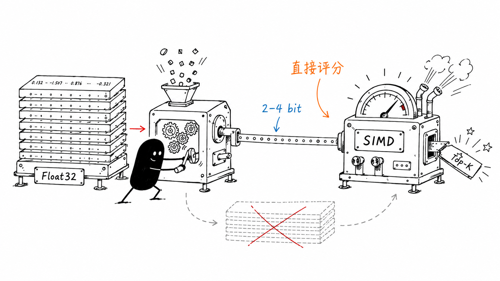

最近在做一个内容创作相关的检索模块。拿小说 Agent 来说，世界观、角色卡、章节和场景记忆会随着写作不断累积，它们都需要一套能长期工作的检索基建。

刚开始我几乎没怎么犹豫，还是沿用以前的习惯，先用 Qdrant 把功能搭起来。它足够成熟，我也熟悉，对当前阶段来说并没有什么明显问题。

但你是知道我这个人的，我已经很久没有认真关注过检索这条技术线了。再次用起来，肯定还是要先研究一下：这几年有没有什么新的技术进步和迭代？继续用 Qdrant，究竟是因为它仍然最合适，还是仅仅因为它是我最熟悉的选择？

于是我把最近的向量数据库、压缩索引和冷热分层方案重新过了一遍，也就有了这篇文章。研究到后面，我发现真正值得提前想清楚的，不是哪款向量库在一张榜单上更快，而是：**当内存、存储或尾延迟开始吃紧时，我们究竟在为哪一段数据路径付费？**

turbopuffer 和 turbovec 恰好给出了两种完全不同的回答。前者把不活跃的数据移出昂贵的内存，后者把热路径中的每条向量压得更小。它们都在减少成本，却没有在解决同一个问题。

> **本文判断**：turbopuffer 改变字节所在的存储层级，turbovec 改变每条向量的表示密度。二者不能用一张性能榜直接排出胜负，也不该因为技术上可用，就提前替换小说 Agent 的现有检索栈。

本文对 turbopuffer 只做官方架构与性能资料的阅读，没有压测其托管服务；对 turbovec 则运行了两次可复现实验，但数据是随机单位向量，机器是共享容器。因此下面能支持的是**架构机制、局部实验和当前产品决策**，不是两款产品的完整 Benchmark。

## 先分清两笔成本

一千万条 768 维 Float32 向量，主体数据就是 30.72 GB，ID、元数据、索引结构、副本和内存对齐还没有计算在内。规模继续增长后，距离计算只是一部分成本；数据位于对象存储、SSD 还是内存，以及一次查询需要读取多少字节，往往会更早影响延迟和价格。

| | turbopuffer | turbovec |
|---|---|---|
| 系统边界 | 通过网络访问的完整搜索数据库 | 嵌入应用进程的本地向量索引 |
| 改变什么 | 全量数据的存储位置与工作集缓存 | 每条向量的表示大小与内存带宽 |
| 主要代价 | 冷查询、远程访问和写入延迟下限 | 召回损失与本地索引生命周期 |
| 本文证据 | 官方架构数据，未做服务实测 | 2、3、4 bit 本地实验 |


turbopuffer 动的是**位置**：全量数据留在便宜的对象存储，活跃工作集进入 NVMe 和内存。turbovec 动的是**密度**：热路径中的 Float32 被压成 2–4 bit，并直接在压缩码上评分。这两个杠杆彼此独立，甚至可能在同一套分层系统中同时出现。

## turbopuffer：为冷数据保留一条远程路径

按照 [turbopuffer 的架构文档](https://turbopuffer.com/docs/architecture)，对象存储是持久层，NVMe 与内存只承担缓存。每个 Namespace 在对象存储中拥有独立前缀；首次查询需要取回远端索引块，后续请求则尽量路由到已经持有缓存的查询节点。



这张时序图解释了官方性能数字为什么会相差悬殊：一百万文档的 Namespace 首次查询 p50 为 874 ms，缓存后降到 14 ms。差距不是需要藏起来的异常，而是“对象存储作为真相源”的直接价格。预热可以降低用户撞上冷查询的概率，却没有让远程 I/O 消失；只拿热缓存 p50 代表整个系统，会把最重要的架构代价抹掉。



写入路径服从相同的选择。成功返回代表 WAL 已持久化到对象存储，索引随后异步构建；尚未索引的近期数据仍可通过较慢的穷举参与查询。官方文档说明强一致读取默认开启，而 [Tradeoffs](https://turbopuffer.com/docs/tradeoffs) 给出约 10 ms 的一致性延迟下限，并提醒极端尾延迟仍可能遇到数百毫秒的冷查询。

它采用质心与聚类式索引，没有把 HNSW 图直接搬到对象存储，也是同一约束的结果。[官方架构说明](https://turbopuffer.com/docs/architecture)指出，基于 SPFresh 的质心索引可以用较少的对象存储往返批量读取候选簇；HNSW 一类图遍历包含更多不规则随机访问，在远程存储上会放大 I/O 成本。这里优先优化的是**读哪些块、需要几次往返**，单次内积速度排在其后。

## turbovec：让热数据少搬一些字节

[turbovec 0.8.0](https://github.com/RyanCodrai/turbovec/releases/tag/v0.8.0) 是 Rust 编写并提供 Python Binding 的本地索引。应用仍然负责文档、权限与持久化边界，turbovec 保存压缩向量并返回 Top-K，主要减少热数据在内存层级中移动时的字节数。

它实现的 [TurboQuant](https://arxiv.org/abs/2504.19874) 先归一化向量，再施加共享的随机正交旋转，让坐标分布更适合标量量化。turbovec 的 [TQ+ 实现](https://github.com/RyanCodrai/turbovec/blob/v0.8.0/README.md#how-it-works)会在首次写入时校准各维经验分布，然后使用 Lloyd-Max 量化与 Bit Packing 将坐标压到 2、3 或 4 bit。



这条流水线最关键的地方不在“压缩”本身，而在**数据库向量不会在搜索时逐条恢复为 Float32**。Query 只旋转一次，NEON、AVX-512 或 AVX2 kernel 直接在量化码上查表评分；否则压缩省下的带宽会在解码阶段重新付出。



[过滤也进入同一条计算路径](https://github.com/RyanCodrai/turbovec/blob/v0.8.0/README.md#hybrid-retrieval-filtered-search)。应用可以先用 SQL、租户权限或时间窗口生成 allowlist，turbovec 再以 32 条向量为一个 Block 跳过完全不相关的块。这样得到的是允许集合内部的 Top-K，不需要先过量召回再后过滤；但它也说明 turbovec 不是文档数据库，过滤集合及其生命周期仍由外部系统负责。

## 真正稳定的是空间—召回交换

本地实验只尝试证伪一个窄问题：低 bit 索引获得压缩率时，能否仍然保留足够多的精确近邻。环境为 turbovec 0.8.0、NumPy 2.5.1、Python 3.12.13；使用固定随机种子生成 50,000 条 384 维随机单位向量和 200 条独立 Query，以 Float32 精确内积的 Top-10 作为 Ground Truth。OpenBLAS、OMP、MKL 与 Rayon 均固定为单线程，每组预热后重复七次取中位数。

[实验脚本](https://github.com/littlewwwhite/littlewwwhite.github.io/blob/main/content/posts/260726/benchmark_turbovec.py)、[第一次原始结果](benchmark-results.json)、[复跑结果](benchmark-results-rerun.json)和[绘图脚本](plot_tradeoff.py)都保留在 Page Bundle 中。图表可由原始 JSON 直接重建：

```bash
python plot_tradeoff.py
```


| 表示 | 落盘大小 | 相对 Float32 | Recall@10 | Top-1 命中 | 200 条查询：首次 / 复跑 |
|---|---:|---:|---:|---:|---:|
| Float32 精确搜索 | 73.242 MiB | 1× | 1.0000 | 1.0000 | 171.9 / 86.5 ms |
| turbovec 2 bit | 4.771 MiB | 15.35× | 0.4755 | 0.3000 | 34.0 / 33.2 ms |
| turbovec 3 bit | 7.060 MiB | 10.37× | 0.7010 | 0.5500 | 60.7 / 55.8 ms |
| turbovec 4 bit | 9.349 MiB | 7.83× | 0.8335 | 0.7000 | 60.9 / 59.0 ms |

两次运行中，索引大小、Recall@10 和 Top-1 命中完全一致。2 bit 接近理论上的 16 倍压缩，但只保留了 47.55% 的 Top-10；4 bit 仍有 7.83 倍压缩，Recall@10 提高到 0.8335。**从 3 bit 增加到 4 bit，多占 2.289 MiB，却换回 13.25 个百分点的 Recall。** 这才是当前实验能够稳定支持的判断：bit width 必须与数据质量损失一起选择。

延迟没有同样稳定。使用相同版本、数据与线程设置复跑时，Float32 精确搜索从 171.9 ms 变成 86.5 ms，而压缩索引的大小和召回没有变化。这说明共享容器里的绝对速度受 CPU 调度和底层资源影响，不能据此宣称 turbovec “快 2.8 倍”，也不能把 3 bit 与 4 bit 的几毫秒差异解释成稳定优势。

> **结论边界**：随机单位向量是可控的合成分布，不是小说 Embedding；共享容器也不是目标硬件。这组实验决定的是下一步该测什么，不能直接决定是否迁移。

turbovec 0.8.0 的 README 在 [OpenAI Embedding 与 GloVe](https://github.com/RyanCodrai/turbovec/blob/v0.8.0/README.md#recall) 上报告了不同的召回曲线，也说明量化结论属于具体数据分布。速度比较需要回到目标硬件，质量比较则需要一套真实小说 Query。

## 回到小说 Agent：先保留现有检索栈

小说 Agent 的实际需求是按租户过滤世界观、角色卡、章节和场景记忆，并混合关键词与向量召回；当前运行边界以 Vercel、Supabase 等托管组件为主。turbovec 需要稳定的本地索引生命周期，把它放进短生命周期 Function 会新增加载、同步和并发控制。turbopuffer 的多租户与混合检索边界更接近需求，但现有证据还没有证明 Postgres/Supabase 路径已经受到冷数据或 Namespace 扩张限制。

> **当前决策**：继续使用现有检索栈，先建立可回放的真实查询集。技术组件只有在系统已经支付它所解决的那笔成本时，才值得引入。

下一步保存真实 Query、过滤条件、候选 Chunk 和最终采用结果，并观察 Recall、p95 与 p99。之后按瓶颈分叉：

- 如果问题集中在大量冷租户与长期存储成本，用同一批 Query 测 turbopuffer 的首次访问、缓存命中和淘汰后尾延迟；
- 如果系统转向稳定本地进程，并出现明确的内存容量或带宽瓶颈，再在真实 Embedding 上比较 turbovec 的 2、3、4 bit 与 Float32/PQ；
- 如果两类成本都没有出现，就不迁移。提前引入第二套检索系统，只是在预付复杂度。

turbopuffer 和 turbovec 都有成立的工程逻辑。对当前小说 Agent，更重要的不是提前选中其中一个，而是先让真实查询暴露：**系统究竟在搬太远的数据，还是在搬太多的字节。**
