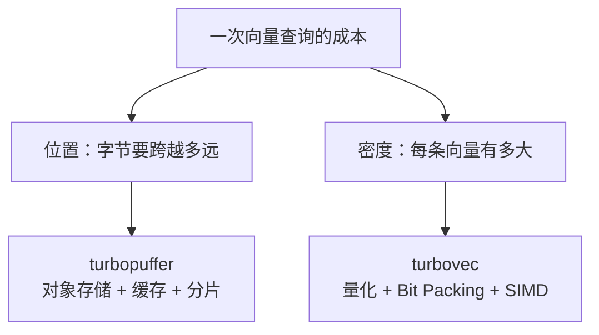
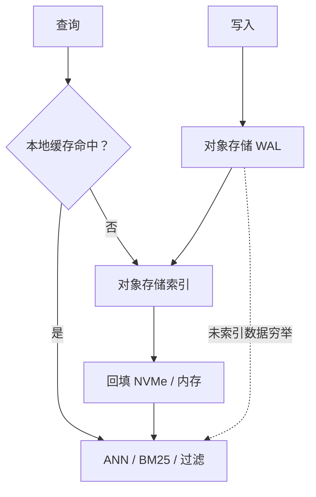
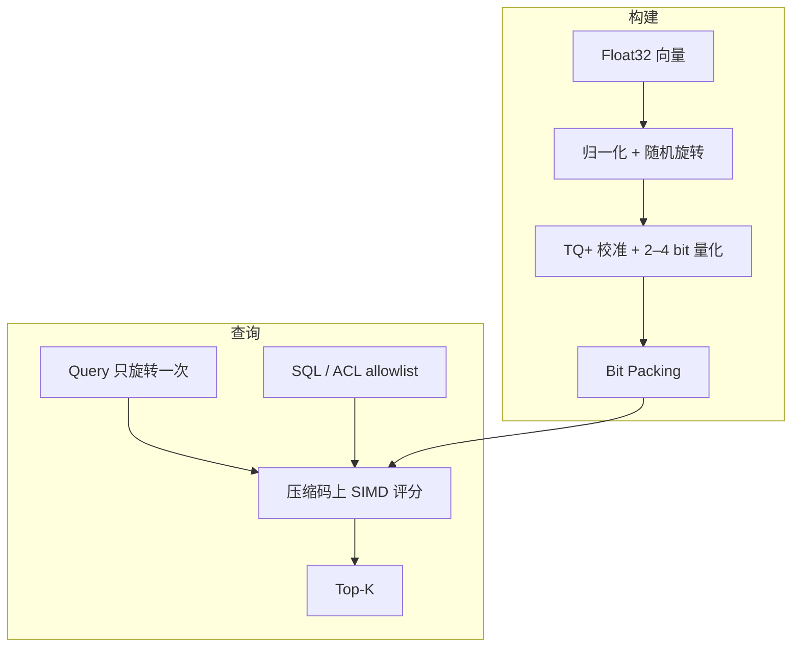
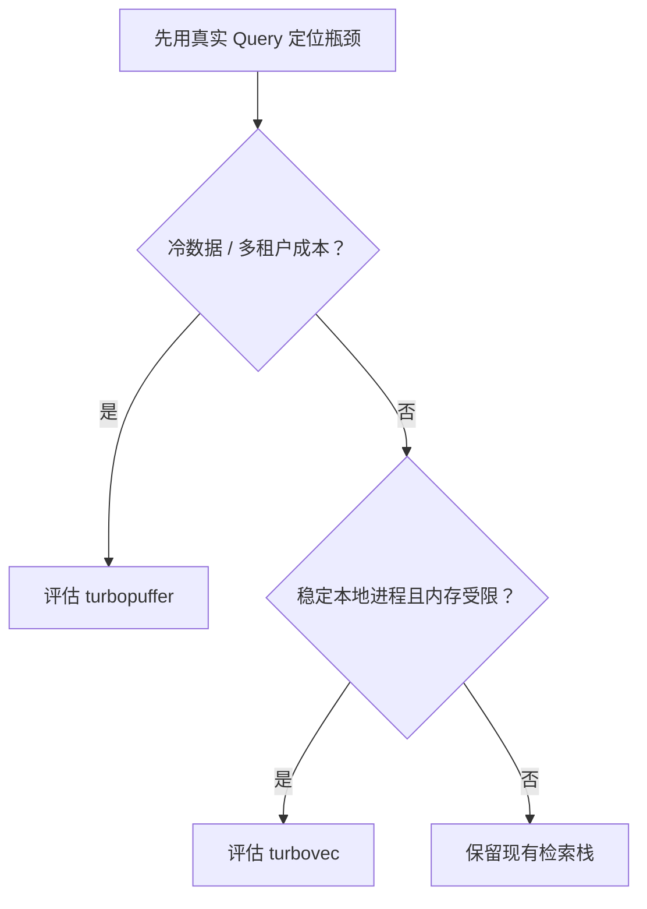

同一批 50,000 条、384 维随机单位向量，Float32 原始矩阵占 73.24 MiB；写进 4 bit turbovec 后，索引只剩 9.35 MiB，但 Recall@10 也降到了 0.8335。另一边，turbopuffer 官方架构文档里，一百万文档的 Namespace 首次查询 p50 是 874 ms，缓存后只有 14 ms。

这两组数字看起来都在谈向量检索性能，实际暴露的是两笔完全不同的账：一条向量本身有多少字节，以及查询前要从多远的地方把这些字节搬过来。

我在给网页端小说 Agent 设计长期记忆时，曾把 turbopuffer 和 turbovec 放进同一张候选表，准备比较 QPS、Recall 和成本。表做到一半就卡住了：前者是一个通过网络访问的完整搜索数据库，后者是嵌入应用进程的本地压缩索引。很多格子不是缺数据，而是问题本身问错了。

后来我把产品对比放到一边，直接去读它们的数据路径，并用 turbovec 0.8.0 跑了一轮实验。真正有用的比较不是“谁更快”，而是它们分别消灭了哪一段字节搬运。

## 检索成本先是一条字节路径

假设有一千万条 768 维 Float32 向量，光主体数据就有 30.72 GB。ID、元数据、索引结构、多副本和内存对齐还没算进去。数据规模继续增长后，一次内积需要多少乘加已经不是唯一问题；向量放在对象存储、SSD 还是内存，以及每次要读多少字节，往往更先决定延迟和成本。

turbopuffer 动的是位置：让全量数据待在便宜的对象存储，只把活跃工作集逐步拉进 NVMe 和内存。turbovec 动的是密度：让已经处于热路径里的向量不再以 Float32 存在，并直接在压缩码上评分。

这个拆分一旦成立，两款产品就不再是竞争关系。它们位于同一条数据路径的不同位置，也因此承担完全不同的代价。

## turbopuffer 用冷启动换低存储成本

turbopuffer 把对象存储当成数据库的持久真相源，SSD 和内存只是缓存。每个 Namespace 在对象存储中拥有独立前缀，查询节点可以服务任意 Namespace，但会尽量把后续请求路由回已经持有缓存的节点。它同时提供向量、BM25、过滤、聚合和混合检索，所以更接近一个完整的搜索数据库，而不是单独的 ANN 库。

874 ms 和 14 ms 的差距不是一个需要藏起来的异常，恰好是这套设计的价格。冷 Namespace 第一次查询要直接读取对象存储，热起来后才接近本地搜索。它省下的是长期占用昂贵存储的钱，并没有让远程 I/O 凭空消失。

写入也遵循同一套逻辑。数据先进入对象存储 WAL，持久化后即可返回；后台异步构建索引。在这段间隙里，新数据仍能被查到，只是需要对未索引部分做较慢的穷举。对一个多租户产品来说，这种语义很实用，但它也意味着强一致读取、冷启动和尾延迟必须进入容量设计。

它没有把 HNSW 当成唯一答案也与这条路径有关。图遍历包含大量不规则随机访问，底层一旦跨越对象存储和 SSD，这种访问模式会迅速放大 I/O 成本。turbopuffer 公开的 SPFresh 与 ANN v3 设计更偏向质心、聚类和分层读取，再配合二值量化与全精度回查；优化顺序始终是先减少读什么、从哪里读，再讨论单次距离计算。

## 热数据也没必要保持 Float32

turbopuffer 解决了冷数据放在哪里，仍然没有消除工作集进入内存后的带宽压力。turbovec 从这里接手：它是 Rust 编写、带 Python Binding 的本地索引，应用负责文档、权限和生命周期，它只负责把向量压缩后排出 Top-K。

TurboQuant 先将向量拆成长度和方向，再对方向施加共享的随机正交旋转。旋转不会破坏内积关系，却会把各维坐标变成更容易预测和量化的分布。turbovec 随后用 Lloyd-Max 标量量化把坐标映射到 2、3 或 4 bit，紧凑打包，并为首次写入的数据做一次 TQ+ 校准。

最重要的工程细节是：搜索时不会逐条恢复 Float32。Query 只旋转一次，NEON、AVX2 或 AVX-512 kernel 直接查量化码的得分表。否则压缩省下来的内存带宽，会在解码阶段原样花回去。

allowlist 也被压进了同一条计算路径。应用可以先用 SQL、租户权限或时间窗口得到允许的 ID，turbovec 再以 32 条向量为一个 Block 跳过完全不相关的块。这比先取一大批结果再后过滤更干净，因为后过滤既浪费计算，也可能把真正需要的 Top-K 挤出候选集。

## 压缩倍数必须和召回率一起读

只看理论值，384 维向量从 Float32 压到 2 bit，主体数据会从每条 1,536 bytes 变成 96 bytes，正好 16 倍。这个数字太漂亮，很容易让人直接把 2 bit 当成答案。我真正跑完实验后，判断变了。

实验使用 turbovec 0.8.0、NumPy 2.5.1 和固定随机种子 `20260727`。数据库包含 50,000 条随机单位向量，另生成 200 条独立 Query，维度为 384，取 Top-10；Float32 精确内积作为 Ground Truth。为了减少线程调度噪声，我把 OpenBLAS、OMP、MKL 和 Rayon 都固定为单线程，每组搜索预热后重复七次取中位数。

第一遍甚至没跑到结果：`index.write()` 不接受 `pathlib.Path`，必须显式转成 `str`。这只是一个小坑，却也解释了为什么我把[完整脚本](https://github.com/littlewwwhite/littlewwwhite.github.io/blob/main/content/posts/260726/benchmark_turbovec.py)和[原始结果](https://github.com/littlewwwhite/littlewwwhite.github.io/blob/main/content/posts/260726/benchmark-results.json)一起放进仓库，而不是只留一张看起来很确定的表。

| 表示 | 落盘大小 | 相对 Float32 | Recall@10 | Top-1 命中 | 200 条查询 |
|---|---:|---:|---:|---:|---:|
| Float32 精确搜索 | 73.242 MiB | 1× | 1.0000 | 1.0000 | 171.893 ms |
| turbovec 2 bit | 4.771 MiB | 15.35× | 0.4755 | 0.3000 | 33.983 ms |
| turbovec 3 bit | 7.060 MiB | 10.37× | 0.7010 | 0.5500 | 60.661 ms |
| turbovec 4 bit | 9.349 MiB | 7.83× | 0.8335 | 0.7000 | 60.903 ms |

2 bit 确实接近 16 倍压缩，查询也最快，但它只保留了不到一半的 Top-10。4 bit 仍然省下接近八倍空间，Recall@10 提高到 0.8335。更让我意外的是，3 bit 和 4 bit 在这台机器上都约为 61 ms，后者没有付出可见的查询时间，却多拿回 13.25 个百分点的召回；在这组条件下，3 bit 反而显得尴尬。

这组数字不能被改写成“turbovec 比 Float32 快 2.8 倍”。随机单位向量的近邻得分非常接近，是偏难的量化场景；共享容器的 CPU 也不能代表 Apple M 系列或生产服务器。它只验证了一件事：**压缩率不是独立指标，必须和 bit width、数据分布、维度、硬件以及 Recall@K 一起读。** 项目 README 在真实 OpenAI Embedding 和 GloVe 数据上的结果会明显不同，这不矛盾，反而说明数据集就是结论的一部分。

## 两套系统必须接受不同的问题

实验暴露出旧稿里另一处空洞：我列了一长串“应该测什么”，却没有说明每项测试在证伪什么。一个有效的 Benchmark 不追求指标齐全，它先找到产品最昂贵的承诺，然后设计最短的失败路径。

测 turbopuffer 时，我会固定同一批文档、Query、过滤条件和 Top-K，让同一个 Namespace 依次处于首次访问、缓存命中和缓存淘汰后三种状态，记录 p50、p95、p99 与 Recall。这样先回答对象存储换缓存的真实代价，再根据异常继续追查过滤选择率、Namespace 大小和分片。写入可见性属于另一条链路，应单独测量从写入返回到普通读取、强一致读取分别可见的时间，不能和搜索吞吐揉成一个平均数。

测 turbovec 时，数据集、距离度量、Query、Top-K、线程数和硬件必须完全固定，只改变 2、3、4 bit，并同时保留 Float32 与 PQ 基线。主曲线先回答“每省一倍内存丢多少召回”；只有出现反常点，再向下检查 TQ+ 首批校准规模、allowlist 选择率、持久化加载以及增删后的性能。实验应该像调试树一样逐层分叉，而不是一开始就摆出二十个互不相干的指标。

## 我的小说 Agent 现在不该急着换

把这套框架放回我的网页端小说 Agent，结论不是立刻接入其中一个。现阶段的真实需求是按租户过滤世界观、角色卡、章节和场景记忆，同时混合关键词与向量召回；运行环境又以 Vercel、Supabase 这类托管组件为主。turbovec 需要稳定的本地索引生命周期，直接塞进短生命周期 Function 会额外制造加载、同步和并发问题。turbopuffer 的产品边界更匹配，但在检索规模和尾延迟尚未成为瓶颈前，引入第二套搜索系统只是在预付复杂度。

所以当前选择是保留已有的 Postgres/Supabase 检索路径，先建立一组来自真实小说的查询集。每次检索保存用户最终采用的 Chunk，形成可以回放的 Recall 与排序判断；再把 Query 分成冷租户、热租户和强过滤三组，记录 p95、p99。只有当数据证明成本来自冷数据与多租户扩张时，才评估 turbopuffer；只有出现稳定进程、私有部署或明确的内存带宽瓶颈时，才评估 turbovec。

这比“云端选 turbopuffer，本地选 turbovec”多了一层约束：如果系统还没有付出那笔成本，就不要为了可能出现的未来问题提前购买一种优化。

## 向量检索最终比拼的是整条数据流

turbopuffer 和 turbovec 最终可能出现在同一套系统里：冷数据留在对象存储，活跃索引进入 SSD，更热的候选进入内存，每一层再采用与延迟预算匹配的量化精度。但这种组合不是架构终点，只是数据规模逼迫系统分层后的自然结果。

向量检索不是在挑一个更快的 ANN 名字，而是在决定一次查询要搬多少字节、搬多远，以及愿意用多少召回换掉它们。组件只有消灭你正在支付的那笔字节账，才算优化。

## 延伸阅读

- [turbopuffer Introduction](https://turbopuffer.com/docs/index)
- [turbopuffer Architecture](https://turbopuffer.com/docs/architecture)
- [turbopuffer Tradeoffs](https://turbopuffer.com/docs/tradeoffs)
- [turbopuffer ANN v3](https://turbopuffer.com/blog/ann-v3)
- [turbovec](https://github.com/RyanCodrai/turbovec)
- [TurboQuant: Online Vector Quantization with Near-optimal Distortion Rate](https://arxiv.org/abs/2504.19874)
- [SPFresh: Incremental In-Place Update for Billion-Scale Vector Search](https://dl.acm.org/doi/10.1145/3545008.3535058)
