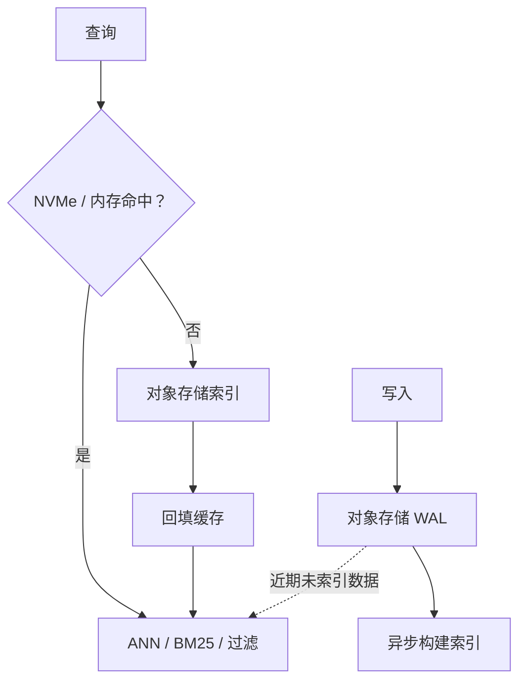
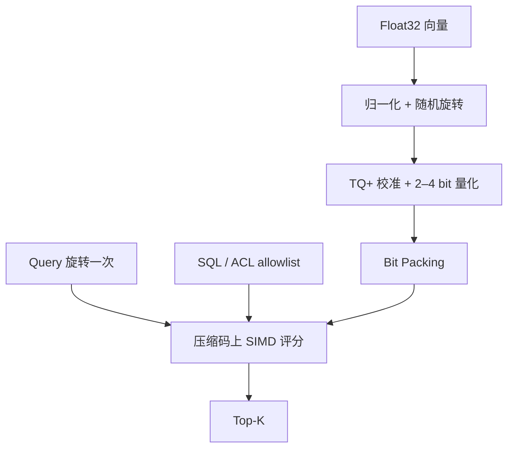

turbopuffer 和 turbovec 都在做向量检索，却不适合放进同一张性能榜。turbopuffer 官方文档给出的例子是：一百万文档的 Namespace 首次查询 p50 为 874 ms，缓存后降到 14 ms；在本地运行 turbovec 0.8.0 时，50,000 条 384 维 Float32 向量从 73.242 MiB 压到 4 bit 索引后只剩 9.349 MiB，但 Recall@10 也降到 0.8335。前一组数字描述数据离 CPU 有多远，后一组数字描述每条向量占多少字节。它们无法互相证明谁更快，却能把向量检索的两类成本分开。

这里的证据也有明确边界：turbopuffer 部分来自官方架构与性能说明，未直接压测其托管服务；turbovec 部分来自两次可复现的本地实验，但使用的是合成数据和共享容器。下面讨论的是架构机制、局部实验和当前产品决策，不是两款产品的完整 Benchmark。

## 先分清两笔成本

一千万条 768 维 Float32 向量，主体数据就有 30.72 GB，ID、元数据、索引结构、副本和内存对齐还没有计算在内。规模继续增长后，距离计算只是一部分成本；数据位于对象存储、SSD 还是内存，以及一次查询需要读取多少字节，会更早影响延迟和价格。

| | turbopuffer | turbovec |
|---|---|---|
| 系统边界 | 通过网络访问的完整搜索数据库 | 嵌入应用进程的本地向量索引 |
| 改变的成本 | 全量数据的存储位置与工作集缓存 | 每条向量的表示大小与内存带宽 |
| 主要代价 | 冷查询、远程访问和写入延迟下限 | 召回损失与本地索引生命周期 |
| 本文证据 | 官方架构数据，未做服务实测 | 2、3、4 bit 本地实验 |

turbopuffer 改变“字节放在哪里”：全量数据留在便宜的对象存储，活跃工作集进入 NVMe 和内存。turbovec 改变“每条向量有多大”：热路径中的 Float32 被压成 2–4 bit，并直接在压缩码上评分。这两个杠杆彼此独立，也可能在同一套分层系统里同时出现。

## turbopuffer：用冷查询换长期驻留成本

按照 [turbopuffer 的架构文档](https://turbopuffer.com/docs/architecture)，对象存储是持久层，NVMe 与内存只承担缓存。每个 Namespace 在对象存储中拥有独立前缀；首次查询直接读取对象存储，后续请求尽量回到已经持有缓存的查询节点。文档中一百万文档的首次查询与缓存查询因此出现 874 ms 和 14 ms 的 p50 差距，直接反映了这套存储选择的代价。

写入路径也服从相同的设计。成功返回代表 WAL 已持久化到对象存储，索引随后异步构建；尚未索引的近期数据仍可通过较慢的穷举参与查询。官方文档说明强一致读取默认开启，而 [Tradeoffs](https://turbopuffer.com/docs/tradeoffs) 进一步给出约 10 ms 的一致性延迟下限，并提醒极端尾延迟仍可能遇到数百毫秒的冷查询。

这种架构适合大量 Namespace 和天然按租户分区的数据，因为冷租户不必长期占用高价内存。代价也必须按同一条因果链理解：预热可以降低用户撞上冷查询的概率，却没有消除对象存储访问；切换到最终一致读取可以绕开部分延迟下限，却改变了读取语义。不能只拿热缓存 p50 代表整个系统。

它采用质心与聚类式索引，没有把图索引直接搬到对象存储，也是同一约束的结果。[官方架构说明](https://turbopuffer.com/docs/architecture)指出，基于 SPFresh 的质心索引可以用较少的对象存储往返批量读取候选簇；HNSW 一类图遍历包含更多不规则随机访问，在远程存储上会放大 I/O 成本。这里优先优化的是“读哪些块、需要几次往返”，单次内积速度排在其后。

## turbovec：在压缩码上完成评分

[turbovec 0.8.0](https://github.com/RyanCodrai/turbovec/releases/tag/v0.8.0) 是 Rust 编写并提供 Python Binding 的本地索引。应用仍然负责文档、权限与持久化边界，turbovec 负责保存压缩向量并返回 Top-K，主要减少热数据在内存层级中移动时的字节数。

它所实现的 [TurboQuant](https://arxiv.org/abs/2504.19874) 先归一化向量，再施加共享的随机正交旋转，让坐标分布更容易被标量量化器处理。turbovec 的 [TQ+ 实现](https://github.com/RyanCodrai/turbovec/blob/v0.8.0/README.md#how-it-works)会在首次写入时校准各维经验分布，然后使用 Lloyd-Max 量化和 Bit Packing 将坐标压到 2、3 或 4 bit。

这套压缩成立的关键在查询路径。[0.8.0 对应版本的实现说明](https://github.com/RyanCodrai/turbovec/blob/v0.8.0/README.md#how-it-works)显示，数据库向量不会在搜索时逐条恢复为 Float32；Query 只旋转一次，NEON、AVX-512 或 AVX2 kernel 直接在量化码上查表评分。否则压缩省下的带宽会在解码阶段重新付出。

[过滤也进入同一条计算路径](https://github.com/RyanCodrai/turbovec/blob/v0.8.0/README.md#hybrid-retrieval-filtered-search)。应用可以先用 SQL、租户权限或时间窗口生成 allowlist，turbovec 再以 32 条向量为一个 Block 跳过完全不相关的块。这样得到的是允许集合内部的 Top-K，不需要先过量召回再后过滤；但它也说明 turbovec 不是文档数据库，过滤集合及其生命周期仍由外部系统负责。

## 实验只回答空间与召回的交换

本次实验要证伪的问题很窄：低 bit 索引在获得压缩率时，是否仍能保留足够多的精确近邻。环境为 turbovec 0.8.0、NumPy 2.5.1、Python 3.12.13；使用固定随机种子生成 50,000 条 384 维随机单位向量和 200 条独立 Query，以 Float32 精确内积的 Top-10 作为 Ground Truth。OpenBLAS、OMP、MKL 与 Rayon 都固定为单线程，每组预热后重复七次取中位数。

[实验脚本](https://github.com/littlewwwhite/littlewwwhite.github.io/blob/main/content/posts/260726/benchmark_turbovec.py)、[第一次原始结果](https://github.com/littlewwwhite/littlewwwhite.github.io/blob/main/content/posts/260726/benchmark-results.json)和[复跑结果](https://github.com/littlewwwhite/littlewwwhite.github.io/blob/main/content/posts/260726/benchmark-results-rerun.json)均保留在 Page Bundle 中。

| 表示 | 落盘大小 | 相对 Float32 | Recall@10 | Top-1 命中 | 200 条查询：首次 / 复跑 |
|---|---:|---:|---:|---:|---:|
| Float32 精确搜索 | 73.242 MiB | 1× | 1.0000 | 1.0000 | 171.9 / 86.5 ms |
| turbovec 2 bit | 4.771 MiB | 15.35× | 0.4755 | 0.3000 | 34.0 / 33.2 ms |
| turbovec 3 bit | 7.060 MiB | 10.37× | 0.7010 | 0.5500 | 60.7 / 55.8 ms |
| turbovec 4 bit | 9.349 MiB | 7.83× | 0.8335 | 0.7000 | 60.9 / 59.0 ms |

两次运行中，索引大小、Recall@10 和 Top-1 命中完全一致。2 bit 接近理论上的 16 倍压缩，但只保留了 47.55% 的 Top-10；4 bit 仍有 7.83 倍压缩，Recall@10 提高到 0.8335。从 3 bit 增加到 4 bit，多占 2.289 MiB，却换回 13.25 个百分点的 Recall。实验能稳定支持的判断，是 bit width 必须与数据质量损失一起选择。

延迟则不适合下同样强度的结论。使用相同版本、数据与线程设置复跑时，Float32 精确搜索从 171.9 ms 变成 86.5 ms，而压缩索引的大小和召回没有变化。这足以说明共享容器里的绝对速度受 CPU 调度和底层资源影响，不能据此宣称 turbovec “快 2.8 倍”，也不能把 3 bit 与 4 bit 的几毫秒差异解释成稳定优势。速度比较必须回到目标硬件，并使用能代表业务的数据和并发。

随机单位向量本身也是边界。它提供了可控的合成分布，却不代表小说 Embedding。turbovec 0.8.0 的 README 在 [OpenAI Embedding 与 GloVe](https://github.com/RyanCodrai/turbovec/blob/v0.8.0/README.md#recall) 上报告了不同的召回曲线，说明量化结论属于具体数据集，不能脱离分布外推。

## 当前的小说 Agent 不需要迁移

网页端小说 Agent 的实际需求是按租户过滤世界观、角色卡、章节和场景记忆，并混合关键词与向量召回；当前运行边界以 Vercel、Supabase 等托管组件为主。turbovec 需要稳定的本地索引生命周期，把它放进短生命周期 Function 会新增加载、同步和并发控制。turbopuffer 的多租户与混合检索边界更接近需求，但现有证据还没有证明 Postgres/Supabase 路径已受冷数据或 Namespace 扩张限制。

更稳妥的动作是先建立可回放的真实查询集：保存 Query、过滤条件、候选 Chunk 和最终采用结果，再观察召回、p95 与 p99。若问题集中在大量冷租户和存储成本，才用同一批 Query 对 turbopuffer 测首次访问、缓存命中与淘汰后的尾延迟；若系统转向稳定本地进程并出现明确的内存带宽瓶颈，才在真实 Embedding 上比较 turbovec 的 2、3、4 bit 与 Float32/PQ。

在这些证据出现之前，继续使用现有检索栈。turbopuffer 和 turbovec 解决的问题都成立，但当前系统还没有证明自己正在支付对应的成本。
