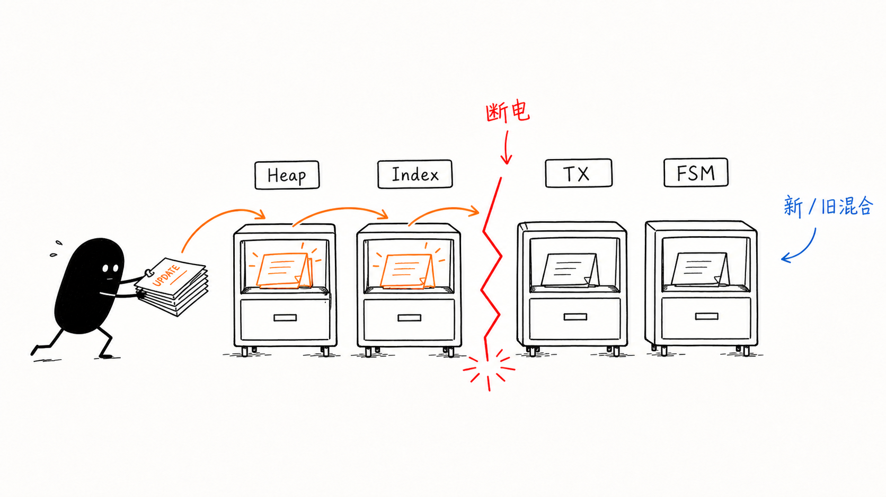
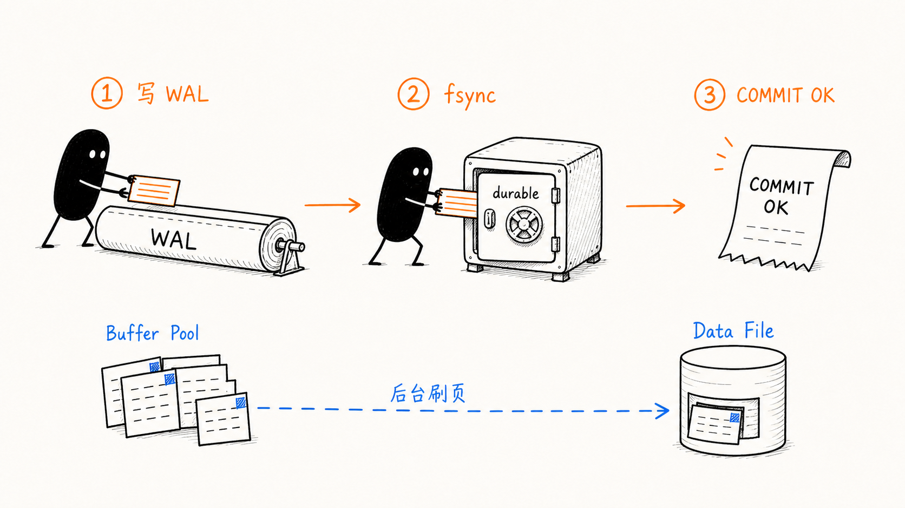
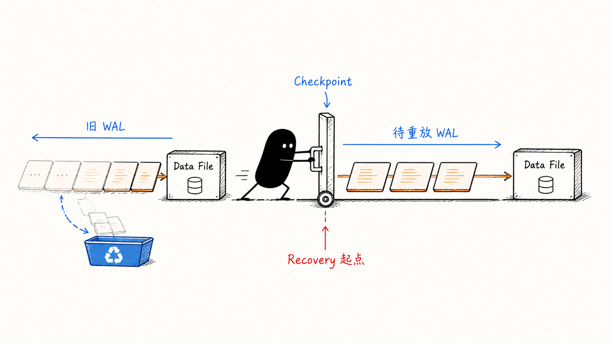

<!--
input: PostgreSQL 与 SQLite 官方 WAL 文档、SQLite 3.53.2 本地实验、WAL 原理讨论和小黑视觉参考。
output: 解释 WAL 的提交顺序、性能来源、checkpoint 边界及其在 durable workflow 中适用条件的技术文章。
pos: content/posts/260818 的主文章入口。
-->

最近看了一篇推，主要讲的是 PostgreSQL 执行一条 `UPDATE` 时，需要持久化的对象通常不止一行记录。heap page、相关索引页、事务状态和其他元数据可能一起变化；机器在写回过程中断电，磁盘就会留下部分新 page 和部分旧 page。数据库仍然要给出一个确定结果：这笔事务已经提交，或者恢复后继续把它完成。

以余额更新为例，假设 `balance` 上还有索引：

```sql
UPDATE users
SET balance = 50
WHERE id = 42;
```

直接写回数据文件，大致会面对这样的持久化序列：

```text
Heap Page          ✓
Balance Index Page ✓
Transaction State  ... 断电
Free Space Map
```

这些位置无法共享一个物理原子写。即使每个 page 都能完整写入，事务级状态仍会停在新旧混合的位置。WAL 把持久化承诺压缩到一条追加路径，让复杂 page 更新离开提交的关键路径。



## WAL 先固定顺序，再承诺提交

[PostgreSQL 对 WAL 的定义](https://www.postgresql.org/docs/current/wal-intro.html)包含一条硬约束：数据文件发生的修改，必须在描述这些修改的 WAL record 进入持久化存储之后才能落盘。默认同步提交路径可以简化为：

```text
UPDATE
  ↓
修改 Buffer Pool 中的 page
  ↓
追加 WAL record 与 commit record
  ↓
flush WAL
  ↓
COMMIT OK
```

客户端收到 `COMMIT OK` 时，数据文件里的 page 仍可能保留旧值。新 page 暂时留在内存，带着 dirty 标记等待后台刷写。此时发生崩溃，恢复进程从 WAL 读取已经提交的修改，将尚未进入数据文件的部分重新应用。PostgreSQL 把这条路径称为 REDO。



这条顺序解决了两个独立问题。commit record 给事务提供清晰边界；write-ahead 约束保证数据页永远不会领先于恢复所需的信息。数据页允许晚写，描述它的 WAL 必须先落盘。

SQLite 的 WAL 模式更容易直接观察。它保留原始数据库文件，把修改追加进独立的 `-wal` 文件；特殊 commit record 进入 WAL 后，事务完成提交，checkpoint 再把修改迁回 `.db`。在 checkpoint 之前，有效数据库状态由 `.db` 和 `-wal` 共同组成。

## 一个 20 行实验的结论：

我在本机用 Python 自带的 `sqlite3` 跑了一个最小实验，底层 SQLite 版本为 3.53.2。实验关闭自动 checkpoint，创建一张表并提交一行数据，然后刻意只复制主数据库文件。这个复制动作是错误示范，目的就是检查 `.db` 单独包含了什么。

```python
import shutil
import sqlite3
import tempfile
from pathlib import Path

root = Path(tempfile.mkdtemp(prefix="wal-lab-"))
db = root / "lab.db"
con = sqlite3.connect(db)

mode = con.execute("PRAGMA journal_mode=WAL").fetchone()[0]
con.execute("PRAGMA wal_autocheckpoint=0")
con.execute("CREATE TABLE ledger(id INTEGER PRIMARY KEY, balance INTEGER)")
con.execute("INSERT INTO ledger VALUES (42, 50)")
con.commit()

wal = root / "lab.db-wal"
print(f"sqlite={sqlite3.sqlite_version} mode={mode}")
print(f"before_checkpoint db={db.stat().st_size} wal={wal.stat().st_size}")

main_only = root / "main-only.db"
shutil.copyfile(db, main_only)
try:
    print(sqlite3.connect(main_only).execute("SELECT * FROM ledger").fetchall())
except sqlite3.Error as exc:
    print(f"main_only_error={exc}")

con.execute("PRAGMA wal_checkpoint(TRUNCATE)")
print(f"after_checkpoint db={db.stat().st_size} wal={wal.stat().st_size}")
print(f"current={con.execute('SELECT balance FROM ledger').fetchone()[0]}")
```

实际输出：

```text
sqlite=3.53.2 mode=wal
before_checkpoint db=4096 wal=12392
main_only_error=no such table: ledger
after_checkpoint db=8192 wal=0
current=50
```

我原本预期 schema 可能已经进入主文件，行数据仍停在 WAL；结果主文件副本连 `ledger` 表都看不到。`CREATE TABLE` 和 `INSERT` 都发生在切换 WAL 模式之后，两次修改都还在 12392 B 的 WAL 中。执行 `TRUNCATE` checkpoint 后，主文件从 4096 B 增长到 8192 B，WAL 归零，余额 50 仍然存在。

[SQLite 官方文档](https://www.sqlite.org/wal.html)把 `-wal` 文件列为数据库持久状态的一部分，也明确警告复制或移动数据库时要带上它。这个实验给了那句话一个可见结果：事务已经 commit，主数据库文件却还没有独立携带最新状态。

实验里保持连接开启同样关键。最后一个连接关闭时，SQLite 通常会自动做一次 checkpoint 并清理 WAL；先关连接再看文件，最有信息量的中间状态就消失了。

## 提交变快依赖更少的同步屏障

直接持久化事务触及的 page，会把 I/O 分散到数据文件的多个位置。WAL 把提交路径集中为顺序追加；数据页刷写可以在后台合并、排序和摊平。[PostgreSQL 文档](https://www.postgresql.org/docs/current/wal-intro.html)给出的性能原因很具体：提交只需要同步 WAL，顺序写的成本也低于刷新许多离散数据页。

SSD 缩小了机械寻道带来的差距，持久化屏障仍然昂贵。WAL 还能让并发事务共享一次同步：

```text
TX1 ─┐
TX2 ─┤
TX3 ─┼── WAL buffer ── fsync
TX4 ─┤
TX5 ─┘
```

这就是 group commit。一次 WAL flush 可以确认多个已经排队的事务，存储设备兑现持久性承诺的次数随之下降。WAL 同时改善可靠性和吞吐，靠的是同一项结构变化：提交路径只保留可顺序写、可重放的最小记录。

## Checkpoint 把恢复起点向前推进

WAL 会增长，dirty page 也要进入正式数据文件。Checkpoint 负责把此前累积的修改写回，并建立新的恢复边界：

```text
Current State = Checkpoint State + WAL after checkpoint
```

在 PostgreSQL 中，checkpoint 保证 heap 和 index 数据文件已经包含边界之前的必要修改；崩溃恢复从 checkpoint 指定的 redo 位置继续。旧 WAL segment 还可能被备份、归档或复制槽占用，只有这些消费者全部越过相应位置后，segment 才能回收。



[PostgreSQL 的 checkpoint 配置文档](https://www.postgresql.org/docs/current/wal-configuration.html)也展示了这项权衡。缩短 checkpoint 间隔通常会减少崩溃后的 REDO 工作量，同时增加 dirty page 刷写频率；开启 `full_page_writes` 后，每次 checkpoint 之后第一次修改 page 还会带来额外 WAL 流量。恢复时间、前台延迟和磁盘占用需要一起调。

SQLite 暴露了另一个实际边界。长读事务会让 checkpoint 无法越过该 reader 的 end mark，WAL 因此持续增长。Checkpoint 属于并发协议的一部分；回收位置必须尊重仍在读取旧版本的参与者。

## WAL 延伸出复制与 CDC，也保留存储层边界

修改已经按顺序记录后，同一份记录可以在另一台机器重新物化。[PostgreSQL standby](https://www.postgresql.org/docs/current/warm-standby.html)持续接收并重放 primary 的 WAL；基础备份配合 WAL archive 可以恢复到指定时间；[logical decoding](https://www.postgresql.org/docs/current/logicaldecoding-explanation.html)把存储层变化解码为 tuple 或 SQL statement 一类应用可消费的数据流。

Event Sourcing 与 WAL 都使用追加记录和重放，二者保存的语义层级不同。Event Sourcing 通常把业务事件作为长期 source of truth；PostgreSQL WAL 服务于存储恢复，超过恢复、归档和复制需求的 segment 会被回收。WAL record 也缺少业务事件需要长期维护的命名、版本和消费契约。

CDC 可以从 WAL 派生可靠变化流。业务事件模型仍要由领域层定义。把两者分开，既能复用数据库提供的顺序与持久性，也能避免让物理存储格式承担长期业务语义。

## Durable Workflow 还要处理日志之外的副作用

WAL 的结构可以迁移到 Agent 长任务或工作流引擎：先保存可重放的 step 状态，再执行后续计算，周期性把历史压成 snapshot。纯计算步骤很适合这套模型，重放同一输入即可得到同一结果。

外部副作用会增加一道约束。假设某一步调用付费图像 API，进程在 provider 已扣费、receipt 尚未写回时崩溃，盲目 replay 可能造成重复计费。安全记录至少要包含：

```text
operation_id: shot-17
state: effect_requested
idempotency_key: run-42-shot-17
```

恢复时根据 provider 的幂等能力和 receipt 决定继续、查询或标记 `ambiguous`。这里无法照搬数据库内部 REDO，因为外部系统不受本地 WAL 协议控制。日志先行只提供可审计顺序；幂等键、确认语义和不确定状态共同决定副作用能否安全恢复。

这次 SQLite 实验让我更确定 WAL 的工程价值落在三个可检查的合同上：哪条记录代表提交，重复应用如何保持安全，历史在哪个边界后可以回收。数据库用 commit record、REDO 和 checkpoint 回答了它们。任何 durable system 想借用这套结构，也要给出同样精确的答案。

## 延伸阅读

- [Write-Ahead Logging — PostgreSQL Documentation](https://www.postgresql.org/docs/current/wal-intro.html)
- [WAL Configuration — PostgreSQL Documentation](https://www.postgresql.org/docs/current/wal-configuration.html)
- [Log-Shipping Standby Servers — PostgreSQL Documentation](https://www.postgresql.org/docs/current/warm-standby.html)
- [Logical Decoding Concepts — PostgreSQL Documentation](https://www.postgresql.org/docs/current/logicaldecoding-explanation.html)
- [Write-Ahead Logging — SQLite Documentation](https://www.sqlite.org/wal.html)
