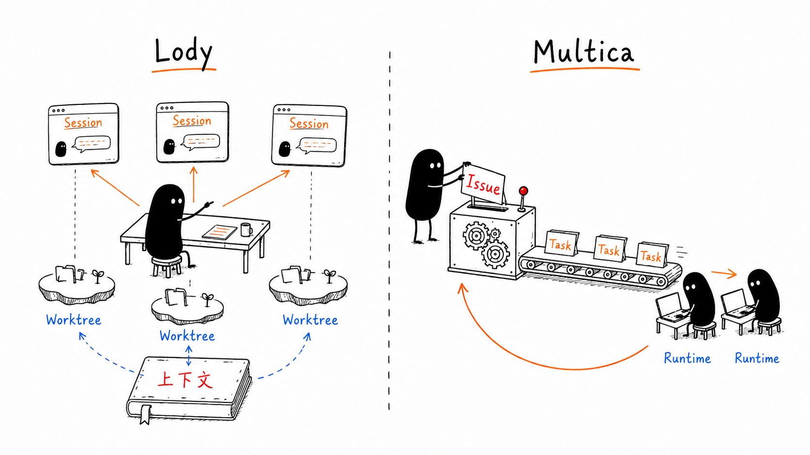
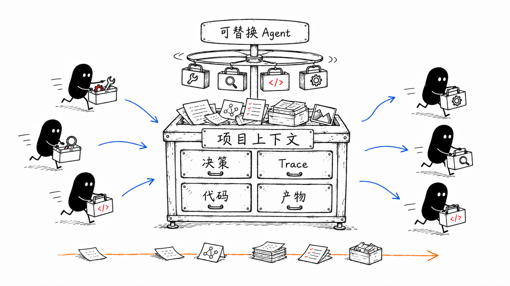
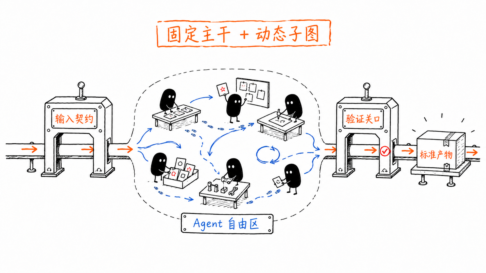
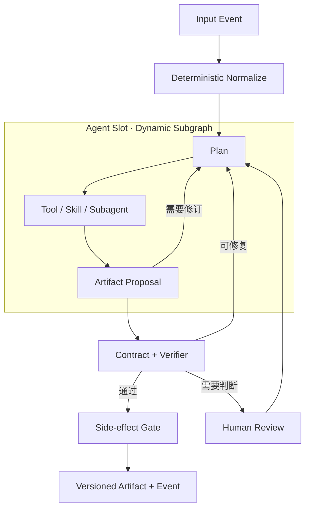
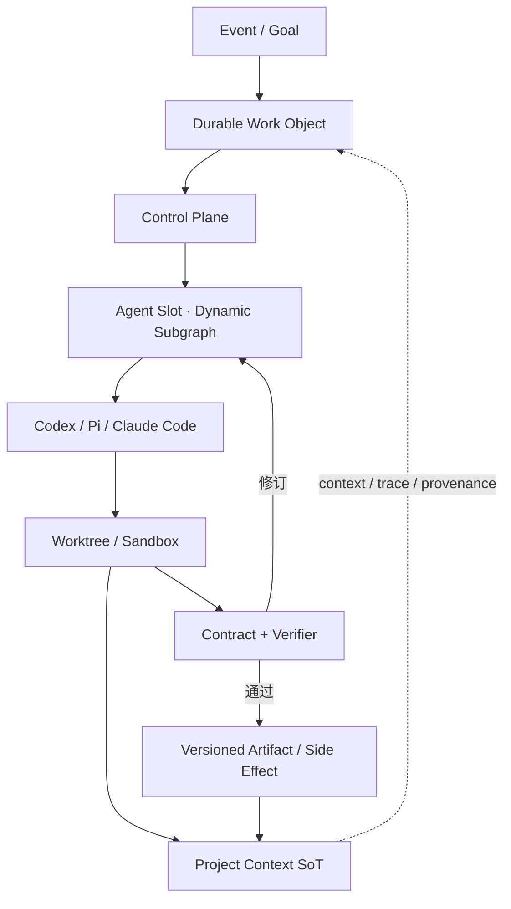

最近我一直在找一类工具：能把 Pi、Codex、Claude Code 放到同一个地方管理。现在开几个终端当然也能工作，可一旦 Agent 分布在不同机器上，同时跑着几个 worktree，还要随时看 trace、diff 和权限请求，终端 tab 很快就会变成一排认不清的标签。

Lody 和 Multica 都在解决这个问题。刚看首页时，它们甚至有点像：都能连接本地 coding agent，都能远程派活，也都有 worktree、执行记录和团队协作。把文档和源码摊开后，我发现两者关心的事情差得很远。

我现在会用一个很简单的问题判断它们：**人离开以后，这项工作停在哪里？**

在 Lody 里，答案通常是某个 Session。你回来后打开它，聊天、分支、diff 和运行现场还连在一起。在 Multica 里，答案通常是某个 Issue。它可能已经跑过几次 Task，换过 Agent，留下了评论、失败记录和待审核结果，工作本身仍挂在同一个 Issue 下。

这次调研基于 2026 年 9 月 1 日的公开文档与源码，核对的仓库版本分别为 Lody `27b5623`、Multica `11bd18a`。我没有把两款产品放到同一批真实项目上压测，所以文中只讨论产品抽象、数据边界和执行模型，不比较延迟和稳定性。

## 关掉所有窗口后，什么应该留下来

讨论 Agent 产品时，我们很容易盯着 Agent 本身：它叫什么，挂了哪些 skills，用哪个模型，能不能带队。可从系统设计看，更要紧的是**哪种对象活得最长**。模型会换，CLI 会升级，某次执行也会失败；总得有一个地方接住目标、讨论、代码变化和后续动作。

Multica 把 Agent 称作 first-class teammate，听起来像一名常驻员工。它的 [Core concepts](https://www.multica.ai/docs/concepts) 写得更具体：Agent 是一份可复用配置，保存名称、instructions、model、skills、Access 和 runtime。只有 assignment、`@mention`、Chat 或 Autopilot 触发后，它才开始执行，并产生一条新的 Task。

Lody 最近也加入了 [Agent Roles](https://lody.ai/docs/agent-roles/)。Role 保存 machine、Agent Config、model、reasoning、permission 和默认 instruction，也可以通过 `@mention` 拉起新会话。Role 平时没有进程在后台运行，也不保存 API key。

因此，两边都有“Agent 身份”，差别落在工作记录上。Lody 让 Session 长期存在，Multica 让 Issue 长期存在。

| 看什么 | Lody | Multica |
|---|---|---|
| 工作主要停在哪里 | Session / conversation | Issue |
| 可复用的执行配置 | Agent Config + Agent Role | Agent |
| 一次执行怎么记录 | Session 中的一轮，或独立子 Session | Task |
| 谁会启动执行 | 人类操作，或另一个 Agent 编排 Session | assignment、`@mention`、Chat、Autopilot |
| 机器怎么接入 | machine 上运行 ACP CLI | daemon 注册 runtime |
| 并发代码怎么隔离 | 通常是一 Session 一 worktree | Task 工作目录；Git 仓库共享 bare clone，再创建 worktree |
| 跨设备状态放在哪里 | 本地副本通过 CRDT 同步，当前依赖托管同步服务 | 服务端记录工作状态，本地机器执行代码 |



这张图已经能解释大部分产品差异。Lody 把人放在工作台前，几个 Agent 会话都看得见，也能随时接手。Multica 更像把一张工作单放进系统，队列找到合适的 runtime，Agent 跑完后再把结果送回原来的工作单。

## Lody 更像一个可以随时接管的工作台

打开一个 Lody Session，你面对的并非只有聊天框。仓库、分支、Agent Config、模型和权限在创建 Session 时就已经确定；主聊天、子聊天、文件预览和 diff 又以 tab 的形式挂在里面。[Sessions 文档](https://lody.ai/docs/session/) 直接把 Session 称作最基础概念，并把它对应到 Claude Code 或 Codex CLI 的一次 conversation。

这种组织方式很符合今天使用 coding agent 的习惯。你先和 Agent 讨论，Agent 修改代码，你在旁边看 diff；做到一半换到手机上检查进度，发现方向偏了就补一句，回来后继续在同一个工作现场里处理。人的位置始终很清楚：启动、观察、纠偏、验收。

并发时，Lody 通常会给每个 Session 准备独立 [worktree](https://lody.ai/docs/worktrees/)，创建 `session/<shortSessionId>` 分支，执行项目级 setup script，再把文件变化同步到界面。Session 归档后，工作目录可以回收，聊天和分支仍保留下来。你可以同时开几个 Agent，又不用担心未提交改动混到一起。

这里有个细节很容易踩错。Codex 和 Claude Code 自带的 conversation fork 只分开聊天历史，两个 fork 继续共用原来的 machine 和 working directory，所以它们能看到彼此的文件变化。想让代码也分开，需要创建新的 worktree Session。Lody 同时提供了聊天分叉和工作目录分叉，按钮看着相近，实际解决的是两件事。

[Local Projects](https://lody.ai/docs/local-project/) 对已有 CLI 用户也很友好。桌面端已经打开过的项目和 Session 在断网后仍能继续使用，重连后再同步；过去直接用 Codex、Claude Code 产生的会话可以导入，Lody 新建的会话也会镜像回对应 CLI。它没有要求你先放弃现有工作习惯，再重新搬进一套系统。

Lody 也开始支持 Agent 管 Agent。[Agent Session Control](https://lody.ai/docs/session-orchestration/) 允许一个 Agent 新建或复用其他 Session，查看状态和有限历史，追加指令、取消执行，再把子任务结果收回来。每个子 Session 有自己的历史和 active turn，也可以并行运行。官方同时给它划了边界：这套能力只读取 Lody 持有的 conversation data，也没有被设计成无限运行的后台 scheduler。

所以，Lody 已经比“几个聊天窗口”多走了一步，但它依然把可见、可接管的 Session 放在中心。对现在的 coding agent 能力来说，这种保守反而很实用。Agent 做得快，人还能看见它在哪里做、改了什么、下一步准备干什么。

## local-first 是 Lody 最值得继续看的部分

我最看重 Lody 的地方，其实不在聊天和 worktree，而在它对项目上下文的判断。2026 年 8 月的 [开源公告](https://lody.ai/blog/lody-is-now-open-source/) 提到，代码通常只保存决定的结果，业务规则、兼容性约束和当时的取舍散落在文档、PR、Issue、会议和 Agent 对话里。Lody 想把这些东西接起来，让团队以后还能回答“当时为什么这样改”。

这个方向已经进入代码。当前仓库的 [workspace dependencies](https://github.com/LodyAI/Lody/blob/27b56232dcf5af64437954dfa914f35a17afa849/pnpm-workspace.yaml) 包含 Loro、Flock、Loro Streams、`loro-repo` 和本地 SQLite 组件；源码里也能看到 Loro 文档传输、合并、离线恢复与冲突测试。CRDT 让不同设备先在本地修改，网络恢复后再合并，而每台设备都保有自己能直接使用的副本。

不过，这件事现在只走了一部分。Lody 在 [README](https://github.com/LodyAI/Lody/blob/27b56232dcf5af64437954dfa914f35a17afa849/README.md) 中明确写着 full local-first 仍在建设；跨设备协作依赖 Lody 托管的同步服务，端到端加密也还在设计。Document、whiteboard、task management 和 plugin 共用一套数据基础，目前更多体现了它要去的方向。



我仍然觉得这个判断很重要。Claude Code、Codex、Pi 以后一定会继续换，今天精心配置的 Agent Role 也可能过时。长期留下来的应该是项目意图、决策、执行痕迹、代码和产物。Lody 现在还没有完整做到，但 CRDT、本地副本和开放实现至少让这条路有了数据层基础。

## Multica 已经开始像一套调度系统

想象另一种使用方式：你把一个 Issue 指派给 Agent，然后合上电脑。过一阵再回来，你关心的是任务有没有排队、哪台机器接走了、执行失败后有没有重试、结果是否已经进入 review。至于中间一共开了几个聊天窗口，重要性已经低了很多。

Multica 的执行路径正是围绕这个场景设计的：

```mermaid
sequenceDiagram
    participant H as Human / Trigger
    participant I as Issue
    participant C as Control Plane
    participant D as Daemon / Runtime
    participant A as Coding Agent

    H->>I: assignment / comment / event
    I->>C: 创建 Task
    C-->>D: 唤醒并等待 claim
    D->>C: claim Task
    D->>A: 启动本地 CLI
    A-->>C: progress / tool log / result
    C-->>I: 写回历史与执行结果
    H->>I: review / follow-up / reassign
```



[Tasks 文档](https://www.multica.ai/docs/tasks) 把 Issue 和 Task 分得很清楚。Issue 保存目标、讨论、负责人和最终状态；Task 记录一次 Agent run。一个 Issue 可以先后交给不同 Agent，也可以失败后重跑。每次执行都会新增 Task，过去的记录继续保留。Task 跑完也不代表工作已经验收，Issue 还可能停在 `in_progress` 或 `in_review`。

它的状态机已经很接近常见的任务队列：先 `queued` 等待机器领取，随后进入 `dispatched` 和 `running`；本地目录正被其他任务占用时，会停在 `waiting_local_directory`；最后进入完成、失败或取消状态。这里的 control plane 负责队列、身份、权限、重试和记录，具体代码仍由本机 CLI 执行。

[Daemon 文档](https://www.multica.ai/docs/daemon-runtimes) 给出的默认值也很具体：daemon 每 15 秒发送一次 heartbeat，一台 daemon 同时执行最多 20 个 Task，同一个 Agent 默认最多并发 6 个。达到上限后，新 Task 继续排队。机器短暂离线时，已排队的工作会等它回来；运行中的任务失败后，再根据错误类型决定是否自动重试。

服务端与本地机器的分工也比较清楚。Issue、comment、Agent 配置、Task context、run record 和结果保存在 Multica server；代码目录、CLI 登录凭据和命令执行留在 connected computer。`custom_env` 与 MCP 配置是例外，它们保存在 server 侧，执行时再发给 runtime。这条边界在团队协作上很方便，涉及秘密管理时也需要单独评估。

Multica 的本地执行没有简单地把每次运行当成一次性目录。[CLI 与 daemon 的实现说明](https://github.com/multica-ai/multica/blob/11bd18a50794eb013061f33783dd20dcc14f8c3c/CLI_AND_DAEMON.md) 显示，同一仓库共享 bare clone，每个 Task 通过 Git worktree 建立工作目录；部分 runtime 还会单独保留 conversation state。以 Codex 为例，旧 checkout 被清理后，会话状态仍可能保留到独立 TTL 到期，后续 Task 可以在新的 checkout 里继续原来的 thread。

这套设计适合异步工作。Issue 接住业务目标，Task queue 接住一次次执行，runtime 负责把工作送到真实机器上。人主要处理目标、风险和 review，不需要一直盯着 Agent 的每个回合。

## Multica 最大的风险：把公司组织图带进调度器

Multica 的 [VISION](https://github.com/multica-ai/multica/blob/11bd18a50794eb013061f33783dd20dcc14f8c3c/VISION.md) 把 Agent 放进 assignee picker、activity timeline、task lifecycle 和 runtime infrastructure，希望少量工程师管理一组 Agent。它也强调人类继续设定方向、定义质量，并承担最终结果。

这个隐喻在产品界面上很好用。团队已经熟悉 Issue、assignee、status、comment 和 review，Agent 加进来以后，人可以立刻看懂谁在处理、卡在哪里、结果有没有验收。十几个 Agent 同时运行时，这些记录非常有必要，否则我们只会得到十几个更难追踪的终端。

麻烦出在调度内核。人类需要 manager、handoff、status meeting 和固定 specialization，背后有很现实的原因：人一天工作时间有限，沟通很慢，招聘与 onboarding 也很贵。Agent 可以快速创建，任务开始时再加载 skill 和 context。把人类组织结构完整复制过去，会平白增加许多交接动作。

Multica 当前的 [Squad](https://www.multica.ai/docs/squads) 正好处在这个阶段。Issue 交给 Squad 后，系统先唤醒 Leader；Leader 读取一套固定 operating protocol 和 roster，发布带有精确 `@mention` 的 delegation comment；这条 comment 再给成员创建 Task。Leader 随后停止，等成员回帖或 stage barrier 关闭后再次被唤醒。系统做了去重和防循环，整个协作过程仍然依赖 prompt、comment 和 status lifecycle。

它已经能回答“这件事交给谁”，通用 DAG scheduler 需要的依赖图、资源约束、动态重规划、投机执行、结果合并和独立 verifier 还没有形成一套完整模型。官方文档也说明 Squad 不会自动增加并发；Task 绑定具体 runtime，机器离线后会等待，系统不会临时把它迁到另一台机器。

所以我认可 Multica 对异步执行的判断，同时会谨慎看待“Agent 员工组织”这套表达。它很适合作为人类理解系统的入口。再往底层走，scheduler 更应该看 capability、dependency、resource 和 verification，组织头衔的重要性会慢慢下降。

## Agent 进入生产流程，难点在自由度怎么分

看到这里，Lody 和 Multica 还只是工具选型。落到真实生产环境，更难的问题是：**流程里哪些决定可以交给 Agent，哪些边界必须由系统守住？**

一条成熟的生产流程很少是全自动流水线，也很少是完全开放的创作空间。它通常混着三类环节：

| 环节 | 常见任务 | 更合适的执行方式 |
|---|---|---|
| 固定环节 | 文件转换、Schema 校验、版本落盘、权限检查、发布前门禁 | 普通代码、CLI、workflow engine |
| 灵活环节 | 选择模型和工具、调整执行顺序、决定是否重试、按输入进入不同分支 | 受约束的 Agent 或语义 Router |
| 开放环节 | 内容创作、复杂调试、镜头设计、素材加工、研究与方案探索 | Agent 自主规划，人类和 verifier 在关键点检查 |

固定环节追求可预测。输入、输出、失败语义和副作用都应该写清楚，同一份输入至少要得到结构一致、可追踪的结果。让 Agent 每次临场决定文件格式、数据库字段、发布条件或审核规则，只会把随机性一路传到下游。

开放环节需要搜索空间。内容创作经常要先试几条方向，看到半成品后再改镜头、换模型、补素材；复杂工程任务也可能要读仓库、跑测试、推翻初始假设。把这些过程提前画成一张完整 workflow，分支会越写越多，最后得到一套很难维护的 prompt 流程图。每遇到一种新输入，又要给图上补一条线。

灵活环节位于两者之间。系统知道有哪些合法能力，也知道最终产物必须满足什么条件，但执行顺序并不唯一。Agent 很适合处理这里的选择：它可以根据当前上下文决定先查资料还是先跑工具，先生成几个候选还是直接修订，也可以在预算内调用固定 subagent。

过度开放的问题同样明显。同一个 brief 连跑几次，Agent 可能走出完全不同的计划；模型、上下文压缩、工具返回和外部数据又会继续放大差异。如果下游依赖某个字段、时间戳、角色 ID 或文件路径，一次“有创意的偏离”就可能让后面十个步骤一起失效。流程偶尔跑通没有太大意义，生产系统需要知道它为什么成功，也要知道失败后从哪里继续。

这里的可复现也不要求每个字、每个镜头完全一致。内容生产本来就允许多个好答案。生产侧更关心这些东西能否还原：输入快照、规则版本、Agent 配置、工具版本、决策路径、每个 checkpoint 的产物、验证结果，以及已经发生的外部副作用。创作结果可以变化，流程契约不能跟着漂移。

## 固定主干，动态子图

我现在更倾向于把生产流程设计成一条固定主干，中间留出若干 **Agent Slot**。Workflow 管输入、状态迁移、预算、验证和副作用；Agent 在 Slot 内决定计划、工具、subagent 与执行顺序。



精确一点，它的执行关系可以画成：



Agent Slot 允许内部 subflow 每次变化。它更像一块带围栏的工作区：Agent 可以在里面创建临时任务、调整顺序、调用不同工具、让几个固定 subagent 并行，也可以根据中间结果删掉原计划。它每次离开工作区时，都要交付符合契约的产物。

这个契约至少需要回答七个问题：这一步要完成什么，输入来自哪个版本，允许调用哪些能力，预算和超时是多少，输出遵守哪个 Schema，怎样才算通过，失败后去哪里。以视频转剧本中的场景重写为例，可以把它写成一份很薄的配置：

```yaml
step: rewrite_scene
goal: 在事实不变的前提下生成可读剧本
inputs:
  - local_facts
  - character_cards
  - scene_mapping
  - style_guide
allowed_capabilities:
  - script-rewriter
  - continuity-checker
  - source-frame-reader
output_schema: SceneRewriteV3
side_effect_scope: staging_only
acceptance:
  - timestamp_traceable
  - character_id_valid
  - no_new_facts
on_failure:
  retry: 2
  then: human_review
```

这份配置没有规定 Agent 先做人物关系检查，还是先整理场景节奏；也没有规定它必须调用几个 subagent。它只固定了边界和交付条件。换模型、换工具、改变内部计划时，下游仍然收到 `SceneRewriteV3`，并能检查人物 ID、时间戳和新增事实。

动态子图也需要成为正式数据。Agent 如果发现当前计划缺少一步，可以提交一份 `plan_patch`：新增什么任务，依赖哪个产物，预计花多少预算，完成后回到哪个 checkpoint。Scheduler 校验权限、循环、预算和依赖后再接受。这样既允许 Agent 临场加步骤，也不会让执行图在后台悄悄变化。

固定 subagent 在这套结构里仍然有价值。`script-rewriter`、`continuity-checker`、`policy-reviewer`、`render-validator` 可以保持稳定的 instruction、tools 和评测集，成为可复用 capability。上层 Agent 根据问题选择它们，控制面按照依赖和资源运行它们。稳定性来自 capability contract，团队不需要为了模拟公司层级再造一批“经理 Agent”。

## 稳定性由关口和版本产生

很多 Agent 系统把稳定性寄托在 prompt 上：再加几条规则，再强调一次格式，再要求模型自检。这样做能改善平均表现，承受不了复杂下游对确定性的要求。模型升级、上下文变化或工具异常，都可能让同一套 prompt 出现新的行为。

更稳的做法是把稳定性拆到模型外面。Schema validator 检查结构，普通代码检查 ID、范围、文件和时间戳，policy engine 执行不可绕过的规则，独立 verifier 评估语义质量，human review 处理高风险或无法自动判断的情况。Agent 负责产出候选和修订，关口决定候选能否进入下一段流程。

| 关口 | 固定什么 | 适合检查什么 |
|---|---|---|
| Schema / Type | 结构契约 | 必填字段、枚举、ID、时间戳格式 |
| Rule / Policy | 硬约束 | 权限、地区规则、版权规则、禁止动作 |
| Deterministic Test | 可执行行为 | 单测、构建、文件可达性、渲染完整性 |
| Learned Verifier | 难以写成规则的质量 | 风格、连贯性、语义覆盖、视觉质量 |
| Human Gate | 责任与不可逆决策 | 发布、预算跳升、关键创作方向、风险豁免 |

Verifier 也应该尽量独立。让同一个 Agent 在同一份上下文里检查自己的结果，错误往往高度相关。代码任务可以依靠测试、类型检查、静态分析和第二个 review model；内容任务可以使用独立的 continuity checker、规则检索、视觉评测与人工抽检。验证证据要和产物一起落盘，不能只保存一句“检查通过”。

副作用则放在最后一道 gate 后。Agent 可以在 staging 里生成文件、建立草稿、修改临时分支和提出发布计划；发消息、扣费、覆盖正式素材、合并代码、发布内容这类动作需要幂等键、权限和确认策略。`run_id + step_id + input_hash` 可以避免同一次重试重复触发外部操作，Artifact 版本则让失败任务回到最近的 checkpoint 继续。

这也是为什么 Context SoT 不能只存聊天。一次生产执行至少要留下输入快照、计划与 `plan_patch`、工具调用、规则版本、产物版本、验证证据和 side-effect receipt。会话历史能解释 Agent 当时在想什么，结构化运行记录才能让系统恢复、比较和审计。

## 放进视频转剧本与审核流程会是什么样

我之前设计的视频转剧本 V1，本身就很适合用来检验这套结构。主链是：

```text
Video → Split → Parse → LocalFacts → Cards → Resolve
      → Mapping → Rewrite → JSON → Render → Markdown
```

这条主链保持普通函数和任务队列即可。视频切分、时间戳归一化、Schema 校验、JSON 渲染与 Markdown 导出都有明确输入输出，Agent 插进来不会增加多少价值。API 失败可以重试，Schema 不合法就重新生成；这些规则写在 runtime 里，比提醒 Agent “请严格遵守格式”可靠得多。

Agent 更适合进入 `Resolve`、`Mapping` 和 `Rewrite`。`Resolve` 需要查看局部事实、人物卡与跨场景证据，决定两个角色候选是否可能是同一个人；`Mapping` 要根据故事结构组织场景；`Rewrite` 需要在保留事实的情况下调整表达和节奏。这些步骤都有搜索与判断空间，也会随着题材、素材质量和创作目标变化。

自由度依然有清楚边界。身份不确定时保持分裂，禁止强制合并；说话人无法确认就写 `unknown`；动作缺乏证据时不生成；所有重写都要能追溯到原始时间戳。Agent 可以寻找证据、提出合并和重写方案，规则层负责挡住无法证明的结论。场景覆盖率、角色纯度、时间戳可追溯率和剧本幻觉率则进入 verifier 和评测集。

内容创作还可以在 `Rewrite` 内长出动态子图。Agent 先判断一场戏的问题落在人物动机、对白节奏还是信息重复，再选择对应 subagent；初稿通过 continuity checker 后，如果风格分数偏低，可以只重写对白层，保留事实层和角色映射。遇到关键创作分歧时，把两个带 diff 的候选送到画布或 review 页面，让人做选择。人看到的是需要品味和责任的决策，流程性修订继续在后台完成。

视频审核也遵循同一逻辑。正式审核规则是唯一规则真源，历史案例只提供分层参考。Jina Embedding 可以负责静态候选召回，Gemini 可以理解跨时间语义，Agent 可以汇总证据和解释命中原因；最终违规结论仍要通过规则版本、时间戳证据和人工复核策略。Jina 单帧效果达不到 Go/No-Go 指标时，这条能力分支应该关闭，Agent 不能靠语言说服系统继续使用它。

这样接入后，Agent 不需要成为一个独立入口。现有系统产生事件，control plane 自动挂载项目、规则、素材和权限，把工作送进对应 Agent Slot；Agent 的进度与产物继续写回原来的 Project、Scene、Shot、Issue 或审核记录。只有遇到创作选择、风险豁免、预算跳升和发布确认时，人类才被拉进来。

这种“无感”来自上下文和状态自动流动，并不依赖把 Agent 藏起来。人在需要时仍能打开 Session，看计划、trace、diff 和中间产物，也能暂停、修改或接管。平时它像生产系统中的一种计算能力，遇到不确定性时才恢复成协作者。

## 两条路线会在中间碰头

Lody 已经有 Agent Role、`@mention`、跨 Session 编排和多机执行，它正在补 control plane。Multica 也保存 Issue 历史、Task trace 和 provider session，并给部分 runtime 提供跨 Task resume，它正在补 context continuity。两家公司从不同位置出发，功能边界已经开始交叉。

放到前面的生产模型里，Lody 更适合 Agent Slot 内部：Agent 需要探索，人要看见过程，也可能随时接管。Multica 更适合 Slot 外部：Issue 接住长期工作，Task queue 管异步执行，runtime 与权限决定工作去哪里。固定主干本身仍然应该由普通 workflow、CLI 和规则引擎承担。

两边现在都没有完整覆盖这套结构。Lody 的跨 Session 编排刻意限制了后台调度能力，Multica 的 Squad 又主要通过 Leader、comment 和 `@mention` 协作。一个生产级 Agent OS 需要把动态子图、typed artifact、verifier、checkpoint、side-effect gate 和 Context SoT 连起来。

如果自己设计，我会把它拆成下面几层：



这里需要保留两种长期记录。Durable Work Object 负责一项工作：目标是什么，经过哪些尝试，由谁处理，最后有没有通过验收。Project Context SoT 负责整个项目：意图、需求、决策、代码、产物、评测和来源。Provider session 可以帮助 Agent 接着上一次继续做，但它的生命周期应该由项目记录和审计要求决定。Workflow run 和 Agent plan 都是过程状态，最终要回到这两类长期记录里。

Lody 现在更靠近 Agent workspace 与 context plane，Multica 更靠近 work object 与 control plane。把 Lody 的 local-first Context SoT、Multica 的异步队列和权限模型放在一起，再加入固定 workflow、typed contract 与独立 verifier，让 Pi、Codex、Claude Code 充当可更换 runtime，我认为会更接近 Agent OS 的长期结构。

## 我会怎么选

如果现在要管理 Pi、Codex、Claude Code 的多机 Session、trace、diff 和 worktree，我会先选 Lody。它能接住已有 CLI 会话，也保留人随时介入的空间。需要提前确认的地方是 local-first 完成度，尤其是托管同步和 E2EE 边界。

如果要设计一个让 10～50 个 Agent 持续处理异步研发工作的团队，我会重点研究 Multica。Issue 能串起多次执行，Task queue、heartbeat、并发限制、失败重试、权限和 review status 已经连成了一条清楚的控制路径。采用前需要验证 Squad 能否表达真实依赖，以及固定 runtime、server-side config 和本地目录锁能否满足安全与容灾要求。

如果面对的是内容创作、视频制作、审核或其他混合生产流程，我不会让任何一个产品直接替代原来的 workflow engine。固定主干继续跑普通函数、队列、CLI 和规则；Lody 一类 workspace 承载开放步骤中的探索、协作与接管；Multica 一类 control plane 负责长期工作对象、异步执行、权限和 review。Agent 只在预留的 Slot 里扩展动态子图。

如果一定要给产品方向下注，我仍然会给 Multica 60、Lody 40。Coding Agent 能力继续提高后，人会减少逐轮对话，把注意力留给目标、风险、决策和验收。Multica 的 Issue 与异步执行更顺着这条变化。这个比例只讨论产品形态，生产架构仍然需要 Lody 所代表的可接管 workspace 和 durable context。

但在底层架构上，我会给 Lody 很高的权重。Agent、模型和客户端都会快速更换，项目上下文需要活得更久。Multica 更早做出了 control plane，Lody 更早碰到了 context substrate。两者之间缺的连接层，可能才是下一代 Agent 工具最值得做的部分。

## 延伸阅读

- [Lody：Lody Is Now Open Source](https://lody.ai/blog/lody-is-now-open-source/)
- [Lody：Sessions](https://lody.ai/docs/session/)
- [Lody：Worktrees](https://lody.ai/docs/worktrees/)
- [Lody：Agent Session Control](https://lody.ai/docs/session-orchestration/)
- [Lody：源码仓库快照](https://github.com/LodyAI/Lody/tree/27b56232dcf5af64437954dfa914f35a17afa849)
- [Multica：Vision](https://github.com/multica-ai/multica/blob/11bd18a50794eb013061f33783dd20dcc14f8c3c/VISION.md)
- [Multica：Core concepts](https://www.multica.ai/docs/concepts)
- [Multica：Tasks](https://www.multica.ai/docs/tasks)
- [Multica：Daemon and runtimes](https://www.multica.ai/docs/daemon-runtimes)
- [Multica：Squads](https://www.multica.ai/docs/squads)
- [Multica：CLI and daemon architecture](https://github.com/multica-ai/multica/blob/11bd18a50794eb013061f33783dd20dcc14f8c3c/CLI_AND_DAEMON.md)